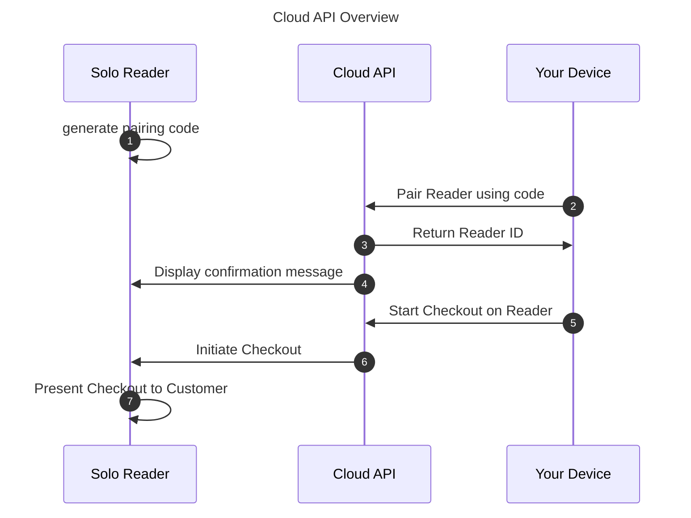

<SYSTEM>This is the full developer documentation for SumUp Developer</SYSTEM>

# Online Payments

> Get started with accepting online payments. This guide walks you through creating a sandbox merchant account and processing your first transaction in minutes.

import { Steps } from '@astrojs/starlight/components';
import Callout from '@components/content/Callout';
import Image from '@components/content/Image.astro';

Online payments form an integral part of the SumUp product portfolio. SumUp supports online payments through multiple approaches to address every merchant use case. Use one of the out-of-the-box integrations or build a complete custom payments flow with the APIs. Your app communicates with SumUp via HTTP requests defined in the [API Reference](/api).​


To get started, review the options SumUp offers for managing online payments.

## Getting a Sandbox Merchant Account

To test SumUp APIs and tools without involving real money, use a sandbox merchant account. Create one from your Dashboard account as follows.

<Steps>

1. Log in to your SumUp account.
2. Open [Developer Settings](https://me.sumup.com/settings/developer?tab=sandboxes).
3. In the **Sandboxes** tab, create a sandbox merchant account if you do not have one yet.

</Steps>

With your sandbox merchant account, begin making API calls with real data. Sandbox merchant accounts **do not** process transactions with real funds. The sandbox merchant account has a different ID and displays a clear warning. Requests with a value of 11 (in any currency) always fail by design, to test failed transaction scenarios.

<Image alt="A screenshot of the dashboard with sandbox merchant account selected" src="/img/guides/test-account-warning.png" width="100%" />

When finished experimenting with the sandbox merchant account, switch back to a regular account for business purposes.

## Authorization

All online payment products use SumUp APIs, which require authorization via an API key or access token. See the [Authorization Guide](/tools/authorization/) for details on available options.​

## Checkout Products

SumUp provides a range of checkout products for seamless integration with your website.

### Hosted Checkout

Hosted Checkout is the fastest path to launch. SumUp hosts the payment page, while your integration creates the checkout and redirects the customer to the returned URL.

See the [Hosted Checkout documentation](/online-payments/checkouts/hosted-checkout/) for details.

### Payment Widget

For an embedded checkout on your own site, use the [Payment Widget](/online-payments/checkouts/card-widget/). It only requires adding a single script to your payment page.

#### Alternative Payment Methods

The Payment Widget supports [Alternative Payment Methods](/online-payments/apm) (APMs) to accept payments beyond traditional card schemes such as Visa and Mastercard. To enable APMs for your Payment Widget integration, use the [contact form](/contact).

Available APMs include:

- Apple Pay
- Bancontact
- Blik
- Boleto
- EPS
- Google Pay
- iDeal
- MyBank
- PIX
- Przelewy24
- Satispay

<Callout type="tip">
The APMs you can offer depend on the location your business is registered and operates in.
</Callout>

<Callout type="note">
See the [Payment Methods overview](/online-payments/payment-methods/) for the
full list of supported methods grouped by payment method family.
</Callout>

### Swift Checkout SDK

The Swift Checkout SDK provides a complete and fast checkout experience to your end users, collecting payment, address, and contact information with a click of a button.

See the [Swift Checkout Documentation](/online-payments/checkouts/swift-checkout/) for details.

## Plugins

For Prestashop, Wix, or WooCommerce, use SumUp plugins for seamless payments. See the [Plugins section](/online-payments/plugins/) for details on each.​

## Custom Integrations

### SumUp APIs

SumUp provides REST APIs for creating and retrieving checkouts, managing transactions, storing tokenized payment instruments, and issuing refunds. SumUp APIs use API keys or [OAuth 2.0](https://www.rfc-editor.org/rfc/rfc6749) for authentication.

Call authenticated API endpoints from your server. Keep API keys and client secrets out of browsers and mobile apps.

### Receiving Payments

Start by [choosing a checkout integration](/online-payments/checkouts/). Your server creates a checkout with the amount, currency, merchant code, and a unique checkout reference. The selected checkout integration then collects the customer's payment details and completes the payment without sending raw card details through your server.

SumUp supports the following payment paths:

- [Hosted Checkout](/online-payments/checkouts/hosted-checkout/) redirects the customer to a SumUp-hosted payment page.
- [Payment Widget](/online-payments/checkouts/card-widget/) embeds the SumUp payment form in your website.
- [Swift Checkout SDK](/online-payments/checkouts/swift-checkout/) and the [React Native SDK](/online-payments/sdks/react-native/) provide checkout experiences for supported mobile use cases.
- [Alternative Payment Methods](/online-payments/apm/) support wallets, bank-based methods, vouchers, and other locally available options.
- [Tokenization and recurring payments](/online-payments/guides/tokenization-with-payment-sdk/) use a saved payment instrument rather than raw card details.

Do not build a payment form that sends raw card details to the Checkouts API. Use one of the checkout integrations above to collect payment details.

## Contact SumUp

<Callout type="note">
Do you have specific questions? Check out our [help page](/help) for the most frequently asked questions or [contact us here](/contact).
</Callout>

# 3D Secure authentication

> Understand how SumUp handles 3D Secure authentication, exemptions, liability, testing, and failed challenges.

import Callout from "@components/content/Callout";

3D Secure (3DS) lets a card issuer authenticate a cardholder during an online card payment. SumUp supports EMV 3DS and starts authentication when it is required for the transaction.

Your integration must support the [two primary EMV 3DS flows](https://www.emvco.com/dynamic/emv-3-d-secure-whitepaper-v2/introduction/):

- **Frictionless flow:** The issuer completes its assessment without asking the customer to take action.
- **Challenge flow:** The issuer asks the customer to verify the payment, for example in their banking app or with a one-time passcode.

<Callout type="note">

You cannot determine whether a customer will be challenged. SumUp, the card scheme, and the issuer evaluate the payment and applicable regulatory requirements. Always handle an authentication step when SumUp returns one.

</Callout>

## 3D Secure and Strong Customer Authentication

Strong Customer Authentication (SCA) generally requires a customer to authenticate with at least two independent factors:

- Something they know, such as a password or PIN
- Something they possess, such as a phone or authentication device
- Something they are, such as a fingerprint or facial recognition

SCA applies to many customer-initiated electronic payments in the European Economic Area and the United Kingdom. An exemption or an out-of-scope transaction can mean that SCA is not applied. An issuer can also require 3DS in markets where SCA is not a regulatory requirement.

3DS is the authentication protocol used for online card payments; SCA is the regulatory requirement. A 3DS flow does not always display a challenge, and the absence of a challenge does not mean that 3DS was skipped.

## Choose an integration path

| Integration                                                    | 3DS responsibility                                                                                                                                                      |
| -------------------------------------------------------------- | ----------------------------------------------------------------------------------------------------------------------------------------------------------------------- |
| [Hosted Checkout](/online-payments/checkouts/hosted-checkout/) | SumUp presents the payment and authentication flow on the hosted page. Your backend verifies the final checkout status.                                                 |
| [Payment Widget](/online-payments/checkouts/card-widget/)      | The widget presents the authentication flow. Its `onResponse` callback can emit `auth-screen` when a challenge starts. Your backend verifies the final checkout status. |

Choose Hosted Checkout for a SumUp-hosted payment page or the Payment Widget for an embedded checkout.

## How the payment flow works

1. Your backend [creates a checkout](/api/checkouts/create) with a unique `checkout_reference` and a `redirect_url`.
2. The customer submits their payment through Hosted Checkout or the Payment Widget.
3. SumUp and the issuer determine whether the payment can proceed without customer interaction or requires a challenge.
4. For a challenge, the customer authenticates directly with their issuer.
5. The customer returns to your `redirect_url` after the external flow finishes.
6. Your backend [retrieves the checkout](/api/checkouts/get) and uses its status as the source of truth.

<Callout type="caution">

Reaching the `redirect_url`, receiving a frontend callback, or completing a challenge does not prove that the payment succeeded. Fulfill the order only after your backend retrieves the checkout and confirms that its status is `PAID`.

</Callout>

## Frictionless and challenge flows

### Frictionless flow

The issuer uses transaction, device, and account information to assess the payment without asking the customer to take action. Your application might not display an authentication screen.

Continue to verify the checkout on your backend. A frictionless customer experience does not change how you confirm the final payment result.

### Challenge flow

The issuer asks the customer to complete an authentication step. The challenge interface and available authentication methods are controlled by the issuer and can vary between cards and customers.

Your application must allow the customer to:

- Leave your checkout for a full-page authentication flow when requested
- Return to the `redirect_url`
- Retry with another card after failed or unavailable authentication
- Safely abandon or resume the order without creating a duplicate charge

## SCA exemptions and out-of-scope payments

The [EU regulatory technical standards for SCA](https://eur-lex.europa.eu/legal-content/EN/TXT/?uri=CELEX:32018R0389) include exemptions intended to reduce unnecessary customer friction. The issuer always makes the final authentication decision and can request a challenge even when a payment appears to qualify for an exemption.

<Callout type="note">

The SumUp Checkouts API does not expose a merchant-selectable SCA exemption parameter. Do not base your integration on a specific exemption being applied. Build it to handle both frictionless and challenge outcomes for every customer-initiated card payment.

</Callout>

Common exemption categories include:

| Category                  | What it means for your integration                                                                                                                                                                          |
| ------------------------- | ----------------------------------------------------------------------------------------------------------------------------------------------------------------------------------------------------------- |
| Low-value payment         | In the EEA, a remote payment of up to €30 can qualify, subject to cumulative amount and consecutive-payment limits. The issuer tracks those limits and can still require authentication.                    |
| Transaction risk analysis | A payment service provider can request an exemption for a qualifying low-risk payment when regulatory fraud-rate and risk-analysis conditions are met. This is not a decision your checkout frontend makes. |
| Recurring payment         | SCA is normally required when the customer establishes or changes a series of payments for the same amount and recipient. Later payments in that series can qualify for an exemption.                       |
| Trusted beneficiary       | A customer can designate a business as trusted through a service offered by their issuer. The issuer controls the list and decides whether to apply the exemption.                                          |

Some payments are outside the scope of SCA rather than exempt. For example, a properly established merchant-initiated transaction can be out of scope when it is made without the customer actively participating. It must be linked to the customer's original consent and authenticated setup. See [Tokenization and recurring payments](/online-payments/guides/tokenization-with-payment-sdk/) for the supported SumUp flow.

Thresholds and eligibility differ by market and can change. Do not use the categories above as legal advice or implement exemption rules in your frontend.

## Liability and disputes

Successful 3DS authentication can shift liability for some fraud-related chargebacks from the merchant to the issuer. The exact outcome depends on the card scheme, market, authentication result, and whether the authentication data was correctly linked to the authorization.

3DS does not guarantee liability protection:

- A successful payment status does not by itself confirm a liability shift.
- An exemption can leave fraud liability with the merchant or acquirer.
- Liability rules for attempted authentication vary by card scheme and region.
- 3DS does not prevent disputes unrelated to unauthorized card use, such as goods not received, goods not as described, duplicate processing, or refund disputes.
- You must still keep order, delivery, refund, and customer-communication evidence.

Treat 3DS as one part of fraud prevention, not as a replacement for risk controls or dispute management.

## Test your integration

Use a sandbox merchant account and the test cards below. Use any future expiry date, such as `12/30`, and any three-digit CVV, such as `123`.

| Scenario                         | Test card                  | Expected behavior                                                               |
| -------------------------------- | -------------------------- | ------------------------------------------------------------------------------- |
| Frictionless success             | VISA `4200 0000 0000 0091` | Payment completes without a challenge screen.                                   |
| Challenge required               | VISA `4200 0000 0000 0042` | The issuer challenge is presented before the payment can complete.              |
| Authentication technical failure | VISA `4012 0010 3746 1114` | Authentication fails because of a simulated technical error.                    |
| Cardholder not enrolled          | VISA `4012 0010 3714 1112` | Authentication cannot complete because the cardholder is not enrolled.          |
| Issuer not participating         | VISA `4532 4970 8877 1651` | Authentication cannot complete because the card or issuer does not participate. |

For more card schemes and scenarios, see [Testing online payments](/online-payments/testing/).

Verify all of the following before going live:

- [ ] A frictionless payment completes without waiting for a challenge event.
- [ ] An iframe or browser challenge can be completed and returns the customer to your site.
- [ ] Your backend verifies `PAID` before fulfillment.
- [ ] A failed or abandoned challenge never produces a paid order in your system.
- [ ] Refreshing the return page does not submit or fulfill the order twice.
- [ ] A delayed final status is reconciled without creating a second checkout.
- [ ] Logs include the checkout ID, checkout reference, timestamps, and final status, but no card data, secrets, or complete authentication payloads.

## Troubleshooting

| Symptom                                                  | What to check                                                                                                                                                                                                                       |
| -------------------------------------------------------- | ----------------------------------------------------------------------------------------------------------------------------------------------------------------------------------------------------------------------------------- |
| No challenge screen appears                              | This can be a valid frictionless outcome. Retrieve the checkout instead of treating the missing challenge as an error.                                                                                                              |
| `next_step` is returned but the challenge does not open  | Use the returned method and URL without modification, submit every payload field, and use a mechanism listed in the response. Check HTTPS, Content Security Policy, popup blocking, and iframe restrictions in the browser console. |
| The Payment Widget emits `auth-screen`                   | This is expected when challenge authentication starts. Wait for the next callback, then verify the checkout from your backend.                                                                                                      |
| The customer returns but the checkout is still `PENDING` | Do not fulfill or immediately create a replacement checkout. Retry retrieval with bounded backoff and reconcile the result through your backend.                                                                                    |
| Authentication fails or the card is not enrolled         | Keep the order unpaid, show a recoverable message, and let the customer retry or choose another card. Do not expose issuer or gateway internals in the message.                                                                     |
| The customer abandons the challenge                      | Keep the order unpaid. Retrieve the existing checkout before deciding whether a new checkout is needed, and use a new unique reference for a genuinely new payment attempt.                                                         |
| The customer is challenged repeatedly                    | Confirm that you are not creating multiple checkouts for the same attempt. Challenge decisions remain issuer-controlled and cannot be disabled by the client.                                                                       |

When contacting support, provide the checkout ID, checkout reference, merchant code, approximate timestamp, environment, and final status. Never send card details, API keys, or the complete authentication payload.

# Alternative Payment Methods

> Learn about supported alternative payment methods, activation steps, and integration options.

import Callout from '@components/content/Callout';

Alternative Payment Methods (APMs) provide alternatives to standard card payment schemes. They offer familiar and frictionless payment experiences to your customers, while making you stand out from your competitors offering only traditional payment experiences.

APMs have completely transformed how we pay online. For example, in the Netherlands more than half of the consumers use iDeal to pay online merchandise.

Some types of APMs are prepaid cards, mobile payments, e-wallets, and "buy now, pay later" installment-based schemes.

## Supported Alternative Payment Methods

The APMs you can offer depend on the country your business is registered and operating in. Here's a list of the currently available APMs at SumUp:

| APM        | Country                                                                                                                                                                                                                                                                                                             |     |
| ---------- | ------------------------------------------------------------------------------------------------------------------------------------------------------------------------------------------------------------------------------------------------------------------------------------------------------------------- | --- |
| Apple Pay  | Austria, Belgium, Brazil, Bulgaria, Chile, Croatia, Cyprus, Czech Republic, Denmark, Estonia, Finland, France, Germany, Greece, Hungary, Ireland, Italy, Latvia, Lithuania, Luxembourg, Malta, Netherlands, Norway, Peru, Poland, Portugal, Romania, Slovenia, Slovakia, Spain, Sweden, Switzerland, United Kingdom |     |
| Bancontact | Belgium                                                                                                                                                                                                                                                                                                             |     |
| Blik       | Poland                                                                                                                                                                                                                                                                                                              |     |
| Boleto     | Brazil                                                                                                                                                                                                                                                                                                              |     |
| EPS        | Austria                                                                                                                                                                                                                                                                                                             |     |
| Google Pay | Austria, Belgium, Brazil, Bulgaria, Chile, Croatia, Cyprus, Czechia, Denmark, Estonia, Finland, France, Germany, Greece, Hungary, Ireland, Italy, Latvia, Lithuania, Luxembourg, Malta, Netherlands, Norway, Peru, Poland, Portugal, Romania, Slovenia, Slovakia, Spain, Sweden, Switzerland, United Kingdom        |     |
| iDeal      | Netherlands                                                                                                                                                                                                                                                                                                         |     |
| MyBank     | Greece, Italy, Spain                                                                                                                                                                                                                                                                                                |     |
| PIX        | Brazil                                                                                                                                                                                                                                                                                                              |     |
| Przelewy24 | Poland                                                                                                                                                                                                                                                                                                              |     |
| Satispay   | Italy                                                                                                                                                                                                                                                                                                               |     |

## Enabling Alternative Payment Methods

As a **sole trader**, APMs are automatically enabled for your merchant account after completing the regular registration steps and performing a test transaction with one of our remote payment products, such as [Payment Links](https://sumup.co.uk/payment-links/), [Invoices](https://sumup.co.uk/invoices), and [Online Store](https://sumup.co.uk/online-store/).

As with any other legal type, you must request activation from our support team or via our [contact form here](/contact), providing your merchant ID (MXXXXX). Our team will onboard your merchant account and grant access to the APMs applicable to your business location. Once your request is processed, APMs become available within [Payment Links](https://sumup.co.uk/payment-links/), [Invoices](https://sumup.co.uk/invoices), and [Online Store](https://sumup.co.uk/online-store/).

<Callout type="note">

At this time APMs are not available in our SumUp plugins.

</Callout>

## Integration

You can offer APMs through a number of approaches:

- Through the [SumUp Payment Widget](/online-payments/checkouts/card-widget). To make APM payments successful, you must always set a `redirect_url` upon [checkout creation](/api/checkouts/create). Beyond that step, the SumUp Payment Widget will handle the rest.
<Callout type="note">
  Please note that Google Pay [Terms of Service](https://payments.developers.google.com/terms/sellertos) are applied to all Google Pay transactions via SumUp Payment Widget
</Callout>
- [API Integrations](/online-payments/apm/integration-guide/)
- Through the [Swift Checkout SDK](/online-payments/checkouts/swift-checkout/)
- Direct Integration:
  - [Apple Pay](/online-payments/apm/apple-pay)
  - [Google Pay](/online-payments/apm/google-pay)

<Callout type="caution">
[Apple Pay](/online-payments/apm/apple-pay) and [Google Pay](/online-payments/apm/google-pay) direct integrations require domain verification in order to be implemented successfully.
</Callout>

# Apple Pay

> Learn how to integrate Apple Pay, including prerequisites, domain validation, and API calls.

import Callout from "@components/content/Callout";
import Image from "@components/content/Image.astro";

In this guide, you will learn how to directly integrate Apple Pay with SumUp, so that you can retain your own UI/UX flow. Please note that you can also offer Apple Pay through our Payment Widget (see [Payment Widget documentation](/online-payments/checkouts/card-widget#alternative-payment-methods)).

## Prerequisites

- You have a SumUp merchant account and have already filled in your [account details](https://me.sumup.com/account).
- Get familiar with [Apple Pay on the Web guide](https://developer.apple.com/documentation/apple_pay_on_the_web).
- Offering Apple Pay requires registering with Apple on all web domains that will expose an Apple Pay button (includes TLD and subdomains). This is a requirement for production AND test environments.
- If you want to test payments without involving real funds, [create a sandbox merchant account](/online-payments/#getting-a-sandbox-merchant-account).
- Complete the domain onboarding setup steps described in your Dashboard under **Settings** > **For developers** > **Payment wallets**.

<Image
  alt="Screenshot of the dashboard Developer Settings, showing Payment wallets section that includes Apple Pay and Google Pay"
  src="/img/guides/find_payment_wallets.png"
  width="80%"
/>

## Accepting Apple Pay Payments with SumUp

To begin your implementation, follow these steps:

1. [Create a checkout](https://developer.sumup.com/api/checkouts/create#create-a-checkout)
2. Create an [Apple Payment request](https://developer.apple.com/documentation/apple_pay_on_the_web/applepaypaymentrequest)

```js
const applePaymentRequest = {
  currencyCode: "EUR",
  countryCode: "DE",
  merchantCapabilities: ["supports3DS"],
  supportedNetworks: ["masterCard", "visa"],
  total: {
    label: "Demo",
    amount: "0.00",
    type: "final",
  },
};
```

3. Initiate an [Apple Pay session](https://developer.apple.com/documentation/apple_pay_on_the_web/applepaysession/2320659-applepaysession) and call the [begin method](https://developer.apple.com/documentation/apple_pay_on_the_web/applepaysession/1778001-begin)
4. Listen for the `onvalidatemerchant` callback and collect the validation URL from the event. Create the following payload and pass the validation URL you received from Apple as the `target` value:

```json
{
  "target": "https://apple-pay-gateway-cert.apple.com/paymentservices/startSession",
  "context": "your_domain_name"
}
```

and initiate a merchant session by calling

```http
PUT https://api.sumup.com/v0.1/checkouts/${checkoutId}/apple-pay-session
```

5. Use the response from the previous step to complete merchant validation with the [`completeMerchantValidation`](https://developer.apple.com/documentation/apple_pay_on_the_web/applepaysession/1778015-completemerchantvalidation/) method.

6. Submitting the payment sheet triggers the `onpaymentauthorized` callback. At that point, [process the checkout](https://developer.sumup.com/api/checkouts/process#process-a-checkout). The process-checkout request body needs to include a `payment_type` of `apple_pay` and an `apple_pay` object containing the Apple Pay payment token returned by the callback.

```json
{
  "payment_type": "apple_pay",
  "id": "9be2da07-a7bd-4877-bc0a-e16cd909a876",
  "amount": 12,
  "currency": "EUR",
  "apple_pay": {
    "token": {
      "paymentData": {
        "data": "si2xuT2ArQo689SfE-long-token",
        "signature": "MIAGCSqGSIb3DQEHA-long-signature",
        "header": {
          "publicKeyHash": "PWfjDi3TSwgZ20TY/A7f3V6J/1rhHyRDCspbeljM0io=",
          "ephemeralPublicKey": "MFkwEwYHKoZIzj0CAQYIKoZIzj0DAQcDQgAEaBtz7UN2MNV0qInJVEEhXy10PU0KfO6KxFjXm93oKWL6lCsxZZGDl/EKioUHVSlKgpsKGin0xvgldfxeJVgy0g==",
          "transactionId": "62e0568bc9258e9d0e059d745650fc8211d05ef7a7a1589a6411bf9b12cdfd04"
        },
        "version": "EC_v1"
      },
      "paymentMethod": {
        "displayName": "MasterCard 8837",
        "network": "MasterCard",
        "type": "debit"
      },
      "transactionIdentifier": "62E0568BC9258E9D0E059D745650FC8211D05EF7A7A1589A6411BF9B12CDFD04"
    }
  }
}
```

<Callout type="tip">
  Handling the responses from the API calls should be according to our public{" "}
  <a href="https://developer.sumup.com/api">API contract & guidelines</a>
</Callout>

# Google Pay

> Learn how to integrate Google Pay, including domain registration, payment requests, and processing.

import Callout from '@components/content/Callout';
import Image from '@components/content/Image.astro';

In this guide, you will learn how to directly integrate Google Pay with SumUp. Please note that you can also offer Google Pay through our Payment Widget (see [Payment Widget documentation](/online-payments/checkouts/card-widget#alternative-payment-methods)).

## Prerequisites

- You have a SumUp merchant account and have already filled in your [account details](https://me.sumup.com/account).
- If you want to test payments without involving real funds, [create a sandbox merchant account](/online-payments/#getting-a-sandbox-merchant-account).
- Review [Google Pay API terms of service](https://payments.developers.google.com/terms/sellertos).
- Complete the domain onboarding setup steps described in your Dashboard under **Settings** > **For developers** > **Payment wallets**. You can read Google's tutorial [Google Pay for Payments](https://developers.google.com/pay/api/web/guides/tutorial), which covers the requirements you're expected to follow in order to successfully offer this payment method.

<Image alt="Screenshot of the dashboard Developer Settings, showing Payment wallets section that includes Apple Pay and Google Pay" src="/img/guides/find_payment_wallets.png" width="80%" />

## Accepting Google Pay Payments with SumUp

Considering you've adhered to the prerequisites, the following steps will enable you to begin accepting Google Pay payments through SumUp:

1. Create a base payment request object, containing:

- `tokenizationSpecification` object with the following parameters:
  - `gateway`- always equal to "sumup"
  - `gatewayMerchantId`- your SumUp merchant code
- [`merchantInfo` object](https://developers.google.com/pay/api/web/reference/request-objects#MerchantInfo) with the following keys:
  - `merchantId`- unique identifier provided to you by Google once you register your domain with them. This is required for `PRODUCTION`.
  - `merchantName`- your merchant name

```js
const baseRequest = {
  apiVersion: 2,
  apiVersionMinor: 0,
  merchantInfo: {
    merchantId: '123456789123456789',
    merchantName: 'Example Merchant',
  },
  allowedPaymentMethods: [
    {
      type: 'CARD',
      parameters: {
        allowedAuthMethods: ['PAN_ONLY', 'CRYPTOGRAM_3DS'],
        allowedCardNetworks: ['MASTERCARD', 'VISA'],
      },
      tokenizationSpecification: {
        type: 'PAYMENT_GATEWAY',
        parameters: {
          gateway: 'sumup',
          gatewayMerchantId: 'exampleGatewayMerchantId',
        },
      },
    },
  ],
};
```

2. Load the [Google Pay API JavaScript library](https://developers.google.com/pay/api/web/guides/tutorial#js-load) on the web page you will offer this payment method
3. Initialize a `PaymentsClient` object for the environment you are implementing. Two values are possible here: `TEST` for testing the integration and `PRODUCTION` for live payments.

```js
const paymentsClient = new google.payments.api.PaymentsClient({
  environment: 'PRODUCTION',
});
```

4. [Check readiness to pay](https://developers.google.com/pay/api/web/guides/tutorial#isreadytopay) with Google Pay API
5. [Launch the Google Pay button](https://developers.google.com/pay/api/web/guides/tutorial#add-button)
6. [Create a PaymentDataRequest](https://developers.google.com/pay/api/web/guides/tutorial#paymentdatarequest) using the `baseRequest` object and append the top-level `transactionInfo` and `merchantInfo` objects. Your `PaymentDataRequest` should look like this:

```js
const paymentDataRequest = {
  apiVersion: 2,
  apiVersionMinor: 0,
  merchantInfo: {
    merchantId: '123456789123456789',
    merchantName: 'Example Merchant',
  },
  transactionInfo: {
    totalPriceStatus: 'FINAL',
    totalPriceLabel: 'Total',
    totalPrice: `${checkoutInfo.amount}`,
    currencyCode: checkoutInfo.currency || 'EUR',
    countryCode: 'DE',
  },
  allowedPaymentMethods: [
    {
      type: 'CARD',
      parameters: {
        allowedAuthMethods: ['PAN_ONLY', 'CRYPTOGRAM_3DS'],
        allowedCardNetworks: ['MASTERCARD', 'VISA'],
      },
      tokenizationSpecification: {
        type: 'PAYMENT_GATEWAY',
        parameters: {
          gateway: 'sumup',
          gatewayMerchantId: 'exampleGatewayMerchantId',
        },
      },
    },
  ],
};
```

7. [Create a checkout](/api/checkouts/create) with SumUp
8. [Call the `loadPaymentData`](https://developers.google.com/pay/api/web/reference/client#loadPaymentData) method and pass it the `PaymentDataRequest` as an argument. This method will respond in a Promise, where if resolved you will receive a `PaymentData` object
9. [Process the checkout](/api/checkouts/process). The process checkout request body needs to include a `payment_type` of `google_pay` and a `google_pay` object, containing the response from the previous step

```json
{
  "payment_type": "google_pay",
  "id": "6te2da07-a7bd-4877-bc0a-e16cd909a876",
  "amount": 12,
  "currency": "EUR",
  "google_pay": {
    "apiVersionMinor": 0,
    "apiVersion": 2,
    "paymentMethodData": {
      "description": "Visa •••• 1111",
      "tokenizationData": {
        "type": "PAYMENT_GATEWAY",
        "token": "token-data"
      },
      "type": "CARD",
      "info": {
        "cardNetwork": "VISA",
        "cardDetails": "1111"
      }
    }
  }
}
```

<Callout type="note">
Handling the responses from the API calls should be according to our public <a href="/api">API contract & guidelines</a>
</Callout>

## Troubleshooting

### Screenshots for Google

Google demands screenshots for the onboarding process, but you don't have the integration ready yet? Simply add `#sumup-widget:google-pay-demo-mode` to your URL to render the Google Pay button for onboarding purposes.

### Testing Google Pay Integration Locally

This is not possible at the moment. You need to use a staging environment and validate the test domain in Google API console.

### Error Decrypting Google Pay Token

An Internal Server Error that points to Google Pay token decryption can be caused by an environment mismatch. Make sure the `PaymentsClient` `environment` matches the Google Pay configuration used to create the payment data: use `TEST` for test flows and `PRODUCTION` for live payments.

```js
const paymentsClient = new google.payments.api.PaymentsClient({
  environment: 'PRODUCTION',
});
```

# Integration Guide

> Learn about the request parameters and flows required to process alternative payment methods.

## Overview

Alternative Payment Methods (further referred to as APMs) are similar to normal checkouts. One key difference is that the customer needs to take an additional action in order to finalize the payment with most APMs. Before proceeding, read the [online payments guide](/online-payments/).

## Check Available APMs

Check which payment methods are available to your merchant account.

1. [Create a checkout](/api/checkouts/create) and use the checkout `id` to fetch the list of available payment methods from the following endpoint `https://api.sumup.com/v0.1/checkouts/{checkout_id}/payment-methods`.

   Example response:

    ```json
    {
      "items": [
        {
          "id": "card",
          "name": "Credit Card"
        },
        {
          "id": "blik",
          "name": "Blik"
        },
        {
          "id": "apple_pay",
          "name": "Apple Pay"
        }
      ]
    }
    ```

Note that this object might change between checkouts as APMs are not offered for all currencies and amounts, and we are continuously introducing new APMs for you to offer.

We recommend handling the returned payment methods as an allowlist for this checkout, and then picking all the payment methods you want to offer. Do **not** simply display all methods returned if your integration doesn't support them.

The customer chooses one of the payment methods from the returned values, sent as part of the process checkout request under `payment_type`.

The currently available payment method ids are: `card`, `ideal`, `bancontact`, `boleto`, `eps`, `mybank`, `satispay`, `blik`, `p24`, `pix`, `qr_code_pix`, `apple_pay`, `paypal`, `google_pay`. _name_ is just for display purposes.

APMs differ from the behavior of cards. There are two possible flows, which we call `artifacts` or `redirect instructions`, explained in more detail below. APMs also require different input parameters obtained from the customer, as listed below:

| Payment method name | Parameters                                          | Flow     |
| ------------------- | --------------------------------------------------- | -------- |
| bancontact          | First name, Last name, Country                      | Redirect |
| blik                | First name, Last name, Country, Email               | Redirect |
| boleto              | First name, Last name, Country, Email, Address, CPF | Artifact |
| eps                 | First name, Last name, Country, Email               | Redirect |
| ideal               | First name, Last name, Country, Email               | Redirect |
| myBank              | First name, Last name, Country, Email               | Redirect |
| p24                 | First name, Last name, Country, Email               | Redirect |
| satispay            | First name, Last name, Country, Email               | Redirect |
| pix                 |                                                     | Artifact |
| qr_code_pix         |                                                     | Artifact |

Example payload:

```json
{
  "payment_type": "#Payment method name",
  "personal_details": {
    "email": "#Email",
    "first_name:": "#First Name",
    "last_name": "#Last Name",
    "tax_id": "#CPF",
    "address": {
      "country": "#Country",
      "city": "#Address",
      "line1": "#Address",
      "postal_code": "#Address",
      "state": "#Address"
    }
  }
}
```

### Process Checkout Using Redirect Flow

In the Redirect Flow, when the checkout is processed, you receive the `"status": "pending"` parameter and the `next_step` parameter, which means an additional action is required to process the payment.Example response:

```json
{
  ...
  "status": "pending",
  "next_step": {
    "url": "https://apm-redirect-link",
    "method": "POST",
    "payload": {
      "....": "..."
    }
  },
  ...
}
```

Most of the time, this is a simple redirect to a 3rd party page, like Blik, where the customer can pay.
But, as shown above, POST requests are also possible. For all calls, ensure that the payload is included, and the appropriate method is used.
Once the customer completes the necessary actions on the page, they are redirected to the `redirect_url` specified under the [create checkout request](/api/checkouts/create).
Now you can retrieve the final status via a [GET checkout request](/api/checkouts/get/).

### Process Checkout Using Payment Method Artifacts Flow

Payment method artifacts are images, PDFs etc. which the customer gets in order to pay. Currently, we have 3 payment methods which have artifacts: `boleto`, `pix` and `qr_code_pix`.

Example requests for each:

**boleto:**

```json
{
  "boleto": {
    "barcode": "23790001246004987209031123456704579990000010000",
    "url": "https://api.sumup.com/v0.1/checkouts/19c11c6c-be1d-4dd6-b718-2798878117cb/boletos/1044833949",
    "valid_until": "2022-02-01T17:57:10.442+00:00",
    "artefacts": [
      {
        "name": "invoice",
        "content_type": "application/pdf",
        "location": "https://homolog.meiosdepagamentobradesco.com.br/apiboleto/Bradesco?token=bWJvYXpkc1hXRzdhRVkyUUFGZUV4T25NYjBVVEZrNG93Y3RKLzM4cTh5dWdDWEh5dDQyTXN6ZHl5NFdjaHBkZg..",
        "created_at": "2022-01-21T17:57:10.443+00:00"
      },
      {
        "name": "code",
        "content_type": "text/plain",
        "location": "https://api.sumup.com/v0.1/artefacts/5266b29e-625b-43c0-a74a-8985ea3acd8a/content",
        "content": "23790001246004987209031123456704579990000010000",
        "created_at": "2022-01-21T17:57:10.445+00:00"
      }
    ]
  }
}
```

**pix:**

```json
{
  "pix": {
    "artefacts": [
      {
        "name": "barcode",
        "content_type": "image/jpeg",
        "location": "https://api.sumup.com/v0.1/artefacts/ee69508f-1b16-4ead-8416-8d2085933e6f/content",
        "created_at": "2021-10-12T22:06:46.327+00:00"
      },
      {
        "name": "code",
        "content_type": "text/plain",
        "location": "https://api.sumup.com/v0.1/artefacts/1e1e5130-17d1-495a-8e36-2a50d40dacde/content",
        "content": "00020126580014br.gov.bcb.pix0136a4fac492-d03b-45a8-bd43-c3f23d4bac68520400005303986540520.005802BR5916Priscila Manhaes6009Sao Paulo62290525SUMUP202110122206453822986304A61E",
        "created_at": "2021-10-12T22:06:46.326+00:00"
      }
    ]
  }
}
```

**qr_code_pix:**

```json
{
  "qr_code_pix": {
    "artefacts": [
      {
        "name": "barcode",
        "content_type": "image/jpeg",
        "location": "https://api.sam-app.ro/v0.1/artefacts/ee69508f-1b16-4ead-8416-8d2085933e6f/content",
        "created_at": "2021-10-12T22:06:46.327+00:00"
      },
      {
        "name": "code",
        "content_type": "text/plain",
        "location": "https://localhost:3000/v0.1/artefacts/1e1e5130-17d1-495a-8e36-2a50d40dacde/content",
        "content": "00020126580014br.gov.bcb.pix0136a4fac492-d03b-45a8-bd43-c3f23d4bac68520400005303986540520.005802BR5916Priscila Manhaes6009Sao Paulo62290525SUMUP202110122206453822986304A61E",
        "created_at": "2021-10-12T22:06:46.326+00:00"
      }
    ]
  }
}
```

The major difference between `qr_code_pix` and `pix` is that `pix` is paid directly into the merchant's SumUp bank account if they have one. `qr_code_pix` is paid out with the normal payout process and incurs a fee.

For all artifact payments, you need to provide the customer with the artifact and wait for the checkout to eventually complete.

Once the user has paid, you can retrieve the final status via the [GET checkout request](/api/checkouts/get/).

# Checkout Integrations

> Compare SumUp checkout integrations for embedded, hosted, and accelerated online payment experiences.

SumUp provides the following checkout integrations for online payments:

- [Payment Widget](/online-payments/checkouts/card-widget/) - embedded checkout UI for cards and supported payment methods
- [Hosted Checkout](/online-payments/checkouts/hosted-checkout/) - SumUp-hosted payment page with minimal integration effort
- [Swift Checkout SDK](/online-payments/checkouts/swift-checkout/) - accelerated wallet checkout for Apple Pay and Google Pay
- [Server-side SDKs](/tools/sdks/) - JavaScript, Go, Python, Java, PHP, .NET, and Rust clients for the SumUp API
- [React Native SDK](/online-payments/sdks/react-native/) - payment sheet for mobile apps

# Payment Widget

> Explore the SumUp Payment Widget, including mounting and configuration for your site.

import { Steps } from "@astrojs/starlight/components";
import Callout from "@components/content/Callout";
import CardWidget from "@components/content/CardWidget.astro";

The Payment Widget, available to all SumUp merchants, is an embedded checkout for card and supported alternative payment methods. It collects payment details and sends them directly to SumUp, supports 3D Secure authentication for card payments, and provides flexible customization options. For card payments, it dynamically recognizes the brand and shows the relevant brand icon.

A secure HTTPS connection is used to submit the payment information. For production usage we only support HTTPS for the payment page. (note: [during development browsers will treat `localhost` as secure](https://developer.mozilla.org/en-US/docs/Web/Security/Defenses/Secure_Contexts#potentially_trustworthy_origins)).

## Prerequisites

Payment Widget requires only the ability to create online checkouts via [SumUp checkout API](/api/checkouts/create), authorized by API key or access token (see the [Authorization Guide](/tools/authorization/) for details).​

## Compliance

### Payment Card Industry

When integrated as documented, the Payment Widget collects and sends card details directly to SumUp, so they do not pass through your server. This reduces the PCI DSS scope of your integration, but it does not make your business automatically compliant. You are still responsible for [validating your PCI DSS compliance](https://www.pcisecuritystandards.org/faqs/does-pci-dss-apply-to-merchants-who-outsource-all-payment-processing-operations-and-never-store-process-or-transmit-cardholder-data/) and confirming the requirements that apply to your environment with your acquirer or a Qualified Security Assessor.

### Payment Services Directive 2

Strong Customer Authentication (SCA) may apply to European online payments. The Payment Widget supports 3D Secure and presents any authentication challenge requested by the card issuer. The issuer decides whether authentication is frictionless, challenged, or exempt. See the [3D Secure guide](/online-payments/3ds/) for integration behavior and testing scenarios.

## Integration

<Steps>

1. To integrate the Payment Widget on your website, include the `sdk.js` script on your payment page.

   ```html
   <script src="https://gateway.sumup.com/gateway/ecom/card/v2/sdk.js"></script>
   ```

2. Once the script is loaded, you have access to a global variable `SumUpCard`, with a `mount` method which renders the available payment methods.

3. [Create a checkout](/api/checkouts/create) and copy the returned `id`.

4. Pass the returned `id` from the checkout response to the widget component.

   ```html
   <div id="sumup-card"></div>
   <script
     type="text/javascript"
     src="https://gateway.sumup.com/gateway/ecom/card/v2/sdk.js"
   ></script>
   <script type="text/javascript">
     SumUpCard.mount({
       id: "sumup-card",
       checkoutId: "2ceffb63-cbbe-4227-87cf-0409dd191a98",
       onResponse: function (type, body) {
         console.log("Type", type);
         console.log("Body", body);
       },
     });
   </script>
   ```

   The Payment Widget makes a request to execute the checkout and after the request is completed, you get a response based on the callback function configured. As a result of successful integration, you can see the following component:

   <CardWidget />

</Steps >

## Configurations

The Payment Widget allows you to customize certain properties on the payment form, as listed below. To override the default settings, add your own configuration property-value pairs to the `SumUpCard.mount` method.

```js
SumUpCard.mount({
  checkoutId: "...",
  // 'config-name': 'config-value'
});
```

| Property Name            | Description                                                                                                                                                                                                                                                                                                                                                                                                                                                                                                                                                                                                                                                                                                                                                                                                                                                                                                                                                                                                                                                                   | Value                                                                                                                                                                                                                                                                                                                                                                                                        | Default Value      | Required |
| ------------------------ | ----------------------------------------------------------------------------------------------------------------------------------------------------------------------------------------------------------------------------------------------------------------------------------------------------------------------------------------------------------------------------------------------------------------------------------------------------------------------------------------------------------------------------------------------------------------------------------------------------------------------------------------------------------------------------------------------------------------------------------------------------------------------------------------------------------------------------------------------------------------------------------------------------------------------------------------------------------------------------------------------------------------------------------------------------------------------------- | ------------------------------------------------------------------------------------------------------------------------------------------------------------------------------------------------------------------------------------------------------------------------------------------------------------------------------------------------------------------------------------------------------------ | ------------------ | -------- |
| `checkoutId`             | The unique ID you receive once you [create a checkout](/api/checkouts/create).                                                                                                                                                                                                                                                                                                                                                                                                                                                                                                                                                                                                                                                                                                                                                                                                                                                                                                                                                                                                | `string`                                                                                                                                                                                                                                                                                                                                                                                                     | _no default value_ | yes      |
| `onResponse`             | The callback function that will be called when you receive a response from the payment form. The first parameter is one of the following: <ul><li>`sent` - the form is sent to the server for processing. The second parameter contains information about the last four digits of the card's number and the card's scheme. </li><li>`invalid` - trying to submit the form but there are validation errors.</li><li>`auth-screen` - the user is prompt to authenticate the payment.</li><li>`error` - the server responded with error. The second parameter gives more information about the error.</li><li>`success` - successful result returned by the checkout endpoint **which does not always mean the transaction was successful**. We recommend verifying the [checkout status](/api/checkouts/get) on your server. The second parameter contains the response from the [endpoint](/api/checkouts/process).</li><li>`fail` - failed result returned by the checkout endpoint, can occur when the user cancels the payment form or the session has timed out.</li></ul> | `function`                                                                                                                                                                                                                                                                                                                                                                                                   | `null`             | no       |
| `onLoad`                 | The callback function that will be called when the Payment Widget is loaded.                                                                                                                                                                                                                                                                                                                                                                                                                                                                                                                                                                                                                                                                                                                                                                                                                                                                                                                                                                                                  | `function`                                                                                                                                                                                                                                                                                                                                                                                                   | `null`             | no       |
| `onPaymentMethodsLoad`   | The callback is called when the payment methods are loaded for the given `checkoutId`. Usually used for when the host page needs to change depending on the payment methods available. <br/><br/>Payment methods can be filtered in order to limit those shown by the widget. `return` the list of payment methods for the widget to render as an _Array of Strings_. E.g. to show only Boleto, when available: `() => ['boleto']`;                                                                                                                                                                                                                                                                                                                                                                                                                                                                                                                                                                                                                                           | `function`                                                                                                                                                                                                                                                                                                                                                                                                   | `null`             | no       |
| `onChangeInstallments`\* | The callback function that will be called when the user changes the dropdown for installments. The first and only parameter will be the number of selected installments. (`showInstallments` must be enabled).                                                                                                                                                                                                                                                                                                                                                                                                                                                                                                                                                                                                                                                                                                                                                                                                                                                                | `function`                                                                                                                                                                                                                                                                                                                                                                                                   | `null`             | no       |
| `showSubmitButton`       | Displays or hides the form's submit button.                                                                                                                                                                                                                                                                                                                                                                                                                                                                                                                                                                                                                                                                                                                                                                                                                                                                                                                                                                                                                                   | `boolean`                                                                                                                                                                                                                                                                                                                                                                                                    | `true`             | no       |
| `showFooter`             | Displays or hides "Powered by SumUp" label.                                                                                                                                                                                                                                                                                                                                                                                                                                                                                                                                                                                                                                                                                                                                                                                                                                                                                                                                                                                                                                   | `boolean`                                                                                                                                                                                                                                                                                                                                                                                                    | `true`             | no       |
| `showInstallments`\*     | Displays or hides a dropdown for choosing installments. Once enabled this overrides any value of the configuration `installments` and will not display `amount` on the submit button.                                                                                                                                                                                                                                                                                                                                                                                                                                                                                                                                                                                                                                                                                                                                                                                                                                                                                         | `boolean`                                                                                                                                                                                                                                                                                                                                                                                                    | `false`            | no       |
| `showZipCode`\*\*        | Displays or hides ZIP code input field. It is mandatory for merchant users from USA.                                                                                                                                                                                                                                                                                                                                                                                                                                                                                                                                                                                                                                                                                                                                                                                                                                                                                                                                                                                          | `boolean`                                                                                                                                                                                                                                                                                                                                                                                                    | `false`            | no       |
| `showEmail`              | Displays or hides email input field. At some time in the future it'll be a mandatory field for every integrator because of the <a href="https://en.wikipedia.org/wiki/Strong_customer_authentication" target="_blank" rel="noopener noreferrer">SCA</a>.                                                                                                                                                                                                                                                                                                                                                                                                                                                                                                                                                                                                                                                                                                                                                                                                                      | `boolean`                                                                                                                                                                                                                                                                                                                                                                                                    | `false`            | no       |
| `email`                  | Alternative way (to `showEmail`) to pass user's email if for example you know it from a previous step in your application. This configuration doesn't display additional input fields. If for some reason both `showEmail` and `email` are passed the `email` will have no effect over the displayed input field.                                                                                                                                                                                                                                                                                                                                                                                                                                                                                                                                                                                                                                                                                                                                                             | `string`                                                                                                                                                                                                                                                                                                                                                                                                     | `null`             | no       |
| `installments`\*         | The number of installments with which the transaction should be processed.                                                                                                                                                                                                                                                                                                                                                                                                                                                                                                                                                                                                                                                                                                                                                                                                                                                                                                                                                                                                    | `number`<br />[1 .. 12]                                                                                                                                                                                                                                                                                                                                                                                      | `null`             | no       |
| `maxInstallments`\*      | The maximum amount of installments in the selector displayed by the widget.                                                                                                                                                                                                                                                                                                                                                                                                                                                                                                                                                                                                                                                                                                                                                                                                                                                                                                                                                                                                   | `number`<br />[1 .. 12]                                                                                                                                                                                                                                                                                                                                                                                      | `12`               | no       |
| `id`                     | `id` of the element that you wish to render the Payment Widget in. _Example:_ `<div id="sumup-card"></div>`                                                                                                                                                                                                                                                                                                                                                                                                                                                                                                                                                                                                                                                                                                                                                                                                                                                                                                                                                                   | `string`                                                                                                                                                                                                                                                                                                                                                                                                     | `"sumup-card"`     | no       |
| `donateSubmitButton`     | Changes the text of the submit button to "Donate".                                                                                                                                                                                                                                                                                                                                                                                                                                                                                                                                                                                                                                                                                                                                                                                                                                                                                                                                                                                                                            | `boolean`                                                                                                                                                                                                                                                                                                                                                                                                    | `false`            | no       |
| `amount`                 | The `amount` you want to be displayed on the submit button. _Requires_ `currency` _and_ `locale` _to take effect._                                                                                                                                                                                                                                                                                                                                                                                                                                                                                                                                                                                                                                                                                                                                                                                                                                                                                                                                                            | `string`                                                                                                                                                                                                                                                                                                                                                                                                     | `null`             | no       |
| `currency`               | The `currency` for the `amount` you want to be displayed on the submit button.                                                                                                                                                                                                                                                                                                                                                                                                                                                                                                                                                                                                                                                                                                                                                                                                                                                                                                                                                                                                | One of: `"EUR"`, `"BGN"`, `"BRL"`, `"CHF"`, `"CZK"`, `"DKK"`, `"GBP"`, `"HUF"`, `"NOK"`, `"PLN"`, `"SEK"`, `"USD"`                                                                                                                                                                                                                                                                                           | `null`             | no       |
| `locale`                 | Translates all texts into the given locale. Also specifies the formatting of the `amount` and `currency`.                                                                                                                                                                                                                                                                                                                                                                                                                                                                                                                                                                                                                                                                                                                                                                                                                                                                                                                                                                     | One of:<br />`"bg-BG"`, `"cs-CZ"`, `"da-DK"`, `"de-AT"`, `"de-CH"`, `"de-DE"`, `"de-LU"`, `"el-CY"`, `"el-GR"`, `"en-GB"`, `"en-IE"`, `"en-MT"`, `"en-US"`, `"es-CL"`, `"es-ES"`, `"et-EE"`, `"fi-FI"`, `"fr-BE"`, `"fr-CH"`, `"fr-FR"`, `"fr-LU"`, `"hu-HU"`, `"it-CH"`, `"it-IT"`, `"lt-LT"`, `"lv-LV"`, `"nb-NO"`, `"nl-BE"`, `"nl-NL"`, `"pt-BR"`, `"pt-PT"`, `"pl-PL"`, `"sk-SK"`, `"sl-SI"`, `"sv-SE"` | `"en-GB"`          | no       |
| `country`                | Sets the country where the user account is from.                                                                                                                                                                                                                                                                                                                                                                                                                                                                                                                                                                                                                                                                                                                                                                                                                                                                                                                                                                                                                              | One of: `"AT"`, `"BE"`, `"BG"`, `"BR"`, `"CH"`, `"CL"`, `"CO"`, `"CY"`, `"CZ"`, `"DE"`, `"DK"`, `"EE"`, `"ES"`, `"FI"`, `"FR"`, `"GB"`, `"GR"`, `"HR"`, `"HU"`, `"IE"`, `"IT"`, `"LT"`, `"LU"`, `"LV"`, `"MT"`, `"NL"`, `"NO"`, `"PE"`, `"PL"`, `"PT"`, `"RO"`, `"SE"`, `"SI"`, `"SK"`, `"US"`                                                                                                               | `null`             | no       |
| `googlePay`              | Required for accepting payments with the widget via Google Pay:<br/><ul><li>**`merchantId`** is a value provided by Google [after registration](https://developers.google.com/pay/api/web/guides/setup#registration). (not to be confused with your SumUp `merchantCode`)</li><li>**`merchantName`** is visible to the customer on the Google Pay payment flow.</li></ul>For more details check [Google Pay **`merchantInfo`** documentation](https://developers.google.com/pay/api/web/reference/request-objects#MerchantInfo).                                                                                                                                                                                                                                                                                                                                                                                                                                                                                                                                              | `{merchantId: string, merchantName: string}`                                                                                                                                                                                                                                                                                                                                                                 | `null`             | no       |

_\* Installments are available only to merchant users in Brazil, Chile, Colombia and Peru._<br />
_\*\* ZIP code is required only for merchant users in the USA._

## Methods

| Name    | Description                               | Parameters                                           | Return Type                                                                                                                                                                                                                                                                                                                                                                                                                               |
| ------- | ----------------------------------------- | ---------------------------------------------------- | ----------------------------------------------------------------------------------------------------------------------------------------------------------------------------------------------------------------------------------------------------------------------------------------------------------------------------------------------------------------------------------------------------------------------------------------- |
| `mount` | Initializes and renders the payment form. | JSON object with a [configuration](#configurations). | Returns object that contains three methods: `submit`, `unmount` and `update`.<ul><li>`submit()` method will submit the form.</li><li>`unmount()` method will destroy the card.</li><li>`update({})` method will dynamically change some configurations, it accepts one argument which has to be an object with at least one of the following configuration keys: `checkoutId`, `email`, `amount`, `currency` or `installments`.</li></ul> |

## Alternative Payment Methods

Depending on the country a merchant is registered in, [Alternative Payment Methods (APMs)](/online-payments/apm) are available for accepting payments from your customers. Please note, the `show*` configuration properties from the [widget configurations](#configurations) do not apply to APMs. The APMs will only render fields applicable to the respective payment method.

You can begin offering APMs to your customers, once you are onboarded as a merchant. Request assistance with getting onboarded for APMs through our [contact form](/contact).

<Callout type="note">
  Installments are not applicable to Alternative Payment Methods.
</Callout>

## Custom Styling

Custom styling to most of the SumUp Payment Widget elements is enabled by the `data-sumup-id` attribute. To get all elements, query the DOM with `document.querySelectorAll('[data-sumup-id]')`.

Here's an example of updating styles for one of the elements:

```css
[data-sumup-id="widget__container"] {
  color: red;
  line-height: 18px;
}
```

You can also style child elements to those with the `data-sumup-id`, by chaining their tag or other uniquely identifiable attribute.

Elements like Payment Selector have some additional items you can query to extend your customizations. To style a specific Payment Selector, you need to appoint the `data-sumup-item=${payment.id}`.

```css
[data-sumup-id="payment_option"][data-sumup-item="blik"] {
  display: none;
}
```

## Using Your Own Submit Button

If you need to use your own submit button, you can achieve this by following the example below:

```html
<button id="custom-submit-button" class="custom-button">Pay your order</button>
<script type="text/javascript">
  document.addEventListener("load", function () {
    var sumupCard = SumUpCard.mount({
      checkoutId: "2ceffb63-cbbe-4227-87cf-0409dd191a98",
      onResponse: function (type, body) {
        console.log("Response from client", res);
        // Verify the checkout is processed correctly.
        // Display success message to the user and destroy the SumUpCard object:
        sumupCard.unmount();
      },
      showSubmitButton: false,
    });
  });
  document
    .getElementById("custom-submit-button")
    .addEventListener("click", function (event) {
      sumupCard.submit();
    });
</script>
```

## Handling Strict Content Security Policies

Pages with strict [Content Security Policies](https://developer.mozilla.org/en-US/docs/Web/HTTP/CSP) (CSP) may experience issues with styles or images when rendering the SumUp Payment Widget. This section contains the necessary adjustments to render the Payment Widget properly.

To confirm your issue is related to CSP, check your browser's console for a similar error message:

```text
Refused to apply inline style because it violates the following Content Security Policy directive: "style-src 'self' \*\*\* Either the 'unsafe-inline' keyword, a hash ('sha256-47DEQpj8HBSa+/TImW+5JCeuQeRkm5NMpJWZG3hSuFU='), or a nonce ('nonce-...') is required to enable inline execution.
```

### Required Configurations

To render the Payment Widget with CSP in place, you must allow the following URLs in your application:

| Content Type | URL                                 |
| ------------ | ----------------------------------- |
| SDK & API    | 'https://\*.sumup.com'              |
| Images       | 'data:', 'https://static.sumup.com' |

Additionally, `nonce` is required to make inline styles work on your host page. For more information view [the CSP docs](https://content-security-policy.com/nonce/).

Example implementation with `nonce`:

```js
const express = require("express");
const app = express();
const http = require("http");
const server = http.createServer(app);

const port = process.env.PORT || 4000;

const crypto = require("crypto");

// Resources
const apisToConnect = ["https://gateway.sumup.com", "https://api.sumup.com"];

const imagesResources = [
  "data:", // inline icons
  "https://static.sumup.com",
  // For generated barcodes

  "https://api.sumup.com",
];

const scriptsResources = [
  "https://gateway.sumup.com",
  // PLUS nonce-$HASH
];

const stylesResources = [
  // nonce-$HASH
];

const framesResources = ["https://gateway.sumup.com"];

app.get("/", (req, res) => {
  const nonce = crypto.randomBytes(16).toString("base64");
  res.setHeader(
    "Content-Security-Policy",
    `default-src 'self';` +
      ` connect-src 'self' ${apisToConnect.join(" ")};` +
      ` img-src 'self' ${imagesResources.join(" ")};` +
      ` script-src 'self' ${scriptsResources.join(" ")} 'nonce-${nonce}';` +
      ` style-src 'self' 'nonce-${nonce}';` +
      ` frame-src 'self' ${framesResources.join(" ")};`,
  );

  // <script type="text/javascript" src="http://localhost:8003/sdkv2.js"></script>
  res.send(`
    <h1>Test CSP</h1>
    <div>Test using generated nonce: ${nonce}</div>
    <div id="sumup-card"></div>
    <script type="text/javascript" nonce="${nonce}">
      (window.SumUpPayment).mount({
        nonce: "${nonce}",
        checkoutId: '7538e178-c8c1-43a1-8eef-c29ab608edd1',
        onResponse: function(type, body) {
          console.log('Type', type);
          console.log('Body', body);
        }
      });
    </script>
    <a href="/without-nonce">See without nonce</a>
    <div>Footer</div>
 `);
});

server.listen(port, () => {
  console.log("listening on:", port);
});
```

If you continue to experience issues with rendering the Payment Widget, reach out to our support through this [contact form](/contact).

### Apple Pay specific policies

To allow Apple Pay functionality on third party browsers, make sure to allow Apple Pay SDK domain in your CSP:

```text
default-src 'self' applepay.cdn-apple.com ...; script-src 'self' applepay.cdn-apple.com ...
```

This is an optional feature, not including these policies will simply prevent Apple Pay from extended availability on unsupported browsers.

<Callout type="caution">
  Note that Apple Pay is available on all SDKs, but only Swift Checkout SDK extends this feature to third party browsers.
</Callout>

# Hosted Checkout

> Use Hosted Checkout to accept online payments with a SumUp-hosted payment page and minimal integration effort.

import { Tabs, TabItem } from "@astrojs/starlight/components";
import Callout from "@components/content/Callout";
import Image from "@components/content/Image.astro";

Hosted Checkout lets you accept online payments with a payment page hosted by SumUp. Your integration creates a checkout through the SumUp API, receives a `hosted_checkout_url`, and sends the customer to that page to complete the payment.

This is the lowest-effort way to launch an online checkout while keeping payment collection, status pages, and wallet support inside a SumUp-hosted flow.

<Image
  alt="A screenshot of the Hosted Checkout form showing available payment options, including Google Pay, Apple Pay, and card payment"
  src="/img/guides/hosted_checkout_landing_page.png"
  width="80%"
/>

## Prerequisites

- Ability to [create a checkout](/api/checkouts/create) through the SumUp API.
- Authentication via API key or access token. See the [Authorization Guide](/tools/authorization/).
- A server-side integration to create the checkout and keep credentials secret.

## How Hosted Checkout Works

1. Create a checkout and set `hosted_checkout.enabled` to `true`.
2. Store the returned checkout `id` and `hosted_checkout_url`.
3. Redirect the customer to `hosted_checkout_url`, or share that URL in the flow you are building.
4. After the customer completes the payment, verify the final result through the API or with [webhooks](/online-payments/webhooks/).

<Callout type="note">
  A Hosted Checkout session is available for 30 minutes. After that, unpaid sessions show an expired or not found page.
</Callout>

## Create a Hosted Checkout

Send a request to the [Create a checkout endpoint](/api/checkouts/create) with `hosted_checkout.enabled` set to `true`. If you want the success page to link back to your website, include `redirect_url` at the same time.

<Tabs syncKey="backend_lang">
  <TabItem label="cURL" icon="seti:powershell">
    ```bash
    curl -X POST https://api.sumup.com/v0.1/checkouts \
      -H "Content-Type: application/json" \
      -H "Authorization: Bearer $SUMUP_API_KEY" \
      -d '{
        "amount": 12.00,
        "checkout_reference": "b50pr914-6k0e-3091-a592-890010285b3d",
        "currency": "EUR",
        "description": "A sample checkout",
        "merchant_code": "MCXXXXXX",
        "redirect_url": "https://example.com/orders/123/complete",
        "hosted_checkout": { "enabled": true }
      }'
    ```
  </TabItem>
  <TabItem label="JavaScript" icon="seti:javascript">
    ```ts
    const checkout = await client.checkouts.create({
      merchant_code: merchantCode,
      amount: 12.0,
      currency: "EUR",
      checkout_reference: "b50pr914-6k0e-3091-a592-890010285b3d",
      description: "A sample checkout",
      redirect_url: "https://example.com/orders/123/complete",
      hosted_checkout: { enabled: true },
    });
    ```
  </TabItem>
  <TabItem label=".NET" icon="seti:c-sharp">
    ```csharp
    var checkout = await client.Checkouts.CreateAsync(new CheckoutCreateRequest
    {
        MerchantCode = merchantCode,
        Amount = 12.0f,
        Currency = Currency.Eur,
        CheckoutReference = "b50pr914-6k0e-3091-a592-890010285b3d",
        Description = "A sample checkout",
        RedirectUrl = "https://example.com/orders/123/complete",
        HostedCheckout = new CheckoutCreateRequestHostedCheckout
        {
            Enabled = true,
        },
    });
    ```
  </TabItem>
  <TabItem label="Java" icon="seti:java">
    ```java
    var checkout = client.checkouts().createCheckout(
        CheckoutCreateRequest.builder()
            .merchantCode(merchantCode)
            .amount(12.0f)
            .currency(Currency.EUR)
            .checkoutReference("b50pr914-6k0e-3091-a592-890010285b3d")
            .description("A sample checkout")
            .redirectUrl("https://example.com/orders/123/complete")
            .hostedCheckout(
                CheckoutCreateRequestHostedCheckout.builder()
                    .enabled(true)
                    .build()
            )
            .build()
    );
    ```
  </TabItem>
  <TabItem label="Go" icon="seti:go">
    ```go
    checkout, err := client.Checkouts.Create(ctx, sumup.CheckoutsCreateParams{
        MerchantCode:      merchantCode,
        Amount:            12.0,
        Currency:          sumup.CurrencyEUR,
        CheckoutReference: "b50pr914-6k0e-3091-a592-890010285b3d",
        Description:       "A sample checkout",
        RedirectURL:       "https://example.com/orders/123/complete",
        HostedCheckout: &sumup.CheckoutHostedCheckout{
            Enabled: true,
        },
    })
    ```
  </TabItem>
  <TabItem label="Python" icon="seti:python">
    ```py
    checkout = client.checkouts.create(
        CreateCheckoutBody(
            merchant_code=merchant_code,
            amount=12.00,
            currency="EUR",
            checkout_reference="b50pr914-6k0e-3091-a592-890010285b3d",
            description="A sample checkout",
            redirect_url="https://example.com/orders/123/complete",
            hosted_checkout={"enabled": True},
        )
    )
    ```
  </TabItem>
  <TabItem label="Rust" icon="seti:rust">
    ```rust
    let checkout = client.checkouts().create(Some(CheckoutCreateRequest {
        merchant_code,
        amount: 12.,
        currency: Currency::EUR,
        checkout_reference: "b50pr914-6k0e-3091-a592-890010285b3d".into(),
        description: Some("A sample checkout".into()),
        redirect_url: Some("https://example.com/orders/123/complete".into()),
        hosted_checkout: Some(CheckoutCreateRequestHostedCheckout {
            enabled: true,
        }),
        return_url: None,
        customer_id: None,
        purpose: None,
        id: None,
        status: None,
        date: None,
        valid_until: None,
        transactions: None,
    })).await?;
    ```
  </TabItem>
  <TabItem label="PHP" icon="seti:php">
    ```php
    $checkout = $sumup->checkouts->create([
        'merchant_code' => $merchantCode,
        'amount' => 12.00,
        'currency' => 'EUR',
        'checkout_reference' => 'b50pr914-6k0e-3091-a592-890010285b3d',
        'description' => 'A sample checkout',
        'redirect_url' => 'https://example.com/orders/123/complete',
        'hosted_checkout' => [
            'enabled' => true,
        ],
    ]);
    ```
  </TabItem>
</Tabs>

The response includes the hosted checkout configuration and the URL you send the customer to:

```json
{
  "amount": 12,
  "checkout_reference": "b50pr914-6k0e-3091-a592-890010285b3d",
  "checkout_type": "checkout",
  "currency": "EUR",
  "date": "2000-01-01T12:49:24.899+00:00",
  "description": "A sample checkout",
  "hosted_checkout": { "enabled": true },
  "hosted_checkout_url": "https://checkout.sumup.com/pay/8f9316a3-cda9-42a9-9771-54d534315676",
  "id": "64553e20-3f0e-49e4-8af3-fd0eca86ce91",
  "merchant_code": "MCXXXXXX",
  "merchant_country": "DE",
  "merchant_name": "Sample Shop",
  "purpose": "CHECKOUT",
  "status": "PENDING",
  "transactions": []
}
```

## Redirect Customers to the Hosted Page

Use the `hosted_checkout_url` returned by the API as the payment page URL in your application.

- Redirect the customer there immediately after checkout creation.
- Or store the URL and present it later in your own flow, for example in an order confirmation page or email.

When the customer opens the Hosted Checkout page, SumUp handles the payment UI and payment confirmation flow.

The business branding shown on Hosted Checkout, such as your business logo and icon, can be configured from the [Branding page](https://me.sumup.com/settings/branding) in SumUp Dashboard. The business name and other customer-facing information can be configured from the [Business profile page](https://me.sumup.com/settings/business-profile/information).

## Configure the Return Flow

If you want the success page to include a button back to your website, set `redirect_url` when you create the checkout, as shown in the examples above.

If `redirect_url` is present, the success page shows a button that sends the customer back to your website.

## Handle Payment Outcomes

Hosted Checkout covers the customer-facing flow from payment page to final status page. Depending on the outcome, customers see different pages:

- Success page after a successful payment.
- Failure page when payment authorization or processing fails.
- Expired page when the checkout session is no longer valid.
- Not found page when the URL does not match an active hosted checkout session.

<Callout type="tip">
  Treat the hosted page as the customer interface, but use the checkout status and webhook events as the source of truth for your backend order state.
</Callout>

### Success

<Image
  alt="A screenshot of the Hosted Checkout payment success page"
  src="/img/guides/hosted checkout_payment_success.png"
  width="50%"
/>

### Failure

<Image
  alt="A screenshot of the Hosted Checkout payment failure page"
  src="/img/guides/hosted checkout_payment_declined.png"
  width="50%"
/>

### Expired Session

<Image
  alt="A screenshot of the Hosted Checkout session expired page"
  src="/img/guides/hosted checkout_session_timed_out.png"
  width="50%"
/>

### Not Found

<Image
  alt="A screenshot of the Hosted Checkout page not found state"
  src="/img/guides/hosted checkout_not_found.png"
  width="50%"
/>

# Swift Checkout SDK

> Learn about the Swift Checkout SDK to offer Apple Pay and Google Pay on your website with minimal setup.

import Callout from "@components/content/Callout";

The Swift Checkout SDK enables you to offer a complete and fast checkout experience to your end users, allowing you to collect payment, address, and contact information with a click of a button. Swift Checkout SDK allows for Google Pay and Apple Pay setup.

## Prerequisites

- Add a payment method to your browser or wallet. For example, you can save a card in Chrome, add a card to your Apple Wallet for Safari and iOS
- Serve your application over HTTPS. This is a requirement both in development and in production environments. One way to get up and running is to use a service like [ngrok](https://ngrok.com/)

Currently available payment methods through Swift Checkout SDK:

<Callout type="caution">
  For pages that have a strict Content Security Policy (CSP) visit the [Handling CSP](/online-payments/checkouts/card-widget/#handling-strict-content-security-policies) instructions.
</Callout>

- [Apple Pay](#apple-pay-setup)
- [Google Pay](#google-pay-setup)

## SumUp Swift Checkout SDK Setup

Include the SDK.js in your page as shown below:

```html
<script src="https://js.sumup.com/swift-checkout/v1/sdk.js"></script>

<div id="payment-request-button">
  <!-- Placeholder for the buttons. -->
</div>
```

Or with JavaScript:

```javascript
function injectScript() {
  return new Promise((resolve) => {
    var script = document.createElement("script");
    script.type = "text/javascript";
    script.onload = function () {
      resolve(window.SumUp);
    };
    script.src = "https://js.sumup.com/swift-checkout/v1/sdk.js";
    document.body.appendChild(script);
  });
}
```

Once the script is loaded, a new SumUp object is injected into the window instance representing SumUp SDK namespace, which contains the SwiftCheckout client.

## Obtaining a Public API Key

To obtain a public API key, go to the [API keys page](https://me.sumup.com/settings/api-keys) in the SumUp Dashboard. Your public merchant key will be automatically generated with a `Private` label and a value such as `sup_pk_0x98lsJhJAs...u5kvg`.

## SumUp Swift Checkout Client

```javascript
const swiftCheckoutClient = new window.SumUp.SwiftCheckout(
  "sup_pk_0x98lsJhJAs...u5kvg",
);
```

The client contains a set of objects to render a payment element UI, request payment authorization and process a payment using SumUp’s API.

### Payment Request Object

The payment request object requests payment authorizations made with various payment methods. It requires an argument that contains a set of details, information about the requested transaction to be processed, that will be presented to the user to authorize the payment later.

Payment request object arguments consist of:

- `countryCode`: Represents the country or region of the merchant’s principle place of business.
- `total`: Represents what is about to be paid by the user, E.g. a summary of an order. It requires a `label` and an `amount`. The `amount` value must be provided as a string in major unit and should use a period (`.`) as a decimal separator. More specifically, the `amount` value should match the following regex: `^[0-9]+(\.[0-9][0-9])?$`

Optional:

- `locale`: Represents the locale the text "Pay with \{\{payment method\}\}" will be displayed with in the buttons.

```js
const paymentRequest = swiftCheckoutClient.paymentRequest({
  countryCode: "DE",
  locale: "de-DE",
  total: {
    label: "My goods",
    amount: { currency: "EUR", value: "65.00" },
  },
});
```

- `shippingOptions`: Represents a collection of shipping methods the end user can select from to receive their purchased goods. The initial `shippingOptions` list can be later modified according to the shipping address the user selects in the payment dialog.

```js
const paymentRequest = swiftCheckoutClient.paymentRequest({
  shippingOptions: [
    {
      id: "post",
      label: "postal service",
      amount: { currency: "EUR", value: "0.00" },
      description: "free post",
    },
  ],
});
```

This object is an analogue to the [PaymentRequest - Web APIs](https://developer.mozilla.org/en-US/docs/Web/API/PaymentRequest/PaymentRequest).

The payment request instance contains the logic related to **checking payment method availability and showing** the payment method dialogue once the user interacts with a **payment element**.

### Payment Request Interface

All methods in the payment request object are asynchronous. Listed below are the payment request methods and their usage:

#### `canMakePayment`

Checks if the given merchant public key has access to at least one payment method and checks the payment method availability in the given environment (browser). Returns a promise that resolves in a `boolean`.

#### `availablePaymentMethods`

Returns the available payment methods for a merchant. Returns a promise that resolves in an `array` of objects representing each available payment method.

#### `show`

Shows the payment authorization dialogue for a given payment method. It requires an object containing a `paymentMethod`, which defines the selected payment method. This method is usually used along with the `PaymentElement`'s `onSubmit` event.

The `show` method resolves with a `AuthorizedPayment`, which contains the `details` shared by the user once they authorize the payment request. The property `details` contains `paymentMethod`, `contactInformation`, `shippingAddress` and may contain `shippingOptions`.

A `PaymentRequestCancelledError` will be thrown when the user rejects or cancels the transaction.

```js
paymentRequest
  .show({ paymentMethod: "apple_pay" })
  .then(processCheckoutAttempt)
  .then(handleResponse)
  .catch((error) => {
    if (
      error instanceof SumUp.SwiftCheckout.Errors.PaymentRequestCancelledError
    ) {
      console.log("Cancelled by the user");
    } else {
      throw error;
    }
  });
```

#### `abort`

Terminates a payment request before it is processed. Once a payment request has been terminated using this method, the payment request will not be processed and the payment dialogue will be closed.

```js
if (someCustomCheck()) {
  try {
    await paymentRequest.abort(); // will throw an error.
    console.log("Payment request aborted due to my custom reason.");
  } catch (e) {
    console.error(
      "Unable to abort, because the user is currently in the process of paying.",
    );
  }
}
```

<Callout type="note">
  The `abort` method should only be used if the payment request has not yet been processed. Attempting to cancel a payment request after it has been processed may result in unexpected behavior.
</Callout>

#### `onShippingAddressChange`

Allows adding an event handler which will be triggered every time the user changes their shipping address. The handler can optionally provide a return value to change the following in the payment dialog:

- `total`
- `shippingOptions`

```js
paymentRequest.onShippingAddressChange(async (newShippingAddress) => {
  const { total, shippingOptions } =
    await someAsyncOperation(newShippingAddress);

  return {
    total,
    shippingOptions,
  };
});
```

<Callout type="note">
To protect user privacy, browsers might hide non-essential and sensitive details from the shipping address, and only provide data required for shipping cost estimation.

The extent of information provided can vary based on the chosen browser and payment method, leading to certain fields being absent. For example, the displayed shipping address might be limited to the city, state, country, and ZIP code.

The full shipping address is disclosed only in the `PaymentResponse` object after the payment is authorized by the account holder.
</Callout>

#### `onShippingOptionsChange`

Allows adding an event handler which will be triggered every time the user changes their shipping option choice. The handler can optionally provide a return value to change the following in the payment dialog:

- `total`
- `shippingAddress`
- `shippingOptions`

```js
paymentRequest.onShippingOptionsChange(async (selectedShippingOption) => {
  const { newTotal, newShippingAddress, newShippingOptions } = await someAsyncOperation(
    total
    shippingOption,
  );

  return {
    total,
    shippingAddress,
    shippingOptions,
  };
});
```

### Payment Element Builder

In order to request a payment, you need to create a UI element. The SDK provides a built-in PaymentElement UI builder, which allows you to create and configure the payment buttons.

_Each payment button can be rendered individually as well._

The Swift Elements Builder allows you to attach an `onSubmit` handler, which will be called once the user clicks on one of the buttons rendered by it. You can pass a `label` option to `elements()` to control the wallet button text, and the `mount` method accepts a `paymentMethods` array to filter the payment methods you want to offer. The arguments passed during `mount`, will render one or more buttons:

```js
const buttons = swiftCheckoutClient.elements({
  label: "book",
});
buttons
  .onSubmit((paymentEvent) => console.log(paymentEvent))
  .mount({
    paymentMethods: [
      { id: "apple_pay" },
      { id: "google_pay" },
      // See `paymentRequest.availablePaymentMethods()` for all available payment methods
    ],
    container: document.querySelector("#express-checkout-container"),
  });
```

#### `label`

Sets the action text used by the rendered Apple Pay and Google Pay buttons. The supported values are `book`, `buy`, `checkout`, `donate`, `order`, `pay`, `plain`, and `subscribe`.

Use the following labels depending on the checkout context:

- `book` for reservations, appointments, and other booking flows
- `buy` for standard ecommerce purchases
- `checkout` when you want the wallet button to match a broader checkout step
- `donate` for donation and contribution flows
- `order` for order-placement flows such as food ordering or fulfillment
- `pay` for paying an existing amount due, such as an invoice or bill
- `plain` for a minimal wallet-branded button without extra action text
- `subscribe` for subscription and recurring purchase flows

Label rendering depends on wallet and browser support. For example, `label: "book"` can be used to show booking-oriented Apple Pay and Google Pay buttons where supported. On Google Pay, `buy`, `pay`, and `plain` can also show the card brand and last four digits when the user's payment method is an eligible card.

<Callout type="caution">
  Apple Pay has additional requirements for donation flows. Before using `label: "donate"` with Apple Pay, make sure your organization is approved to accept donations with Apple Pay and use the donation-specific Apple Pay setup described in Apple’s [Apple Pay for Donations](https://developer.apple.com/apple-pay/nonprofits/) guide.
</Callout>

#### Rendering Buttons for Available Payment Methods

Once the UI and Payment Request are configured, you have to check the availability of Swift payment methods and `mount` them into the page.

The SDK checks several factors to determine if a given payment method is available:

- Is the payment method available for the given merchant?
- Is the payment method available on the browser?
- Is the wallet/card ready to accept payment requests?

After checking if making payments is possible, render the payment element into a given placeholder as shown below:

```js
paymentRequest.canMakePayment().then((isAvailable) => {
  if (isAvailable) {
    paymentRequest.availablePaymentMethods().then((paymentMethods) => {
      buttons.mount({
        paymentMethods,
        container: document.querySelector("#express-checkout-container"),
      });
    });
  } else {
    console.error("No payment method available!");
  }
});
```

### Requesting Payment Authorization

The authorization dialogue is where the user will review the payment requested, select a payment card and a shipping address. Finally, they can authorize the payment request to be **processed**.

Using the payment element builder, configure it to `show` the payment authorization dialogue from the Payment Request instance upon the `onSubmit` event. Once the user authorizes the payment the `show` method will resolve a `PaymentResponse` containing details about the payment authorization.

```js
buttons.onSubmit((paymentMethodEvent) => {
  paymentRequest
    .show(paymentMethodEvent)
    .then((paymentResponse) => console.log(paymentResponse));
});
```

To understand more about the PaymentResponse objects see Mozilla's official [PaymentResponse - Web APIs](https://developer.mozilla.org/en-US/docs/Web/API/PaymentResponse) documentation.

### Processing an Authorized Payment Request

To process a payment, the SumUp API requires you to create a checkout for a given amount. The checkout creation requires an authenticated request. Thus, we recommend implementing an endpoint on your backend that will authenticate with our API, create a checkout and return a `checkoutId`.

Once you obtain a `checkoutId`, call the `processCheckout` method from the SwiftCheckout client with the `checkoutId` and the `PaymentResponse`, which was received in the previous step, to start the processing the checkout.

```js
paymentRequest
  .show(paymentMethodEvent)
  .then((paymentResponse) => {
    console.log(paymentResponse.details); // contactInfo, shippingAddress, etc.
    // here you create your order and a sumup checkout
    const checkoutId = "c463bf5e-d397-4bca-9d2e-a4e04f668b1c";

    return swiftCheckoutClient.processCheckout(checkoutId, paymentResponse);
  })
  .then(console.log)
  .catch(console.error);
```

### The Complete Implementation

```js
const swiftCheckoutClient = new window.SumUp.SwiftCheckout(
  "fOcmczrYtYMJ7Li5GjMLLcUeC9dN",
);

const paymentRequest = swiftCheckoutClient.paymentRequest({
  total: {
    label: "One Shoe",
    amount: {
      value: "100.0",
    },
  },
  shippingOptions: [
    {
      id: "post",
      label: "postal service",
      amount: { currency: "EUR", value: "0.00" },
      description: "free post",
    },
  ],
});

const buttons = swiftCheckoutClient.elements({
  label: "book",
});
buttons.onSubmit((paymentMethodEvent) => {
  paymentRequest
    .show(paymentMethodEvent)
    .then((paymentResponse) => {
      console.log(paymentResponse.details);

      // Create your order and a checkout
      const checkoutId = "c463bf5e-d397-4bca-9d2e-a4e04f668b1c";

      return swiftCheckoutClient.processCheckout(checkoutId, paymentResponse);
    })
    .then((result) => {
      if (result.status === "PAID") {
        window.location.href = "/thankyou";
      } else {
        console.error(
          "It was not possible to process the checkout",
          result.message,
        );
      }
    })
    .catch((error) => {
      if (
        error instanceof SumUp.SwiftCheckout.Errors.PaymentRequestCancelledError
      ) {
        console.error("Cancelled by the user");
      } else {
        throw error;
      }
    });
});

paymentRequest.canMakePayment().then((isAvailable) => {
  if (isAvailable) {
    paymentRequest.availablePaymentMethods().then((paymentMethods) => {
      buttons.mount({
        paymentMethods,
        container: document.querySelector("#express-checkout-container"),
      });
    });
  } else {
    console.error("No payment method is available.");
  }
});
```

## Error Handling

The Swift Checkout SDK returns a series of Errors depending on the event that has taken place. You can use the errors to customise the user experience and communicate error causes as you see fit.

- `PaymentRequestCancelledError` is thrown when the end user closes the open payment dialog or presses the button `esc`.

- `PaymentRequestInvalidActionError` is thrown when the end user has submitted the payment dialog and then attempted to cancel the payment. Once the payment form is submitted the payment can no longer be cancelled.

- `PaymentRequestInternalError` is thrown when attempting to handle the payment request in a forbidden manner. Reasons that you may receive include the following codes, available in the `code` field of the Error object:
  - `SHIPPING_CONTACT_SELECTION`
  - `SHIPPING_ADDRESS_SELECTION`
  - `SHIPPING_METHOD_SELECTION`
  - `INTERNAL_VALIDATION`
  - `COMPLETE_PAYMENT`
  - `UNKNOWN`

## Apple Pay Setup

### Prerequisites

- [Verify your domain with Apple Pay](#verify-your-domain-with-apple-pay), both in development and production
- For Apple Pay [additional configurations](#apple-pay-setup) are required, including macOS 10.12.1+ or iOS 10.1+

### Verify your domain with Apple Pay

To use Apple Pay, you need to register with Apple on all of your web domains which will show an Apple Pay button.

Apple’s documentation for Apple Pay on the Web describes their process of “merchant validation”, which SumUp handles for you behind the scenes. You don’t need to create an Apple Merchant ID, CSR and so on, as described in their documentation. Instead, follow the steps in this section:

1. Request the domain association file through our [contact form](https://developer.sumup.com/contact/) and host it at `https://[YOUR_DOMAIN_NAME]/.well-known/apple-developer-merchantid-domain-association`.

2. Once hosted, request assistance from our integration specialists through the form, to register your domain with Apple.

## Google Pay Setup

### Prerequisites

- [Request production access](https://pay.google.com/business/console/) to Google Pay for your domain name
- Adhere to the [Google Pay requirements](https://developers.google.com/pay/api/web/guides/setup#get-started)
- Review [Google Pay API terms of service](https://payments.developers.google.com/terms/sellertos)

### Google Pay Specific Parameters

Google Pay’s base payment request object requires a few unique parameters:

- [`merchantInfo` object](https://developers.google.com/pay/api/web/reference/request-objects#MerchantInfo) with the following keys:
  - `merchantId`- unique identifier provided to you by Google once you [register your domain](https://pay.google.com/business/console/) with them
  - `merchantName`- your merchant name

  Here’s an example of how the merchantInfo object is included in a Google Pay payment request:

  ```js
  const paymentRequest = sumUpClient.paymentRequest({
    methodData: [
      {
        supportedMethods: "google_pay",
        data: {
          merchantInfo: {
            merchantId: "123456789123456789",
            merchantName: "Example Merchant",
          },
        },
      },
    ],
  });
  ```

### Validating Your Domain with Google Pay

In order to use Google Pay you need to validate your domain with Google. This process requires rendering a nonfunctional Google Pay button on your website and providing them with screenshots of your checkout flow.

To render a Google Pay button on your shop in demo mode, you need to add the `#sumup:google-pay-demo-mode` hash to the page's URL.

Once the hash has been applied you can proceed with the domain validation steps:

1. Create an account in the [Google Pay console](https://pay.google.com/business/console)
2. Go to the **Google Pay API** tabitem in your Google Pay console
3. Navigate to the **Integrate with your website** and click on **+ Add website**
4. Fill out the form with the requested information (domain name, buyflow screenshots, etc.)
5. At the top of the page click on **Submit for approval**

# Custom Integrations

> Integration guides for building with SumUp SDKs and APIs.

import { Steps } from '@astrojs/starlight/components';
import Callout from '@components/content/Callout';
import Image from '@components/content/Image.astro';

Guides in this section cover the basics of SumUp APIs, allowing you to develop a custom integration if SumUp products don't fully support your use case.

## Getting a Sandbox Merchant Account

Create a sandbox merchant account to test APIs without real money:

<Steps>

1. Log in to your SumUp account.
2. Open [Developer Settings](https://me.sumup.com/settings/developer?tab=sandboxes).
3. In the **Sandboxes** tab, create a sandbox merchant account if you do not have one yet.

</Steps>

<Callout type="note">
If you don't have a sandbox account yet, [sign up for a developer account](https://me.sumup.com/signup?signup_intent=developer). This starts you with a sandbox merchant account.
</Callout>

<Image alt="A screenshot of the account selection dropdown in the SumUp dashboard with the sandbox merchant account highlighted with red circle" src="/img/guides/test_acc.png" width="40%" />

With your sandbox merchant account, begin making API calls with real data. Sandbox merchant accounts **do not** process transactions with real funds. The sandbox merchant account has a different ID and displays a clear warning. Requests with a value of 11 (in any currency) always fail by design, to test failed transaction scenarios.

<Image alt="A screenshot of the dashboard with sandbox merchant account selected" src="/img/guides/test-account-warning.png" width="100%" />

When finished experimenting with the sandbox merchant account, switch back to a regular account for business purposes.

SumUp provides official SDKs for JavaScript, Go, Python, Java, PHP, .NET, and Rust — visit the [SDKs overview page](/tools/sdks/) to choose the client that fits your stack.

# Refunds

> Walks through looking up transactions and issuing full or partial refunds.

import { Tabs, TabItem } from '@astrojs/starlight/components';
import Callout from '@components/content/Callout';
import Multicode from '@components/content/Multicode.astro';

## Overview

In this guide, you will learn how to refund a transaction. You will go through the following steps:

1. [Look up a transaction ID (Optional)](#1-look-up-a-transaction-id)
2. [Refund a transaction](#2-refund-a-transaction) by using one of the available options:
   - [Option A: Make a full refund](#make-a-full-refund)
   - [Option B: Make a partial refund](#make-a-partial-refund)

When you complete these steps, the payment you have previously processed through SumUp will be refunded either partially or in full.

## Before You Begin

Here are the things that you need in order to complete the steps in this guide:

- [SumUp merchant account](https://me.sumup.com/login) with completed [account details](https://me.sumup.com/account).
  - You can also use a [sandbox merchant account](/online-payments/#getting-a-sandbox-merchant-account).
- [Registered client application](/tools/authorization/oauth/#register-an-oauth-application) with SumUp.
- Valid access token obtained with the [Authorization code flow](/tools/authorization/oauth/#authorization-code-flow).
- You have processed a checkout and you have the checkout ID.

<Callout type="note">

Transactions are associated with active merchant user accounts. As a result, you _cannot_ use an access token obtained via the [Client credentials flow](/tools/authorization/oauth/#client-credentials-flow) to complete the steps in this guide.

</Callout>

## Steps

### 1. Look up a Transaction ID

<Callout type="note">
If you already have the ID of the transaction you want to refund, you can skip this step and continue with [Step 2](#2-refund-a-transaction).
</Callout>

1. Make a GET request to the `https://api.sumup.com/v0.1/checkouts/{id}` endpoint, where the value of the `{id}` path parameter is the identifier of the checkout resource.

Example request:

<Tabs syncKey="backend_lang">
  <TabItem label="cURL" icon="seti:powershell">
    ```bash
    curl -X GET \
      https://api.sumup.com/v0.1/checkouts/4ebc2ed7-bb8c-4d4d-a110-08fd31301bf2 \
      -H "Authorization: Bearer $SUMUP_API_KEY"
    ```
  </TabItem>
  <TabItem label="JavaScript" icon="seti:javascript">
    ```ts
    const checkout = await client.checkouts.get("4ebc2ed7-bb8c-4d4d-a110-08fd31301bf2");
    ```
  </TabItem>
  <TabItem label=".NET" icon="seti:c-sharp">
    ```csharp
    var checkout = await client.Checkouts.GetAsync("4ebc2ed7-bb8c-4d4d-a110-08fd31301bf2");
    ```
  </TabItem>
  <TabItem label="Java" icon="seti:java">
    ```java
    var checkout = client.checkouts().getCheckout("4ebc2ed7-bb8c-4d4d-a110-08fd31301bf2");
    ```
  </TabItem>
  <TabItem label="Go" icon="seti:go">
    ```go
    ctx := context.Background()
    client := sumup.NewClient()

    checkout, err := client.Checkouts.Get(ctx, "4ebc2ed7-bb8c-4d4d-a110-08fd31301bf2")
    ```
  </TabItem>
  <TabItem label="Python" icon="seti:python">
    ```py
    checkout = client.checkouts.get("4ebc2ed7-bb8c-4d4d-a110-08fd31301bf2")
    ```
  </TabItem>
  <TabItem label="Rust" icon="seti:rust">
    ```rust
    let checkout = client
        .checkouts()
        .get("4ebc2ed7-bb8c-4d4d-a110-08fd31301bf2")
        .await?;
    ```
  </TabItem>
  <TabItem label="PHP" icon="seti:php">
    ```php
    $checkout = $sumup->checkouts->get('4ebc2ed7-bb8c-4d4d-a110-08fd31301bf2');
    $checkoutReference = $checkout->checkout_reference;
    $checkoutId = $checkout->id;
    ```
  </TabItem>
</Tabs>

The response contains a JSON body with the full details of the processed checkout resource. You can find the transaction ID in the `id` attribute of the respective transaction resource (`664200af-2b62-4142-9c73-a2a505310d78` in the sample response below).

```json
{
  "checkout_reference": "CO287866",
  ...
  "id": "4ebc2ed7-bb8c-4d4d-a110-08fd31301bf2",
  ...
  "transactions": [
    {
      "id": "664200af-2b62-4142-9c73-a2a505310d78",
      ...
    }
  ]
}
```

### 2. Refund a Transaction

- [Option A: Make a full refund](#make-a-full-refund)
- [Option B: Make a partial refund](#make-a-partial-refund)

#### Make a Full Refund

1. Make a POST request with an empty request body to the `https://api.sumup.com/v0.1/me/refund/{txn_id}` endpoint, where the value of the `{txn_id}` path parameter is the identifier of the transaction resource.

Example request for the transaction with identifier `664200af-2b62-4142-9c73-a2a505310d78`:

<Tabs syncKey="backend_lang">
  <TabItem label="cURL" icon="seti:powershell">
    ```bash
    curl -X POST \
      https://api.sumup.com/v0.1/me/refund/19aa3cca-89f6-42d2-b462-463b0b53e959 \
      -H "Authorization: Bearer $SUMUP_API_KEY"
    ```
  </TabItem>
  <TabItem label="JavaScript" icon="seti:javascript">
    ```ts
    await client.transactions.refund("19aa3cca-89f6-42d2-b462-463b0b53e959");
    ```
  </TabItem>
  <TabItem label=".NET" icon="seti:c-sharp">
    ```csharp
    await client.Transactions.RefundAsync("19aa3cca-89f6-42d2-b462-463b0b53e959");
    ```
  </TabItem>
  <TabItem label="Java" icon="seti:java">
    ```java
    client.transactions().refundTransaction(
        "19aa3cca-89f6-42d2-b462-463b0b53e959",
        RefundTransactionRequest.builder().build()
    );
    ```
  </TabItem>
  <TabItem label="Go" icon="seti:go">
    ```go
    ctx := context.Background()
    client := sumup.NewClient()

    err := client.Transactions.Refund(ctx, "19aa3cca-89f6-42d2-b462-463b0b53e959", sumup.TransactionsRefundParams{})
    ```
  </TabItem>
  <TabItem label="Python" icon="seti:python">
    ```py
    from sumup.transactions.resource import RefundTransactionBody

    client.transactions.refund(
        "19aa3cca-89f6-42d2-b462-463b0b53e959",
        RefundTransactionBody(),
    )
    ```
  </TabItem>
  <TabItem label="Rust" icon="seti:rust">
    ```rust
    client
        .transactions()
        .refund("19aa3cca-89f6-42d2-b462-463b0b53e959", None)
        .await?;
    ```
  </TabItem>
  <TabItem label="PHP" icon="seti:php">
    ```php
    $sumup->transactions->refund('19aa3cca-89f6-42d2-b462-463b0b53e959');
    ```
  </TabItem>
</Tabs>

The response returns a 204 HTTP status code and contains no body.

#### Make a Partial Refund

1. Make a POST request to the `https://api.sumup.com/v0.1/me/refund/{txn_id}` endpoint, where the value of the `{txn_id}` path parameter is the identifier of the transaction resource.

Unlike the option for a full refund, the request body for partial refunds should be a JSON object with the amount you want to refund for the transaction.

Example request for a partial refund for the amount of 24.42 EUR:

<Tabs syncKey="backend_lang">
  <TabItem label="cURL" icon="seti:powershell">
    ```bash
    curl -X POST \
      https://api.sumup.com/v0.1/me/refund/19aa3cca-89f6-42d2-b462-463b0b53e959 \
      -H "Authorization: Bearer $SUMUP_API_KEY" \
      -H 'Content-Type: application/json' \
      -d '{"amount": 24.42}'
    ```
  </TabItem>
  <TabItem label="JavaScript" icon="seti:javascript">
    ```ts
    await client.transactions.refund("19aa3cca-89f6-42d2-b462-463b0b53e959", {
      amount: 24.42,
    });
    ```
  </TabItem>
  <TabItem label=".NET" icon="seti:c-sharp">
    ```csharp
    await client.Transactions.RefundAsync(
        "19aa3cca-89f6-42d2-b462-463b0b53e959",
        new TransactionsRefundRequest
        {
            Amount = 24.42f,
        });
    ```
  </TabItem>
  <TabItem label="Java" icon="seti:java">
    ```java
    client.transactions().refundTransaction(
        "19aa3cca-89f6-42d2-b462-463b0b53e959",
        RefundTransactionRequest.builder().amount(24.42f).build()
    );
    ```
  </TabItem>
  <TabItem label="Go" icon="seti:go">
    ```go
    ctx := context.Background()
    client := sumup.NewClient()

    amount := float32(24.42)
    client.Transactions.Refund(ctx, "19aa3cca-89f6-42d2-b462-463b0b53e959", sumup.TransactionsRefundParams{
    	Amount: &amount,
    })
    ```
  </TabItem>
  <TabItem label="Python" icon="seti:python">
    ```py
    from sumup.transactions.resource import RefundTransactionBody

    client.transactions.refund(
        "19aa3cca-89f6-42d2-b462-463b0b53e959",
        RefundTransactionBody(amount=24.42),
    )
    ```
  </TabItem>
  <TabItem label="Rust" icon="seti:rust">
    ```rust
    use sumup::resources::transactions::RefundTransactionBody;

    client
        .transactions()
        .refund(
            "19aa3cca-89f6-42d2-b462-463b0b53e959",
            Some(RefundTransactionBody { amount: Some(24.42) }),
        )
        .await?;
    ```
  </TabItem>
  <TabItem label="PHP" icon="seti:php">
    ```php
    $sumup->transactions->refund('19aa3cca-89f6-42d2-b462-463b0b53e959', [
        'amount' => 24.42,
    ]);
    ```
  </TabItem>
</Tabs>

The response returns a 204 HTTP status code and contains no body.

## Result

You have successfully refunded a transaction (either partially or in full) for a payment you previously processed. The refunded amount will be credited to the same payment method the customer had used to pay with in the original transaction.
The processing fees associated with the original transaction are not returned.

# Response Handling

> Explains how to interpret SumUp API responses.

## Overview

Once an API call is submitted to SumUp, you will receive a standard HTTP response informing you if your request has been successful or not. In most cases the HTTP codes are accompanied by a response body in [JSON](https://json.org/) format.

Codes in the `2xx` range indicate success,`4xx` range indicates errors where the information provided results in a failure. Codes in the `5xx` range are rare and indicate server-side errors.

## Successful Requests

Successfully processed requests return one of the following HTTP status codes: `200 OK`, `201 Created`, `202 Accepted`, `204 No Content`. Depending on the use case response bodies may not be present at all. A response body can look like this:

```json
{
  "next_step": {
    "url": "https://dummy-3ds-gateway.com/cap?RID=1233&VAA=A",
    "method": "POST",
    "redirect_url": "https://mysite.com/completed_purchase",
    "mechanism": "iframe",
    "payload": {
      "PaReq": "eJxVUttu2zAM/RXDr4MjyY5dO6BVuE27FZuDZHGG9VGRmMSFb/..f16+jLt/gPhUvGGw==",
      "MD": "b1a536c0-29b9-11eb-adc1-0242ac120002"
    }
  }
}
```

## Client-Side Issues

`4xx` are occasions where you can take action to correct your application requests. Typically, these codes are returned upon user error, such as invalid API calls, incorrect values, missing parameters, etc. The response you receive will provide an indication to the root cause that triggered it. Here's an example of a `4xx` response:

```json
{
  "message": "Validation error",
  "error_code": "MISSING",
  "param": "merchant_code"
}
```

## Server-Side Issues

`5xx` stand for server errors. Although rare, if you receive such code, we recommend retrying your request. Should the returned codes continue to be in the `5xx` range, [reach out to us](/contact).

# Save Customer Cards

> Tokenize cards with the Payment Widget for future recurring payments.

import { Tabs, TabItem } from '@astrojs/starlight/components';
import Callout from '@components/content/Callout';
import Image from '@components/content/Image.astro';

## About Card Tokenization

In this guide, you will learn how to use the Payment Widget to save a customer's card as a tokenized payment instrument and set up recurring payments. The Payment Widget handles the payment interface, consent collection, and 3D Secure authentication.
This feature is also known as **card on file** or **tokenization**.

You will go through the following steps:

1. [Create a customer](#creating-customer).
2. [Create a checkout for card tokenization](#creating-checkout-to-save-card). This is where 3D Secure authentication takes place. The transaction amount is instantly reimbursed.
3. [Process the payment with the Payment Widget](#processing-request-with-payment-widget).
4. [Retrieve the tokenized card](#retrieving-tokenized-card).
5. [Make subsequent payments with the tokenized card](#processing-recurring-payments).

## Prerequisites

- You have a merchant account with [SumUp](https://me.sumup.com/login) and have already filled in your [account details](https://me.sumup.com/account).
  - You can also create a [sandbox merchant account](/online-payments/#getting-a-sandbox-merchant-account). Please note that setting up 3DS verification in a sandbox merchant account requires contacting our team through the [contact form](/contact).
- You have an API Key. For more details see the [Authorization Guide](/tools/authorization/api-keys/).
- You have control over the backend server to retrieve data securely.

## Creating Customer

A customer resource is a representation of a person or business paying for a product or service.
It contains personal information such as name, contact details, postal address, as well as a unique identifier relevant to your business logic (`customer_id`).

1. Create a new customer resource with a POST request to the `https://api.sumup.com/v0.1/customers` endpoint:

<Tabs syncKey="backend_lang">
  <TabItem label="cURL" icon="seti:powershell">
```bash
curl -X POST \
  https://api.sumup.com/v0.1/customers \
  -H "Authorization: Bearer $SUMUP_API_KEY" \
  -H 'Content-Type: application/json' \
  -d '{
  "customer_id": "MYCUSTOMERID-123",
  "personal_details": {
    "address": {
      "city": "Venice",
      "state": "California",
      "country": "US",
      "line1": "606 Venezia Ave",
      "line2": "Front",
      "postal_code": "90291"
    },
    "birthdate": "1949-11-11",
    "email": "thedude@example.com",
    "first_name": "Jeffrey",
    "last_name": "Lebowski",
    "phone": "+1 310-555-1234"
  }
}'
```
</TabItem>
  <TabItem label="JavaScript" icon="seti:javascript">
    ```ts
    const customer = await client.customers.create({
      customer_id: "MYCUSTOMERID-123",
      personal_details: {
        first_name: "Jeffrey",
        last_name: "Lebowski",
        email: "thedude@example.com",
        phone: "+1 310-555-1234",
        birth_date: "1949-11-11",
        address: {
          city: "Venice",
          state: "California",
          country: "US",
          line_1: "606 Venezia Ave",
          line_2: "Front",
          postal_code: "90291",
        },
      },
    });
    ```
  </TabItem>
  <TabItem label=".NET" icon="seti:c-sharp">
    ```csharp
    var customer = await client.Customers.CreateAsync(new Customer
    {
        CustomerId = "MYCUSTOMERID-123",
        PersonalDetails = new PersonalDetails
        {
            FirstName = "Jeffrey",
            LastName = "Lebowski",
            Email = "thedude@example.com",
            Phone = "+1 310-555-1234",
            BirthDate = new System.DateTime(1949, 11, 11),
            Address = new AddressLegacy
            {
                City = "Venice",
                State = "California",
                Country = "US",
                Line1 = "606 Venezia Ave",
                Line2 = "Front",
                PostalCode = "90291",
            },
        },
    });
    ```
  </TabItem>
  <TabItem label="Java" icon="seti:java">
    ```java
    var customer = client.customers().createCustomer(
        Customer.builder()
            .customerId("MYCUSTOMERID-123")
            .personalDetails(
                PersonalDetails.builder()
                    .firstName("Jeffrey")
                    .lastName("Lebowski")
                    .email("thedude@example.com")
                    .phone("+1 310-555-1234")
                    .birthDate(java.time.LocalDate.parse("1949-11-11"))
                    .address(
                        AddressLegacy.builder()
                            .city("Venice")
                            .state("California")
                            .country("US")
                            .line1("606 Venezia Ave")
                            .line2("Front")
                            .postalCode("90291")
                            .build()
                    )
                    .build()
            )
            .build()
    );
    ```
  </TabItem>
  <TabItem label="Go" icon="seti:go">
    ```go
    str := func(v string) *string { return &v }

    customer, err := client.Customers.Create(ctx, sumup.CustomersCreateParams{
    	CustomerID: "MYCUSTOMERID-123",
    	PersonalDetails: &sumup.PersonalDetails{
    		FirstName: str("Jeffrey"),
    		LastName:  str("Lebowski"),
    		Email:     str("thedude@example.com"),
    		Phone:     str("+1 310-555-1234"),
    		Address: &sumup.AddressLegacy{
    			City:       str("Venice"),
    			State:      str("California"),
    			Country:    str("US"),
    			Line1:      str("606 Venezia Ave"),
    			Line2:      str("Front"),
    			PostalCode: str("90291"),
    		},
    	},
    })
    ```
  </TabItem>
  <TabItem label="Python" icon="seti:python">
    ```py
    from sumup.customers.resource import CreateCustomerBody
    from sumup.customers.types import AddressLegacy, PersonalDetails

    customer = client.customers.create(
        CreateCustomerBody(
            customer_id="MYCUSTOMERID-123",
            personal_details=PersonalDetails(
                first_name="Jeffrey",
                last_name="Lebowski",
                email="thedude@example.com",
                phone="+1 310-555-1234",
                birth_date="1949-11-11",
                address=AddressLegacy(
                    city="Venice",
                    state="California",
                    country="US",
                    line_1="606 Venezia Ave",
                    line_2="Front",
                    postal_code="90291",
                ),
            ),
        )
    )
    ```
  </TabItem>
  <TabItem label="Rust" icon="seti:rust">
  ```rust
    let customer = client
        .customers()
        .create(sumup::resources::customers::Customer {
            customer_id: "MYCUSTOMERID-123".into(),
            personal_details: Some(sumup::resources::common::PersonalDetails {
                first_name: Some("Jeffrey".into()),
                last_name: Some("Lebowski".into()),
                email: Some("thedude@example.com".into()),
                phone: Some("+1 310-555-1234".into()),
                birth_date: None,
                tax_id: None,
                address: Some(sumup::resources::common::AddressLegacy {
                    city: Some("Venice".into()),
                    state: Some("California".into()),
                    country: Some("US".into()),
                    line_1: Some("606 Venezia Ave".into()),
                    line_2: Some("Front".into()),
                    postal_code: Some("90291".into()),
                }),
            }),
        })
        .await?;
    ```
  </TabItem>
  <TabItem label="PHP" icon="seti:php">
    ```php
    $customer = $sumup->customers->create([
        'customer_id' => 'MYCUSTOMERID-123',
        'personal_details' => [
            'first_name' => 'Jeffrey',
            'last_name' => 'Lebowski',
            'email' => 'thedude@example.com',
            'phone' => '+1 310-555-1234',
            'address' => [
                'city' => 'Venice',
                'state' => 'California',
                'country' => 'US',
                'line_1' => '606 Venezia Ave',
                'line_2' => 'Front',
                'postal_code' => '90291',
            ],
        ],
    ]);
    ```
  </TabItem>
</Tabs>

You should expect a standard `201 Created` response, with the customer details you passed. For full details, see the [endpoint documentation](/api/customers/create). Having created the customer, we can now proceed to making a payment

## Creating Checkout to Save Card

Now, we need to tokenize the customer's card, and we will need a checkout for this. The checkout resource is a representation of a payment being made by the previously created customer.
It contains information such as the amount, currency, and a unique `checkout_reference` identifier that is relevant to your business logic.

The flow is initiated with the `create a checkout` endpoint. It is important to pass the `customer_id` parameter in this step, for future linking to a payment instrument. Critically, a `purpose` parameter is passed to indicate the payment type as **recurring payment** and process an authorization charge of the checkout amount indicated, **which is instantly reimbursed**. Note that this doesn't automatically imply further payments from this customer - at this point, we're just tokenizing the card.

1. To create a new checkout resource, make a POST request to the `https://api.sumup.com/v0.1/checkouts` endpoint.

Example of such request:

<Tabs syncKey="backend_lang">
  <TabItem label="cURL" icon="seti:powershell">
    ```bash
    curl -X POST \
      https://api.sumup.com/v0.1/checkouts \
      -H "Authorization: Bearer $SUMUP_API_KEY" \
      -H 'Content-Type: application/json' \
      -d '{
            "checkout_reference": "MYCHECKOUT",
            "amount": 1,
            "currency": "EUR",
            "merchant_code": "MDEERENR",
            "description": "My checkout",
            "customer_id": "MYCUSTOMERID-123",
            "purpose": "SETUP_RECURRING_PAYMENT"
          }'
    ```
  </TabItem>
  <TabItem label="JavaScript" icon="seti:javascript">
    ```ts
    const checkout = await client.checkouts.create({
      checkout_reference: "MYCHECKOUT",
      amount: 1,
      currency: "EUR",
      merchant_code: "MDEERENR",
      description: "My checkout",
      customer_id: "MYCUSTOMERID-123",
      purpose: "SETUP_RECURRING_PAYMENT",
    });
    ```
  </TabItem>
  <TabItem label=".NET" icon="seti:c-sharp">
    ```csharp
    var checkout = await client.Checkouts.CreateAsync(new CheckoutCreateRequest
    {
        CheckoutReference = "MYCHECKOUT",
        Amount = 1.0f,
        Currency = Currency.Eur,
        MerchantCode = "MDEERENR",
        Description = "My checkout",
        CustomerId = "MYCUSTOMERID-123",
        Purpose = "SETUP_RECURRING_PAYMENT",
    });
    ```
  </TabItem>
  <TabItem label="Java" icon="seti:java">
    ```java
    var checkout = client.checkouts().createCheckout(
        CheckoutCreateRequest.builder()
            .checkoutReference("MYCHECKOUT")
            .amount(1.0f)
            .currency(Currency.EUR)
            .merchantCode("MDEERENR")
            .description("My checkout")
            .customerId("MYCUSTOMERID-123")
            .purpose(CheckoutCreateRequestPurpose.SETUP_RECURRING_PAYMENT)
            .build()
    );
    ```
  </TabItem>
  <TabItem label="Go" icon="seti:go">
    ```go
    customerID := "MYCUSTOMERID-123"
    purpose := sumup.CheckoutCreateRequestPurposeSetupRecurringPayment
    description := "My checkout"

    checkout, err := client.Checkouts.Create(ctx, sumup.CheckoutsCreateParams{
    	CheckoutReference: "MYCHECKOUT",
    	Amount:            1,
    	Currency:          sumup.CurrencyEUR,
    	MerchantCode:      "MDEERENR",
    	Description:       &description,
    	CustomerID:        &customerID,
    	Purpose:           &purpose,
    })
    ```
  </TabItem>
  <TabItem label="Python" icon="seti:python">
    ```py
    from sumup.checkouts.resource import CreateCheckoutBody

    checkout = client.checkouts.create(
        CreateCheckoutBody(
            checkout_reference="MYCHECKOUT",
            amount=1,
            currency="EUR",
            merchant_code="MDEERENR",
            description="My checkout",
            customer_id="MYCUSTOMERID-123",
            purpose="SETUP_RECURRING_PAYMENT",
        )
    )
    ```
  </TabItem>
  <TabItem label="Rust" icon="seti:rust">
    ```rust
    let checkout = client
        .checkouts()
        .create(Some(sumup::resources::checkouts::CheckoutCreateRequest {
            checkout_reference: "MYCHECKOUT".into(),
            amount: 1.0,
            currency: sumup::resources::checkouts::Currency::EUR,
            merchant_code: "MDEERENR".into(),
            description: Some("My checkout".into()),
            customer_id: Some("MYCUSTOMERID-123".into()),
            purpose: Some("SETUP_RECURRING_PAYMENT".into()),
            id: None,
            status: None,
            date: None,
            valid_until: None,
            transactions: None,
            return_url: None,
            redirect_url: None,
        }))
        .await?;
    ```
  </TabItem>
  <TabItem label="PHP" icon="seti:php">
    ```php
    $checkout = $sumup->checkouts->create([
        'checkout_reference' => 'MYCHECKOUT',
        'amount' => 1,
        'currency' => 'EUR',
        'merchant_code' => 'MDEERENR',
        'description' => 'My checkout',
        'customer_id' => 'MYCUSTOMERID-123',
        'purpose' => 'SETUP_RECURRING_PAYMENT',
    ]);
    ```
  </TabItem>
</Tabs>

You should expect a standard `201 Created` response, with the checkout reference and both merchant and customer information.

```json
{
    "amount": 1,
    "checkout_reference": "MYCHECKOUT",
    "checkout_type": "checkout",
    "currency": "EUR",
    "customer_id": "MYCUSTOMERID-123",
    "date": "2025-10-29T15:09:11.550+00:00",
    "description": "My checkout",
    "id": "7164c99b-13cb-42a1-8ba1-3c2c46a29de7",
    "merchant_code": "MDEERENR",
    "merchant_country": "PL",
    "merchant_name": "Sandbox Merchant Account",
    "pay_to_email": "a8e019f9bb2f49159182e8bd61eb5ea6@developer.sumup.com",
    "purpose": "SETUP_RECURRING_PAYMENT",
    "status": "PENDING",
    "transactions": []
}
```

For more information, see the [create a checkout](/api/checkouts/create) endpoint.

## Processing Request with Payment Widget

The [SumUp Payment Widget](/online-payments/checkouts/card-widget/) securely collects card details and processes checkouts while handling consent collection and 3D Secure authentication.

Once you have the checkout ID from the previous step, mount the Payment Widget on your website and pass the ID as `checkoutId`.

```html
<div id="sumup-card"></div>
<script
  type="text/javascript"
  src="https://gateway.sumup.com/gateway/ecom/card/v2/sdk.js"
></script>
<script type="text/javascript">
  SumUpCard.mount({
    id: "sumup-card",
    checkoutId: `${checkout_id}`, // Ex: '7164c99b-13cb-42a1-8ba1-3c2c46a29de7'
    onResponse: function (type, body) {
      console.log("Type", type);
      console.log("Body", body);
    },
  });
</script>
```

Upon mounting the Payment Widget with a recurring purpose checkout, you should see the following screen:

<Image alt="Card on file with Payment Widget" src="/img/guides/cof-payment-sdk.png" width="40%" />

The customer enters their card details, consents to storing them, and completes the checkout in the Payment Widget. The card details are sent directly to SumUp and do not pass through your server.

If the previous operation is successful, and the card is stored with the **Save for future payments option**, a `payment_instrument` object containing a `token` representing the card is created (AKA tokenized card) for this customer.

```json
"payment_instrument": {
    "token": "6878cb7f-6515-47bf-bdd9-1408d270fdce"
}
```

At any time, you can fetch the list of tokenized cards of a customer by
requesting them via [the list payment instruments](/api/customers/list-payment-instruments) endpoint.

<Tabs syncKey="backend_lang">
  <TabItem label="cURL" icon="seti:powershell">
    ```bash
    curl -X GET \
      "https://api.sumup.com/v0.1/customers/${CUSTOMER_ID}/payment-instruments" \
      -H "Authorization: Bearer $SUMUP_API_KEY" \
      -H "Content-Type: application/json;charset=UTF-8"
    ```
  </TabItem>
  <TabItem label="JavaScript" icon="seti:javascript">
    ```ts
    const instruments = await client.customers.listPaymentInstruments("MYCUSTOMERID-123");
    ```
  </TabItem>
  <TabItem label=".NET" icon="seti:c-sharp">
    ```csharp
    var instruments = await client.Customers.ListPaymentInstrumentsAsync("MYCUSTOMERID-123");
    ```
  </TabItem>
  <TabItem label="Java" icon="seti:java">
    ```java
    var instruments = client.customers().listPaymentInstruments("MYCUSTOMERID-123");
    ```
  </TabItem>
  <TabItem label="Go" icon="seti:go">
    ```go
    instruments, err := client.Customers.ListPaymentInstruments(ctx, "MYCUSTOMERID-123")
    ```
  </TabItem>
  <TabItem label="Python" icon="seti:python">
    ```py
    instruments = client.customers.list_payment_instruments("MYCUSTOMERID-123")
    ```
  </TabItem>
  <TabItem label="Rust" icon="seti:rust">
    ```rust
    let instruments = client
        .customers()
        .list_payment_instruments("MYCUSTOMERID-123")
        .await?;
    ```
  </TabItem>
  <TabItem label="PHP" icon="seti:php">
    ```php
    $instruments = $sumup->customers->listPaymentInstruments('MYCUSTOMERID-123');
    ```
  </TabItem>
</Tabs>

## Retrieving Tokenized Card

Having successfully processed the checkout, a token representing the payment instrument (card) is created. You can now [retrieve the checkout](/api/checkouts/get) to find this token within a `payment_instrument` object for later recurrent payment.

Example response:

```json
{
  "id": "cd36780e-f43d-4f22-1i9e-e32a1a1bafc8",
  "checkout_reference": "0BYNWLYC7KV",
  "amount": 3.51,
  "currency": "EUR",
  ...
  "payment_instrument": {
    "token": "2fa27578-e765-5dbh-aa97-d45d3d6cdfbb"
  }
}
```

## Processing Recurring Payments

Having tokenized the customer's card, you can now process recurring payments by referencing the saved token and the associated customer. Both `token` and `customer_id` fields are required.

1. [Create a checkout](/api/checkouts/create) again. This time, it's for the actual payment. The previous checkout was for tokenizing the card only.
2. Process the checkout. Make sure to pass the following data (`installments` is only valid for the Brazilian market):

```json
{
  "payment_type": "card",
  "installments": 1,
  "token": "{{CARD_TOKEN}}"
  "customer_id": "{{CUSTOMER_ID}}",
}
```

## What's Next?

You may be interested in the following resources related to Online Payments:

- [Handling Refunds](/online-payments/guides/refund)
- [Response Handling](/online-payments/guides/response-handling)

# Payment Methods

> Learn which SumUp online payment methods you can offer, how availability works, and which integration path to start with.

import Callout from "@components/content/Callout";
import Country from "@components/content/Country.astro";
import PaymentMethodTitle from "@components/content/PaymentMethodTitle.astro";

SumUp supports cards, wallets, bank redirects, bank debits, real-time payment methods, vouchers, and buy now, pay later payment methods. Use this page to understand which payment methods SumUp can offer, how they behave in a checkout, and where to start your integration.

If you're deciding what to build first, start with [Hosted Checkout](/online-payments/checkouts/hosted-checkout/) for the fastest launch, or [Payment Widget](/online-payments/checkouts/card-widget/) if you want an embedded checkout experience.

Payment method families:

- [Cards](#cards)
- [Wallets](#wallets)
- [Bank redirects](#bank-redirects)
- [Bank debits](#bank-debits)
- [Real-time payments](#real-time-payments)
- [Vouchers](#vouchers)

## Before You Start

The payment methods you can offer depend on more than the payment method itself. In practice, availability depends on your merchant setup and on the specific checkout you create.

- Merchant country and onboarding status determine which methods can be enabled for your account.
- Checkout currency, amount, and product can change the set of methods returned for a specific checkout.
- Some methods redirect the customer away from your site or return payment artifacts such as QR codes or vouchers instead of completing immediately.

Treat the payment methods returned for a checkout as the source of truth for that checkout.

## Cards

Cards are the baseline online payment option. For Europe, the United Kingdom, and Chile, SumUp supports the following card schemes. Brazil also supports Elo and some additional niche local card schemes.

Cards are the simplest place to start if you want broad coverage with a single integration. For most websites, use [Hosted Checkout](/online-payments/checkouts/hosted-checkout/), [Payment Widget](/online-payments/checkouts/card-widget/), or [Swift Checkout](/online-payments/checkouts/swift-checkout/), depending on how much checkout UI you want to own.

<PaymentMethodTitle icon="visa" title="Visa" />

**Availability:** <Country code="EU" name="Europe" /> <Country code="AU" name="Australia" /> <Country code="BR" name="Brazil" /> <Country code="CL" name="Chile" /> <Country code="CO" name="Colombia" /> <Country code="PE" name="Peru" /> <Country code="US" name="United States" />

[Visa](https://www.visa.com/) is one of the most widely accepted global card networks for online debit and credit card payments.

<PaymentMethodTitle icon="visa_electron" title="Visa Electron" />

**Availability:** <Country code="EU" name="Europe" /> <Country code="AU" name="Australia" /> <Country code="BR" name="Brazil" /> <Country code="CL" name="Chile" /> <Country code="CO" name="Colombia" /> <Country code="PE" name="Peru" /> <Country code="US" name="United States" />

[Visa Electron](https://www.visa.com/) is a Visa debit card product commonly used for consumer card payments in supported markets.

<PaymentMethodTitle icon="vpay" title="V Pay" />

**Availability:** <Country code="EU" name="Europe" />

[V Pay](https://www.visa.co.uk/pay-with-visa/find-a-card/v-pay.html) is Visa's European debit card scheme designed for regional card acceptance.

<PaymentMethodTitle icon="mastercard" title="Mastercard" />

**Availability:** <Country code="EU" name="Europe" /> <Country code="AU" name="Australia" /> <Country code="BR" name="Brazil" /> <Country code="CL" name="Chile" /> <Country code="CO" name="Colombia" /> <Country code="PE" name="Peru" /> <Country code="US" name="United States" />

[Mastercard](https://www.mastercard.com/) is a global card network used for both credit and debit card payments.

<PaymentMethodTitle icon="maestro" title="Maestro" />

**Availability:** <Country code="EU" name="Europe" /> <Country code="BR" name="Brazil" /> <Country code="CL" name="Chile" /> <Country code="CO" name="Colombia" /> <Country code="PE" name="Peru" /> <Country code="US" name="United States" />

[Maestro](https://www.mastercard.com/) is Mastercard's debit card brand for everyday consumer payments.

<PaymentMethodTitle icon="american_express" title="American Express" />

**Availability:** <Country code="EU" name="Europe" /> <Country code="AU" name="Australia" /> <Country code="BR" name="Brazil" /> <Country code="CL" name="Chile" /> <Country code="CO" name="Colombia" /> <Country code="US" name="United States" />

[American Express](https://www.americanexpress.com/) is a global card network widely used for consumer and business card payments.

<PaymentMethodTitle icon="discover" title="Discover" />

**Availability:** <Country code="EU" name="Europe" /> <Country code="CO" name="Colombia" /> <Country code="US" name="United States" />

[Discover](https://www.discover.com/) is an international card network that can be used for online card payments in supported markets.

<PaymentMethodTitle icon="jcb" title="JCB" />

**Availability:** <Country code="EU" name="Europe" /> <Country code="AU" name="Australia" /> <Country code="US" name="United States" />

[JCB](https://www.global.jcb/en/) is a global card network originating in Japan and accepted for online payments in supported regions.

<PaymentMethodTitle icon="elo" title="Elo" />

**Availability:** <Country code="BR" name="Brazil" />

[Elo](https://www.elo.com.br/) is a Brazilian card scheme supported for online payments in Brazil. Additional niche local card schemes may also be supported.

## Wallets

Wallets provide a faster checkout experience by reusing saved payment details or wallet balances.

Wallets are useful when you want faster checkout on mobile and supported browsers. Apple Pay and Google Pay can be offered through [Payment Widget](/online-payments/checkouts/card-widget/), through the [Swift Checkout SDK](/online-payments/checkouts/swift-checkout/), or through their dedicated direct integration guides.

<PaymentMethodTitle icon="apple_pay" title="Apple Pay" />

**Availability:** <Country code="EU" name="Europe" /> <Country code="BR" name="Brazil" /> <Country code="CL" name="Chile" />

[Apple Pay](https://www.apple.com/apple-pay/) is Apple's wallet-based checkout experience for Safari and Apple devices.

<PaymentMethodTitle icon="google_pay" title="Google Pay" />

**Availability:** <Country code="EU" name="Europe" /> <Country code="CL" name="Chile" />

[Google Pay](https://pay.google.com/about/) is Google's wallet checkout option for supported browsers, devices, and Android surfaces.

<PaymentMethodTitle icon="pay_pal" title="PayPal" />

**Availability:** <Country code="BG" name="Bulgaria" /> <Country code="CH" name="Switzerland" /> <Country code="DE" name="Germany" /> <Country code="ES" name="Spain" /> <Country code="FR" name="France" /> <Country code="GB" name="United Kingdom" /> <Country code="IE" name="Ireland" /> <Country code="IT" name="Italy" /> <Country code="NL" name="Netherlands" /> <Country code="SE" name="Sweden" /> <Country code="US" name="United States" />

[PayPal](https://www.paypal.com/) lets customers authorize payments using their PayPal account instead of entering card details directly.

<PaymentMethodTitle icon="sumup_pay" title="SumUp Pay" />

**Availability:** <Country code="FR" name="France" /> <Country code="DE" name="Germany" /> <Country code="IE" name="Ireland" /> <Country code="IT" name="Italy" /> <Country code="ES" name="Spain" /> <Country code="GB" name="United Kingdom" />

[SumUp Pay](https://www.sumup.com/) is SumUp's own payment experience for returning customers within the SumUp ecosystem.

<PaymentMethodTitle icon="alternative_payment_method" title="BANCOMAT Pay" />

**Availability:** <Country code="IT" name="Italy" />

[BANCOMAT Pay](https://www.bancomat.it/en/bancomat-pay/) is an Italian account-linked mobile payment method operated by BANCOMAT.

## Bank Redirects

Bank redirect methods send the customer to their bank or local payment network to approve the payment.

These methods usually require you to handle a pending status and send the customer through an additional authorization step. Payment Widget handles this checkout experience for the customer.

<PaymentMethodTitle icon="bancontact" title="Bancontact" />

**Availability:** <Country code="BE" name="Belgium" />

[Bancontact](https://bancontact.com/en) is Belgium's domestic online payment method for redirect-based checkout.

<PaymentMethodTitle icon="blik" iconSize="24" title="Blik" />

**Availability:** <Country code="PL" name="Poland" />

[Blik](https://blik.com/en) is a Polish payment method that lets customers confirm payments through their banking app.

<PaymentMethodTitle icon="eps" iconSize="24" title="EPS" />

**Availability:** <Country code="AT" name="Austria" />

[EPS](https://www.eps-ueberweisung.at/) is an Austrian online bank redirect method commonly used for domestic ecommerce payments.

<PaymentMethodTitle icon="ideal" title="iDeal" />

**Availability:** <Country code="NL" name="Netherlands" />

[iDeal](https://www.ideal.nl/en/) is the Netherlands' most widely used online banking payment method for ecommerce.

<PaymentMethodTitle icon="mybank" iconSize="24" title="MyBank" />

**Availability:** <Country code="ES" name="Spain" /> <Country code="GR" name="Greece" /> <Country code="IT" name="Italy" />

[MyBank](https://www.mybank.eu/) is a European online bank payment scheme that redirects customers to authorize the transaction with their bank.

<PaymentMethodTitle icon="przelewy24" iconSize="24" title="Przelewy24" />

**Availability:** <Country code="PL" name="Poland" />

[Przelewy24](https://www.przelewy24.pl/en) is a Polish online bank redirect method and payment network for local ecommerce checkout.

<PaymentMethodTitle icon="twint" iconSize="24" title="TWINT" />

**Availability:** <Country code="CH" name="Switzerland" />

[TWINT](https://www.twint.ch/en/) is a Swiss mobile payment method that supports wallet-style and bank-linked payments.

## Bank Debits

Bank debit methods collect funds directly from the customer's bank account.

Bank debit methods can require additional customer details depending on the checkout flow.

## Real-Time Payments

Real-time payment methods confirm funds immediately and are commonly used for local account-to-account payment flows.

Some real-time methods return payment artifacts such as QR codes instead of using a browser redirect.

<PaymentMethodTitle icon="pix" title="PIX" />

**Availability:** <Country code="BR" name="Brazil" />

[PIX](https://www.bcb.gov.br/estabilidadefinanceira/pix) is Brazil's instant payment system for real-time account-to-account transfers.

<PaymentMethodTitle
  icon="pix_full"
  iconSize="24"
  title="QR Code powered by PIX"
/>

**Availability:** <Country code="BR" name="Brazil" />

[QR Code powered by PIX](https://www.bcb.gov.br/estabilidadefinanceira/pix) lets customers complete a PIX payment by scanning a generated QR code.

## Vouchers

Voucher-based methods generate a payment artifact that the customer uses to complete the purchase.

Voucher methods are asynchronous by nature and rely on a payment artifact that the customer uses to complete the payment.

<PaymentMethodTitle icon="boleto" title="Boleto" />

**Availability:** <Country code="BR" name="Brazil" />

[Boleto](https://portal.febraban.org.br/pagina/3166/33/en/) is a Brazilian voucher-based payment method where the customer pays using a generated boleto document or barcode.

<Callout type="tip">
Availability still depends on merchant setup, checkout product, and account configuration. For implementation details, see [Alternative Payment Methods](/online-payments/apm/) and the [Payment Widget](/online-payments/checkouts/card-widget/).
</Callout>

# Plugins

> Overview of SumUp plugins for third-party platforms.

import PluginsList from '@components/OnlinePayments/PluginsList';

These plugins enable quick SumUp payment integration on PrestaShop, Wix, WooCommerce, Medusa, and Vendure requiring only your API key and merchant information to start. Select a plugin of interest for further, detailed instructions.

<PluginsList />

# Medusa

> Accept SumUp payments in Medusa with the SumUp plugin for Medusa v2.

import { LinkButton } from "@astrojs/starlight/components";
import Callout from "@components/content/Callout";

The [SumUp plugin for Medusa](https://github.com/sumup/sumup-plugin-medusa) adds SumUp as a payment provider for [Medusa v2](https://medusajs.com/). It lets your Medusa backend create and manage SumUp online checkouts while keeping your SumUp credentials on the server side.

The plugin supports:

- Hosted Checkout, where the customer is redirected to a SumUp-hosted payment page
- Payment Widget, where your storefront mounts the SumUp Payment Widget using a checkout created by Medusa
- Refunds through SumUp transactions
- Medusa payment webhooks for asynchronous status updates

<Callout type="note">
  The plugin supports SumUp online payment flows only. It does not support
  terminal or other card-present integrations.
</Callout>

<LinkButton
  href="https://github.com/sumup/sumup-plugin-medusa"
  icon="external"
>
  View Medusa Plugin Repository
</LinkButton>

## Prerequisites

- Active [SumUp account](https://me.sumup.com)
- SumUp [API key](/tools/authorization/api-keys/#create-an-api-key)
- SumUp merchant code
- Medusa `v2.15.x`
- A Medusa backend with the payment module enabled

Before going live, make sure your SumUp account is fully verified and your business model is supported according to our [allowed businesses article](https://help.sumup.com/en-GB/articles/3G8ZHjdgFZjmKWOmDWS52m).

## Install the Plugin

Install the package in your Medusa project:

```bash
yarn add @sumup/medusa-plugin
```

## Configure Medusa

Register the plugin and payment provider in `medusa-config.ts`:

```ts
import { defineConfig } from "@medusajs/framework/utils";

export default defineConfig({
  plugins: [
    {
      resolve: "@sumup/medusa-plugin",
      options: {},
    },
  ],
  modules: [
    {
      resolve: "@medusajs/medusa/payment",
      options: {
        providers: [
          {
            resolve: "@sumup/medusa-plugin/providers/sumup",
            id: "sumup",
            options: {
              apiKey: process.env.SUMUP_API_KEY,
              merchantCode: process.env.SUMUP_MERCHANT_CODE,
              checkoutMode: "hosted",
              returnUrl: `${process.env.MEDUSA_BACKEND_URL}/hooks/payment/sumup_sumup`,
              redirectUrl: `${process.env.STOREFRONT_URL}/checkout/sumup/return`,
            },
          },
        ],
      },
    },
  ],
});
```

After your application starts, enable the provider for the relevant region in Medusa Admin.

For the service identifier `sumup` and provider `id` `sumup`, the resulting Medusa payment provider identifier is `pp_sumup_sumup`.

## Configuration Options

The plugin accepts the following provider options:

| Option | Required | Description |
| --- | --- | --- |
| `apiKey` | Yes | SumUp API key or access token. Keep it server-side. |
| `merchantCode` | Yes | SumUp merchant code that receives the payment. |
| `checkoutMode` | No | Checkout mode: `hosted` or `widget`. Defaults to `hosted`. |
| `returnUrl` | No | Backend webhook URL. For provider `id: "sumup"`, use `/hooks/payment/sumup_sumup`. |
| `redirectUrl` | No | Storefront URL used after redirect or Strong Customer Authentication flows. |
| `paymentDescription` | No | Default SumUp checkout description. |
| `timeout` | No | SumUp SDK request timeout in milliseconds. |
| `maxRetries` | No | SumUp SDK retry count. |

You can also override `checkout_mode`, `description`, `return_url`, `redirect_url`, and `checkout_reference` per payment session through provider data.

## Choose a Checkout Flow

### Hosted Checkout

With `checkoutMode: "hosted"`, the plugin creates a SumUp checkout with Hosted Checkout enabled and stores the returned `hosted_checkout_url` in the Medusa payment session. Your storefront should redirect the customer to that URL to complete the payment.

Use your backend state as the source of truth. The redirect alone should not be treated as proof of a successful payment.

### Payment Widget

With `checkoutMode: "widget"`, the plugin creates a SumUp checkout and stores the returned `checkout_id` in the payment-session data. Your storefront is then responsible for loading and mounting the SumUp widget and asking the backend to re-check the payment state after a successful widget response.

If you need a lower-level widget implementation reference, see the [Payment Widget guide](/online-payments/checkouts/card-widget/).

## Webhooks

Medusa provides a built-in webhook listener route for payment providers at:

```text
/hooks/payment/[identifier]_[provider]
```

For this plugin, with service identifier `sumup` and provider `id` `sumup`, the webhook URL is:

```text
https://your-medusa-backend.com/hooks/payment/sumup_sumup
```

The plugin receives the webhook payload, retrieves the checkout from SumUp, maps the result to a Medusa payment action, and returns the payment session reference back to Medusa.

## What the Plugin Stores

The payment-session data returned by the provider includes:

- `checkout_id`
- `checkout_reference`
- `checkout_mode`
- `hosted_checkout_url` for hosted flows
- `transaction_id` and `transaction_code` when available
- `merchant_code`
- `amount` and `currency`

## Sandbox Checklist

Before enabling the plugin in production, verify the following in a sandbox environment:

- One successful Hosted Checkout payment
- One successful Payment Widget payment
- At least one webhook-driven payment update
- One full refund and one partial refund
- SumUp's deliberate failure path with amount `11`
- Expired or canceled checkouts mapping cleanly back into Medusa session state

<Callout type="note">
  Minimal storefront and Docker example projects are available in the plugin
  repository if you want a working reference implementation.
</Callout>

# PrestaShop

> Accept SumUp payments with the PrestaShop plugin.

import { LinkButton } from '@astrojs/starlight/components';
import Callout from '@components/content/Callout';

To use PrestaShop with SumUp, download the SumUp Payment module plugin, which requires configuration in your SumUp dashboard.

<LinkButton
  href="https://addons.prestashop.com/en/payment-card-wallet/44630-sumup-payment.html"
  icon="external"
>
  Download PrestaShop Plugin
</LinkButton>

## Prerequisites

You will need an active [SumUp account](https://me.sumup.com). As an authorized Payment Institution by the Central Bank of Ireland, SumUp must verify your identity and business ownership. Please make sure your [business model is supported by SumUp](https://help.sumup.com/en-GB/articles/3G8ZHjdgFZjmKWOmDWS52m).

<Callout type="note">

Currently, Alternative Payment Methods (APMs) are not available in SumUp plugins. We are working to support APMs soon.

</Callout>

## Installation

1. Follow [the register application guide](/tools/authorization/oauth/#register-an-oauth-application) to obtain the client credentials for your app.
2. Download the client credentials file.
3. Upload the JSON to the **Module Configuration** page in PrestaShop Backoffice.
4. After SumUp account verification, [contact us](/contact) to enable online payments scope for your PrestaShop online store.


Once you receive a confirmation from SumUp, you’re fully set-up! Note that minimum transaction amount is 1 EUR (or equivalent).

<Callout type="note">

Still need help? Contact our [customer service](https://me.sumup.com/en-gb/support) for assistance.

</Callout>

# Vendure

> Accept SumUp payments in Vendure with the SumUp plugin.

import { LinkButton } from "@astrojs/starlight/components";
import Callout from "@components/content/Callout";

The [SumUp plugin for Vendure](https://github.com/sumup/sumup-plugin-vendure) adds SumUp as a payment integration for [Vendure](https://vendure.io/). It creates SumUp checkouts from Vendure's payment flow while keeping your SumUp credentials on the server side.

The plugin supports:

- Hosted Checkout, where the customer is redirected to a SumUp-hosted payment page
- Widget-oriented storefront integrations that use a returned `checkoutId`
- Webhook-driven payment updates through Vendure's payment flow

<Callout type="note">
  The plugin supports SumUp online payment flows only. It does not support
  terminal or other card-present integrations.
</Callout>

<LinkButton
  href="https://github.com/sumup/sumup-plugin-vendure"
  icon="external"
>
  View Vendure Plugin Repository
</LinkButton>

<LinkButton
  href="https://docs.vendure.io/plugins/sumup"
  icon="external"
>
  View Vendure Plugin Docs
</LinkButton>

## Prerequisites

- Active [SumUp account](https://me.sumup.com)
- SumUp [API key](/tools/authorization/api-keys/#create-an-api-key)
- SumUp merchant code
- Vendure `^3.6.4`
- A Vendure server with payment methods enabled

Before going live, make sure your SumUp account is fully verified and your business model is supported according to our [allowed businesses article](https://help.sumup.com/en-GB/articles/3G8ZHjdgFZjmKWOmDWS52m).

## Install the Plugin

Install the package in your Vendure project:

```bash
npm install @sumup/vendure-plugin
```

## Configure Vendure

Register the plugin and payment handler in your Vendure config:

```ts
import { VendureConfig } from "@vendure/core";

import {
  SumUpPlugin,
  sumUpPaymentHandler,
} from "@sumup/vendure-plugin";

export const config: VendureConfig = {
  plugins: [
    SumUpPlugin.init({
      apiKey: process.env.SUMUP_API_KEY!,
      merchantCode: process.env.SUMUP_MERCHANT_CODE!,
      checkoutMode: "hosted",
      returnUrl: "https://your-vendure.example/payments/sumup/webhook",
      redirectUrl: "https://storefront.example/checkout/sumup/return",
    }),
  ],
  paymentOptions: {
    paymentMethodHandlers: [sumUpPaymentHandler],
  },
};
```

`returnUrl` should be a publicly reachable URL that SumUp can call with checkout status updates. In most setups that should be your Vendure server's `/payments/sumup/webhook` route.

## Create the Payment Method

Create a payment method in the Vendure Admin UI with:

- `Code`: `sumup`
- `Handler`: `sumup`

Optional handler arguments:

- `merchantCode`
- `checkoutMode`
- `returnUrl`
- `redirectUrl`
- `paymentDescription`

Global defaults can be defined in `SumUpPlugin.init()` and overridden per payment method when needed.

## Storefront Flow

Once the order is in `ArrangingPayment`, call `addPaymentToOrder` with `method: "sumup"` and any SumUp-specific metadata you need:

```graphql
mutation AddPaymentToOrder {
  addPaymentToOrder(
    input: {
      method: "sumup"
      metadata: {
        checkout_mode: "hosted"
        checkout_reference: "ORDER-1001"
      }
    }
  ) {
    ... on Order {
      id
      state
      payments {
        transactionId
        metadata
      }
    }
    ... on ErrorResult {
      errorCode
      message
    }
  }
}
```

The plugin stores SumUp data on the Vendure payment and exposes a safe subset through `payments[].metadata.public`.

## Choose a Checkout Flow

### Hosted Checkout

Use `checkout_mode: "hosted"` or set `checkoutMode: "hosted"` in the plugin or payment-method config.

After `addPaymentToOrder`, redirect the shopper to:

```text
payments[].metadata.public.hostedCheckoutUrl
```

Use your backend payment state as the source of truth. The redirect alone should not be treated as proof of a successful payment.

### Widget-Oriented Flow

Use `checkout_mode: "widget"` if your storefront will mount SumUp's checkout UI itself.

After `addPaymentToOrder`, read:

```text
payments[].metadata.public.checkoutId
```

Use that `checkoutId` in your storefront's SumUp client integration. The plugin still treats the webhook callback or a later checkout lookup as the source of truth for the final payment state.

If you need a lower-level widget implementation reference, see the [Payment Widget guide](/online-payments/checkouts/card-widget/).

## Webhooks

The plugin exposes a notification endpoint at:

```text
POST /payments/sumup/webhook
```

When SumUp calls this endpoint, the plugin re-fetches the checkout from SumUp and updates the matching Vendure payment from the checkout state.

## Public Payment Metadata

The plugin exposes these fields in `payments[].metadata.public`:

| Field | Description |
| --- | --- |
| `checkoutId` | SumUp checkout ID |
| `checkoutReference` | Merchant checkout reference sent to SumUp |
| `checkoutMode` | `hosted` or `widget` |
| `hostedCheckoutUrl` | Hosted Checkout URL when SumUp returns one |
| `redirectUrl` | Redirect URL associated with the checkout |

## Configuration Options

| Option | Required | Description |
| --- | --- | --- |
| `apiKey` | Yes | SumUp API key or access token. Keep it server-side. |
| `merchantCode` | Yes | SumUp merchant code that receives the payment. |
| `defaultLanguageCode` | No | Language used for the handler description shown in Vendure. |
| `checkoutMode` | No | Default checkout mode: `hosted` or `widget`. Defaults to `hosted`. |
| `returnUrl` | No | Backend callback URL used by SumUp for checkout status updates. |
| `redirectUrl` | No | URL the shopper is sent to after redirect-based payment flows. |
| `paymentDescription` | No | Default SumUp checkout description. |
| `timeout` | No | SumUp SDK request timeout in milliseconds. |
| `maxRetries` | No | SumUp SDK retry count. |
| `supportedCurrencies` | No | Override the built-in supported currency allowlist. |
| `client` | No | Inject a custom SumUp client implementation. Useful for tests. |

## Payment State Mapping

The plugin maps SumUp checkout state to Vendure payment state like this:

- Successful transaction or `PAID` checkout -> `Settled`
- `PENDING` -> `Authorized`
- `FAILED` -> `Declined`
- `EXPIRED` -> `Cancelled`
- Anything else -> `Created`

## Sandbox Checklist

Before enabling the plugin in production, verify the following in a sandbox environment:

- One successful Hosted Checkout payment
- One successful widget-oriented payment flow
- At least one webhook-driven payment update
- SumUp's deliberate failure path with amount `11`
- Expired or canceled checkouts mapping cleanly back into Vendure payment state

<Callout type="note">
  The plugin does not add Admin UI extensions or extend Vendure's GraphQL
  schema. It uses the standard `addPaymentToOrder` payment metadata flow.
</Callout>

# Wix

> Accept SumUp payments on your Wix online store.

import Callout from "@components/content/Callout";

Connect your [Wix online store](https://wix.com) dashboard to SumUp for secure payment processing through our payment gateway, as explained in this guide.

<Callout>

New onboarding for the Wix integration has been temporarily paused since **March 2025**. If you’re already using the integration, you can continue processing payments. For updates or alternatives, contact us via the [contact form](/contact).

</Callout>

## Prerequisites

- Active [SumUp account](https://me.sumup.com). If you don't have one yet, sign up on [our website](https://me.sumup.com/signup). As an authorized Payment Institution by the Central Bank of Ireland, SumUp must verify your identity and business ownership.

- Business model supported by SumUp, according to our [allowed businesses article](https://help.sumup.com/en-GB/articles/3G8ZHjdgFZjmKWOmDWS52m).

- Wix online store.

The Wix integration supports the following Alternative Payment Methods (APMs): iDeal (Netherlands), Bancontact (Belgium), P24 (Poland), EPS (Austria). Apple Pay and Google Pay are currently unavailable.

## Installation

1. First, create your secret API Key. [See this article](/tools/authorization/api-keys/#create-an-api-key) for details. Copy your key before proceeding.
2. In the Wix dashboard, go to **Settings** > **Accept payments**.
3. Select **SumUp**, paste your secret API Key in **Account Information**, and **Save**.

That's it! You can now start accepting payments through SumUp on your Wix online store.

If you have any questions or encounter any issues, contact our [customer service](https://me.sumup.com/en-gb/support) team.

# WooCommerce

> Accept SumUp payments with the WooCommerce plugin.

import { LinkButton } from "@astrojs/starlight/components";
import Callout from "@components/content/Callout";

The [SumUp Payment Gateway for WooCommerce](https://wordpress.org/plugins/sumup-payment-gateway-for-woocommerce/) enables payments on WordPress sites without coding, enabling your customizations and providing your customers the convenience of securely buying products from your website without being redirected to other pages. The plugin supports major cards (Visa, Mastercard, Amex, Diners, Discover, JCB) via embedded forms. Transactions are processed through the SumUp payment platform with [transaction history provided in the SumUp Dashboard](https://me.sumup.com/sales/transactions).

<Callout type="note">
  The SumUp WooCommerce plugin is SCA ready and compliant with PCI standards.
</Callout>

<LinkButton
  href="https://wordpress.org/plugins/sumup-payment-gateway-for-woocommerce/"
  icon="external"
>
  Go to plugin page
</LinkButton>

## Prerequisites

- Active [SumUp account](https://me.sumup.com). If you don't have one yet, sign up on [our website](https://me.sumup.com/signup). As an authorized Payment Institution by the Central Bank of Ireland, SumUp must verify your identity and business ownership.

- [Review allowed businesses](https://help.sumup.com/hc/en-gb/articles/115008338707-Restricted-businesses) before [signing up](https://me.sumup.com).

## Installing the Plugin

### Automatic Installation

The automatic installation is the easiest option, as WordPress handles the file transfer and you don't need to leave your web browser.

1. Install the plugin via the **Plugins** section in the WordPress Dashboard.
2. Click on **Add new** and search for **SumUp Payment Gateway for WooCommerce**.
3. Click on the **Install Now** button.
4. Click **Activate** to active the plugin.

### Manual Installation

1. [Download our plugin](https://wordpress.org/plugins/sumup-payment-gateway-for-woocommerce/).

2. Upload it to your web server using FTP. See [WordPress codex](https://wordpress.org/support/article/managing-plugins/#manual-upload-via-wordpress-admin) for details on how to do this.

Before setting up the plugin, create your client credentials.

## Integration Options

For plugin versions `2.5` or later, both a [simple](#simple-integration) and [advanced](#advanced-integration) integration flows are available. If you are using a plugin version below `2.5`, follow the steps in our [advanced integration guide](#advanced-integration).

### Simple Integration

Available for plugin versions above `2.5`.

1. Click **Connect account** to initiate the lightweight integration flow (redirects to SumUp Dashboard).

2. In your SumUp Dashboard, click on **Start setup** to generate your production API keys.

   Once the flow is initiated, we will take care of generating live API keys for your SumUp account. When the flow completes successfully, they will become available to your WordPress shop.

   At this point, you can start accepting payments through SumUp on your WordPress shop.

<Callout type="note">
  The [Online Payments settings
  page](https://me.sumup.com/settings/online-payments) in the SumUp Dashboard,
  allows you to view your plugin connections and manage payment method settings.
</Callout>


### Advanced Integration

1. Once the plugin is activated, click **Advanced version**.
2. [Create your API Key](/tools/authorization/api-keys/#create-an-api-key).
3. Enter SumUp credentials (API Key, email, and merchant code) and settings.

## Additional Configuration

- Enable the SumUp Payment Gateway
- Set customer-facing title/description
- Apply an optional payment method description, visible by your customers
- Match shop currency to SumUp account
- Require ZIP code from your customers. **Mandatory for US merchants**
- We recommend enabling the logging option for better troubleshooting should any issues occur (logs can be found in **WooCommerce** > **Status** > **Logs**)
- Choose between popup or embedded payment form with the **Open Payment in modal?** option

### Update Your Website

Before accepting payments through SumUp, your website should display the following information:

- Business & product information
- Delivery, cancellation & return/refund policy
- Payment & billing process
  - All prices must have the respective currency prefix
- Privacy policy
- Security policy

<Callout type="note">
  We recommend configuring a "Thank You" page for successful checkouts,
  according to [WooCommerce official
  standards](https://docs.woocommerce.com/document/woocommerce-custom-thank-you-pages/).
</Callout>

## Configuration for Legacy Plugin (Version Older than 2.5)

### Create Your Client Credentials

To create client credentials you must have an active [SumUp account](https://me.sumup.com) with completed [account details](https://me.sumup.com/account). Your account has successfully completed the onboarding process, and you have received the `payments` scope activation. If you don't have the `payments` scope activated yet, [contact us](/contact) for assistance.

<Callout type="caution">
  SumUp aims to respond to all [contact queries](/contact) within 24 hours,
  Monday through Friday.
</Callout>

Once you ensure you've met the above requirements, you can proceed with our [Register application guide](/tools/authorization/oauth/#register-an-oauth-application) to set up your client credentials.

## Plugin Configuration

Now that you have created your client credentials and installed the plugin, you can proceed with configuration.

In WordPress Dashboard, go to **Plugins** `. **Settings** under the SumUp WooCommerce plugin. You will find the following customization options:

- Enable the SumUp Payment Gateway
- Apply custom title of the payment method, visible by your customers
- Apply an optional payment method description, visible by your customers
- Apply your shop currency corresponding to the one set in your SumUp account
- **Client ID** and **Client Secret** of your application. Both are located in the JSON file you created in the [Create your client credentials step](#create-your-client-credentials), in the following key-value pair:

```json
{
  "id": "CCCFAXYD",
  "name": "My Online Store Name",
  "client_id": "fOcmczrYtYMJ7Li5GjMLLcUeC9dN",
  "client_secret": "717bd571b54297494cd7a79b491e8f2c1da6189c4cc2d3481380e8366eef539c",
  "application_type": "web",
  "redirect_uris": ["https://mywebsite.com/callback"]
}
```

- The email address of your SumUp merchant account
- The merchant code associated with your SumUp account
- Require ZIP code from your customers. **Mandatory for US merchants**
- We recommend enabling logs for better troubleshooting, should any issues occur (Logs can be accessed in **WooCommerce** > **Status** > **Logs**)

# React Native Checkout SDK

> Step-by-step guide for integrating the SumUp React Native Payment SDK, from prerequisites to checkout creation and mounting the payment sheet.

import { Tabs, TabItem } from '@astrojs/starlight/components';
import Callout from '@components/content/Callout';
import Image from '@components/content/Image.astro';

SumUp's React Native Payment SDK provides a payment sheet that is displayed on top of your app. It collects user payment details, confirms a payment, and saves a card for future usage. Moreover, it allows a user to use Apple Pay or Google Pay to process payments.

<Image alt="Challenge screen" src="/img/guides/react_native_payment_sheet.png" width="40%" />

## Integration

### Before You Begin

Here are the things that you need in order to complete the steps in this guide:

- You have a merchant account with [SumUp](https://me.sumup.com/login) and have already filled in your [account details](https://me.sumup.com/account).
  - For a **sandbox merchant account** reach out to our support team through this [contact form](/contact).
- You have [registered your client application](/tools/authorization/oauth/#register-an-oauth-application) with SumUp.
- You have a valid access token obtained via the [Authorization code flow](/tools/authorization/oauth/#authorization-code-flow).
- The restricted `payment_instruments` scope is enabled for your client application. If it isn't enabled, [contact us](/contact) and request it.

### Create a Checkout

Initializing the SDK works by passing it a `checkout_id`. To [create a checkout](/api/checkouts/create) on your backend make the following request:

<Tabs syncKey="backend_lang">
  <TabItem label="cURL" icon="seti:powershell">
    ```bash
    curl --request POST \
      --url https://api.sumup.com/v0.1/checkouts \
      --header "Authorization: Bearer $SUMUP_API_KEY" \
      --header 'Content-Type: application/json' \
      --data '{
        "checkout_reference": "44ea5096-b83f-46e1-9323-fe82a8cb7eb5",
        "currency": "SEK",
        "amount": 9.99,
        "description": "Order #1234",
        "merchant_code": "MXXXXXXX",
        "return_url": "https://example.com",
        "redirect_url": "https://sumup.com"
      }'
    ```
  </TabItem>
  <TabItem label="JavaScript" icon="seti:javascript">
    ```ts
    const checkout = await client.checkouts.create({
      checkout_reference: "44ea5096-b83f-46e1-9323-fe82a8cb7eb5",
      amount: 9.99,
      currency: "SEK",
      merchant_code: "MXXXXXXX",
      description: "Order #1234",
      return_url: "https://example.com",
      redirect_url: "https://sumup.com",
    });
    ```
  </TabItem>
  <TabItem label=".NET" icon="seti:c-sharp">
    ```csharp
    var checkout = await client.Checkouts.CreateAsync(new CheckoutCreateRequest
    {
        CheckoutReference = "44ea5096-b83f-46e1-9323-fe82a8cb7eb5",
        Amount = 9.99f,
        Currency = Currency.Sek,
        MerchantCode = "MXXXXXXX",
        Description = "Order #1234",
        ReturnUrl = "https://example.com",
        RedirectUrl = "https://sumup.com",
    });
    ```
  </TabItem>
  <TabItem label="Java" icon="seti:java">
    ```java
    var checkout = client.checkouts().createCheckout(
        CheckoutCreateRequest.builder()
            .checkoutReference("44ea5096-b83f-46e1-9323-fe82a8cb7eb5")
            .amount(9.99f)
            .currency(Currency.SEK)
            .merchantCode("MXXXXXXX")
            .description("Order #1234")
            .returnUrl("https://example.com")
            .redirectUrl("https://sumup.com")
            .build()
    );
    ```
  </TabItem>
  <TabItem label="Go" icon="seti:go">
    ```go
    description := "Order #1234"
    returnURL := "https://example.com"
    redirectURL := "https://sumup.com"

    checkout, err := client.Checkouts.Create(ctx, sumup.CheckoutsCreateParams{
    	CheckoutReference: "44ea5096-b83f-46e1-9323-fe82a8cb7eb5",
    	Amount:            9.99,
    	Currency:          sumup.CurrencySEK,
    	MerchantCode:      "MXXXXXXX",
    	Description:       &description,
    	ReturnURL:         &returnURL,
    	RedirectURL:       &redirectURL,
    })
    ```
  </TabItem>
  <TabItem label="Python" icon="seti:python">
    ```py
    from sumup.checkouts.resource import CreateCheckoutBody

    checkout = client.checkouts.create(
        CreateCheckoutBody(
            checkout_reference="44ea5096-b83f-46e1-9323-fe82a8cb7eb5",
            amount=9.99,
            currency="SEK",
            merchant_code="MXXXXXXX",
            description="Order #1234",
            return_url="https://example.com",
            redirect_url="https://sumup.com",
        )
    )
    ```
  </TabItem>
  <TabItem label="Rust" icon="seti:rust">
    ```rust
    let checkout = client
        .checkouts()
        .create(Some(sumup::resources::checkouts::CheckoutCreateRequest {
            checkout_reference: "44ea5096-b83f-46e1-9323-fe82a8cb7eb5".into(),
            amount: 9.99,
            currency: sumup::resources::checkouts::Currency::SEK,
            merchant_code: "MXXXXXXX".into(),
            description: Some("Order #1234".into()),
            return_url: Some("https://example.com".into()),
            redirect_url: Some("https://sumup.com".into()),
            customer_id: None,
            purpose: None,
            id: None,
            status: None,
            date: None,
            valid_until: None,
            transactions: None,
        }))
        .await?;
    ```
  </TabItem>
  <TabItem label="PHP" icon="seti:php">
    ```php
    $checkout = $sumup->checkouts->create([
        'checkout_reference' => '44ea5096-b83f-46e1-9323-fe82a8cb7eb5',
        'currency' => 'SEK',
        'amount' => 9.99,
        'description' => 'Order #1234',
        'merchant_code' => 'MXXXXXXX',
        'return_url' => 'https://example.com',
        'redirect_url' => 'https://sumup.com',
    ]);
    ```
  </TabItem>
</Tabs>

The SDK will process the checkout once a customer provides payment details. If payment details aren't passed an error will be received.

## Set up SDK

Install the npm module by one of the following commands:

<Tabs>
<TabItem label="npm">

```bash
npm i sumup-react-native-alpha
npm i react-native-webview
```

</TabItem>
<TabItem label="yarn">

```bash
yarn add sumup-react-native-alpha
yarn add react-native-webview
```

</TabItem>
</Tabs>

You need to install `react-native-localization` to automatically detect the user system language.

<Tabs>
<TabItem label="npm">

```bash
npm i react-native-localization
```

</TabItem>
<TabItem label="yarn">

```bash
yarn add react-native-localization
```

</TabItem>
</Tabs>

If you don't need it, please provide the language field in the `initPaymentSheet` function.

```javascript
await initPaymentSheet({
 checkoutId,
 language: 'en',
});
```

Next, install the native modules.

```bash
cd ios
pod install
```

SDK should be initialized by wrapping your payment screen into SumUpProvider. This component requires an `apiKey` you can create in the [API Keys settings](/tools/authorization/api-keys/).

```javascript
import { SumUpProvider } from 'sumup-react-native-alpha';

export default function App() {
 return (
   <SumUpProvider apiKey="sup_sk_...">
     <Screen />
   </SumUpProvider>
 );
}
```

## Provide Payment Details

Before showing the payment sheet, it needs to be initialized. Call `initPaymentSheet` with the parameters like in example below:

```js
import React, { useEffect } from "react";
import { View, Alert } from "react-native";
import { useSumUp } from "sumup-react-native-alpha";

export default function MainScreen() {
 const { initPaymentSheet } = useSumUp();

 const initSumUpPaymentSheet = async () => {
   const { error } = await initPaymentSheet({
     checkoutId: "...",
     customerId: "...",
     language: "en", // en or sv are supported
   });


   if (error) {
     Alert.alert(
       error.status,
       error.status === "failure" ? error.message : undefined
     );
   } else {
     Alert.alert("Payment Sheet was configured");
   }
 };

 useEffect(() => {
   initSumUpPaymentSheet();
 }, []);

...
```

**Required** fields for `initPaymentSheet`:

- `checkoutId` - described in section [Create a checkout](/online-payments/sdks/react-native/#create-a-checkout).

*Optional*:

- `customerId` - used for saving cards for future usage.
- `language` - English and Sweden are supported (if undefined, react-native-localization will be used to check user device language).

## Show Payment Sheet

After initialization a payment sheet can be shown. When a user presses a button, you can show it by calling `presentPaymentSheet()`. After a user completes a payment, this function will return a callback. If any errors take place, the callback will contain an error field with the details.

```js
...

 const showPaymentSheet = async () => {
   const { error } = await presentPaymentSheet();


   if (error) {
     Alert.alert(
       error.status,
       error.status === "failure" ? error.message : undefined
     );
   } else {
     Alert.alert("Payment successfully was processed");
   }
 };


 return (
   <View style={{ justifyContent: "center", alignItems: "center" }}>
     <Button title="Present Payment Sheet!" onPress={showPaymentSheet} />
   </View>
 );
}
```

## Optional Integrations

### Save a Card for Future Usage

To save a card for future usage, a customer should be created. It can be achieved by making the following request:

<Tabs syncKey="backend_lang">
  <TabItem label="cURL" icon="seti:powershell">
    ```bash
    curl -L -X POST 'https://api.sumup.com/v0.1/customers' \
      -H 'Content-Type: application/json' \
      -H 'Accept: application/json' \
      -H "Authorization: Bearer $SUMUP_API_KEY" \
      --data-raw '{
        "customer_id": "831ff8d4cd5958ab5670",
        "personal_details": {
          "first_name": "John",
          "last_name": "Doe",
          "email": "user@example.com",
          "phone": "+491635559723",
          "birthdate": "1993-12-31",
          "address": {
            "city": "Berlin",
            "country": "DE",
            "line1": "Sample street",
            "line2": "ap. 5",
            "postal_code": "10115",
            "state": "Berlin"
          }
        }
      }'
    ```
  </TabItem>
  <TabItem label="JavaScript" icon="seti:javascript">
    ```ts
    const customer = await client.customers.create({
      customer_id: "831ff8d4cd5958ab5670",
      personal_details: {
        first_name: "John",
        last_name: "Doe",
        email: "user@example.com",
        phone: "+491635559723",
        birth_date: "1993-12-31",
        address: {
          city: "Berlin",
          state: "Berlin",
          country: "DE",
          line_1: "Sample street",
          line_2: "ap. 5",
          postal_code: "10115",
        },
      },
    });
    ```
  </TabItem>
  <TabItem label=".NET" icon="seti:c-sharp">
    ```csharp
    var customer = await client.Customers.CreateAsync(new Customer
    {
        CustomerId = "831ff8d4cd5958ab5670",
        PersonalDetails = new PersonalDetails
        {
            FirstName = "John",
            LastName = "Doe",
            Email = "user@example.com",
            Phone = "+491635559723",
            BirthDate = new System.DateTime(1993, 12, 31),
            Address = new AddressLegacy
            {
                City = "Berlin",
                State = "Berlin",
                Country = "DE",
                Line1 = "Sample street",
                Line2 = "ap. 5",
                PostalCode = "10115",
            },
        },
    });
    ```
  </TabItem>
  <TabItem label="Java" icon="seti:java">
    ```java
    var customer = client.customers().createCustomer(
        Customer.builder()
            .customerId("831ff8d4cd5958ab5670")
            .personalDetails(
                PersonalDetails.builder()
                    .firstName("John")
                    .lastName("Doe")
                    .email("user@example.com")
                    .phone("+491635559723")
                    .birthDate(java.time.LocalDate.parse("1993-12-31"))
                    .address(
                        AddressLegacy.builder()
                            .city("Berlin")
                            .state("Berlin")
                            .country("DE")
                            .line1("Sample street")
                            .line2("ap. 5")
                            .postalCode("10115")
                            .build()
                    )
                    .build()
            )
            .build()
    );
    ```
  </TabItem>
  <TabItem label="Go" icon="seti:go">
    ```go
    str := func(v string) *string { return &v }

    customer, err := client.Customers.Create(ctx, sumup.CustomersCreateParams{
    	CustomerID: "831ff8d4cd5958ab5670",
    	PersonalDetails: &sumup.PersonalDetails{
    		FirstName: str("John"),
    		LastName:  str("Doe"),
    		Email:     str("user@example.com"),
    		Phone:     str("+491635559723"),
    		Address: &sumup.AddressLegacy{
    			City:       str("Berlin"),
    			State:      str("Berlin"),
    			Country:    str("DE"),
    			Line1:      str("Sample street"),
    			Line2:      str("ap. 5"),
    			PostalCode: str("10115"),
    		},
    	},
    })
    ```
  </TabItem>
  <TabItem label="Python" icon="seti:python">
    ```py
    from sumup.customers.resource import CreateCustomerBody
    from sumup.customers.types import AddressLegacy, PersonalDetails

    customer = client.customers.create(
        CreateCustomerBody(
            customer_id="831ff8d4cd5958ab5670",
            personal_details=PersonalDetails(
                first_name="John",
                last_name="Doe",
                email="user@example.com",
                phone="+491635559723",
                birth_date="1993-12-31",
                address=AddressLegacy(
                    city="Berlin",
                    state="Berlin",
                    country="DE",
                    line_1="Sample street",
                    line_2="ap. 5",
                    postal_code="10115",
                ),
            ),
        )
    )
    ```
  </TabItem>
  <TabItem label="Rust" icon="seti:rust">
    ```rust
    let customer = client
        .customers()
        .create(sumup::resources::customers::Customer {
            customer_id: "831ff8d4cd5958ab5670".into(),
            personal_details: Some(sumup::resources::common::PersonalDetails {
                first_name: Some("John".into()),
                last_name: Some("Doe".into()),
                email: Some("user@example.com".into()),
                phone: Some("+491635559723".into()),
                birth_date: None,
                tax_id: None,
                address: Some(sumup::resources::common::AddressLegacy {
                    city: Some("Berlin".into()),
                    state: Some("Berlin".into()),
                    country: Some("DE".into()),
                    line_1: Some("Sample street".into()),
                    line_2: Some("ap. 5".into()),
                    postal_code: Some("10115".into()),
                }),
            }),
        })
        .await?;
    ```
  </TabItem>
  <TabItem label="PHP" icon="seti:php">
    ```php
    $customer = $sumup->customers->create([
        'customer_id' => '831ff8d4cd5958ab5670',
        'personal_details' => [
            'first_name' => 'John',
            'last_name' => 'Doe',
            'email' => 'user@example.com',
            'phone' => '+491635559723',
            'address' => [
                'city' => 'Berlin',
                'state' => 'Berlin',
                'country' => 'DE',
                'line_1' => 'Sample street',
                'line_2' => 'ap. 5',
                'postal_code' => '10115',
            ],
        ],
    ]);
    ```
  </TabItem>
</Tabs>

For more information on saving a customer refer to [this guide](/api/customers/create).

To use the newly created customer, create a checkout by passing the `customer_id` and provide it to the `initPaymentSheet` function.

```js
await initPaymentSheet({
 // ...
 customerId: '...',
});
```

### Use Google Pay

To use Google Pay, first enable the Google Pay API by adding the following to the `application` tag of your `AndroidManifest.xml`:

```bash
<application>
 ...
 <meta-data
   android:name="com.google.android.gms.wallet.api.enabled"
   android:value="true" />
</application>
```

For more details, see [Google Pay’s Set up Google Pay API for Android](https://developers.google.com/pay/api/android/guides/setup).

Then provide `googlePay` object to the `initPaymentSheet` to initialize.

```js
await initPaymentSheet({
 // ...
 googlePay: {
   isProductionEnvironment: false,
 },
});
```

### Use Apple Pay

<Callout type="caution">

The backend doesn't process payments with Apple Pay and an error message will be displayed after attempting to pay with it.  This is a known issue and a fix is being worked on.

</Callout>

#### Register for an Apple Merchant ID

Obtain an Apple Merchant ID by registering for a new identifier on the Apple Developer website. Fill out the form with a description and identifier. Your description is for your own records and you can modify it in the future.

**Create a new Apple Pay certificate - needs to be implemented.**

To enable Apple Pay in Xcode:

1. Open your target settings
2. Go to Signing & Capabilities tab
3. Click on Add Capability button
4. Select your merchant identifier


Then provide an `applePay` object in `initPaymentSheet` to initialize.

```js
await initPaymentSheet({
 // ...
 applePay: {
   merchantIdentifier: 'merchant.com.{{YOUR_APP_NAME}}',
   label: 'Pay',
 },
});
```

# Testing

> Learn how to test online payments using a sandbox merchant account and test cards with different 3D Secure flows.

import { Steps } from "@astrojs/starlight/components";
import Callout from "@components/content/Callout";
import Table from "@components/content/Table";

Testing your online payments integration is crucial before going live. SumUp provides sandbox merchant accounts and a comprehensive set of test cards to simulate various payment scenarios, including different 3D Secure authentication flows.

## Setting up a Sandbox Merchant Account

Before you can test online payments, you need to create a sandbox merchant account in the SumUp Dashboard.

<Steps>

1. Log in to your SumUp account.
2. Open [Developer Settings](https://me.sumup.com/settings/developer?tab=sandboxes).
3. In the **Sandboxes** tab, create a sandbox merchant account if you do not have one yet.

</Steps>

<Callout type="note">
  If you don't have a sandbox account yet, [sign up for a developer
  account](https://me.sumup.com/signup?signup_intent=developer). This starts you with a
  sandbox merchant account.
</Callout>

<Callout type="note">
  Sandbox merchant accounts **do not** process transactions with real funds. All
  transactions are simulated for testing purposes only.
</Callout>

## How to Use Test Cards

When testing with card payments, you can use the following common details for all test cards:

- **CVV**: Any 3 digits (e.g., `123`)
- **Expiry Date**: Any future date (e.g., `12/30`)
- **Cardholder Name**: Any name

## Test Successful Payments

Use this section as your primary end-to-end test path. It validates that a payment can be completed successfully without additional customer authentication steps.

What to verify:

1. Your checkout completes successfully without additional cardholder action
2. You correctly handle frictionless authentication and continue order processing
3. Your success path is robust across different card brands

<Table
  columns={[
    { key: "icon", label: "", size: 24 },
    { key: "brand", label: "Brand", nowrap: true },
    { key: "number", label: "Card Number", nowrap: true, as: "code" },
    { key: "behavior", label: "Expected Behavior", minWidth: "18rem" },
  ]}
  rows={[
    { icon: "visa", brand: "VISA", number: "4200 0000 0000 0091", behavior: "Payment succeeds with frictionless authentication." },
    { icon: "visa", brand: "VISA", number: "4200 0000 0000 0109", behavior: "Authentication is attempted and payment proceeds without challenge." },
    { icon: "visa", brand: "VISA", number: "4200 0000 0000 0026", behavior: "Payment succeeds with frictionless authentication." },
    { icon: "visa", brand: "VISA", number: "4200 0000 0000 0059", behavior: "Authentication is attempted and payment proceeds without challenge." },
    { icon: "mastercard", brand: "Mastercard", number: "5200 0000 0000 0007", behavior: "Payment succeeds with frictionless authentication." },
    { icon: "mastercard", brand: "Mastercard", number: "5200 0000 0000 0023", behavior: "Authentication is attempted and payment proceeds without challenge." },
    { icon: "mastercard", brand: "Mastercard", number: "5200 0000 0000 0056", behavior: "Payment succeeds with frictionless authentication." },
    { icon: "mastercard", brand: "Mastercard", number: "5200 0000 0000 0106", behavior: "Authentication is attempted and payment proceeds without challenge." },
    { icon: "maestro", brand: "MAESTRO", number: "6761 3010 0099 3772", behavior: "Payment succeeds with frictionless authentication." },
    { icon: "maestro", brand: "MAESTRO", number: "6706 9811 1111 1113", behavior: "Authentication is attempted and payment proceeds without challenge." },
    { icon: "maestro", brand: "MAESTRO", number: "6799 8510 0000 0032", behavior: "Payment succeeds with frictionless authentication." },
    { icon: "maestro", brand: "MAESTRO", number: "6007 9301 2345 6780", behavior: "Authentication is attempted and payment proceeds without challenge." },
    { icon: "american_express", brand: "American Express", number: "374 5002 6200 1008", behavior: "Payment succeeds with frictionless authentication." },
    { icon: "american_express", brand: "American Express", number: "377 2770 8138 2243", behavior: "Authentication is attempted and payment proceeds without challenge." },
    { icon: "american_express", brand: "American Express", number: "375 9870 0000 0062", behavior: "Payment succeeds with frictionless authentication." },
    { icon: "american_express", brand: "American Express", number: "373 9531 9235 1004", behavior: "Authentication is attempted and payment proceeds without challenge." },
    { icon: "discover", brand: "Diners / Discover", number: "36 1775 8067 7072", behavior: "Payment succeeds with frictionless authentication." },
    { icon: "discover", brand: "Diners / Discover", number: "6011 0004 0000 1008", behavior: "Authentication is attempted and payment proceeds without challenge." },
    { icon: "discover", brand: "Diners / Discover", number: "6011 0100 0000 0003", behavior: "Payment succeeds with frictionless authentication." },
    { icon: "discover", brand: "Diners / Discover", number: "6011 0009 9009 9818", behavior: "Authentication is attempted and payment proceeds without challenge." },
    { icon: "jcb", brand: "JCB", number: "3530 1113 3330 0000", behavior: "Payment succeeds with frictionless authentication." },
    { icon: "jcb", brand: "JCB", number: "3566 0020 2036 0505", behavior: "Authentication is attempted and payment proceeds without challenge." },
    { icon: "jcb", brand: "JCB", number: "3569 9900 1227 8361", behavior: "Payment succeeds with frictionless authentication." },
    { icon: "jcb", brand: "JCB", number: "3569 9900 1227 8353", behavior: "Authentication is attempted and payment proceeds without challenge." },
    { icon: "dankort", brand: "Dankort", number: "5019 9954 2085 3334", behavior: "Payment succeeds with frictionless authentication." },
    { icon: "dankort", brand: "Dankort", number: "5019 9995 3113 7108", behavior: "Authentication is attempted and payment proceeds without challenge." },
    { icon: "dankort", brand: "Dankort", number: "5019 9916 5867 2173", behavior: "Payment succeeds with frictionless authentication." },
    { icon: "dankort", brand: "Dankort", number: "5019 9915 0365 5373", behavior: "Authentication is attempted and payment proceeds without challenge." },
    { icon: "union_pay", brand: "UnionPay", number: "6250 9470 0000 0014", behavior: "Payment succeeds with frictionless authentication." },
    { icon: "union_pay", brand: "UnionPay", number: "6250 9470 0000 0022", behavior: "Authentication is attempted and payment proceeds without challenge." },
    { icon: "union_pay", brand: "UnionPay", number: "6250 9470 0000 0089", behavior: "Payment succeeds with frictionless authentication." },
    { icon: "union_pay", brand: "UnionPay", number: "6250 9442 2091 4108", behavior: "Authentication is attempted and payment proceeds without challenge." },
    { icon: "bancontact", brand: "Bancontact Link", number: "6703 9972 1273 7146", behavior: "Payment succeeds with frictionless authentication." },
    { icon: "bancontact", brand: "Bancontact Link", number: "6703 9933 5156 0670", behavior: "Authentication is attempted and payment proceeds without challenge." },
    { icon: "bancontact", brand: "Bancontact Link", number: "6703 9949 4294 1098", behavior: "Payment succeeds with frictionless authentication." },
    { icon: "bancontact", brand: "Bancontact Link", number: "6703 9916 9450 4181", behavior: "Authentication is attempted and payment proceeds without challenge." },
  ]}
/>

## Test Unsuccessful Payments

Use this section to verify how your integration handles declined or failed payments.

To simulate an unsuccessful payment, create a checkout for amount `11.00`, `42.01`, `42.76`, or `42.91` (depending on currency, for example `4201` in minor units[^minor_units]). These amounts result in a failed payment.

What to verify:

1. Your frontend displays a clear failure message and allows safe retry
2. Your backend marks the payment as failed and avoids creating a successful order
3. Your logs and monitoring capture the failure reason for troubleshooting

## Test 3D Secure Authentication

3D Secure (3DS) adds an authentication step between payment submission and final authorization when issuer verification is required.

Use the [Payment Widget](/online-payments/checkouts/card-widget/) to test card payments. It handles authentication screens and redirect behavior for you.

### Successful 3D Secure Authentication Scenarios

For Payment Widget integrations, `onResponse` can emit `auth-screen` when challenge authentication starts. After challenge completion, verify the final checkout result on your backend with [Retrieve a checkout](/api/checkouts/get).

What to verify:

1. Your frontend handles challenge redirects and return URLs correctly
2. Your backend waits for the final authentication result before fulfillment
3. Retry and timeout handling behaves correctly when users abandon the challenge

<Table
  columns={[
    { key: "icon", label: "", size: 24 },
    { key: "brand", label: "Brand", nowrap: true },
    { key: "number", label: "Card Number", nowrap: true, as: "code" },
    { key: "behavior", label: "Expected Behavior", minWidth: "18rem" },
  ]}
  rows={[
    { icon: "visa", brand: "VISA", number: "4200 0000 0000 0042", behavior: "3D Secure challenge is required." },
    { icon: "visa", brand: "VISA", number: "4200 0000 0000 0067", behavior: "3D Secure challenge is required." },
    { icon: "visa", brand: "VISA", number: "4200 0000 0000 0018", behavior: "3D Secure challenge is required." },
    { icon: "visa", brand: "VISA", number: "4200 0000 0000 0075", behavior: "3D Secure challenge is required." },
    { icon: "mastercard", brand: "Mastercard", number: "5200 0000 0000 0015", behavior: "3D Secure challenge is required." },
    { icon: "mastercard", brand: "Mastercard", number: "5200 0000 0000 0049", behavior: "3D Secure challenge is required." },
    { icon: "mastercard", brand: "Mastercard", number: "5200 0000 0000 0064", behavior: "3D Secure challenge is required." },
    { icon: "mastercard", brand: "Mastercard", number: "5200 0000 0000 0072", behavior: "3D Secure challenge is required." },
    { icon: "maestro", brand: "MAESTRO", number: "679 9998 9000 0006 0018", behavior: "3D Secure challenge is required." },
    { icon: "maestro", brand: "MAESTRO", number: "6773 6700 0911 4879", behavior: "3D Secure challenge is required." },
    { icon: "maestro", brand: "MAESTRO", number: "6 7034 2005 5456 5015", behavior: "3D Secure challenge is required." },
    { icon: "maestro", brand: "MAESTRO", number: "6759 8888 8888 8888", behavior: "3D Secure challenge is required." },
    { icon: "american_express", brand: "American Express", number: "343 4343 4343 4343", behavior: "3D Secure challenge is required." },
    { icon: "american_express", brand: "American Express", number: "375 9870 0000 0021", behavior: "3D Secure challenge is required." },
    { icon: "american_express", brand: "American Express", number: "375 9870 0016 9867", behavior: "3D Secure challenge is required." },
    { icon: "american_express", brand: "American Express", number: "371 4496 3539 8431", behavior: "3D Secure challenge is required." },
    { icon: "discover", brand: "Diners / Discover", number: "36 2596 0000 0004", behavior: "3D Secure challenge is required." },
    { icon: "discover", brand: "Diners / Discover", number: "6011 2087 0111 7775", behavior: "3D Secure challenge is required." },
    { icon: "discover", brand: "Diners / Discover", number: "6559 9065 5990 6557", behavior: "3D Secure challenge is required." },
    { icon: "discover", brand: "Diners / Discover", number: "36 4588 1111 1119", behavior: "3D Secure challenge is required." },
    { icon: "jcb", brand: "JCB", number: "3566 0023 4543 2153", behavior: "3D Secure challenge is required." },
    { icon: "jcb", brand: "JCB", number: "3569 9900 1009 5916", behavior: "3D Secure challenge is required." },
    { icon: "jcb", brand: "JCB", number: "3569 9900 1230 0876", behavior: "3D Secure challenge is required." },
    { icon: "jcb", brand: "JCB", number: "3569 9900 1230 0884", behavior: "3D Secure challenge is required." },
    { icon: "dankort", brand: "Dankort", number: "4571 9912 6271 8985", behavior: "3D Secure challenge is required." },
    { icon: "dankort", brand: "Dankort", number: "4571 9957 1262 8447", behavior: "3D Secure challenge is required." },
    { icon: "dankort", brand: "Dankort", number: "4571 9984 7027 9619", behavior: "3D Secure challenge is required." },
    { icon: "dankort", brand: "Dankort", number: "5019 9917 0704 4788", behavior: "3D Secure challenge is required." },
    { icon: "union_pay", brand: "UnionPay", number: "6250 9470 0000 0097", behavior: "3D Secure challenge is required." },
    { icon: "union_pay", brand: "UnionPay", number: "6250 9441 9672 5207", behavior: "3D Secure challenge is required." },
    { icon: "union_pay", brand: "UnionPay", number: "6250 9496 4405 0173", behavior: "3D Secure challenge is required." },
    { icon: "union_pay", brand: "UnionPay", number: "6250 9458 8276 8112", behavior: "3D Secure challenge is required." },
    { icon: "bancontact", brand: "Bancontact Link", number: "6703 6461 7321 1993", behavior: "3D Secure challenge is required." },
    { icon: "bancontact", brand: "Bancontact Link", number: "6703 6478 2371 8742", behavior: "3D Secure challenge is required." },
    { icon: "bancontact", brand: "Bancontact Link", number: "6703 6188 4785 1199", behavior: "3D Secure challenge is required." },
    { icon: "bancontact", brand: "Bancontact Link", number: "6703 6180 8422 1908", behavior: "3D Secure challenge is required." },
  ]}
/>

### 3D Secure Failure Scenarios

Use these cards to validate failed authentication and non-participation behavior.

These cards simulate:

- Technical authentication errors
- Cardholder not enrolled for 3D Secure
- Card/issuer not participating in 3D Secure

What to verify:

1. You display actionable error messaging for technical authentication failures
2. You handle non-enrolled and non-participating cards without crashing
3. Failed payments do not create successful order states in your system

<Table
  columns={[
    { key: "icon", label: "", size: 24 },
    { key: "brand", label: "Brand", nowrap: true },
    { key: "number", label: "Card Number", nowrap: true, as: "code" },
    { key: "behavior", label: "Expected Behavior", minWidth: "18rem" },
  ]}
  rows={[
    { icon: "visa", brand: "VISA", number: "4012 0010 3746 1114", behavior: "Authentication fails due to a technical error." },
    { icon: "visa", brand: "VISA", number: "4012 0010 3714 1112", behavior: "Cardholder is not enrolled for 3D Secure." },
    { icon: "visa", brand: "VISA", number: "4532 4970 8877 1651", behavior: "Card or issuer does not participate in 3D Secure." },
    { icon: "mastercard", brand: "Mastercard", number: "5434 5800 0000 0006", behavior: "Authentication fails due to a technical error." },
    { icon: "mastercard", brand: "Mastercard", number: "5457 3500 7654 3210", behavior: "Cardholder is not enrolled for 3D Secure." },
    { icon: "mastercard", brand: "Mastercard", number: "5497 2608 4731 6287", behavior: "Card or issuer does not participate in 3D Secure." },
    { icon: "maestro", brand: "MAESTRO", number: "6761 3010 0094 1201", behavior: "Authentication fails due to a technical error." },
    { icon: "maestro", brand: "MAESTRO", number: "6761 3010 0094 6341", behavior: "Cardholder is not enrolled for 3D Secure." },
    { icon: "maestro", brand: "MAESTRO", number: "6761 2577 0783 6567", behavior: "Card or issuer does not participate in 3D Secure." },
    { icon: "american_express", brand: "American Express", number: "375 9870 0016 9875", behavior: "Authentication fails due to a technical error." },
    { icon: "american_express", brand: "American Express", number: "375 9870 0016 9883", behavior: "Cardholder is not enrolled for 3D Secure." },
    { icon: "american_express", brand: "American Express", number: "343 9230 9205 0144", behavior: "Card or issuer does not participate in 3D Secure." },
    { icon: "discover", brand: "Diners / Discover", number: "6510 0000 0000 1248", behavior: "Authentication fails due to a technical error." },
    { icon: "discover", brand: "Diners / Discover", number: "6011 0255 0026 5831", behavior: "Cardholder is not enrolled for 3D Secure." },
    { icon: "discover", brand: "Diners / Discover", number: "6011 4207 1174 6440", behavior: "Card or issuer does not participate in 3D Secure." },
    { icon: "jcb", brand: "JCB", number: "3566 0077 7001 7510", behavior: "Authentication fails due to a technical error." },
    { icon: "jcb", brand: "JCB", number: "3569 9900 1229 1497", behavior: "Cardholder is not enrolled for 3D Secure." },
    { icon: "jcb", brand: "JCB", number: "3096 0233 6337 9943", behavior: "Card or issuer does not participate in 3D Secure." },
    { icon: "dankort", brand: "Dankort", number: "5019 9968 9072 9079", behavior: "Authentication fails due to a technical error." },
    { icon: "dankort", brand: "Dankort", number: "4571 9957 0066 7571", behavior: "Cardholder is not enrolled for 3D Secure." },
    { icon: "dankort", brand: "Dankort", number: "4571 9933 1492 6574", behavior: "Card or issuer does not participate in 3D Secure." },
    { icon: "union_pay", brand: "UnionPay", number: "6250 9470 0000 0048", behavior: "Authentication fails due to a technical error." },
    { icon: "union_pay", brand: "UnionPay", number: "6250 9470 0000 0030", behavior: "Cardholder is not enrolled for 3D Secure." },
    { icon: "union_pay", brand: "UnionPay", number: "6250 9470 0000 0052", behavior: "Card or issuer does not participate in 3D Secure." },
    { icon: "bancontact", brand: "Bancontact Link", number: "6703 9957 3038 2544", behavior: "Authentication fails due to a technical error." },
    { icon: "bancontact", brand: "Bancontact Link", number: "6703 6495 1976 7306", behavior: "Cardholder is not enrolled for 3D Secure." },
    { icon: "bancontact", brand: "Bancontact Link", number: "6703 6495 1976 7555", behavior: "Card or issuer does not participate in 3D Secure." },
  ]}
/>

## Next Steps

Once you've thoroughly tested your integration with your sandbox merchant account and test cards:

1. Switch back to your live account in the Dashboard
2. Ensure your production credentials are properly configured
3. Process a small real transaction to verify everything works as expected
4. Monitor your first transactions closely to ensure proper payment processing

<Callout type="caution">
  Remember to switch from your sandbox merchant account to your live merchant
  account before accepting real payments from customers.
</Callout>

[^minor_units]: [Minor unit fractions](https://en.wikipedia.org/wiki/ISO_4217#Minor_unit_fractions) refer to the smallest denomination of a currency, which is used for representing transaction amounts. For example, if a currency has two decimal places, like USD (dollars and cents), the minor unit is the cent, and an amount is represented as a whole number of cents

# Webhooks

> Webhooks notify your application about checkout status changes.

import Callout from '@components/content/Callout';

Webhooks are a convenient approach to notify an application about relevant events that have taken place within another application.

The event is similar to one in real-life, where you’re awaiting your favorite item to restock in a shop and ask a representative to notify you once it’s back. In this scenario, SumUp plays the role of the shop, the representative is the [SumUp APIs](/api) and the update seeker is your application.

## Events

At this time our system only allows you to get notified about a status change for a checkout. To subscribe to an event, specify a `return_url` parameter upon [checkout creation](/api/checkouts/create).

New events may be introduced at any time, without prior notice. Your application has to be able to cope with such. Our recommendation would be to silently ignore unknown events.

## Handling a Webhook

Webhooks are delivered in the form of a HTTP POST request, to which your application should reply to as soon as possible. If the response takes longer, our system accepts this as a failed notification and retries it.

Your application should return a valid, empty response with any `2xx` status code. Any response other than a `2xx` is treated as erroneous.

<Callout type="note">

After receiving a webhook call, your application must **always** verify if the event really took place, by calling a relevant SumUp's API.

</Callout>

Here's a sample of the webhook payload:

```json
{
  "event_type": "CHECKOUT_STATUS_CHANGED",
  "id": "id-of-the-changed-checkout"
}
```

## Retries

When an erroneous response is received, a webhook delivery is retried with the following delays:

- 1 minute
- 5 minutes
- 20 minutes
- 2 hours

# Problems

> Reference of common SumUp API error responses with HTTP status codes, payload formats, and handling guidance.

This section lists the common error responses that the SumUp API can return. Each
page describes the HTTP status code, error structure and suggestions for how to
handle it in your integration.

- [Invalid Parameter](/problem/invalid-parameter)
- [Multiple Invalid Parameters](/problem/multiple-invalid-parameters)
- [Payment Method Not Allowed](/problem/payment-method-not-allowed)
- [Unknown Payment Method](/problem/unknown-payment-method)
- [Validation Failed](/problem/validation-failed)
- [Bad Request](/problem/bad-request)
- [Invalid Token](/problem/invalid-token)
- [Missing Token](/problem/missing-token)
- [Not Authorized Token](/problem/not-authorised-token)
- [Unauthorized](/problem/unauthorized)
- [Forbidden](/problem/forbidden)
- [Request Blocked](/problem/request-blocked)
- [Checkout Not Found](/problem/checkout-not-found)
- [Not Found](/problem/not-found)
- [Session Already Processed](/problem/session-already-processed)
- [Session Can't Be Deactivated](/problem/session-cant-be-deactivated)
- [Session Expired](/problem/session-expired)
- [Unprocessable Entity](/problem/unprocessable-entity)
- [Internal Server Error](/problem/internal-server-error)
- [Gateway Timeout](/problem/gateway-timeout)

# Bad Request

> Understand the SumUp API Bad Request response, common causes, and example payload for malformed requests.

Indicates that the server cannot or will not process the request due to a client error.

## Common Causes

- The request body is malformed JSON.
- A required field is missing or has an invalid value.
- The request uses an unsupported content type.

```json
{
  "type": "https://developer.sumup.com/problem/bad-request",
  "status": 400,
  "detail": "Bad Request",
  "fields": [
    {
      "path": "$.user.name",
      "name": "name",
      "message": "Name must not be empty"
    }
  ]
}
```

# Checkout Not Found

> Understand the SumUp API Checkout Not Found response, common causes, and example payload for unknown checkout resources.

Indicates that the server can't find the requested checkout resource.

## Common Causes

- The checkout ID is incorrect or does not exist.
- The checkout belongs to a different merchant.

```json
{
  "type": "https://developer.sumup.com/problem/checkout-not-found",
  "title": "Not Found",
  "status": 404,
  "detail": "A checkout session with the id 61b06d01-ffc4-4432-9053-2ea587f735b1 does not exist"
}
```

# Forbidden

> Understand the SumUp API Forbidden response, common causes, and example payload for requests blocked by permissions.

Indicates that the server understood the request but refuses to authorize it.

## Common Causes

- The merchant account is not permitted to perform this action.
- The resource belongs to another merchant or app.
- The operation is blocked due to compliance or risk checks.

```json
{
  "error_message": "request_not_allowed",
  "error_code": "FORBIDDEN",
  "status_code": 403
}
```

# Gateway Timeout

> Understand the SumUp API Gateway Timeout response, common causes, and example payload for upstream timeout failures.

Indicates that the server did not receive a timely response to complete the request. Retry the request, and if timeouts continue, check the [SumUp status page](https://status.sumup.com/) or [contact us](/contact).

## Common Causes

- An upstream dependency did not respond in time.
- Network latency or connectivity issues delayed the response.
- The request required longer processing than the timeout window.

```json
{
  "type": "https://developer.sumup.com/problem/gateway-timeout",
  "title": "Gateway Timeout",
  "status": 504,
  "instance": "8cb5b380786b"
}
```

# Internal Server Error

> Understand the SumUp API Internal Server Error response, common causes, and example payload for unexpected server failures.

Indicates that an unexpected server error occurred. Retry the request, if this persists, check the [SumUp status page](https://status.sumup.com/) or [contact us](/contact).

## Common Causes

- A transient internal exception occurred while processing the request.
- A downstream dependency returned an unexpected error.
- The service was temporarily unavailable under load.

```json
{
  "type": "https://developer.sumup.com/problem/internal-server-error",
  "title": "Internal server error.",
  "status": 500,
  "detail": "The service is temporarily unavailable.",
  "trace_id": "8cb5b380896b"
}
```

When contacting support, include the `trace_id` or `ray_id` value from the response, whichever is available, so we can trace the failed request.

# Invalid Parameter

> Understand the SumUp API Invalid Parameter response, common causes, and example payload for requests with an invalid field value.

Indicates that the server cannot or will not process the request due to something that is perceived to be a client error (e.g., malformed request syntax, invalid request message framing, or deceptive request routing).

## Common Causes

- A required field is missing or empty.
- A field has the wrong type or format (for example, a string where a number is expected).
- A value is outside the allowed range or list of supported values.

```json
{
  "message": "Validation error",
  "error_code": "INVALID",
  "param": "card.expiry_year"
}
```

# Invalid Token

> Understand the SumUp API Invalid Token response, common causes, and example payload for malformed or unusable access tokens.

Indicates that the request has not been applied because it lacks valid authentication credentials for the target resource.

## Common Causes

- The access token has expired.
- The token has been revoked or is no longer valid.
- The token belongs to a different app or environment.

```json
{
  "error_message": "invalid access token",
  "error_code": "NOT_AUTHORIZED"
}
```

# Missing Token

> Understand the SumUp API Missing Token response, common causes, and example payload for unauthenticated requests.

Indicates that the request has not been applied because it lacks valid authentication credentials for the target resource.

## Common Causes

- The `Authorization` header is missing.
- The token is not included in the request at all.
- The header is present but empty or malformed.

```json
{
  "message": "access token required",
  "error_code": "NOT_AUTHORIZED"
}
```

# Multiple Invalid Parameters

> Understand the SumUp API Multiple Invalid Parameters response, common causes, and example payload for requests with several invalid fields.

Indicates that the server cannot or will not process the request due to something that is perceived to be a client error (e.g., malformed request syntax, invalid request message framing, or deceptive request routing).

## Common Causes

- Multiple fields fail validation in the same request.
- Mutually exclusive parameters are provided together.
- A nested object contains one or more invalid fields.

```json
[
  {
    "error_code": "INVALID",
    "message": "Validation error",
    "param": "card.name"
  },
  {
    "error_code": "INVALID",
    "message": "Validation error",
    "param": "card.number"
  },
  {
    "error_code": "INVALID",
    "message": "Validation error",
    "param": "card.expiry_year"
  }
]
```

# Not Authorized Token

> Understand the SumUp API Not Authorised Token response, common causes, and example payload for invalid token authorization.

Indicates that the request has not been applied because it lacks valid authentication credentials for the target resource.

## Common Causes

- The token lacks the required scopes for the endpoint.
- The token belongs to a different merchant than the resource.
- A refresh token is used instead of an access token.

```json
{
  "error_message": "NOT_AUTHORIZED",
  "error_code": "NOT_AUTHORIZED"
}
```

# Not Found

> Understand the SumUp API Not Found response, common causes, and example payload for missing resources.

Indicates that the server can't find the requested resource.

## Common Causes

- The resource ID is incorrect or no longer exists.
- The request isn't authenticated to access the resource.
- The resource was deleted or expired.
- The request path or method does not match a valid endpoint.

```json
{
  "error_code": "NOT_FOUND",
  "message": "Resource not found"
}
```

# Payment Method Not Allowed

> Understand the SumUp API Payment Method Not Allowed response, common causes, and example payload for unsupported payment methods.

Ensure the payment method for the respective checkout, supports the merchant's country. To check which countries a payment method supports, visit our documentation on [Alternative Payment Methods](/online-payments/apm).

## Common Causes

- The payment method is not enabled for the merchant account.
- The checkout currency is not supported by the selected payment method.
- The payment method is not available in the merchant's country.

```json
{
  "type": "https://developer.sumup.com/problem/payment-method-not-allowed",
  "title": "Bad Request",
  "status": 400,
  "detail": "The BLIK payment method is not allowed for this checkout session",
  "instance": "7fe5fcddbf28"
}
```

# Request Blocked

> Understand the SumUp API Request Blocked response, common causes, and example payload for requests blocked by security policy.

Indicates that the request was blocked before it reached the SumUp API service. This can happen when a security policy, firewall rule, or traffic protection rule rejects the request.

## Common Causes

- The request matched a security or firewall rule.
- The request came from a blocked IP address, country, or network.
- The request pattern looked automated, abusive, or otherwise unsafe.

```json
{
  "type": "https://developer.sumup.com/problem/request-blocked",
  "title": "Request blocked.",
  "status": 403,
  "detail": "The request was blocked by security policy.",
  "trace_id": "8cb5b380896b"
}
```

When contacting support, include the `trace_id` or `ray_id` value from the response, whichever is available, so we can trace the failed request.

# Session Already Processed

> Understand the SumUp API Session Already Processed response, common causes, and example payload for completed checkout sessions.

Indicates the checkout has already been processed. Check the transaction status by calling our `get transaction` endpoint.

## Common Causes

- The checkout has already completed successfully.
- A duplicate processing request is sent for the same checkout.
- A retry occurs after the transaction has already been captured.

```json
{
  "type": "https://developer.sumup.com/problem/session-already-processed",
  "title": "Conflict",
  "status": 409,
  "detail": "The checkout session ae98b9cc-2287-4621-afa1-d36ae2ea219d is already processed",
  "instance": "1bfe72b34387"
}
```

# Session Can't Be Deactivated

> Understand the SumUp API Session Can't Be Deactivated response, common causes, and example payload for non-cancellable sessions.

Indicates checkout session can't be canceled due to a pending Boleto payment.

## Common Causes

- A Boleto payment is still pending for the checkout.
- The checkout is in a non-cancellable state.
- A payment authorization is already in progress.

```json
{
  "type": "https://developer.sumup.com/problem/session-cant-be-deactivated",
  "title": "Conflict",
  "status": 409,
  "detail": "The checkout can't be cancelled due to a pending Boleto payment",
  "error_code": "CHECKOUT_CANT_BE_DEACTIVATED",
  "message": "The checkout can't be cancelled due to a pending Boleto payment",
  "instance": "8aeafaccae28"
}
```

# Session Expired

> Understand the SumUp API Session Expired response, common causes, and example payload for expired checkout sessions.

Indicates checkout session has reached its expiration point. Initiate a new checkout.

## Common Causes

- The checkout reached its expiration time before payment completed.
- The customer attempted to pay after the checkout TTL elapsed.
- A delayed payment method completed after expiration.

```json
{
  "type": "https://developer.sumup.com/problem/session-expired",
  "title": "Conflict",
  "status": 409,
  "detail": "The checkout session ae98b9cc-2287-4621-afa1-d36ae2ea219d is already processed",
  "instance": "1bfe72b34387"
}
```

# Unauthorized

> Understand the SumUp API Unauthorized response, common causes, and example payload for invalid or expired credentials.

Indicates that the request lacks valid authentication credentials for the target resource.

## Common Causes

- The access token is missing or empty.
- The access token is expired or revoked.
- The token is for a different environment or app.

```json
{
  "type": "https://developer.sumup.com/problem/unauthorized",
  "status": 401,
  "detail": "Unauthorized"
}
```

# Unknown Payment Method

> Understand the SumUp API Unknown Payment Method response, common causes, and example payload for unrecognized payment methods.

Indicates the payment method is unknown to SumUp.

## Common Causes

- The payment method value is misspelled or not supported.
- The method is not returned by the available payment methods endpoint.
- The method is not enabled for the merchant account.

```json
{
  "type": "https://developer.sumup.com/problem/unknown-payment-method",
  "title": "Bad Request",
  "status": 400,
  "detail": "Unknown payment method: NonExistingPaymentMethod",
  "instance": "7fe5fcddbf28"
}
```

# Unprocessable Entity

> Understand the SumUp API Unprocessable Entity response, common causes, and example payload for semantically invalid requests.

Indicates that the server understands the content type of the request entity, and the syntax of the request entity is correct, but it was unable to process the contained instructions.

**Important:** The client should not repeat this request without modification.

## Common Causes

- The request is syntactically valid but violates business rules.
- A state transition is not allowed for the current resource status.
- Referenced resources exist but are incompatible (for example, currency mismatch).

# Validation Failed

> Understand the SumUp API Validation Failed response, common causes, and example payload for requests that do not pass validation.

Indicates that the request payload fails validation rules.

## Common Causes

- An ID or reference does not match the expected format.
- A field violates length or pattern constraints.
- A required nested field is missing in the payload.

```json
{
    "type": "https://developer.sumup.com/problem/validation-failed",
    "title": "Bad Request",
    "status": 400,
    "detail": "Validation failed",
    "instance": "9b8eda265e35"
    "failed_constraints": [
        {
            "reference": "checkoutId",
            "message": "Invalid checkout ID: 'not_a_valid_id'"
        }
    ]
}
```

# PSD2 Open Banking

> Learn how SumUp supports PSD2 Open Banking, including merchant impact, TPP access, and interface performance reports.

Payment Services Directive 2 is a European directive that regulates payment services and payment service providers throughout the European Union (EU) by creating a more integrated payments market. The directive also promotes safer payments and consumer protection.

As part of PSD2, all payment service providers are required to provide application programming interfaces (APIs) that permit third parties to electronically access financial information in a secure and efficient manner, and _only_ with customer approval.

To ensure the above, SumUp has partnered with Token.io to handle the data exchange.

The regulation allows users to access their payment account information and initiate payments through authorized third-party payment service providers (TPPs). Users can control this through a dedicated interface where they manage access levels between the Account Information Service (AIS) and Payment Initiation Service (PIS) options.

- **AIS** pulls data from your bank accounts and accumulates their information in the same location, through a certified TPP.

- **PIS** allows secure checkouts on any website that supports it.

## Impact on SumUp Merchants

All SumUp merchants who have connected their SumUp Card to their SumUp Business Account will find additional controls for allowing TPPs to access their account information through a dedicated interface. The SumUp Business Account information and payment initiation through a TPP will be performed in a secure and safe manner, upon the explicit approval of the merchant.

Our partnership with [Token.io](https://token.io) has allowed SumUp to enable a [publicly available test environment](https://sumup.dashboard.sandbox.token.io/) for TPPs to test the Open Banking APIs where technical documentation is also available.

## Interface Availability & Performance Data

We publish statistics every three months about the performance of our Open Banking services. You can find the quarterly reports below:

|                  |     |                     |                                                                                                         |
| ---------------- | --- | ------------------- | ------------------------------------------------------------------------------------------------------- |
| 1st October 2020 | to  | 31st December 2020  | [PDF](/open-banking-reports/REP020_Q4.pdf)                                                              |
| 1st January 2021 | to  | 31st March 2021     | [PDF](/open-banking-reports/REP021_Q1.pdf)                                                              |
| 1st April 2021   | to  | 30th June 2021      | [PDF](/open-banking-reports/REP021_Q2.pdf)                                                              |
| 1st July 2021    | to  | 30th September 2021 | [PDF](/open-banking-reports/REP021_Q3.pdf)                                                              |
| 1st October 2021 | to  | 31st December 2021  | [PDF](/open-banking-reports/REP021_Q4.pdf)                                                              |
| 1st January 2022 | to  | 31st March 2022     | [PDF](/open-banking-reports/REP022_Q1.pdf)                                                              |
| 1st April 2022   | to  | 30th June 2022      | [PDF](/open-banking-reports/REP022_Q2.pdf)                                                              |
| 1st July 2022    | to  | 30th September 2022 | [PDF](/open-banking-reports/REP022_Q3.pdf)                                                              |
| 1st October 2022 | to  | 31st December 2022  | [PDF](/open-banking-reports/REP022_Q4.pdf)                                                              |
| 1st January 2023 | to  | 31st March 2023     | [PDF](/open-banking-reports/REP023_Q1.pdf)                                                              |
| 1st April 2023   | to  | 30th June 2023      | [PDF](/open-banking-reports/REP023_Q2.pdf)                                                              |
| 1st July 2023    | to  | 30th September 2023 | [PDF](/open-banking-reports/REP023_Q3.pdf)                                                              |
| 1st October 2023 | to  | 31st December 2023  | [PDF](/open-banking-reports/REP023_Q4.pdf)                                                              |
| 1st January 2024 | to  | 31st March 2024     | [PDF](/open-banking-reports/REP024_Q1.pdf)                                                              |
| 1st April 2024   | to  | 30th June 2024      | [PDF](/open-banking-reports/REP024_Q2.pdf)                                                              |
| 1st July 2024    | to  | 30th September 2024 | [UK](/open-banking-reports/REP024_Q3_UK.pdf) [IE](/open-banking-reports/REP024_Q3_EU.pdf)               |
| 1st October 2024 | to  | 31st December 2024  | [UK](/open-banking-reports/REP024_Q4_UK.pdf) [IE](/open-banking-reports/REP024_Q4_EU.pdf)               |
| 1st January 2025 | to  | 31st March 2025     | [UK](/open-banking-reports/REP025_Q1_UK.pdf) [IE](/open-banking-reports/REP025_Q1_EU.pdf)               |
| 1st April 2025   | to  | 30th June 2025      | [UK](/open-banking-reports/REP025_Q2_UK_REP024.pdf) [IE](/open-banking-reports/REP025_Q2_EU_REP023.pdf) |
| 1st July 2025    | to  | 30th September 2025 | [UK](/open-banking-reports/REP025_Q3_UK_REP024.pdf) [IE](/open-banking-reports/REP025_Q3_EU_REP023.pdf) |
| 1st October 2025 | to  | 31st December 2025  | [UK](/open-banking-reports/REP025_Q4_UK.pdf) [IE](/open-banking-reports/REP025_Q4_EU.pdf)               |
| 1st January 2026 | to  | 31st March 2026     | [UK](/open-banking-reports/REP026_Q1_UK_REP024.pdf) [IE](/open-banking-reports/REP026_Q1_EU_REP024.pdf) |
| 1st April 2026   | to  | 30th June 2026      | [UK](/open-banking-reports/REP026_Q2_UK_REP024.pdf) [IE](/open-banking-reports/REP026_Q2_EU_REP024.pdf) |

# In-Person Payments

> Understand SumUp's in-person payment integrations, supported readers, and how to choose between SDKs, Cloud API, and Payment Switch.

import ReaderGallery from '@components/content/ReaderGallery.astro';
import Confirm from '@components/content/Confirm.astro';

SumUp's in-person payment products let you accept card payments face-to-face using physical card readers or Tap to Pay on a mobile device. You can integrate them into your own app or system using our [Reader SDKs](/terminal-payments/sdks/), [Cloud API](/terminal-payments/cloud-api/), or, for legacy app handoff flows, [Payment Switch](/terminal-payments/payment-switch/).

This section helps you choose the right integration, understand reader compatibility, and get to your first payment quickly.

Need device-specific details? Browse the [reader guides](/terminal-payments/readers/).

## How It Works

Every in-person payment follows the same basic pattern:

1. Your app or system initiates a payment with the amount, currency, and optional metadata.
2. A reader, or the phone itself for Tap to Pay, presents the card interface to the customer.
3. The customer taps, inserts, or swipes their card.
4. SumUp processes the transaction and returns the result.

How the payment is initiated and where the UI runs depends on the integration path you choose.

## Choose Your Integration

<ReaderGallery />

There are three ways to integrate SumUp in-person payments:

|                       | Cloud API                                                                 | Reader SDKs                                                                                                                   | Payment Switch                                                                                                |
| --------------------- | ------------------------------------------------------------------------- | ----------------------------------------------------------------------------------------------------------------------------- | ------------------------------------------------------------------------------------------------------------- |
| **What it does**      | Trigger and manage payments on Solo or Go readers via HTTPS requests.     | Embed payment acceptance directly in your Android or iOS app. Your app controls the reader over Bluetooth or uses Tap to Pay. | Hand off payment acceptance from your app to the SumUp app, then return to your app when the payment is done. |
| **Best for**          | Kiosk, POS, or web-based systems where the reader operates independently. | Mobile apps that need more control over the payment flow and user experience.                                                 | Quick integrations where you do not need to own the payment UI.                                               |
| **Platform**          | Any server-capable platform                                               | Android, iOS                                                                                                                  | Android, iOS                                                                                                  |
| **Reader connection** | Wi-Fi or cellular                                                         | Bluetooth from your app, or Tap to Pay on device                                                                              | Bluetooth via the SumUp app                                                                                   |

## Feature Support by Integration

Different integration paths support different features:

| Feature | Android SDK | iOS SDK | Android Tap-to-Pay SDK | Cloud API |
| --- | --- | --- | --- | --- |
| **Card payments** | NFC and chip | Reader payments with NFC and chip, plus Tap to Pay on iPhone | NFC only | NFC and chip |
| **Tipping** | <Confirm /> | <Confirm /> | <Confirm /> | <Confirm /> |
| **Refunds** | Via SumUp API | Via SumUp API | Contact SumUp for current support details | <Confirm /> |
| **Receipts** | Via SumUp API | Via SumUp API | Contact SumUp for current support details | Via SumUp API |
| **Offline transactions** | <Confirm /> | <Confirm /> | — | — |
| **Reader status via API** | <Confirm /> | <Confirm /> | <Confirm /> | <Confirm /> |
| **Multiple readers on one account** | — | — | — | <Confirm /> |
| **Webhooks for transaction status** | — | — | — | <Confirm /> |

## Reader Compatibility

Not every reader works with every integration:

| Reader | Android SDK | iOS SDK | Android Tap-to-Pay SDK | Cloud API | Payment Switch |
| --- | --- | --- | --- | --- | --- |
| [**Solo Lite**](/terminal-payments/readers/solo-lite/) | <Confirm /> | <Confirm /> | — | — | <Confirm /> |
| [**Solo**](/terminal-payments/readers/solo/) | <Confirm /> | <Confirm /> | — | <Confirm /> | <Confirm /> |
| [**Air**](/terminal-payments/readers/air/) | <Confirm /> | <Confirm /> | — | — | <Confirm /> |
| [**3G**](/terminal-payments/readers/3g/) | <Confirm /> | <Confirm /> | — | — | <Confirm /> |
| [**PIN+**](/terminal-payments/readers/pin-plus/) | <Confirm /> | <Confirm /> | — | — | <Confirm /> |
| [**Tap to Pay**](/terminal-payments/readers/tap-to-pay/) | — | <Confirm /> | <Confirm /> | — | — |
| [**Go**](/terminal-payments/readers/go/) | — | — | — | <Confirm /> | — |

## Market Availability

Reader availability varies by region. Check the SumUp webshop in your country before planning a rollout.

Once a reader processes its first transaction with a merchant account from a specific country, it is locked to that country. For example, if the first payment is processed with a French account, that reader can only be used with French accounts afterward.

## Next Steps

- Ready to build? Start with the [Quickstart](/terminal-payments/quickstart/).
- Building a native mobile app? Go to the [Reader SDKs](/terminal-payments/sdks/).
- Building a server-driven or multi-platform POS? Use the [Cloud API](/terminal-payments/cloud-api/).
- Only need an app-to-app handoff? Review [Payment Switch](/terminal-payments/payment-switch/).

# Cloud API

> Details on using Solo card readers and processing remote in-person payments via the Cloud API.

import { Steps, Tabs, TabItem } from '@astrojs/starlight/components';
import Callout from '@components/content/Callout';
import Video from '@components/content/Video.astro';
import SoloScreen from '@components/content/SoloScreen.astro';

The Cloud API lets you start a transaction from a Point of Sale (POS) running on any platform (Windows, iOS, Linux, Android, Web-based, etc.) capable of sending HTTPS requests and complete that transaction via a Solo reader.

<Callout type="tip">

You can start building with the Cloud API before you order or receive a physical Solo reader. Use [Virtual Solo](https://virtual-solo.sumup.com) together with a [sandbox merchant account](/terminal-payments/quickstart/#sandbox-merchant-account) to test the pairing and checkout flow first, then switch to a physical reader later to validate hardware-specific behavior. See [Solo Virtual Terminal](#solo-virtual-terminal) for the supported limitations.

</Callout>

Key advantages include:

- Compatibility with any operating system and platform
- Ability to process simultaneous transactions on multiple Solo card readers at once
- No distance limitation between your POS device and the Solo card reader; transactions can be sent remotely
- No Bluetooth connection required
- PCI compliance, ensuring secure and compliant transactions

The Cloud API integration supports:

- Debit, credit, and installment transactions
- Pairing multiple Solo card readers with any SumUp account
- Naming each Solo card reader as desired to streamline checkout
- Wi-Fi and mobile data connectivity (mobile data needs manual enabling by SumUp)

## Prerequisites

- Your device must be authorized to use the Cloud API. [Refer to the authorization guide](/tools/authorization/) and implement the method that best fits your use case. An API key should be sufficient if you don’t plan to delegate access to third parties.
- You must [create an Affiliate Key](/tools/authorization/affiliate-keys/) for your app, as SumUp Cloud API requires this key in checkout requests.
- We strongly recommend keeping the Solo terminal plugged in when using the Cloud API.
- If you want to use mobile data, ensure you are not connected to Wi-Fi. Disconnect from Wi-Fi if necessary—when both mobile data and Wi-Fi are available, the Solo reader will always use Wi-Fi.

  To disconnect Wi-Fi, navigate to **Connections** > **Wi-Fi** and disable Wi-Fi using the on-screen slider.

## Solo Virtual Terminal

If you don’t have a Solo reader yet, you can try out the flow using the [Virtual Solo](https://virtual-solo.sumup.com) with a [SumUp sandbox merchant account](/terminal-payments/quickstart/#sandbox-merchant-account).

Virtual Solo works like the real device but with some limitations. The following actions are not supported virtually:

- Physical card insertion or tap simulation (since there is no physical Solo device)
- Real funds transfer (sandbox merchant accounts only)
- PIN entry simulation (always auto-approved)
- Offline transactions
- Custom receipt printing
- Network configuration
- Real device pairing (the simulator uses virtual device identifiers)

## Pairing Solo Reader via Cloud API

The Cloud API acts as a bridge between your application and the Solo reader. It supports two main processes:

- Pairing a Solo reader to your account
- Taking in-person payments via Solo

Once the Solo reader is paired to your SumUp account, your application can initiate a card charge request. SumUp handles the rest, providing a seamless payment experience where all card data is encrypted end-to-end. Transaction results are available in real-time via webhooks.



### Log out of Solo

The Cloud API pairing process is only available for logged-out users. If you're logged in to your merchant account, do the following:

1. Open the top-side menu on your Solo.
2. Select **Settings**. The **Device settings** menu opens.
3. Go to the **About** section.
4. Select **Log out**. Solo should now display the login screen.

### Generate Pairing Code

To initiate a payment on the Solo card reader, it must be enrolled with the merchant account. This enrollment, called reader pairing, starts on the card reader by generating a pairing code and finishes when your device completes a pairing request using the Cloud API with that code. Both your application and Solo reader must be connected to the internet (not necessarily the same network).

<Callout type="note">

The pairing process has an expiration time of 5 minutes, if any issue occurs, the
process must be restarted.

</Callout>

1. Turn on the Solo card reader.
2. Make sure you're not logged in. [Log out from your Solo card reader](#log-out-of-solo) if you are.
3. Open the top menu drawer
4. Go to **Connections** and connect to Wi-Fi (connecting is skipped in the short video below).
5. Select **API**.
6. Click **Connect**. The pairing code is generated.
7. Copy the pairing code displayed on the
Solo card reader screen. You will need this code to pair your Solo reader with your device.

<Video src="/img/guides/pair_solo.mp4" trackSrc="/img/guides/pair_solo.vtt" width="400px" height="400px" />

### Pair the Card Reader with Pairing Code

<Steps>

1. Send a request to the [Create Reader endpoint](/api/readers/create).
2. Verify pairing confirmation on the reader screen. It appears for a short while, after which the reader returns to the idle screen.

</Steps>

<SoloScreen src="/img/guides/solo-pairing-step-7.png" alt="Solo device API pairing confirmation screen." />

## Using Paired Reader

Cloud API lets you manage transactions and readers connected to your account.

### Initiate Transaction

This is an asynchronous process; starting the transaction on the device may take some time.

<Tabs syncKey="backend_lang">
  <TabItem label="cURL" icon="seti:powershell">
    ```bash
    curl -X POST \
      https://api.sumup.com/v0.1/merchants/$SUMUP_MERCHANT_CODE/readers/$READER_ID/checkout \
      -H "Authorization: Bearer $SUMUP_API_KEY" \
      -H 'Content-Type: application/json' \
      -d '{
            "total_amount": {
              "currency": "EUR",
              "minor_unit": 2,
              "value": 1500,
            }
          }'
    ```
  </TabItem>
  <TabItem label="JavaScript" icon="seti:javascript">
    ```ts
    const checkout = await client.readers.createCheckout(merchantCode, readerId, {
      total_amount: {
        currency: "EUR",
        minor_unit: 2,
        value: 1500,
      },
    });
    ```
  </TabItem>
  <TabItem label=".NET" icon="seti:c-sharp">
    ```csharp
    var checkout = await client.Readers.CreateCheckoutAsync(
        merchantCode,
        readerId,
        new CreateReaderCheckoutRequest
        {
            TotalAmount = new CreateReaderCheckoutRequestTotalAmount
            {
                Currency = "EUR",
                MinorUnit = 2,
                Value = 1500,
            },
        });
    ```
  </TabItem>
  <TabItem label="Java" icon="seti:java">
    ```java
    var checkout = client.readers().createReaderCheckout(
        merchantCode,
        readerId,
        CreateReaderCheckoutRequest.builder()
            .totalAmount(
                Money.builder()
                    .currency("EUR")
                    .minorUnit(2L)
                    .value(1500L)
                    .build()
            )
            .build()
    );
    ```
  </TabItem>
  <TabItem label="Go" icon="seti:go">
    ```go
    checkout, err := client.Readers.CreateCheckout(ctx, merchantCode, readerID, sumup.CreateCheckoutRequest{
          TotalAmount: sumup.CreateCheckoutRequestTotalAmount{
              Currency:  "EUR",
              MinorUnit: 2,
              Value:     1500,
          },
      })
    ```
  </TabItem>
  <TabItem label="Python" icon="seti:python">
    ```py
    checkout = await client.readers.create_checkout(
        merchant_code,
        reader_id,
        CreateReaderCheckoutBody(
            total_amount=CreateReaderCheckoutBodyTotalAmount(currency="EUR", minor_unit=2, value=1500),
        ),
    )
    ```
  </TabItem>
  <TabItem label="Rust" icon="seti:rust">
    ```rust
    let checkout = client.readers().create_checkout(
        &merchant_code,
        &reader_id,
        CreateReaderCheckoutRequest {
            total_amount: Money {
                currency: "EUR".into(),
                minor_unit: 2,
                value: 1_500,
            },
            affiliate: None,
            card_type: None,
            description: None,
            installments: None,
            return_url: None,
            tip_rates: None,
            tip_timeout: None,
        },
    ).await?;
    ```
  </TabItem>
</Tabs>

Important notes:

- The target device must be online, otherwise checkout won't be accepted
- After the checkout is accepted, the system has 60 seconds to start the payment on the target device. During this time, any other checkout for the same device will be rejected.
- You need to send the Affiliate Key in the request.

Read the [Create Checkout API endpoint documentation](/api/readers/create-checkout) for details on the API request, examples, and parameter descriptions.

### Terminate Transaction

Stops the current transaction on the target device.
This process is asynchronous, and the actual termination may take some time to be performed on the device.

<Tabs syncKey="backend_lang">
  <TabItem label="cURL" icon="seti:powershell">
    ```bash
    curl -X POST \
      https://api.sumup.com/v0.1/merchants/$SUMUP_MERCHANT_CODE/readers/$READER_ID/terminate \
      -H "Authorization: Bearer $SUMUP_API_KEY"
    ```
  </TabItem>
  <TabItem label="JavaScript" icon="seti:javascript">
    ```ts
    await client.readers.terminateCheckout(merchantCode, readerId)
    ```
  </TabItem>
  <TabItem label=".NET" icon="seti:c-sharp">
    ```csharp
    await client.Readers.TerminateCheckoutAsync(merchantCode, readerId);
    ```
  </TabItem>
  <TabItem label="Java" icon="seti:java">
    ```java
    client.readers().createReaderTerminate(merchantCode, readerId, java.util.Map.of());
    ```
  </TabItem>
  <TabItem label="Go" icon="seti:go">
    ```go
    err := client.Readers.TerminateCheckout(ctx, merchantCode, readerID)
    ```
  </TabItem>
  <TabItem label="Python" icon="seti:python">
    ```py
    await client.readers.terminate_checkout(merchant_code, reader_id)
    ```
  </TabItem>
  <TabItem label="Rust" icon="seti:rust">
    ```rust
    client.readers().terminate_checkout(&merchant_code, &reader_id).await?;
    ```
  </TabItem>
</Tabs>

Important notes:

- The target device must be online, otherwise termination won't be accepted.
- This action is only possible if the device is waiting for cardholder action: waiting for card, waiting for PIN, etc.
There is no confirmation of the termination.
- If a transaction is successfully terminated and `return_url` has been provided on Checkout, the transaction status is sent as failed to the provided URL.

Read the [Terminate Checkout API endpoint documentation](/api/readers/terminate-checkout) for details on the API request, examples, and parameter descriptions.

### List Connected Readers

List all readers connected to your merchant account.

<Tabs syncKey="backend_lang">
  <TabItem label="cURL" icon="seti:powershell">
    ```bash
    curl https://api.sumup.com/v0.1/merchants/$SUMUP_MERCHANT_CODE/readers \
      -H "Authorization: Bearer $SUMUP_API_KEY"
    ```
  </TabItem>
  <TabItem label="JavaScript" icon="seti:javascript">
    ```ts
    const readers = await client.readers.list(merchantCode)
    ```
  </TabItem>
  <TabItem label=".NET" icon="seti:c-sharp">
    ```csharp
    var readers = await client.Readers.ListAsync(merchantCode);
    ```
  </TabItem>
  <TabItem label="Java" icon="seti:java">
    ```java
    var readers = client.readers().listReaders(merchantCode);
    ```
  </TabItem>
  <TabItem label="Go" icon="seti:go">
    ```go
    readers, err := client.Readers.List(ctx, merchantCode)
    ```
  </TabItem>
  <TabItem label="Python" icon="seti:python">
    ```py
    readers = await client.readers.list(merchant_code)
    ```
  </TabItem>
  <TabItem label="Rust" icon="seti:rust">
    ```rust
    let readers = client.readers().list(&merchant_code).await?;
    ```
  </TabItem>
</Tabs>

Read the [List API endpoint documentation](/api/readers/list) for details on the API request, examples, and parameter descriptions.

### Check Reader Pairing

Check the pairing status of a specific reader.

Read the [Retrieve a Reader endpoint documentation](/api/readers/get) for details on the API request, examples, and parameter descriptions.

### Get Reader Status

Get the last known status for a Reader

Read the [Get Reader Status endpoint documentation](/api/readers/get-status) for details on the API request, examples, and parameter descriptions.

### Update Reader

Update the data of a specific reader.

Check the [Update a Reader endpoint documentation](/api/readers/update) for details on the API request, examples, and parameter descriptions.

### Delete Reader

Delete a reader from the Cloud API. After doing this, you also need to physically disconnect the reader using its menu.

Check the [Delete a Reader endpoint documentation](/api/readers/delete) for details on the API request, examples, and parameter descriptions.

## Unpairing Solo Reader

In order to unpair a reader from the merchant account, two steps are required:

1. [Delete Reader](#delete-reader) from the Merchant account (via Readers API).
2. [Disconnect Reader](#disconnect-reader-physically) (manually via Solo).

### Disconnect Reader Physically

<Steps>

1. Open the menu drawer on your Solo.
2. Go to **Connections**.
3. Select **API** from the menu.
4. Tap on **Disconnect**.

</Steps>

Your Solo device is now disconnected.

## What's Next?

For other integration possibilities, check the [SDK Integration Documentation](/terminal-payments/sdks/).

# Payment Switch

> Use the Payment Switch to hand off checkout to the SumUp app, with separate implementation guides for Android and iOS.

import Callout from '@components/content/Callout';

The SumUp API Payment Switch is a lightweight integration where your app opens the SumUp app to request and execute a payment.

This approach is useful when you want a simpler mobile handoff instead of embedding the native SDK. Your app starts the transaction, the SumUp app handles the checkout flow, and then control returns to your app with the payment result.

<Callout type="caution">

Payment Switch is a legacy fallback integration and is no longer actively being developed.

Use it only when you cannot use the native [Terminal SDKs](/terminal-payments/sdks/) or the [Cloud API](/terminal-payments/cloud-api/).

</Callout>

The Payment Switch supports the same core handoff on both platforms:

- Prefill the amount, currency, title, and receipt contact details.
- Attach a unique external transaction reference for reconciliation.
- Receive a callback in your app when the payment succeeds or fails.

## Choose the Right Integration

- Use the [native Terminal SDKs](/terminal-payments/sdks/) when you are building a native iOS or Android app and want the best-supported in-app card-present experience.
- Use the [Cloud API](/terminal-payments/cloud-api/) when your POS is server-driven, web-based, desktop-based, or otherwise cannot embed the mobile SDKs.
- Use Payment Switch only when your app must hand off to the installed SumUp app and neither the native SDKs nor the Cloud API are viable for your setup.

## When Payment Switch Is the Fallback

Payment Switch can still be the right fallback when:

- You already depend on the installed SumUp app and need a simple app-to-app handoff.
- Your mobile integration cannot adopt the native SDK requirements.
- Your setup cannot be reworked to a platform-agnostic [Cloud API](/terminal-payments/cloud-api/) flow.

## Prerequisites

- A SumUp merchant account or [sandbox merchant account](/terminal-payments/quickstart/#sandbox-merchant-account).
- An [Affiliate Key](/tools/authorization/affiliate-keys/) configured for your app.
- The [required OAuth scopes](/tools/authorization/oauth/#authorization-scopes) enabled for your client.
- The SumUp app installed on the merchant device.

## Platform Guides

- [Android Payment Switch](/terminal-payments/payment-switch/android)
- [iOS Payment Switch](/terminal-payments/payment-switch/ios)

## Payment Flow

1. Build a Payment Switch request in your app.
2. Open the SumUp app with the payment details.
3. Let the merchant and customer complete the checkout in the SumUp app.
4. Receive the result back in your app through the callback URL.

Use a unique `foreign-tx-id` for every payment request. This prevents duplicate transaction conflicts and makes it easier to match the callback with your own order or cart state.

## Official Repositories

- [Android URL scheme repository](https://github.com/sumup/sumup-android-url-scheme)
- [iOS URL scheme repository](https://github.com/sumup/sumup-ios-url-scheme)

# Android

> Integrate the Payment Switch on Android by launching the SumUp app with a payment URI and handling the callback result.

import { Steps } from '@astrojs/starlight/components';
import Callout from '@components/content/Callout';

The Android Payment Switch opens the SumUp app from your Android app, lets the merchant complete the transaction there, and then routes the result back to your callback activity.

<Callout type="caution">

Payment Switch is no longer actively being developed. Prefer the [Android SDK](/terminal-payments/sdks/android-sdk/) for native mobile integrations, and use Payment Switch only when the native SDK and the [Cloud API](/terminal-payments/cloud-api/) are not viable for your setup.

</Callout>

## Prerequisites

- A valid [Affiliate Key](/tools/authorization/affiliate-keys/) for your Android application ID.
- The SumUp app installed on the device.
- A custom callback URI scheme that your app can receive.

## Integration Steps

<Steps>

1. Register a callback activity.

   Create an activity that can receive the callback URI from the SumUp app:

   ```xml
   <activity android:name=".PaymentResultActivity">
     <intent-filter>
       <action android:name="android.intent.action.VIEW" />
       <category android:name="android.intent.category.DEFAULT" />
       <category android:name="android.intent.category.BROWSABLE" />
       <data
         android:scheme="myapp"
         android:host="sumup-callback" />
     </intent-filter>
   </activity>
   ```

   In this example, the callback URL is `myapp://sumup-callback`.

2. Open the SumUp app.

   Build the Payment Switch URI and launch it with an `ACTION_VIEW` intent:

   ```java
   String foreignTxId = UUID.randomUUID().toString();

   Uri paymentUri = Uri.parse(
       "sumupmerchant://pay/1.0"
           + "?affiliate-key=YOUR_AFFILIATE_KEY"
           + "&app-id=com.example.myapp"
           + "&total=12.34"
           + "&currency=EUR"
           + "&title=Coffee"
           + "&receipt-email=customer@example.com"
           + "&receipt-mobilephone=%2B49123456789"
           + "&foreign-tx-id=" + foreignTxId
           + "&skip-screen-success=true"
           + "&callback=myapp://sumup-callback"
   );

   Intent payIntent = new Intent(Intent.ACTION_VIEW, paymentUri);
   startActivity(payIntent);
   ```

   `total`, `currency`, and `affiliate-key` define the checkout request. `app-id` must match the Android application ID configured for the Affiliate Key.

3. Handle the callback result.

   The SumUp app returns the payment result through the callback URI:

   ```java
   public class PaymentResultActivity extends Activity {
     @Override
     protected void onCreate(Bundle savedInstanceState) {
       super.onCreate(savedInstanceState);

       Uri result = getIntent().getData();
       if (result == null) {
         finish();
         return;
       }

       String status = result.getQueryParameter("smp-status");
       String message = result.getQueryParameter("smp-message");
       String transactionCode = result.getQueryParameter("smp-tx-code");
       String foreignTxId = result.getQueryParameter("foreign-tx-id");

       if ("success".equals(status)) {
         // Mark the order as paid and persist transactionCode / foreignTxId.
       } else {
         // Show the error state and allow retry.
       }

       finish();
     }
   }
   ```

   The callback includes `smp-status` and may also include `smp-message`, `smp-tx-code`, `smp-receipt-sent`, and `foreign-tx-id`.

</Steps>

## Common Parameters

- `title`: Optional label shown in transaction history and receipts.
- `receipt-email`: Prefills the email receipt field.
- `receipt-mobilephone`: Prefills the SMS receipt field.
- `foreign-tx-id`: Your unique external transaction reference. Keep it unique per payment and under 128 characters.
- `skip-screen-success=true`: Skips the success screen after a successful payment. Use this only if your app shows the final state itself.

## Notes

- `total` is supported in newer SumUp app versions. If you still support older versions, keep compatibility with the older `amount` field as documented in the Android repository.
- The payment currency must match the currency of the merchant account logged in to the SumUp app.
- If you skip the SumUp success screen, your app becomes responsible for clearly presenting the final payment outcome to the merchant.

## Related Links

- [Cloud API](/terminal-payments/cloud-api/)
- [Affiliate Keys](/tools/authorization/affiliate-keys/)
- [Official Android Payment Switch repository](https://github.com/sumup/sumup-android-url-scheme)

# iOS

> Integrate the Payment Switch on iOS by opening the SumUp URL scheme and parsing the callback in your app.

import { Steps } from '@astrojs/starlight/components';
import Callout from '@components/content/Callout';

The iOS Payment Switch starts a payment by opening the SumUp app with a URL scheme. After the checkout completes, the SumUp app redirects back to your app with the payment result.

<Callout type="caution">

Payment Switch is no longer actively being developed. Prefer the [iOS SDK](/terminal-payments/sdks/ios-sdk/) for native mobile integrations, and use Payment Switch only when the native SDK and the [Cloud API](/terminal-payments/cloud-api/) are not viable for your setup.

</Callout>

## Prerequisites

- A valid [Affiliate Key](/tools/authorization/affiliate-keys/) associated with your iOS bundle identifier.
- The SumUp app installed on the device.
- A custom URL scheme registered by your app to receive callbacks.

## Integration Steps

<Steps>

1. Register a callback URL scheme.

   In Xcode, add a URL type for your app, for example `myapp`. That gives you a callback URL such as `myapp://sumup-callback`.

2. Open the SumUp app.

   Use `URLComponents` to build the Payment Switch request and open the SumUp app:

   ```swift
   let foreignTxId = UUID().uuidString

   var components = URLComponents(string: "sumupmerchant://pay/1.0")!
   components.queryItems = [
       URLQueryItem(name: "amount", value: "12.34"),
       URLQueryItem(name: "currency", value: "EUR"),
       URLQueryItem(name: "affiliate-key", value: "YOUR_AFFILIATE_KEY"),
       URLQueryItem(name: "title", value: "Coffee"),
       URLQueryItem(name: "receipt-email", value: "customer@example.com"),
       URLQueryItem(name: "receipt-mobilephone", value: "+49123456789"),
       URLQueryItem(name: "foreign-tx-id", value: foreignTxId),
       URLQueryItem(name: "callbacksuccess", value: "myapp://sumup-callback"),
       URLQueryItem(name: "callbackfail", value: "myapp://sumup-callback"),
       URLQueryItem(name: "skip-screen-success", value: "true"),
   ]

   if let paymentURL = components.url {
       UIApplication.shared.open(paymentURL)
   }
   ```

   The mandatory parameters are `amount`, `currency`, and `affiliate-key`. The callback URLs tell the SumUp app where to return after success or failure.

3. Handle the callback.

   Parse the callback URL and inspect the query parameters when your app is reopened:

   ```swift
   func scene(
       _ scene: UIScene,
       openURLContexts URLContexts: Set<UIOpenURLContext>
   ) {
       guard let url = URLContexts.first?.url,
             let components = URLComponents(url: url, resolvingAgainstBaseURL: false) else {
           return
       }

       let queryItems = Dictionary(
           uniqueKeysWithValues: components.queryItems?.map { ($0.name, $0.value ?? "") } ?? []
       )

       let status = queryItems["smp-status"]
       let transactionCode = queryItems["smp-tx-code"]
       let foreignTxId = queryItems["foreign-tx-id"]

       if status == "success" {
           // Mark the order as paid and persist transactionCode / foreignTxId.
       } else {
           // Show the failure state and allow retry.
       }
   }
   ```

   When available, the callback can include:

   - `smp-status`: `success`, `failed`, or `invalidstate`
   - `smp-tx-code`: The SumUp transaction code
   - `foreign-tx-id`: The external transaction ID you sent with the request

</Steps>

## Common Parameters

- `title`: Optional label shown in transaction history and receipts.
- `receipt-email`: Prefills the email receipt field in the SumUp app.
- `receipt-mobilephone`: Prefills the SMS receipt field in the SumUp app.
- `foreign-tx-id`: Your unique external transaction reference. Keep it unique per payment and under 128 characters.
- `skip-screen-success=true`: Skips the success screen after a successful payment. Use this only if your app shows the final payment outcome itself.

## Notes

- The payment currency must match the currency of the merchant account logged in to the SumUp app.
- Use the same callback URL for both success and failure if you want a single result handler in your app.
- The official iOS repository also provides an `SMPPaymentRequest` helper if you prefer not to build the URL manually.

## Related Links

- [Cloud API](/terminal-payments/cloud-api/)
- [Affiliate Keys](/tools/authorization/affiliate-keys/)
- [Official iOS Payment Switch repository](https://github.com/sumup/sumup-ios-url-scheme)

# Quickstart

> Get your first in-person payment running with the right SumUp integration path and the prerequisites for testing.

import { Steps } from '@astrojs/starlight/components';
import Callout from '@components/content/Callout';
import Image from '@components/content/Image.astro';

Get your first in-person payment running quickly.

## Prerequisites

- A SumUp merchant account
- A supported reader or Tap to Pay-capable device
- The credentials required for your chosen integration:
  - [Affiliate Key](/tools/authorization/affiliate-keys/) for Reader SDKs and Payment Switch
  - [Authorization](/tools/authorization/) for Cloud API and Tap to Pay SDK flows

## Sandbox Merchant Account

To test without real money, create a sandbox merchant account from the SumUp Dashboard.

<Steps>

1. Log in to your SumUp account.
2. Open [Developer Settings](https://me.sumup.com/settings/developer?tab=sandboxes).
3. In the **Sandbox environment** section, create a sandbox merchant account if you do not have one yet.
4. Open the account switcher in the Dashboard and select **Sandbox Merchant Account**.

</Steps>

<Callout type="note">
If you don't have a sandbox account yet, [sign up for a developer account](https://me.sumup.com/signup?signup_intent=developer). This starts you with a sandbox merchant account.
</Callout>

<Image alt="A screenshot of the account selection dropdown in the SumUp dashboard with the sandbox merchant account highlighted with red circle" src="/img/guides/test_acc.png" width="40%" />

Sandbox accounts do not process real funds. They have a separate merchant ID, show a clear warning in the Dashboard, and requests with a value of `11` always fail by design so you can test failed transaction scenarios.

<Image alt="A screenshot of the dashboard with sandbox merchant account selected" src="/img/guides/test-account-warning.png" width="100%" />

## Choose Your Path

### Reader SDKs

Best for native Android and iOS apps that want more control over the payment experience.

<Steps>

1. Install the SDK for [Android SDK](/terminal-payments/sdks/android-sdk/), [iOS SDK](/terminal-payments/sdks/ios-sdk/), or [Android Tap-to-Pay SDK](/terminal-payments/sdks/android-ttp/).
2. Authenticate the merchant.
3. Pair a reader over Bluetooth, or initialize Tap to Pay on device.
4. Start a payment and handle the result in your app.

</Steps>

### Cloud API

Best for server-driven, web-based, or multi-platform systems using Solo readers.

<Steps>

1. Set up [authorization](/tools/authorization/) for API access.
2. Pair or register a Solo reader through the [Cloud API](/terminal-payments/cloud-api/).
3. Create a checkout for the paired reader.
4. Let the reader complete the payment and track the result asynchronously.

</Steps>

### Payment Switch

Best for lightweight legacy mobile integrations that hand off checkout to the SumUp app.

<Steps>

1. Install the SumUp app on the merchant device.
2. Build a Payment Switch request with amount, currency, and a callback URL.
3. Open the SumUp app and let it handle the checkout.
4. Receive the payment result back in your app.

</Steps>

<Callout type="note">
Use a unique transaction reference such as `foreignTransactionId` or `foreign-tx-id` for each payment. That prevents duplicate transaction conflicts and makes reconciliation easier.
</Callout>

## Next Steps

- Need an embedded mobile flow? Continue with [Reader SDKs](/terminal-payments/sdks/).
- Need remote Solo payments? Continue with [Cloud API](/terminal-payments/cloud-api/).
- Need app handoff to SumUp? Continue with [Payment Switch](/terminal-payments/payment-switch/).

# Reader Guides

> Browse reader-specific pages for Tap to Pay, Solo, Solo Lite, Go, Air, 3G, and PIN+.

Use these pages when you need reader-specific details instead of the higher-level overview.

## Available Readers

| Reader | Best fit | Main connection model |
| --- | --- | --- |
| [Solo](/terminal-payments/readers/solo/) | Standalone checkout and Cloud API | Wi-Fi, mobile data, Bluetooth |
| [Solo Lite](/terminal-payments/readers/solo-lite/) | App-paired mobile payments | Bluetooth to phone or tablet |
| [Tap to Pay](/terminal-payments/readers/tap-to-pay/) | No extra hardware | On-device NFC |
| [Go](/terminal-payments/readers/go/) | Standalone checkout and Cloud API | Wi-Fi and mobile data |
| [Air](/terminal-payments/readers/air/) | App-paired mobile payments | Bluetooth to phone or tablet |
| [3G](/terminal-payments/readers/3g/) | Standalone mobile payments | Built-in SIM, Wi-Fi, Bluetooth |
| [PIN+](/terminal-payments/readers/pin-plus/) | Paired mobile payments | Bluetooth Low Energy or cable |

## Notes

- Market availability varies by country and product generation.
- Product capabilities can vary by market, app version, and hardware generation.

# 3G

> 3G reader compatibility and basic information for SumUp in-person payments.

import ReaderHero from '@components/content/ReaderHero.astro';
import Country from '@components/content/Country.astro';

**Available in**: <Country code="AT" name="Austria" /> <Country code="BE" name="Belgium" /> <Country code="BG" name="Bulgaria" /> <Country code="CL" name="Chile" /> <Country code="CY" name="Cyprus" /> <Country code="CZ" name="Czech Republic" /> <Country code="DK" name="Denmark" /> <Country code="EE" name="Estonia" /> <Country code="FI" name="Finland" /> <Country code="FR" name="France" /> <Country code="DE" name="Germany" /> <Country code="GR" name="Greece" /> <Country code="HU" name="Hungary" /> <Country code="IE" name="Ireland" /> <Country code="IT" name="Italy" /> <Country code="LV" name="Latvia" /> <Country code="LT" name="Lithuania" /> <Country code="LU" name="Luxembourg" /> <Country code="MT" name="Malta" /> <Country code="NL" name="Netherlands" /> <Country code="NO" name="Norway" /> <Country code="PL" name="Poland" /> <Country code="PT" name="Portugal" /> <Country code="RO" name="Romania" /> <Country code="SK" name="Slovakia" /> <Country code="SI" name="Slovenia" /> <Country code="ES" name="Spain" /> <Country code="SE" name="Sweden" /> <Country code="CH" name="Switzerland" /> <Country code="GB" name="United Kingdom" /> <Country code="US" name="United States" />

The 3G reader is a standalone mobile reader with its own network connectivity and optional printer support.

<ReaderHero
  alt="3G card reader"
  src="/img/terminal-payments/readers/3g-2x.png"
  srcset="/img/terminal-payments/readers/3g-1x.png 1x, /img/terminal-payments/readers/3g-2x.png 2x, /img/terminal-payments/readers/3g-3x.png 3x"
  width={320}
  height={556}
/>

## Basic Information

| Category | Details |
| --- | --- |
| Device type | Standalone card reader |
| Main connections | Built-in SIM, Wi-Fi, and Bluetooth |
| Hardware characteristics | Mobile standalone reader with optional paired printer support |
| Accepted payment types | Card-present payments on the reader, including contactless and chip flows |
| Good fit for | Merchants who want standalone mobility without depending on a phone for every sale |

## Integration Compatibility

- [Android SDK](/terminal-payments/sdks/android-sdk/)
- [iOS SDK](/terminal-payments/sdks/ios-sdk/)
- [Payment Switch](/terminal-payments/payment-switch/)

## What to Expect

- The built-in SIM and Wi-Fi support make 3G more independent than app-paired readers.
- Bluetooth support is also available for connected device workflows.
- Printed receipts typically rely on the 3G printer accessory rather than the reader alone.

# Air

> Air reader compatibility and basic information for SumUp in-person payments.

import ReaderHero from '@components/content/ReaderHero.astro';
import Country from '@components/content/Country.astro';

**Available in**: <Country code="EU" name="Europe" /> <Country code="AU" name="Australia" /> <Country code="CL" name="Chile" /> <Country code="CO" name="Colombia" /> <Country code="PE" name="Peru" /> <Country code="US" name="United States" />

Air is a Bluetooth reader for merchants who run checkout from a phone, tablet, or POS app.

<ReaderHero
  alt="Air card reader"
  src="/img/terminal-payments/readers/air-2x.png"
  srcset="/img/terminal-payments/readers/air-1x.png 1x, /img/terminal-payments/readers/air-2x.png 2x, /img/terminal-payments/readers/air-3x.png 3x"
  width={320}
  height={320}
/>

## Basic Information

| Category | Details |
| --- | --- |
| Device type | App-paired card reader |
| Main connection | Bluetooth to a mobile device or compatible POS device |
| Hardware characteristics | Mobile reader designed for on-the-go use, with battery life advertised for more than 500 transactions on a charge in some markets |
| Accepted payment types | Contactless, chip card payments, Apple Pay, and Google Pay |
| Good fit for | Mobile sellers and existing tablet-based checkouts |

## Integration Compatibility

- [Android SDK](/terminal-payments/sdks/android-sdk/)
- [iOS SDK](/terminal-payments/sdks/ios-sdk/)
- [Payment Switch](/terminal-payments/payment-switch/)

## What to Expect

- Air depends on a paired device for checkout and network access.
- It is better suited to app-led flows than to fully standalone operation.
- Printer connectivity and device compatibility can vary by market and POS setup.

# Go

> Go reader compatibility and basic information for SumUp in-person payments.

import ReaderHero from '@components/content/ReaderHero.astro';
import Country from '@components/content/Country.astro';

**Available in**: <Country code="AU" name="Australia" /> <Country code="MX" name="Mexico" /> <Country code="CA" name="Canada" />

<ReaderHero
  alt="Go card reader"
  src="/img/terminal-payments/readers/go-2x.png"
  srcset="/img/terminal-payments/readers/go-1x.png 1x, /img/terminal-payments/readers/go-2x.png 2x, /img/terminal-payments/readers/go-3x.png 3x"
  width={320}
  height={582}
/>

## Basic Information

| Category | Details |
| --- | --- |
| Device type | Integrated card reader (EPS-paired) |
| Main connections | Wi-Fi and Cellular data |
| On-device capabilities | Card-present payment acceptance, pairing code display |
| Accepted payment types | Contactless, chip card payments, Apple Pay, and Google Pay |
| Good fit for | Platform teams and software vendors building point-of-sale integrations via the Cloud API |

## Integration Compatibility

- [Cloud API](/terminal-payments/cloud-api/)

## What to Expect

- Go can work independently, which makes it the most flexible option in this group.
- It is the right reader family when you need the current server-driven [Cloud API](/terminal-payments/cloud-api/).

# PIN+

> PIN+ reader compatibility and basic information for SumUp in-person payments.

import ReaderHero from '@components/content/ReaderHero.astro';
import Country from '@components/content/Country.astro';

**Available in**: <Country code="AT" name="Austria" /> <Country code="BE" name="Belgium" /> <Country code="BR" name="Brazil" /> <Country code="CH" name="Switzerland" /> <Country code="CL" name="Chile" /> <Country code="DE" name="Germany" /> <Country code="ES" name="Spain" /> <Country code="FR" name="France" /> <Country code="GB" name="United Kingdom" /> <Country code="IE" name="Ireland" /> <Country code="IT" name="Italy" /> <Country code="NL" name="Netherlands" /> <Country code="PL" name="Poland" /> <Country code="PT" name="Portugal" /> <Country code="SE" name="Sweden" />

PIN+ is an older paired SumUp reader that connected to mobile devices for card-present payments.

<ReaderHero
  alt="PIN+ card reader"
  src="/img/terminal-payments/readers/pin-plus-2x.png"
  srcset="/img/terminal-payments/readers/pin-plus-1x.png 1x, /img/terminal-payments/readers/pin-plus-2x.png 2x, /img/terminal-payments/readers/pin-plus-3x.png 3x"
  width={318}
  height={320}
/>

## Basic Information

| Category | Details |
| --- | --- |
| Device type | App-paired card reader |
| Main connections | Bluetooth Low Energy or cable connection to a phone or tablet |
| Platform compatibility | iOS and Android devices |
| Accepted payment types | Major debit and credit cards, including contactless-capable card-present flows in supported markets |
| Good fit for | Existing estates that still need compatibility guidance for earlier SumUp hardware |

## Integration Compatibility

- [Android SDK](/terminal-payments/sdks/android-sdk/)
- [iOS SDK](/terminal-payments/sdks/ios-sdk/)
- [Payment Switch](/terminal-payments/payment-switch/)

## What to Expect

- PIN+ is not part of the current Cloud API path.
- It was designed around phone- or tablet-connected checkout flows rather than standalone operation.
- If you are choosing new hardware today, compare it against Solo or Solo Lite before standardising on it.

# Solo

> Solo reader compatibility and basic information for SumUp in-person payments.

import ReaderHero from '@components/content/ReaderHero.astro';
import Country from '@components/content/Country.astro';

**Available in**: <Country code="EU" name="Europe" /> <Country code="AU" name="Australia" /> <Country code="BR" name="Brazil" /> <Country code="CL" name="Chile" /> <Country code="CO" name="Colombia" /> <Country code="PE" name="Peru" /> <Country code="US" name="United States" />

Solo is SumUp's standalone reader with a touchscreen. It can accept payments independently and can also be used in connected integration flows.

<ReaderHero
  alt="Solo card reader"
  src="/img/terminal-payments/readers/solo-2x.png"
  srcset="/img/terminal-payments/readers/solo-1x.png 1x, /img/terminal-payments/readers/solo-2x.png 2x, /img/terminal-payments/readers/solo-3x.png 3x"
  width={320}
  height={298}
/>

## Basic Information

| Category | Details |
| --- | --- |
| Device type | Standalone card reader |
| Main connections | Wi-Fi, built-in mobile data, and Bluetooth |
| On-device capabilities | Touchscreen checkout flow, digital receipts, sales reporting, and printer support |
| Accepted payment types | Contactless, chip card payments, Apple Pay, and Google Pay |
| Good fit for | Merchants who want a standalone reader or platform teams building around the Cloud API |

## Integration Compatibility

- [Android SDK](/terminal-payments/sdks/android-sdk/)
- [iOS SDK](/terminal-payments/sdks/ios-sdk/)
- [Cloud API](/terminal-payments/cloud-api/)
- [Payment Switch](/terminal-payments/payment-switch/)

## What to Expect

- Solo can work independently, which makes it the most flexible option in this group.
- It is the right reader family when you need the current server-driven [Cloud API](/terminal-payments/cloud-api/).
- Solo can also connect to printers for printed receipts.

# Solo Lite

> Solo Lite reader compatibility and basic information for SumUp in-person payments.

import ReaderHero from '@components/content/ReaderHero.astro';
import Country from '@components/content/Country.astro';

**Available in**: <Country code="EU" name="Europe" /> <Country code="BR" name="Brazil" /> <Country code="US" name="United States" />

Solo Lite is a lightweight reader that pairs with the SumUp app over Bluetooth. It is aimed at mobile businesses that want simpler hardware than Solo.

<ReaderHero
  alt="Solo Lite card reader"
  src="/img/terminal-payments/readers/solo-lite-2x.png"
  srcset="/img/terminal-payments/readers/solo-lite-1x.png 1x, /img/terminal-payments/readers/solo-lite-2x.png 2x, /img/terminal-payments/readers/solo-lite-3x.png 3x"
  width={320}
  height={298}
/>

## Basic Information

| Category | Details |
| --- | --- |
| Device type | App-paired card reader |
| Main connection | Bluetooth to a compatible phone or tablet running the SumUp app |
| Hardware characteristics | Lightweight reader with a Corning Gorilla Glass screen and battery life advertised for more than 1,000 transactions on one charge |
| Accepted payment types | Chip and PIN, contactless, Apple Pay, and Google Pay |
| Good fit for | Businesses that want a lower-cost paired reader for mobile or countertop use |

## Integration Compatibility

- [Android SDK](/terminal-payments/sdks/android-sdk/)
- [iOS SDK](/terminal-payments/sdks/ios-sdk/)
- [Payment Switch](/terminal-payments/payment-switch/)

## What to Expect

- Solo Lite relies on a companion device rather than built-in mobile data.
- It is a strong fit when you already have an app, phone, or tablet in the checkout flow.
- Charging docks and POS add-ons are available in some markets.

# Tap to Pay

> Tap to Pay compatibility and basic information for SumUp in-person payments.

import ReaderHero from '@components/content/ReaderHero.astro';
import Country from '@components/content/Country.astro';

**Available in (Android)**: <Country code="EU" name="Europe" /> <Country code="AU" name="Australia" /> <Country code="BR" name="Brazil" /> <Country code="CL" name="Chile" /> <Country code="CO" name="Colombia" /> <Country code="PE" name="Peru" /> <Country code="US" name="United States" />

**Available in (iOS)**: <Country code="AU" name="Australia" /> <Country code="AT" name="Austria" /> <Country code="BE" name="Belgium" /> <Country code="BR" name="Brazil" /> <Country code="BG" name="Bulgaria" /> <Country code="CL" name="Chile" /> <Country code="HR" name="Croatia" /> <Country code="CY" name="Cyprus" /> <Country code="CZ" name="Czech Republic" /> <Country code="DK" name="Denmark" /> <Country code="EE" name="Estonia" /> <Country code="FI" name="Finland" /> <Country code="FR" name="France" /> <Country code="DE" name="Germany" /> <Country code="HU" name="Hungary" /> <Country code="IE" name="Ireland" /> <Country code="IT" name="Italy" /> <Country code="LV" name="Latvia" /> <Country code="LT" name="Lithuania" /> <Country code="LU" name="Luxembourg" /> <Country code="MT" name="Malta" /> <Country code="NL" name="Netherlands" /> <Country code="NO" name="Norway" /> <Country code="PL" name="Poland" /> <Country code="PT" name="Portugal" /> <Country code="RO" name="Romania" /> <Country code="SK" name="Slovakia" /> <Country code="SI" name="Slovenia" /> <Country code="ES" name="Spain" /> <Country code="SE" name="Sweden" /> <Country code="CH" name="Switzerland" /> <Country code="GB" name="United Kingdom" />

Tap to Pay lets merchants accept in-person contactless payments directly on a compatible phone without carrying a separate card reader.

<ReaderHero
  alt="Tap to Pay on a mobile device"
  src="/img/terminal-payments/readers/tap-to-pay-2x.png"
  srcset="/img/terminal-payments/readers/tap-to-pay-1x.png 1x, /img/terminal-payments/readers/tap-to-pay-2x.png 2x, /img/terminal-payments/readers/tap-to-pay-3x.png 3x"
  width={320}
  height={671}
/>

## Basic Information

| Category | Details |
| --- | --- |
| Device type | Software-based payment acceptance on the merchant's phone |
| Hardware model | No separate reader required |
| Compatible merchant devices | iPhone XS or newer on supported iOS versions, or Android devices with NFC running Android 11 or later |
| Connection needs | The SumUp app or SDK flow plus internet access on the merchant device |
| Accepted payment types | Contactless cards, Apple Pay, Google Pay, Samsung Pay, and similar digital wallets |
| Good fit for | Merchants who want the fastest setup and the lightest hardware footprint |

## Integration Compatibility

- [iOS SDK](/terminal-payments/sdks/ios-sdk/)
- [Android Tap-to-Pay SDK](/terminal-payments/sdks/android-ttp/)

## What to Expect

- There is no separate reader to pair, charge, or carry.
- Tap to Pay is contactless-only. If you need chip insertion, use a physical reader such as Solo or Solo Lite.
- Customers can enter their PIN directly on the merchant device when required.

# SDKs

> Compare the mobile Terminal Payment SDKs for Android and iOS, then continue to the platform-specific guides and offline transaction documentation.

The Reader SDKs let you embed SumUp in-person payment acceptance directly into your Android or iOS app. Your app can connect to a Bluetooth card reader or, depending on platform, use Tap to Pay on the device itself.

## Available SDKs

| SDK | Platform | Readers supported | Tap to Pay |
| --- | --- | --- | --- |
| [Android SDK](/terminal-payments/sdks/android-sdk/) | Android | Solo Lite, Solo, Air, 3G, PIN+ | No |
| [Android Tap-to-Pay SDK](/terminal-payments/sdks/android-ttp/) | Android | — | Yes |
| [iOS SDK](/terminal-payments/sdks/ios-sdk/) | iOS | Solo Lite, Solo, Air, 3G, PIN+ | Yes |

## How It Works

The SDK provides the payment UI and handles communication with the card reader. Your app initiates checkout, the SDK guides the merchant and customer through the payment flow, and the transaction result is returned to your app at the end.

## Shared Concepts

- Start with the top-level [Quickstart](/terminal-payments/quickstart/) for a minimal first-payment flow.
- Use [Offline Transactions](/terminal-payments/sdks/offline-transactions/) if you need store-and-forward card payments when connectivity is unavailable.
- Use the platform-specific guides for setup, permissions, authentication, and full checkout implementation details.

## Platform Guides

- [Android SDK](/terminal-payments/sdks/android-sdk/)
- [Android Tap-to-Pay SDK](/terminal-payments/sdks/android-ttp/)
- [iOS SDK](/terminal-payments/sdks/ios-sdk/)

# Android SDK

> This guide walks you through integrating the Android SDK and embedding the checkout flow within your app.

import Callout from "@components/content/Callout";
import Image from "@components/content/Image.astro";

This documentation provides a step-by-step guide for SumUp's native Android SDK, which enables you to integrate SumUp's proprietary card terminals and payment platform to accept credit and debit card payments (including VISA, MasterCard, American Express, and more). The SDK communicates with card terminals via Bluetooth (BLE 4.0).

During checkout, the SDK guides users through each payment step with appropriate screens. It also provides terminal setup and cardholder signature verification interfaces. The checkout result is returned with relevant transaction data for your records.

Sensitive card data is never passed to or stored on the merchant's phone. All data is encrypted by the card terminal, which complies with top industry standards (PCI, EMV I & II, Visa, MasterCard, Amex).

<Callout>
  SumUp also provides the [Android Tap to Pay SDK](/terminal-payments/sdks/android-ttp) as a separate package for handling tap-to-pay payments via smartphone.
</Callout>

## At a Glance

|                        |                                                      |
| ---------------------- | ---------------------------------------------------- |
| **Platform**           | Android                                              |
| **Languages**          | Java, Kotlin                                         |
| **Readers**            | Solo, Solo Lite, Air, 3G, PIN+                       |
| **Distribution**       | Maven (`com.sumup:merchant-sdk`)                     |
| **Source and samples** | [GitHub](https://github.com/sumup/sumup-android-sdk) |

## Prerequisites

- Registered for a merchant account via SumUp's [country websites](https://sumup.com/) or use a [sandbox merchant account](/terminal-payments/quickstart/#sandbox-merchant-account)
- A supported SumUp card reader: Solo, Solo Lite, Air, 3G, or PIN+
- An [Affiliate Key](/tools/authorization/affiliate-keys/) linked to your Android application ID
- Access to the [Android SDK repository](https://github.com/sumup/sumup-android-sdk)

## Requirements

| Requirement           | Minimum |
| --------------------- | ------- |
| `minSdkVersion`       | 26      |
| `targetSdkVersion`    | 36      |
| Android Gradle Plugin | 9.2.1   |
| Kotlin                | 2.4.0   |
| Java                  | 17      |

## Sandbox Merchant Account

Use the shared [Quickstart sandbox setup](/terminal-payments/quickstart/#sandbox-merchant-account) to create and test with a sandbox merchant account before integrating the Android SDK.

## Compatibility

Starting with firmware version 1.0.1.84, Air card readers with serial numbers starting with 108, 109 or later require SDK version 4.0.0 and later. Please update to the latest SDK version if you need to support these readers.

For store-and-forward payments when connectivity is unavailable, see [Offline Transactions](/terminal-payments/sdks/offline-transactions/).

## Integrate the Android SDK

You can use the sample app provided in the repository as a reference.

### Adding Dependencies

1. Add the SumUp maven repository to your Gradle project dependencies build file:

   ```groovy
   allprojects {
     repositories {
         maven { url 'https://maven.sumup.com/releases' }
     }
   }
   ```

2. Add the SDK dependency to your app module build file:

   ```groovy
   implementation 'com.sumup:merchant-sdk:7.1.0'
   ```

3. Sync your project.

### Initializing SumUp Components

Initialize the SumUp components in your app:

```java
public class SampleApplication extends Application {

  @Override
  public void onCreate() {
    super.onCreate();
    SumUpState.init(this);
  }
}
```

### Logging Merchant In and Out

Before calling any features of the Android SDK, a registered SumUp merchant account needs to be logged in. Log in by supplying your Affiliate Key ([create one](/tools/authorization/affiliate-keys) if necessary):

```java
SumUpLogin sumupLogin = SumUpLogin.builder(mAffiliateKey).build();
SumUpAPI.openLoginActivity(MainActivity.this, sumupLogin, 1);
```

To integrate with the Activity Result API, use `SumUpLoginContract`:

```kotlin
val loginLauncher = registerForActivityResult(SumUpLoginContract()) { result ->
        // Login result
    }
loginLauncher.launch(sumupLogin)
```

<Image alt="Login screen" src="/img/guides/android_sdk_login.png" width="40%" />

<Callout>
  It is also possible to login an account with a token, without the user entering their SumUp login credentials in the SDK. Please refer to section [Transparent Authentication](#transparent-authentication)
</Callout>

To log Merchant out, call:

```java
SumUpAPI.logout();
```

### Making Payments

After logging in, start accepting card payments. If no account is logged in, an error `ERROR_NOT_LOGGED_IN` is returned.

Once logged in, you can start using the Android SDK to accept card payments. If no account is logged in, `SumUpAPI.Response.ResultCode.ERROR_NOT_LOGGED_IN` will be returned.

```java
    SumUpPayment payment = SumUpPayment.builder()
            // mandatory parameters
            .total(new BigDecimal("1.12")) // minimum 1.00
            .currency(SumUpPayment.Currency.EUR)
            // optional: to be used only if the card reader supports the feature, what can be checked with `SumUpApi.isTipOnCardReaderAvailable()`
            .tipOnCardReader()
        // optional: include a tip amount in addition to the total, ignored if `tipOnCardReader()` is present
        .tip(new BigDecimal("0.10"))
            // optional: add details
            .title("Taxi Ride")
            .receiptEmail("customer@mail.com")
            .receiptSMS("+3531234567890")
            // optional: Add metadata
            .addAdditionalInfo("AccountId", "taxi0334")
            .addAdditionalInfo("From", "Paris")
            .addAdditionalInfo("To", "Berlin")
            // optional: foreign transaction ID, must be unique!
            .foreignTransactionId(UUID.randomUUID().toString())  // can not exceed 128 chars
        // optional: skip the success screen
        .skipSuccessScreen()
        // optional: time out for the success screen
        .successScreenTimeout(3)
        // optional: skip the failed screen
            .skipFailedScreen()
            .build();

    SumUpAPI.checkout(MainActivity.this, payment, 2);
```

<Image
  alt="Payment screen"
  src="/img/guides/android_sdk_payment.png"
  width="40%"
/>

### Handling Payment Result

Override `onActivityResult` to handle payment results:

```java
   @Override
   protected void onActivityResult(int requestCode, int resultCode, Intent data) {
      if (requestCode == 2 && data != null) {
         // Handle the response here
      }
   }
```

To integrate with the Activity Result API, use `SumUpCheckoutContract`:

```kotlin
val checkoutLauncher = registerForActivityResult(SumUpCheckoutContract()) { result ->
        // Checkout result
    }
checkoutLauncher.launch(payment)
```

### Connecting Reader

## Additional Features

### Response Fields

Several response fields are available when the callback activity is called:

| Property                                           | Type                                                   | Description / Possible Values                                                                                                                                                                                                                                                                                                                                                                                                                                                                                                                                 |
| -------------------------------------------------- | ------------------------------------------------------ | ------------------------------------------------------------------------------------------------------------------------------------------------------------------------------------------------------------------------------------------------------------------------------------------------------------------------------------------------------------------------------------------------------------------------------------------------------------------------------------------------------------------------------------------------------------- |
| **SumUpAPI.Response.RESULT_CODE**                  | int                                                    | Possible Values:<br/>- SUCCESSFUL = 1<br/>- ERROR_TRANSACTION_FAILED = 2<br/>- ERROR_GEOLOCATION_REQUIRED = 3<br/>- ERROR_INVALID_PARAM = 4<br/>- ERROR_INVALID_TOKEN = 5<br/>- ERROR_NO_CONNECTIVITY = 6<br/>- ERROR_PERMISSION_DENIED = 7<br/>- ERROR_NOT_LOGGED_IN = 8<br/>- ERROR_DUPLICATE_FOREIGN_TX_ID = 9<br/>- ERROR_INVALID_AFFILIATE_KEY = 10<br/>- ERROR_ALREADY_LOGGED_IN = 11<br/>- ERROR_INVALID_AMOUNT_DECIMALS = 12<br/>- ERROR_API_LEVEL_TOO_LOW = 13<br/>- ERROR_CARD_READER_SETTINGS_OFF = 14<br/>- ERROR_UNKNOWN_TRANSACTION_STATUS = 15 |
| **SumUpAPI.Response.MESSAGE**                      | String                                                 | A human readable message describing the result of the payment                                                                                                                                                                                                                                                                                                                                                                                                                                                                                                 |
| **SumUpAPI.Response.TX_CODE**                      | String                                                 | The transaction code associated with the payment                                                                                                                                                                                                                                                                                                                                                                                                                                                                                                              |
| **SumUpAPI.Response.TX_INFO**                      | Parcelable (com.sumup.merchant.Models.TransactionInfo) | Transaction info object containing information about the transaction:<br/>- Transaction Code<br/>- Merchant Code<br/>- Amount (including tip amount and VAT)<br/>- Tip amount<br/>- VAT<br/>- Currency (e.g. EUR)<br/>- Payment Status (PENDING \| SUCCESSFUL \| CANCELLED \| FAILED)<br/>- Payment Type (CASH \| POS \| ECOM \| UNKNOWN \| RECURRING \| BITCOIN \| BALANCE)<br/>- Entry Mode (e.g. CHIP)<br/>- Number of Installments<br/>- Card Type (e.g. MASTERCARD)<br/>- Last four digits of the card<br/>- Product information                         |
| **SumUpAPI.Response.RECEIPT_SENT**                 | boolean                                                | true if a receipt was issued to the customer, false otherwise                                                                                                                                                                                                                                                                                                                                                                                                                                                                                                 |
| **SumUpAPI.Response.CARD_READER_MODEL**            | String                                                 | The model of the card reader used for the transaction                                                                                                                                                                                                                                                                                                                                                                                                                                                                                                         |
| **SumUpAPI.Response.CARD_READER_FIRMWARE_VERSION** | String                                                 | The firmware version of the card reader used for the transaction                                                                                                                                                                                                                                                                                                                                                                                                                                                                                              |

The response flags are provided within the Bundle that is passed back to the callback activity:

```java
 	int resultCode = getIntent().getExtras().getInt(SumUpAPI.Response.RESULT_CODE);
```

### Card Reader Page

When a merchant is logged in, you can open this activity to access all the settings and options related to the card reader.

- Connect to new readers.
- View the reader attributes when previously connected i.e. Battery percentage, Serial number, Last three digits of serial number, Software version.
- Connect to the last saved reader if it is inactive.
- Update firmware of the reader if available.
- Visual illustration of the saved reader with its current connectivity status and name.

```java
 	SumUpAPI.openCardReaderPage(MainActivity.this, 4);
```

To integrate with the Activity Result API, use `SumUpCardReaderPageContract`:

```kotlin
val cardReaderPageLauncher = registerForActivityResult(SumUpCardReaderPageContract()) { result ->
        // Card reader page result
    }
cardReaderPageLauncher.launch(null)
```

<Image
  alt="Card Reader Page"
  src="/img/guides/android_sdk_reader_view.png"
  width="40%"
/>

### Preparing the SumUp Card Terminal for Checkout

`prepareForCheckout()` offers the possibility to connect the card reader ahead of initiating the checkout which speeds up the overall checkout time.

To call this method, user needs to be logged in with a SumUp account and their card reader should already be setup. Next, call `prepareForCheckout()` before initiating a checkout.

```java
SumUpAPI.prepareForCheckout()
```

> Note: Air and Solo card readers remain connected via BLE after each transaction while `prepareForCheckout()` is used when the card reader becomes disconnected (e.g. the reader is out of range, the host app looses focus, or the reader is turned off).

### Additional Checkout Parameters

When setting up the `SumUpPayment` object, the following optional parameters can be included:

#### Tip Amount

A tip amount can be processed in addition to the `total` using the `tip` parameter. The tip amount will then be shown during the checkout process and be included in the response. Please note that a tip amount cannot be changed during/after the checkout.

##### Tip on Card Reader

This allows the customer to add a tip directly on the card reader, rather than prompting for a tip amount on the Android device.

A tip amount can be prompted directly in the card reader by using `tipOnCardReader` parameter, if the card reader supports tipping. See the [tipOnCardReader payment example](https://github.com/sumup/sumup-android-sdk#4-make-a-payment) for this field.

<Callout>
Not all card readers support this feature. To find out if the feature is supported for the last-saved card reader, you should always check `SumUpApi.isTipOnCardReaderAvailable()`. You must handle this case yourself in order to avoid no tip from being prompted.

Please also note that if both `tip` and `tipOnCardReader` are called then only `tipOnCardReader` amount will be considered during checkout if available.
</Callout>

#### Timeout on Success Screen

Use `.successScreenTimeout(int seconds)` to configure how long the success screen is displayed. The screen will automatically dismiss after the specified duration if the user has not closed it manually. The value must be greater than 0.

#### Retry Policy Configuration

The `configureRetryPolicy()` feature allows you to set custom retry parameters for transaction result retrieval, using `pollingInterval`, `maxWaitingTime`, and `disableBackButton`.

- Parameters: Both `pollingInterval` and `maxWaitingTime` should be provided in milliseconds, with default values of 2000 ms and 60000 ms, respectively. Setting `disableBackButton` to true disables the back button during retries.
- Timeout: If `maxWaitingTime` elapses with no result, the SDK returns `SumUpAPI.ResultCode.ERROR_UNKNOWN_TRANSACTION_STATUS`. Pressing the back button (if enabled) during retries will also trigger this error.
- Adjustments: If `pollingInterval` exceeds `maxWaitingTime`, `maxWaitingTime` will automatically be adjusted to match. Negative values for either parameter default to 0.
- Default: If `configureRetryPolicy()` is not used, the SDK defaults to returning `SumUpAPI.ResultCode.ERROR_TRANSACTION_FAILED`.

##### Querying the Transaction Status

When using the SumUp payment as shown below:

```java
SumupPayment.builder()
...
.foreignTransactionId(UUID.randomUUID().toString())
.configureRetryPolicy(2000, 60000, true)
.build();
```

If there are connectivity issues and the transaction status can not be retrieved, the API will return `ERROR_UNKNOWN_TRANSACTION_STATUS`. In such cases, you can query the transaction status by calling [SumUp transaction status API](https://developer.sumup.com/api/transactions/get) using the specified `foreignTransactionId`.

#### Transaction Identifier

The `foreignTransactionID` identifier will be associated with the transaction and can be used to retrieve details related to the transaction. See [API documentation](https://developer.sumup.com/rest-api/#tag/Transactions) for details. Please make sure that this ID is unique within the scope of the SumUp merchant account and sub-accounts. It must not be longer than 128 characters.
The foreignTransactionID is available when the callback activity is called: `SumUpAPI.Param.FOREIGN_TRANSACTION_ID`

#### Skip Success Screen

To skip the success screen shown at the end of a successful transaction, the `skipSuccessScreen` parameter can be used. When using this parameter, your application is responsible for displaying the transaction result to the customer. In combination with the Receipts API your application can also send your own receipts, see [API documentation](https://developer.sumup.com/rest-api/#tag/Receipts) for details. Please note success screens will still be shown when using the SumUp Air Lite readers.

#### Skip Failed Screen

To skip the failed screen shown at the end of a failed transaction, the `skipFailedScreen` parameter can be used. When using this parameter, your application is responsible for displaying the transaction result to the customer. Please note failed screens will still be shown when using the SumUp Air Lite readers.

### Transparent Authentication

To authenticate an account without the user typing in their SumUp credentials each time, you can generate an access token using the OAuth 2.0 authorization code flow and use it to transparently log in to the Android SDK.

```java
SumUpLogin sumupLogin = SumUpLogin.builder(mAffiliateKey).accessToken("MY_ACCESS_TOKEN").build();
SumUpAPI.openLoginActivity(MainActivity.this, sumupLogin, 1);
```

For information about how to obtain a token, please see the [Authorization Documentation](/tools/authorization/).

If the token is invalid, `SumUpAPI.Response.ResultCode.ERROR_INVALID_TOKEN` is returned.

### Retrieve Data of the Active Merchant Account

If a merchant account is currently logged in, it is possible to retrieve the data for this account.

```java
	if (!SumUpAPI.isLoggedIn()) {
		// no merchant account currently logged in
	} else {
		Merchant currentMerchant = SumUpAPI.getCurrentMerchant();
	}
```

### Retrieve Connected Card Reader's Data

You can check the connection status and retrieve details about the saved card reader using the following methods:

- **`isCardReaderConnected()`**: Returns a `boolean` indicating whether a card reader is currently connected.
- **`getSavedCardReaderDetails()`**: Returns an object containing the reader's serial number, type, and last known battery percentage.

#### Supported Reader Types

The reader type returned by `getSavedCardReaderDetails()` will be one of the following constants:

- `SOLO`
- `SOLO_LITE`
- `AIR`
- `THREE_G`
- `PIN_PLUS`
- `UNKNOWN` — returned only if the SDK encounters an issue and cannot identify the reader type.

<Callout>
  The `lastKnownBatteryPercentage` is **not** real-time. It reflects the battery level recorded during the last transaction. As a result, this value may not match the current battery level exactly if the reader has been idle or charged since the last payment.
</Callout>

### Enable ProGuard

```groovy
   buildTypes {
        release {
            // All ProGuard rules required by the SumUp SDK are packaged with the library
            minifyEnabled true
            proguardFiles getDefaultProguardFile('proguard-android.txt')
        }
    }
```

### Use Google Location Services

The SDK supports Google Location Services, to improve location accuracy and reduce power consumption.

In order to use it you need to add the dependency in `build.gradle` file

```groovy
implementation "com.google.android.gms:play-services-location:19.0.1"
```

If the GLS dependency is not added to the project or Google Play Services are not installed on the mobile device, the Android SDK will determine the location with the default Location Service provided by Android.

<Callout>
  Using GLS version 19.0.1 is recommended.
</Callout>

## Sample App

SumUp provides a sample app which implements main SDK components. You can find the app under [App directory](https://github.com/sumup/sumup-android-sdk/tree/master/app) of the repository.

## Out of Scope

The following functions are handled by the [SumUp APIs](/api/):

- [Refunds](/api/transactions/refund/)
- [Transaction history](/api/transactions/list/)
- [Receipts](/api/receipts/get/)
- [Account management](/api/merchants/)
- [Online Payments](/online-payments/)

## Community

- **Questions?** Get in contact with our integration team through the [contact form](/contact).
- **Found a bug?** [Open an issue](https://github.com/sumup/sumup-android-sdk/issues/new).
  Please provide as much information as possible.

## Changelog

See the [SumUp Changelog](/changelog/) for updates.

## License

See [SumUp Android SDK License](https://github.com/sumup/sumup-android-sdk/blob/master/LICENSE.md).

# Android Tap-to-Pay SDK

> Integrate with the Android Tap to Pay SDK to process contactless payments directly on a phone.

import { Steps } from "@astrojs/starlight/components";
import Callout from "@components/content/Callout";
import Image from "@components/content/Image.astro";

The Android Tap-to-Pay SDK enables your mobile app to accept card-present contactless payments using only a smartphone, without any additional hardware. This guide explains how to integrate this functionality into your Android app.

- Intended for live, customer-facing use.
- The SDK is not debuggable. Additionally, **Attestation & Monitoring** is enabled. If a device fails to meet our security policies (e.g., debug mode enabled or rooted device), payment operations will be disabled.
- For testing purposes, use dedicated developer credentials to prevent actual card charges. The more information about testing can be found in the [Testing the SDK](#testing-the-sdk) section.
- For the latest updates, consult the [Android Tap-to-Pay SDK Changelog](/changelog/?tag=android-tap-to-pay-sdk).
- See our [Android Tap-to-Pay SDK sample app](https://github.com/sumup/android-tap-to-pay) to get started. As noted below, credentials to access and use the SDK is restricted pending review and must be requested via our Integration team.

## Prerequisites

- Kotlin version: 1.9.22 or later
- `minSDK`: 30 or later
- `targetSDK`/`compileSDK`: 34 or later
- Android Gradle Plugin: 7.3.0 or later
- Java 17 or later
- [Core library desugaring](https://developer.android.com/studio/write/java8-support#library-desugaring) enabled (required since SDK version 1.1.1)
- maven repository credentials (to access the SDK repository, request them through the [contact form](/contact)).
- A Secret API key, if not using OAuth 2.0 authentication. You can generate a Secret API key on the [API keys page](https://me.sumup.com/settings/api-keys) in the SumUp Dashboard.

### Hardware Requirements

- NFC-enabled Android device (emulators are not supported)
- Android 11 or later

## Integration

You can use the sample app provided in the [GitHub repository](https://github.com/sumup/android-tap-to-pay) as a reference.

<Callout type="note">
  If your app shuts down immediately upon start, try disconnecting your phone
  and launching the app from your phone and not your IDE.
</Callout>

### Dependencies

1. Add the following to the Gradle dependencies:

   ```kotlin
   allprojects {
       repositories {
           maven {
               url = uri("https://maven.sumup.com/releases")
           }
           maven {
               url = uri("https://tap-to-pay-sdk.fleet.live.sumup.net/")
               credentials {
                   username = "your_username"  // The maven credentials are provided by SumUp
                   password = "your_password"
               }
           }
           google()
           mavenCentral()
       }
   }
   ```

2. Add the dependency to a module `build.gradle`:

   ```kotlin
   implementation("com.sumup.tap-to-pay:utopia-sdk:1.1.5")
   ```

3. Starting from SDK version 1.1.1, [core library desugaring](https://developer.android.com/studio/write/java8-support#library-desugaring) is required. Add the following to your module `build.gradle`:

   ```kotlin
   android {
       compileOptions {
           isCoreLibraryDesugaringEnabled = true
       }
   }

   dependencies {
       coreLibraryDesugaring("com.android.tools:desugar_jdk_libs:2.1.5")
   }
   ```

### Authentication

The Android Tap-to-Pay SDK uses a transparent authentication approach: authentication is handled by the consumer app, not the SDK.
The SDK provides the `init` [method](#1-initialization) with the `AuthTokenProvider` interface as a parameter.
The `AuthTokenProvider` interface is responsible for providing the access token to the SDK.

```kotlin
interface AuthTokenProvider {
    fun getAccessToken(): String
}
```

There are several ways for a consumer app to provide the access token to the SDK.

1. Using the OAuth 2.0 [flow](/tools/authorization/oauth/#authorization-code-flow):
   The consumer app can implement the OAuth 2.0 flow to get the access token and provide it to the SDK. The SDK provides the `AuthTokenProvider` interface that should be implemented by the consumer app. The implementation of the `getAccessToken` method should return the access token. This way is preferable and recommended because it provides a more secure way to authenticate the user.

2. Using API Key:
   You can use an API key as an auth token. Generate the key on the [API keys page](https://me.sumup.com/settings/api-keys) in the SumUp Dashboard and provide it to the SDK through `AuthTokenProvider.getAccessToken()` method.

> ⚠️ **Important:**
> The API keys should be stored securely and should not be hardcoded in the app. Instead, they should be stored in the secure storage and provided to the SDK when needed. Do not share your secret API keys in publicly accessible places such as GitHub repositories, client-side code, etc.

### Using API

The `TapToPay` interface provides methods to interact with the SDK. To get an implementation of the `TapToPay` interface, call:

```kotlin
val tapToPay = TapToPayApiProvider.provide(applicationContext)
```

where `applicationContext` is the context of a consumer application.

The `TapToPay` interface has the following methods:

#### 1. Initialization

```kotlin
suspend fun init(authTokenProvider: AuthTokenProvider): Result<Unit>
```

The `init` method initializes the session. The `AuthTokenProvider` interface is responsible for providing the access token to the SDK (see [Authentication](#authentication)).
Please, note that the `init` method should be called only once during the app lifecycle. The `init` method should be called as soon as possible after the app starts.

The `init` function returns a `Result` object that can be either a `Result.Success` if the initialization was successful.
The function can also return `Result.Failure` with one exception from the list of exceptions mentioned [under Exceptions](#exceptions).

#### 2. Start Payment

```kotlin
suspend fun startPayment(
    checkoutData: CheckoutData,
    skipSuccessScreen: Boolean
): Flow<PaymentEvent>
```

The `startPayment` method initiates the payment process. It returns a `Flow` that emits `PaymentEvent` or throws an exception with an error message.

The list of possible events:

- `CardRequested` - the SDK is trying to detect a card, waiting for the cardholder to tap/present their card.
- `CardPresented` - a card is detected.
- `CVMRequested` - a CVM (Cardholder Verification Method) is requested. This event is fired when the card is detected and the SDK is waiting for the cardholder to enter the PIN.
- `CVMPresented` - a CVM was entered by the cardholder. This event is fired upon completion of the CVM regardless if it was successful or not.
- `TransactionDone(val paymentOutput: PaymentOutput)` - transaction was completed. `PaymentOutput` param is:

  ```kotlin
  data class PaymentOutput(
      val txCode: String,
      val serverTransactionId: String,
      val cardType: String? = null,
      val lastFour: String? = null,
      val merchantCode: String? = null,
      val cardScheme: String? = null
  )
  ```

- `TransactionFailed(val paymentOutput: PaymentOutput?, val tapToPayException: TapToPayException?)` - transaction failed. It might happen due to many reasons, like attestation error, backend error, card reader error, and so on. The full list of errors is described in the [Exceptions](#exceptions) section. `PaymentOutput` param might be null if the transaction failed before reaching the backend.
- `TransactionCanceled(val paymentOutput: PaymentOutput?)` - transaction was cancelled by the user.
- `TransactionResultUnknown(val paymentOutput: PaymentOutput?)` - transaction result is unknown. This might happen on remote calls, when there is no response due to timeout.
- `PaymentFlowClosedSuccessfully(val paymentOutput: PaymentOutput?, val shouldDisplayReceipt: Boolean)` - after a successful transaction, users see the successful screen with two buttons: **Send receipt** and **Done**. Once the user clicks on any button, the screen closes and fires the `PaymentClosed` event.

##### Parameters

`checkoutData` - The checkout data object.

`skipSuccessScreen` - A boolean value that controls whether the user is redirected to a built-in success screen after a successful payment.

```kotlin
data class CheckoutData(
    val totalAmount: Long,
    val tipsAmount: Long?,
    val vatAmount: Long?,
    val clientUniqueTransactionId: String,
    val customItems: List<CustomItem>?,
    val priceItems: List<PriceItem>?,
    val products: List<ProductModel>?,
    val processCardAs: ProcessCardAs?,
    val affiliateData: AffiliateModel?
) : Serializable
```

Where:

- `totalAmount` - The amount expressed in the minor unit of the currency. Total amount includes tip amount and VAT amount.
- `tipsAmount` - The amount of tips expressed in the minor unit of the currency. Please, note that the tip amount is included in the total amount. Ignored if null.
- `vatAmount` - The amount of VAT expressed in the minor unit of the currency. Please, note that the VAT amount is included in the total amount. Ignored if null.
- `clientUniqueTransactionId` - This should be a unique identifier for the transaction. A random UUID is can be used.
- `customItems` - The list of custom items. Set null if not used.
- `priceItems` - The list of price items. Set null if not used.
- `products` - The list of product items. Set null if not used.
- `processCardAs` - The type of the card processing. The default value is `null`. The possible values are `ProcessCardAs.Credit(val instalments: Int)` and `ProcessCardAs.Debit`, where `instalments` is the number of installments. This parameter is optional and only applicable to some markets, such as Brazil, where the card type selection and installments are supported.
- `affiliateData` - The affiliate data refers to tracking and attributing transactions to specific affiliates, integrators, or referral sources.

**Note:** The amounts shall be provided in minor unit of the currency according to the list below.
Currencies with exponent 2 : `AUD, BGN, BRL, CHF, CLP, COP, CZK, DKK, EUR, GBP, HRK, HUF, NOK, PEN, PLN, RON, SEK, USD`.

For example, an amount of `$12.34` corresponds to a value of `1234`, `$11.00` corresponds to a value of `1100`.

**Note 2:** Some currencies (Hungarian Forint `HUF`, Chilean Peso `CLP` and Colombian Peso `COP`) are displayed to the merchant and cardholder without minor unit of the currency but still require it.

For these specific currencies, the amount shall still be multiplied by 100 (exponent 2).
For example, `Ft100` should be provided as `10000`.

The `AffiliateModel` data type has the following parameters:

```kotlin
data class AffiliateModel(
    val key: String,
    val foreignTransactionId: String? = null,
    val tags: Map<String, String>? = null
) : Serializable
```

Where:

- `key` - The primary identifier for the affiliate or integrator partner.
- `foreignTransactionId` - An optional reference to an external transaction ID (from the integrator's system).
- `tags` - Flexible key-value pairs for additional metadata about the transaction or affiliate.

The required minimum to make the transaction looks like:

```kotlin
fun startPayment() {
    tapToPay.startPayment(
        checkoutData = CheckoutData(
            totalAmount = 1234, // 12.34 EUR
            clientUniqueTransactionId = "123",
            tipsAmount = null,
            vatAmount = null,
            customItems = null,
            priceItems = null,
            processCardAs = null,
        ),
        skipSuccessScreen = false
    ).collectLatest {
        Log.d("Payment event: $it")
    }
}
```

#### 3. Tear Down

```kotlin
suspend fun tearDown(): Result<Unit>
```

The `tearDown` function logs out the user, cleans up keys and other sensitive data, and closes the session.
The `tearDown` method should be called when the app is closed or when the user logs out.
It returns a `Result` object that can be either a `Result.Success` if the teardown was successful or a `Result.Failure` if there was an error during the teardown.

#### Exceptions

The Android Tap-to-Pay SDK may return a `Result.Failure` containing an exception when one of its methods is called.
Every exception belongs to one of the base types.
The base types are listed below, and each of these is further divided into more specific exception types.

- `CommonException` - These exceptions cover scenarios such as initialization issues, registration problems, authentication failures, and required updates, providing a consistent and predictable way to handle errors across the system.
- `NetworkException` - These exceptions represent network-related and communication errors encountered during SDK operation. They include issues such as interrupted connections, authentication problems, and server/client-side failures.
- `PaymentException` - These exceptions represent errors related to the payment transaction flow, covering everything from preprocessing to final charge attempts. They include issues such as invalid payment actions, timeouts, incorrect amounts, unsupported card technologies, and unexpected states during card reading.
- `PaymentPreparationException` - These exceptions relate to the preparation and availability of the payment process. They indicate failures such as the unavailability of the payment function, issues during kernel setup, missing security-related data, and general checkout failures. These errors typically occur before or at the start of a transaction and prevent it from proceeding.
- `AttestationException` - These exceptions represent errors related to the attestation process, which is crucial for ensuring the security and integrity of the payment environment. They include issues like enabled USB debugging, non secure device or network.
- `TapToPayException.Unknown` - The Unknown exception represents an internal error that cannot be exposed externally. It acts as a fallback for unexpected or unclassified issues that occur within the SDK, ensuring sensitive or implementation-specific details are not leaked.

#### Error Codes

| **Base Type**                   | **Exception Type**          | **Error Code** | **Description**                                           |
| ------------------------------- | --------------------------- | -------------- | --------------------------------------------------------- |
| **CommonException**             | Parsing                     | 101            | Error occurred during parsing.                            |
|                                 | Environment                 | 102            | Environment-related issue.                                |
|                                 | NotRegisteredTerminal       | 103            | Terminal is not registered.                               |
|                                 | AuthTokenProvider           | 105            | Authentication token issue.                               |
|                                 | Update                      | 106            | Update is required.                                       |
|                                 | SDKIsAlreadyInitialized     | 107            | SDK is already initialized.                               |
|                                 | SDKIsNotInitialized         | 108            | SDK is not initialized.                                   |
|                                 | SDKTearDown                 | 109            | SDK teardown process.                                     |
|                                 | TerminalRegistration        | 110            | Terminal registration issue.                              |
|                                 | MissingResult               | 111            | Missing result error.                                     |
| **NetworkException**            | NetworkConnection           | 201            | General network error.                                    |
|                                 | Authentication              | 202            | Authentication failure.                                   |
|                                 | Server                      | 204            | Server-related issue.                                     |
|                                 | Client                      | 205            | Client-related issue.                                     |
|                                 | NetworkSecurity             | 206            | Secure network (mTLS) issue.                              |
| **PaymentException**            | InvalidPaymentAction        | 1001           | Invalid payment action.                                   |
|                                 | UncertainTransaction        | 1002           | Transaction status is uncertain.                          |
|                                 | Timeout                     | 1003           | Payment process timed out.                                |
|                                 | Preprocessing               | 1005           | Error during preprocessing.                               |
|                                 | CombinationSelection        | 1006           | Error in combination selection.                           |
|                                 | Transaction                 | 1007           | Transaction-related issue.                                |
|                                 | ExtractPAN                  | 1008           | Error extracting PAN.                                     |
|                                 | UnknownCVM                  | 1009           | Unknown Cardholder Verification Method.                   |
|                                 | IncorrectAmount             | 1010           | Incorrect amount specified.                               |
|                                 | UnsupportedCardTechnology   | 1011           | Unsupported card technology.                              |
|                                 | UnexpectedCardReadState     | 1012           | Unexpected card read state.                               |
|                                 | UnexpectedOutcome           | 1013           | Unexpected transaction outcome.                           |
|                                 | IncorrectFormat             | 1014           | Card read process failed.                                 |
|                                 | ReadEMVTagsException        | 1015           | Error reading EMV tags.                                   |
|                                 | TechnoPollingStopped        | 1016           | Techno polling process stopped.                           |
|                                 | CancelationFailed           | 1017           | Cancellation process failed.                              |
|                                 | ChargeFailed                | 1018           | Charge process failed.                                    |
|                                 | UnsupportedOnlinePin        | 1020           | Unsupported online PIN.                                   |
|                                 | UnsupportedSignatureRequest | 1021           | Unsupported signature request.                            |
|                                 | ErrorAction                 | 1022           | Error in payment action.                                  |
|                                 | TransactionInterrupted      | 1023           | Transaction was interrupted.                              |
|                                 | CardReadFailed              | 1024           | Card read failed.                                         |
|                                 | DeclinedOutcome             | 1025           | Card declined.                                            |
|                                 | EmptyCandidatesList         | 1026           | No candidates available.                                  |
|                                 | UnknownKernel               | 1027           | Unknown kernel error.                                     |
| **PaymentPreparationException** | PaymentAvailability         | 1101           | Payment availability issue.                               |
|                                 | KernelPreparation           | 1102           | Error during kernel preparation.                          |
|                                 | EmptyAntireplayData         | 1103           | Antireplay data is empty.                                 |
|                                 | CheckoutFailed              | 1104           | Checkout process failed.                                  |
| **AttestationException**        | UsbDebuggingEnabled         | 301            | USB debugging enabled. Disable USB debugging.             |
|                                 | AppDebuggable               | 302            | App is build as debuggable. Rebuild it as non debuggable. |
|                                 | AdbSessionActive            | 303            | There is an active ADB session.                           |
|                                 | DeviceSecurity              | 305            | The device is not secure.                                 |
|                                 | NetworkSecurity             | 304            | The network is not secure.                                |
| **TapToPayException**           | Unknown                     | 0              | An internal error that cannot be exposed externally       |

### Testing the SDK

With SDK v1.1.0 and later, you can use sandbox account for testing purposes.

<Steps>

1. Go to the [Developer Settings](https://me.sumup.com/settings/developer) in the SumUp Dashboard.

2. Create a Sandbox Account:

   <Image
   alt="Sandbox account"
   src="/img/guides/utopia-sandboxes.png"
   width="70%"
   />

3. In your new sandbox merchant account, create an [API key](https://me.sumup.com/settings/api-keys) or configure [OAuth 2.0](https://me.sumup.com/settings/oauth2-applications) for authentication.

   <Image
   alt="Authentication approaches"
   src="/img/guides/utopia-auth-keys.png"
   width="70%"
   />

</Steps>

_Note_: These test accounts run in the production environment and allows you debug mode to be enabled in the SDK. To process live transactions with a real account, you must disable debug mode, otherwise, payments will not be executed.

When you’re done experimenting with the sandbox merchant account, switch back to a regular account for business purposes.

Before testing in production, make sure of the following:

1. The app is not debuggable. Making the build debuggable will cause the attestation to fail and the payments will not work.

   ```kotlin
      buildTypes {
          release {
              isDebuggable = false
          }
      }
   ```

2. You have USB debugging disabled on your device. Even if you install the app through a cable, disable the USB debugging after installation.
3. You have Developer Mode disabled on your device. Even if you install the app through a cable, disable the Developer Mode after installation.

On some devices (e.g. Samsung), you still have to disable USB debugging before disabling the Developer Mode.
It is still possible to have a USB debugging enabled and Developer Mode disabled, but it depends on the device manufacturer.

### Testing in Specific Regions

#### Brazil and Chile

To test the Android Tap-to-Pay SDK in Brazil and Chile, you should set `processCardAs` for each transaction. For example:

```kotlin
tapToPay.startPayment(
    CheckoutData(
        totalAmount = amount,
        clientUniqueTransactionId = UUID.randomUUID().toString(),
        tipsAmount = null,
        vatAmount = null,
        customItems = null,
        products = null,
        priceItems = null,
        processCardAs = ProcessCardAs.Credit(instalments = 5), // or ProcessCardAs.Debit
        affiliateData = null
    )
)
```

Additionally, PIN verification for transactions is mandatory for these countries.
However, the PIN entry screen will appear only if _Developer Options_ are _disabled_ on the device - otherwise, the transaction will fail with an error.

# iOS SDK

> Explains how the iOS SDK works, how to set it up, and how it delivers card-present and Tap to Pay experiences.

import { Steps, Tabs, TabItem } from '@astrojs/starlight/components';
import Callout from '@components/content/Callout';
import Image from '@components/content/Image.astro';


SumUp provides a [native iOS SDK](https://github.com/sumup/sumup-ios-sdk) that enables you to integrate SumUp's proprietary
card terminal(s) and its payment platform to accept credit and debit card payments
(incl. VISA, MasterCard, American Express and more) as well as Tap-to-Pay payments on iPhones. SumUp's SDK communicates transparently
to the card terminal(s) via Bluetooth. Upon initiating
a checkout, the SDK guides your user using appropriate screens through each step of the payment
process. As part of the process, SumUp also provides the card terminal setup screen, along with the
cardholder signature verification screen. The checkout result is returned with the relevant
data for your records.

No sensitive card data is ever passed through to or stored on the merchant’s phone.
All data is encrypted by the card terminal, which has been fully certified to the highest
industry standards (PCI, EMV I & II, Visa, MasterCard & Amex).

SumUp iOS SDK is provided as an Objective C binary. However, when you use the SDK in Swift projects, Xcode uses automatic bridging to generate Swift-friendly interfaces from the Objective-C headers. For that reason, code samples in this guide are provided both in Swift and Objective C.

The iOS SDK includes a [Sample App](https://github.com/sumup/sumup-ios-sdk/tree/master/SampleApp/SumUpSDKSampleApp), which you can run out-of-the-box to immediately test the implementation in practice.

## Prerequisites

* Registered for a merchant account via SumUp's [country websites](https://sumup.com/) or use a [sandbox merchant account](/terminal-payments/quickstart/#sandbox-merchant-account).
* Received SumUp card terminal: Solo Lite, Solo, Air, 3G, PIN+.
* Requested an Affiliate (Access) Key in the [Developer Settings](https://me.sumup.com/settings/developer) of the SumUp Dashboard.
* Xcode 26.2 or later.
* Deployment Target iOS 16.0 or later.
* iPhone or iPad.
* If your device is managed by an organization, make sure app installation is permitted.

## Sandbox Merchant Account

Use the shared [Quickstart sandbox setup](/terminal-payments/quickstart/#sandbox-merchant-account) to create and test with a sandbox merchant account before integrating the iOS SDK.

### Compatibility

* The SDK supports all device orientations on iPad and portrait on iPhone. Feel free to support other orientations on iPhone but please keep in mind that the SDK's UI will be presented in portrait on iPhone. See `UISupportedInterfaceOrientations` in the sample app's `Info.plist` or the "General" tab in Xcode's Target Editor.

### Match Affiliate Key to App Bundle ID

iOS SDK uses the Affiliate Key from your merchant account to authenticate your app.

1. Log in to SumUp with your merchant account and open the [Developer Settings](https://me.sumup.com/settings/developer) page.
2. Create an Affiliate Key if you don't have one yet.
3. Add your app's _Bundle ID_ in the SumUp portal's _Application ID_ field. This way, your app will be able to call SumUp APIs, which require the Affiliate Key.

### Add Property List Keys to Project

The SumUp iOS SDK requires access to the user's location and Bluetooth peripherals. If your app has not asked for the user's permission, the SumUp iOS SDK will ask at the time of the first login or checkout attempt.
Please add the following keys to your `info.plist` file and set some values:

```txt
NSLocationWhenInUseUsageDescription
NSBluetoothAlwaysUsageDescription
```

Check the [Sample App property list](https://github.com/sumup/sumup-ios-sdk/tree/master/SampleApp/SumUpSDKSampleApp/SumUpSDKSampleApp-Info.plist) for reference.

<Callout>
You can provide localization by providing a localized [InfoPlist.strings](https://github.com/sumup/sumup-ios-sdk/tree/master/SampleApp/SumUpSDKSampleApp/en.lproj/InfoPlist.strings) file.

```txt
/* Localized versions of Info.plist keys */

"NSLocationWhenInUseUsageDescription" = "To provide a secure payment service, we need to know your location.\nWithout location information, you cannot accept payments using this app.";

"NSBluetoothAlwaysUsageDescription" = "The app needs to connect to Bluetooth peripherals to detect the SumUp Card Terminal correctly. Please confirm with \"OK\" as you cannot use your card reader otherwise.";
```

For further information, see Apple's documentation on [NSLocationWhenInUseUsageDescription](https://developer.apple.com/documentation/bundleresources/information-property-list/nslocationwheninuseusagedescription) and [NSBluetoothAlwaysUsageDescription](https://developer.apple.com/documentation/bundleresources/information-property-list/nsbluetoothalwaysusagedescription).

</Callout>

### Location Services Requirement

<Callout type="caution">
**Mandatory Location Access**

For security, compliance, and fraud prevention, the SumUp SDK **requires active location services** to process any transaction.

If a user denies location permissions (e.g., selecting "Never" in the iOS settings), the SDK will be unable to validate the payment environment. This often results in a generic and misleading **"Server Error"** message on the UI or a `SMPSumUpSDKErrorCheckoutGeneral` (Error Code 50) in the callback.

**Integration Best Practices:**
* **Explicit Description:** Ensure your `NSLocationWhenInUseUsageDescription` clearly states that location is mandatory for processing card payments.
* **Pre-flight Check:** We recommend checking the `CLLocationManager.authorizationStatus()` before calling the checkout method. If access is denied, guide the user to the system settings to enable it.
* **User Guidance:** If you receive a General Error (50), verify the location permissions before retrying the transaction.
</Callout>

## Fast-Track Implementation

If you want to dive straight into implementation, carry out the following steps:

### Card Reader Flow

1. [Install the SDK](#adding-sdk-framework-to-project).
2. [Import the SDK into your project file](#importing-sdk).
3. [Initialize the SDK with an Affiliate Key](#initialization).
4. [Log the user in](#logging-the-user-in).
5. [Prepare user's device for checkout](#prepare-for-checkout).
6. [Allow the user to select a card reader](#present-card-reader-settings).
7. Finally, [implement the full checkout](#implement-full-checkout).

### Tap-to-Pay Flow

Please consider the following when building Tap-to-Pay solutions, as Apple reviews them with high scrutiny:

* Follow the [Human Interface Guidelines](https://developer.apple.com/design/human-interface-guidelines/tap-to-pay-on-iphone) to save time when Apple reviews your app.
* Also consider [Apple’s marketing guidelines](https://developer.apple.com/tap-to-pay/marketing-guidelines/) and use standard assets where possible.

1. [Install the SDK](#adding-sdk-framework-to-project).
2. [Import the SDK into your project file](#importing-sdk).
3. [Initialize the SDK with an Affiliate Key](#initialization).
4. [Log the user in](#logging-the-user-in).
5. Follow steps under [Implementing Tap-to-Pay](#implementing-tap-to-pay).

## Integrating iOS SDK

### Adding SDK Framework to Project

The SumUp iOS SDK is provided as an XCFramework `SumUpSDK.xcframework` that contains
the headers and bundles containing resources such as images and localizations. You can add the SDK binary manually or use a package manager such as Swift Package Manager or Cocoapods.

<Callout type="caution">
**Cocoapods support ending**

Cocoapods will be making their registry service read-only after November 2026; because of this new releases of the SDK will not be published via Cocoapods after October 31st 2026.

We encourage you to migrate your app to use Swift Package Manager before this deadline in order to be able to update to new versions as needed. Existing SDK versions on Cocoapods should not be affected.
</Callout>

Please follow the relevant instructions below to prepare your project:


<Tabs>

<TabItem label="Swift Package Manager">

The latest Swift Package Manager version added support to [distribute binary frameworks as Swift Packages](https://developer.apple.com/documentation/xcode/distributing-binary-frameworks-as-swift-packages).

Follow this workaround to manage SumUp iOS SDK versions via Swift PM in those cases:

<Steps>
1. Add the package dependency to the repository `https://github.com/sumup/sumup-ios-sdk` (*File > Swift Packages > Add Package Dependency...*) with the version `Up to Next Major: 7.1.0`
2. Leave the checkbox unchecked for the SumUpSDK at the integration popup (*Add Package to ...:*)
3. From the Project Navigator, drag and drop the `SumUpSDK/Referenced Binaries/SumUpSDK.xcframework` to your Xcode project's "Frameworks, Libraries, and Embedded Content" on the General settings tab.
4. Make sure the [required Info.plist keys](#add-property-list-keys-to-project) are present.
</Steps>

To learn more about adding Swift Package dependencies, please refer to the [official documentation](https://developer.apple.com/documentation/xcode/adding-package-dependencies-to-your-app).

</TabItem>

<TabItem label="Use XCFramework directly">

<Steps>
1. Drag and drop the `SumUpSDK.xcframework` to your Xcode project's "Frameworks,
Libraries, and Embedded Content" on the project General Settings tab.
2. Make sure the [required Info.plist keys](#add-property-list-keys-to-project) are present.
</Steps>

</TabItem>

<TabItem label="Cocoapods">

```ruby
target '<Your Target Name>' do
    pod 'SumUpSDK', '~> 7.1.0'
end
```

</TabItem>

</Tabs>

### Importing SDK

To import the SDK in Objective-C source files, you can use `#import <SumUpSDK/SumUpSDK.h>`. If module
support is enabled in your project, you can use `@import SumUpSDK;` instead.

In Swift, use `import SumUpSDK`. You do not have to add any headers to your bridging header.

### Initialization

Before calling any additional feature of the SumUp iOS SDK, you are required to set up the SDK with your Affiliate Key. Call on the main thread. You may wish to defer calling `setupWithAffiliateKey:` until after app launch, as it requests the user's location permission.

<Image alt="Location permission required" src="/img/guides/ios-sdk_location-permission.png" width="40%" />

<Tabs>

<TabItem label="Swift">

```swift
import SumUpSDK
import UIKit

@main
class AppDelegate: UIResponder, UIApplicationDelegate {
    var window: UIWindow?

    func application(_ application: UIApplication, didFinishLaunchingWithOptions launchOptions: [UIApplication.LaunchOptionsKey: Any]?) -> Bool {

        /*
         *   This will setup the SumUpSDK.
         *
         *   You might consider moving this to a later point in your application's lifecycle,
         *   as this will start updating for locations.
         *
         *   Also remember to provide the necessary usage descriptions in your info.plist
         *   and to properly localize it, see the
         *   Add Property List Keys to Project section.
         *
         *   Ensure to add the Bundle Identifier of your iOS app to your
         *   Affiliate Key's Application identifiers in the SumUp developer portal.
         */
        SumUpSDK.setup(affiliateKey: "sup_afk_abcqwerty")
        return true
    }

}
```

</TabItem>

<TabItem label="Objective-C">

```objc
#import "SUSAppDelegate.h"
#import <SumUpSDK/SumUpSDK.h>

@implementation SUSAppDelegate

- (BOOL)application:(UIApplication *)application didFinishLaunchingWithOptions:(NSDictionary *)launchOptions {
    /*
     *   This will setup the SumUpSDK.
     *
     *   You might consider moving this to a later point in your application's lifecycle,
     *   as this will start updating for locations.
     *
     *   Also remember to provide the necessary usage descriptions in your info.plist
     *   and to properly localize it, see the
     *   Add Property List Keys to Project section.
     *
     *   Ensure to add the Bundle Identifier of your iOS app to your
     *   Affiliate Key's Application identifiers in the SumUp developer portal.
     */
    [SMPSumUpSDK setupWithAffiliateKey:@"sup_afk_abcqwerty"];
    return YES;
}
```

</TabItem>

</Tabs>

### Authentication - Component Definitions

SumUp iOS SDK supports either the OAuth 2.0 Authorization Code Flow login with Access Token or a modally presented login from a View Controller (as you can see implemented in the Sample App). We strongly recommend the OAuth 2.0 approach for new integrations, due to support for MFA, better overall security, and possible deprecation of the View Controller in the future.

<Tabs>

<TabItem label="Login Access Token (OAuth 2.0)">
```objc
/**
 *  Logs in a merchant with an access token acquired via /tools/authorization/oauth/.
 *  You must implement the "Authorization code flow", the "Client credentials flow" is not supported.
 *  Make sure that no user is logged in already when calling this method.
 *
 *  @param aToken a user-scoped access token
 *  @param block  a completion block that will run after login has succeeded/failed
 */
+ (void)loginWithToken:(NSString *)aToken completion:(nullable SMPCompletionBlock)block;
```
</TabItem>

<TabItem label="Login View Controller">

```objc
/**
 *  Presents the login modally from the given view controller.
 *
 *  The login is automatically dismissed if login was successful or cancelled by the user.
 *  If error is nil and success is NO, the user cancelled the login.
 *  Errors are handled internally and usually do not need any display to the user.
 *  Does nothing if merchant is already logged in (calls completion block with success=NO, error=nil).
 *
 *  @param fromViewController The UIViewController instance from which the login should be presented modally.
 *  @param animated Pass YES to animate the transition.
 *  @param block The completion block is called after each login attempt.
 */
+ (void)presentLoginFromViewController:(UIViewController *)fromViewController
                              animated:(BOOL)animated
                       completionBlock:(nullable SMPCompletionBlock)block;
```


</TabItem>

<TabItem label="Logout">
```objc
/**
 *  Performs a logout of the current merchant and resets the remembered password.
 *
 *  @param block The completion block is called once the logout has finished.
 */
+ (void)logoutWithCompletionBlock:(nullable SMPCompletionBlock)block;
```
</TabItem>

</Tabs>

### Implementing Authentication with OAuth 2.0

SumUp can issue Access Tokens in accordance with the OAuth 2.0 Authorization Code Flow, which is our recommended authorization approach (Client Credentials Flow is not supported by this SDK). See the [Authorization Documentation](/tools/authorization/oauth/#authorization-code-flow) for more details.

### Implementing Authentication with View Controller

If you want to use the View Controller embedded in the SDK, this section explains how to do it. Please note that OAuth 2.0 Authorization Code Flow is supported and recommended, and the View Controller may become deprecated in the future.

#### Logging the User In

Following app authentication, a registered SumUp merchant account needs to be logged in. Present a login screen from your UIViewController:

<Image alt="Login screen" src="/img/guides/ios-sdk_login.png" width="40%" />

<Tabs>

<TabItem label="Swift">

```swift
private func presentLogin() {
    // present login UI and wait for completion block to update button states
    SumUpSDK.presentLogin(from: self, animated: true) { [weak self] (success: Bool, error: Error?) in
        print("Did present login with success: \(success). Error: \(String(describing: error))")

        guard error == nil else {
            // errors are handled within the SDK, there should be no need
            // for your app to display any error message
            return
        }

        self?.updateCurrency()
        self?.updateButtonStates()
    }
}
```

</TabItem>

<TabItem label="Objective C">

```objc
- (IBAction)buttonLoginTapped:(id)sender {
    [SMPSumUpSDK presentLoginFromViewController:self
                                       animated:YES
                                completionBlock:^(BOOL success, NSError *error) {
                                    if (error) {
                                        // errors are handled within the SDK, there should be no need
                                        // for your app to display any error message
                                    }

                                    [self updateButtonState];
                                }];
}
```

</TabItem>

</Tabs>

#### Logging the User Out

Similarly, you can log the user out.

<Tabs>

<TabItem label="Swift">

```swift
fileprivate func requestLogout() {
    SumUpSDK.logout { [weak self] (success: Bool, error: Error?) in
        print("Did log out with success: \(success). Error: \(String(describing: error))")
        self?.updateButtonStates()
    }
}
```

</TabItem>

<TabItem label="Objective C">

```objc
- (IBAction)buttonLogoutTapped:(id)sender {
    [SMPSumUpSDK logoutWithCompletionBlock:^(BOOL success, NSError *error) {
        [self updateButtonState];
    }];
}
```

</TabItem>

</Tabs>

### Payment Checkout Definitions

* In order to prepare a SumUp card terminal for checkout, `prepareForCheckout` can be called in advance. A registered SumUp merchant account needs to be logged in, and the card terminal must already be setup.
  You should use this method to let the SDK know that the user is most
  likely starting a checkout attempt soon; for example when entering an amount or adding products to a shopping cart. This allows the SDK to take appropriate measures, like attempting to wake a connected card terminal.
* When logged in you can let merchants check and update their card reader settings. Merchants can select their preferred card terminal and set up a
  new one if needed. The preferences available to a merchant depend on their
  respective account settings.
* Present Checkout View is the main checkout request definition.

Check these methods and included comments before moving on to implementation below.

<Tabs>

<TabItem label="Prepare for Incoming Checkout">
```objc
/**
 *  Can be called in advance when a checkout is imminent and a user is logged in.
 *  You should use this method to let the SDK know that the user is most likely starting a
 *  checkout attempt soon, e.g. when entering an amount or adding products to a shopping cart.
 *  This allows the SDK to take appropriate measures, like attempting to wake a connected card terminal.
 */
+ (void)prepareForCheckout;

/**
 *  Call in advance when you know that checkout will occur for the logged-in user.
 *
 *  Functionally the same as prepareForCheckout.
 *  This version provides the option of supplying a SMPCompletionBlock where you can
 *  dismiss custom UI, check the reader status or perform a checkout.
 *
 *  @param block The block is called at the end of the preparation after asking the reader to wake.
 */
+ (void)prepareForCheckout:(nullable SMPCompletionBlock)block;
```


</TabItem>

<TabItem label="Present Card Reader Settings">
```objc
/**
 *  Presenting card reader settings allows the current merchant to switch to a different
 *  card reader, view general information about the current card reader, and connect to it.
 *  Can only be called when a merchant is logged in and checkout is not in progress.
 *  The completion block will be executed once the screen has been dismissed.
 *  If not successful an error will be provided, see SMPSumUpSDKError.
 *
 *  @param fromViewController The UIViewController instance from which the checkout should be presented modally.
 *  @param animated           Pass YES to animate the transition.
 *  @param block              The completion block is called after the view controller has been dismissed.
 */
+ (void)presentCardReaderSettingsFromViewController:(UIViewController *)fromViewController
                                           animated:(BOOL)animated
                                         completion:(nullable SMPCompletionBlock)block;
```


</TabItem>

<TabItem label="Present Checkout View">
```objc
/**
 *  Presents a checkout view with all necessary steps to charge a customer.
 *
 *  @param request    The SMPCheckoutRequest encapsulates all transaction relevant data such as total amount, label, etc.
 *  @param controller The UIViewController instance from which the checkout should be presented modally.
 *  @param block      The completion block will be called when the view will be dismissed.
 */
+ (void)checkoutWithRequest:(SMPCheckoutRequest *)request
         fromViewController:(UIViewController *)controller
                 completion:(nullable SMPCheckoutCompletionBlock)block;
```


</TabItem>

</Tabs>

### Adding Payment Checkout View

In this step, we implement the payment checkout.

#### Prepare for Checkout

<Tabs>

<TabItem label="Objective C">
```objc
- (BOOL)textFieldShouldReturn:(UITextField *)textField {
    if (textField == self.textFieldTotal) {
        // we assume a checkout is imminent
        // let the SDK know to e.g. wake a connected terminal
        [SMPSumUpSDK prepareForCheckout];

        [self.textFieldTitle becomeFirstResponder];
    } else if ([SMPSumUpSDK isLoggedIn]) {
        [self buttonChargeTapped:nil];
    } else {
        [textField resignFirstResponder];
    }

    return YES;
}
```

</TabItem>

<TabItem label="Swift">

```swift
extension ViewController: UITextFieldDelegate {
    func textFieldShouldReturn(_ textField: UITextField) -> Bool {
        if textField == textFieldTotal {
            // we assume a checkout is imminent
            // let the SDK know to e.g. wake a connected terminal
            SumUpSDK.prepareForCheckout()

            textFieldTitle?.becomeFirstResponder()
        } else if SumUpSDK.isLoggedIn {
            requestCheckout()
        } else {
            textField.resignFirstResponder()
        }

        return true
    }
}
```

</TabItem>

</Tabs>

A variant of `prepareForCheckout` accepts a completion block, called after the SDK has asked the reader to wake. Use it to check reader status or proceed straight to checkout:

<Tabs>

<TabItem label="Swift">
```swift
SumUpSDK.prepareForCheckout { (success: Bool, error: Error?) in
    guard success, let status = SumUpSDK.lastReaderStatus, status.isActive else {
        // reader did not wake — handle accordingly
        return
    }
    // reader is active, proceed to checkout
}
```

</TabItem>

<TabItem label="Objective C">
```objc
[SMPSumUpSDK prepareForCheckout:^(BOOL success, NSError * _Nullable error) {
    if (!success) {
        // reader did not wake — handle accordingly
        return;
    }

    SMPReaderStatus *status = SMPSumUpSDK.lastReaderStatus;
    if (status.isActive) {
        // reader is active, proceed to checkout
    }
}];
```

</TabItem>

</Tabs>

#### Present Card Reader Settings

Provides the user a way to search for nearby Bluetooth card readers and select one to be used. The selected card reader will be saved to `UserDefaults` and used for subsequent checkouts. Using this screen is optional. If a checkout is started but no card reader has been saved, the checkout itself will automatically present the screen to search for and select a card reader, and this will be saved for next time.

<Image alt="Search Bluetooth" src="/img/guides/ios-sdk_bluetooth-permission.png" width="40%" />

<Image alt="Terminal selection" src="/img/guides/ios-sdk_terminals-found.png" width="40%" />

<Tabs>

<TabItem label="Swift">

```swift
private func presentCardReaderSettings() {
    SumUpSDK.presentCardReaderSettings(from: self, animated: true) { [weak self] (success: Bool, presentationError: Error?) in
        print("Did present checkout preferences with success: \(success). Error: \(String(describing: presentationError))")

        guard let safeError = presentationError as NSError? else {
            // no error, nothing else to do
            return
        }

        print("error presenting checkout preferences: \(safeError)")

        let errorMessage: String
        switch (safeError.domain, safeError.code) {
        case (SumUpSDKErrorDomain, SumUpSDKError.accountNotLoggedIn.rawValue):
            errorMessage = "not logged in"

        case (SumUpSDKErrorDomain, SumUpSDKError.checkoutInProgress.rawValue):
            errorMessage = "checkout is in progress"

        default:
            errorMessage = "general error"
        }

        self?.showResult(string: errorMessage)
    }
}
```

</TabItem>

<TabItem label="Objective C">

```objc
- (IBAction)buttonOpenPreferencesTapped:(id)sender {
    [SMPSumUpSDK presentCardReaderSettingsFromViewController:self
                                                     animated:YES
                                                   completion:^(BOOL success, NSError *_Nullable error) {
                                                       if (!success || error) {
                                                           [self showResultsString:@"not logged in"];
                                                       }
                                                   }];
}
```

</TabItem>

</Tabs>

#### Reader Status

The `lastReaderStatus` class property returns the most recently reported information about a saved or connected card reader. It returns `nil` if the merchant is not logged in or no reader has been connected and saved.

The returned `SMPReaderStatus` object exposes:

- `batteryLevel` — last reported battery level (updated during pairing or transaction processing; freshness varies with reader usage).
- `serialNumber` — the serial number printed on the back of the physical reader.
- `readerType` — the reader model (`SMPReaderType` / `ReaderType`): Air, Air Lite, 3G, Solo, Solo Lite.
- `isActive` — `YES` when the reader is currently active or becoming active (e.g. after calling `prepareForCheckout:`). Returns `NO` if no reader has been connected or the saved reader is currently disconnected.

<Tabs>

<TabItem label="Swift">
```swift
if let status = SumUpSDK.lastReaderStatus {
    print("Reader: \(status.serialNumber), active: \(status.isActive), battery: \(status.batteryLevel)%")
}
```

</TabItem>

<TabItem label="Objective C">
```objc
SMPReaderStatus *status = SMPSumUpSDK.lastReaderStatus;
if (status) {
    NSLog(@"Reader: %@, active: %d, battery: %lu%%", status.serialNumber, status.isActive, (unsigned long)status.batteryLevel);
}
```

</TabItem>

</Tabs>

#### Present Checkout View

Prepare a checkout request that encapsulates the information regarding the transaction.

<Image alt="Checkout screen" src="/img/guides/ios-sdk_checkout.png" width="40%" />

<Tabs>

<TabItem label="Swift">

```swift
SumUpSDK.checkout(with: request, from: self) { [weak self] (result: CheckoutResult?, error: Error?) in
    if let safeError = error as NSError? {
        print("error during checkout: \(safeError)")

        if (safeError.domain == SumUpSDKErrorDomain) && (safeError.code == SumUpSDKError.accountNotLoggedIn.rawValue) {
            self?.showResult(string: "not logged in")
        } else {
            self?.showResult(string: "general error")
        }

        return
    }
```

</TabItem>

<TabItem label="Objective C">

```objc
[SMPSumUpSDK checkoutWithRequest:request fromViewController:self completion:^(SMPCheckoutResult *result, NSError *error) {
    if ([error.domain isEqualToString:SMPSumUpSDKErrorDomain] && (error.code == SMPSumUpSDKErrorAccountNotLoggedIn)) {
        [self showResultsString:@"not logged in"];
        return;
    }
```

</TabItem>

<TabItem label="Error codes Objective C">

```objc
NS_SWIFT_NAME(SumUpSDKErrorDomain)
extern NSString * const SMPSumUpSDKErrorDomain;
/**
 *  The error codes returned from the SDK
 */
typedef NS_ENUM(NSInteger, SMPSumUpSDKError) {
    /// General error
    SMPSumUpSDKErrorGeneral                        = 0,
    /// The merchant's account is not activated
    SMPSumUpSDKErrorActivationNeeded               = 1,
    /// General error with the merchant's account
    SMPSumUpSDKErrorAccountGeneral                 = 20,
    /// The merchant is not logged in to their account
    SMPSumUpSDKErrorAccountNotLoggedIn             = 21,
    /// A merchant is logged in already. Call logout before logging in again.
    SMPSumUpSDKErrorAccountIsLoggedIn              = 22,
    /// General checkout error
    SMPSumUpSDKErrorCheckoutGeneral                = 50,
    /// Another checkout process is currently in progress.
    SMPSumUpSDKErrorCheckoutInProgress             = 51,
    /// The currency code specified in the checkout request does not match that of the current merchant.
    SMPSumUpSDKErrorCheckoutCurrencyCodeMismatch   = 52,
    /// The foreign transaction ID specified in the checkout request has already been used.
    SMPSumUpSDKErrorDuplicateForeignID             = 53,
    /// The access token is invalid. Login to get a valid access token.
    SMPSumUpSDKErrorInvalidAccessToken             = 54,
    /// The amount entered contains invalid number of decimals.
    SMPSumUpSDKErrorInvalidAmountDecimals          = 55,
    /// The processAs property of CheckoutRequest is not valid
    SMPSumUpSDKErrorInvalidProcessAs               = 56,
    /// The numberOfInstallments property of CheckoutRequest is not valid
    SMPSumUpSDKErrorInvalidNumberOfInstallments    = 57,
    /// Reader wake error during Prepare for Checkout process.
    /// Includes when a reader has never been paired.
    SMPSumUpSDKErrorPrepareCheckoutReaderWakeFailed = 60,
    /// Tap to Pay on iPhone payment method is not available for the current merchant. This may be
    /// because the payment method is not available in their country.
    SMPSumUpSDKErrorTapToPayNotAvailable           = 100,
    /// Tap to Pay on iPhone: activation is required. Call `presentTapToPayActivationFromViewController:animated:completionBlock:`.
    SMPSumUpSDKErrorTapToPayActivationNeeded       = 101,
    /// Tap to Pay on iPhone: an unspecified error occurred
    SMPSumUpSDKErrorTapToPayInternalError          = 102,
    /// Tap to Pay on iPhone requires an iPhone XS or later and does not work on iPads.
    SMPSumUpSDKErrorTapToPayMinHardwareNotMet      = 103,
    /// Tap to Pay on iPhone requires a newer version of iOS; please check the documentation for the
    /// minimum supported version.
    SMPSumUpSDKErrorTapToPayiOSVersionTooOld       = 104,
    /// Tap to Pay on iPhone has some other (unspecified) requirement(s) that are not met.
    SMPSumUpSDKErrorTapToPayRequirementsNotMet     = 105,
} NS_SWIFT_NAME(SumUpSDKError);
```

</TabItem>

<TabItem label="Error codes Swift">

```swift
public enum SumUpSDKError : Int, @unchecked Sendable {
    /// General error
    case general = 0

    /// The merchant's account is not activated
    case activationNeeded = 1

    /// General error with the merchant's account
    case accountGeneral = 20

    /// The merchant is not logged in to their account
    case accountNotLoggedIn = 21

    /// A merchant is logged in already. Call logout before logging in again.
    case accountIsLoggedIn = 22

    /// General checkout error
    case checkoutGeneral = 50

    /// Another checkout process is currently in progress.
    case checkoutInProgress = 51

    /// The currency code specified in the checkout request does not match that of the current merchant.
    case checkoutCurrencyCodeMismatch = 52

    /// The foreign transaction ID specified in the checkout request has already been used.
    case duplicateForeignID = 53

    /// The access token is invalid. Login to get a valid access token.
    case invalidAccessToken = 54

    /// The amount entered contains invalid number of decimals.
    case invalidAmountDecimals = 55

    /// The processAs property of CheckoutRequest is not valid
    case invalidProcessAs = 56

    /// The numberOfInstallments property of CheckoutRequest is not valid
    case invalidNumberOfInstallments = 57

    /// Reader wake error during Prepare for Checkout process.
    /// Includes when a reader has never been paired.
    case prepareCheckoutReaderWakeFailed = 60

    /// Tap to Pay on iPhone payment method is not available for the current merchant. This may be
    /// because the payment method is not available in their country.
    case tapToPayNotAvailable = 100

    /// Tap to Pay on iPhone: activation is required. Call `presentTapToPayActivationFromViewController:animated:completionBlock:`.
    case tapToPayActivationNeeded = 101

    /// Tap to Pay on iPhone: an unspecified error occurred
    case tapToPayInternalError = 102

    /// Tap to Pay on iPhone requires an iPhone XS or later and does not work on iPads.
    case tapToPayMinHardwareNotMet = 103

    /// Tap to Pay on iPhone requires a newer version of iOS; please check the documentation for the
    /// minimum supported version.
    case tapToPayiOSVersionTooOld = 104

    /// Tap to Pay on iPhone has some other (unspecified) requirement(s) that are not met.
    case tapToPayRequirementsNotMet = 105
}
```


</TabItem>

</Tabs>


### Handling Payment Checkout

Detailed information on the payment checkout.

#### Note on Tipping

There are three modes for tipping:

<Steps>
1. No tipping. Leave `tipAmount` set to nil when creating the `SMPCheckoutRequest` object.
2. Programmatic tipping via the `tipAmount` property. Ask the user in your own UI for an appropriate tip amount and then set the `tipAmount` property on `SMPCheckoutRequest`. This will be added to the total amount, but will be displayed to the user separately during checkout.
3. Tip on Card Reader. TCR prompts the customer directly on the card reader's display for a tip amount, rather than prompting for a tip amount on the iPhone or iPad display.
    <Callout type="caution">
    Not all card readers support this feature. To find out if the feature is supported for the last-used card reader, you should always check `SMPSumUpSDK.isTipOnCardReaderAvailable`. You must handle this case yourself in order to avoid no tip from being prompted. To do this:

    Before calling `SMPSumUpSDK checkoutWithRequest:fromViewController:completion:`, check `SMPSumUpSDK.isTipOnCardReaderAvailable`:

    - If NO, you should prompt the user for a tip amount yourself and set tipAmount on `SMPCheckoutRequest`
    - If YES, you may set `tipOnCardReaderIfAvailable` on `SMPCheckoutRequest` to YES. Do not prompt the user for a tip amount or set tipAmount if you do this.
    </Callout>
</Steps>


#### Definitions

You have an option to add the `paymentMethod` to checkout request, or skip it and let it default to Card Reader payment, as shown in the examples below. You can also familiarize yourself with the payment properties before moving on to implementation.

<Tabs>

<TabItem label="Checkout Request with any Payment Method">

```objc
/**
 *  Creates a new checkout request.
 *
 *  Be careful when creating the NSDecimalNumber to not falsely use the NSNumber class creator methods.
 *
 *  @param totalAmount The total amount to be charged to a customer. Cannot be nil.
 *  @param title An optional title to be displayed in the merchant's history and on customer receipts.
 *  @param currencyCode Currency Code in which the total should be charged (ISO 4217 code, see SMPCurrencyCode). Cannot be nil, has to match the currency of the merchant logged in. Use [[[SMPSumUpSDK currentMerchant] currencyCode] and ensure its length is not 0.
 *
 *  @return A new request object or nil if totalAmount or currencyCode are nil.
 */
+ (SMPCheckoutRequest *)requestWithTotal:(NSDecimalNumber *)totalAmount
                                   title:(nullable NSString *)title
                            currencyCode:(NSString *)currencyCode
                           paymentMethod:(SMPPaymentMethod)paymentMethod;
```


</TabItem>

<TabItem label="Checkout Request with Card Reader Only">

```objc
/**
 *  Creates a new checkout request using a card reader as the method of payment.
 *
 *  Be careful when creating the NSDecimalNumber to not falsely use the NSNumber class creator methods.
 *
 *  @param totalAmount The total amount to be charged to a customer. Cannot be nil.
 *  @param title An optional title to be displayed in the merchant's history and on customer receipts.
 *  @param currencyCode Currency Code in which the total should be charged (ISO 4217 code, see SMPCurrencyCode). Cannot be nil, has to match the currency of the merchant logged in. Use [[[SMPSumUpSDK currentMerchant] currencyCode] and ensure its length is not 0.
 *
 *  @return A new request object or nil if totalAmount or currencyCode are nil.
 */
+ (SMPCheckoutRequest *)requestWithTotal:(NSDecimalNumber *)totalAmount
                                   title:(nullable NSString *)title
                            currencyCode:(NSString *)currencyCode;
```


</TabItem>

<TabItem label="Payment Properties">

```objc
/**
 * The total amount to be charged to a customer.
 */
@property (nonatomic, strong, readonly, nullable) NSDecimalNumber *totalAmount;

/// A title to be displayed in the merchant's history and on customer receipts.
@property (nonatomic, strong, readonly, nullable) NSString *title;

/**
 * Currency code in which the total should be charged (ISO 4217 code, see SMPCurrencyCode).
 */
@property (nonatomic, strong, readonly, nullable) NSString *currencyCode;

/**
 * An (optional) ID to be associated with this transaction.
 * See:
 * https://docs.sumup.com/rest-api/#tag/Transactions
 *
 * on how to retrieve a transaction using this ID.
 *
 * This ID has to be unique in the scope of a SumUp merchant account and its sub-accounts.
 * It must not be longer than 128 characters and can only contain printable ASCII characters.
 */
@property (nonatomic, copy, nullable) NSString *foreignTransactionID;

/**
 * An optional additional tip amount to be charged to a customer.
 *
 * @note This property will be ignored if the connected card reader supports the
 * Tip-on-Card Reader (TCR) feature and if it is enabled by setting tipOnCardReaderIfAvailable to
 * YES.
 *
 * Important: The customer may use a reader that does not support TCR. You must handle this
 * case yourself in order to avoid no tip from being prompted.
 *
 * To do this:
 *
 * Before calling SMPSumUpSDK checkoutWithRequest:fromViewController:completion:,
 * check SMPSumUpSDK.isTipOnCardReaderAvailable:
 *
 * - If NO, you should prompt the user for a tip amount yourself and set tipAmount
 * - If YES, you may set tipOnCardReaderIfAvailable to YES.
 * Do not prompt the user for a tip amount or set tipAmount if you do this.
 *
 * Will be added to the totalAmount. Must be greater than zero if set.
 */
@property (nonatomic, copy, nullable) NSDecimalNumber *tipAmount;

/**
 * Optional list of suggested tip percentages shown during checkout.
 *
 * Values are interpreted as whole-number percentages, for example, 15.33 is treated as 15%.
 * Negative values are also ignored.
 *
 * The SDK evaluates only the first 3 elements provided in the array. Within this subset, any
 * values that are duplicates or fall outside the 1-100 range are ignored.
 *
 * If the property is not set, or if the processed subset contains no valid values, the SDK reverts
 * to the default suggestions: 10%, 15%, 20%.
 *
 * Note: Valid values are automatically displayed in ascending order.
 *
 * The "No Tip" option is always shown and is not part of this list.
 *
 * In Tip-on-Card Reader (TCR) mode, fewer than 3 values may be displayed
 * depending on hardware support.
 */
@property (nonatomic, copy, nullable) NSArray<NSNumber *> *customTipRates;

/**
 * Enables Tip-on-Card Reader (TCR), if the feature is available.
 *
 * @note TCR prompts the customer directly on the card reader's display for a tip amount, rather
 * than prompting for a tip amount on the iPhone or iPad display.
 *
 * Not all card readers support this feature. To find out if the feature is supported for the last-used
 * card reader, check SMPSumUpSDK.isTipOnCardReaderAvailable.
 *
 * Setting this property to YES when the feature is not available will do nothing.
 */
@property (nonatomic, assign) BOOL tipOnCardReaderIfAvailable;

/**
 * An optional count for the display of the number of sale items throughout the checkout process.
 *
 * Default is zero which will hide the display of the item count.
 *
 * This value is currently not reflected in the merchant's history or the customer receipts.
 */
@property (nonatomic, assign) NSUInteger saleItemsCount;

/**
 * An optional flag to skip the confirmation screen in checkout.
 * If set, the checkout will be dismissed w/o user interaction.
 *
 * Default is SMPSkipScreenOptionNone.
 */
@property (nonatomic, assign) SMPSkipScreenOptions skipScreenOptions;

/**
 * The method of payment to use during checkout; for example, a bluetooth-connected card
 * reader, or Tap to Pay on iPhone.
 *
 * Defaults to `SMPPaymentMethodCardReader`.
 */
@property (nonatomic, assign) SMPPaymentMethod paymentMethod;

/**
 * Some cards contain multiple applications. Use `processAs` to allow the customer to
 * control which application is used to process the transaction, e.g. credit or debit.
 *
 * To do this, display a UI that asks the user to select either Credit or Debit.
 * If they choose Credit, there should also be a way for them to enter the number of
 * installments, which you should assign to `numberOfInstallments`
 *
 * Warning: The transaction will fail if `isProcessAsRequired` on `SMPSumUpSDK`  is `YES` but `processAs` is
 * `SMPProcessAsNotSet`.
 *
 * Defaults to `SMPProcessAsNotSet`.
 */
@property (nonatomic, assign) SMPProcessAs processAs;

/**
 * Some markets allow the customer to pay in installments. Ignored unless `processAs` is set to `SMPProcessAsCredit`.
 */
@property (nonatomic, assign) NSInteger numberOfInstallments;

/**
 * Automatically close the checkout if the user stops on the Send Receipt screen without manually dismissing it.
 * This can be useful for kiosk environments where users might walk away without manually closing the Send Receipt screen.
 *
 * If the user starts entering a phone number or email address on the Send Receipt screen, this duration will automatically
 * increase to 60 seconds after the last edit is made.
 *
 * If set to 0.0, the Send Receipt screen remains on-screen forever or until the user dismisses it.
 */
@property (nonatomic, assign) NSTimeInterval successScreenTimeout;
```


</TabItem>

</Tabs>

#### Implement Full Checkout

In this step, we implement the checkout.

1. Verify that Merchant is logged in and using a valid currency code.
2. Define total amount to be charged. Please note that you need to pass an `NSDecimalNumber` as the total value. While `NSDecimalNumber` is a subclass of `NSNumber` it is not advised to use the convenience method of `NSNumber` to create an `NSDecimalNumber`.
3. Set up the request.
4. Add a tip if selected ([see the section about tipping](#note-on-tipping)).
5. Check if the option to skip receipt is enabled, if so, execute it.
6. Check for `foreignTransactionID`.
7. Execute the request with error handling and confirmation.
8. Verify that the checkout started correctly.


<Tabs>

<TabItem label="Swift">

```swift
fileprivate func requestCheckout() {
        // ensure that we have a valid merchant
        guard let merchantCurrencyCode = SumUpSDK.currentMerchant?.currencyCode else {
            showResult(string: "not logged in")
            return
        }

        guard let totalText = textFieldTotal?.text else {
            return
        }

        // create an NSDecimalNumber from the totalText
        // please be aware to not use NSDecimalNumber initializers inherited from NSNumber
        let total = NSDecimalNumber(string: totalText)
        guard total != NSDecimalNumber.zero else {
            return
        }

        // setup payment request
        let request = CheckoutRequest(total: total,
                                      title: textFieldTitle?.text,
                                      currencyCode: merchantCurrencyCode)

        // add tip if selected
        if let selectedTip = segmentedControlTipping?.selectedSegmentIndex,
            selectedTip > 0,
            tipAmounts.indices ~= selectedTip {
            let tipAmount = tipAmounts[selectedTip]
            request.tipAmount = tipAmount
        }

        // set screenOptions to skip if switch is set to on
        if let skip = switchSkipReceiptScreen?.isOn, skip {
            request.skipScreenOptions = .success
        }

        // the foreignTransactionID is an **optional** parameter and can be used
        // to retrieve a transaction from SumUp's API. See -[SMPCheckoutRequest foreignTransactionID]
        request.foreignTransactionID = "your-unique-identifier-\(ProcessInfo.processInfo.globallyUniqueString)"

        SumUpSDK.checkout(with: request, from: self) { [weak self] (result: CheckoutResult?, error: Error?) in
            if let safeError = error as NSError? {
                print("error during checkout: \(safeError)")

                if (safeError.domain == SumUpSDKErrorDomain) && (safeError.code == SumUpSDKError.accountNotLoggedIn.rawValue) {
                    self?.showResult(string: "not logged in")
                } else {
                    self?.showResult(string: "general error")
                }

                return
            }

            guard let safeResult = result else {
                print("no error and no result should not happen")
                return
            }

            print("result_transaction==\(String(describing: safeResult.transactionCode))")

            if safeResult.success {
                print("success")
                var message = "Thank you - \(String(describing: safeResult.transactionCode))"

                if let info = safeResult.additionalInfo,
                    let tipAmount = info["tip_amount"] as? Double, tipAmount > 0,
                    let currencyCode = info["currency"] as? String {
                    message = message.appending("\ntip: \(tipAmount) \(currencyCode)")
                }

                self?.showResult(string: message)
            } else {
                print("cancelled: no error, no success")
                self?.showResult(string: "No charge (cancelled)")
            }
        }

        // after the checkout is initiated we expect a checkout to be in progress
        if !SumUpSDK.checkoutInProgress {
            // something went wrong: checkout was not started
            showResult(string: "failed to start checkout")
        }
}
```

</TabItem>

<TabItem label="Objective C">

```objc
- (IBAction)buttonChargeTapped:(id)sender {
    // check total and currency code
    NSString *total = [[self textFieldTotal] text];
    NSString *currencyCode = [[SMPSumUpSDK currentMerchant] currencyCode];

    if (([total doubleValue] <= 0) || ![currencyCode length]) {
        [self showResultsString:@"not logged in"];
        return;
    }

    SMPCheckoutRequest *request;

    request = [SMPCheckoutRequest requestWithTotal:[NSDecimalNumber decimalNumberWithString:total]
                                             title:self.textFieldTitle.text
                                      currencyCode:currencyCode];

    // Tip is optional. Default is no tip.
    NSInteger selectedTipSegment = self.segmentedControlTipping.selectedSegmentIndex;

    if (selectedTipSegment > 0) {
        [request setTipAmount:[[self tipAmounts] objectAtIndex:selectedTipSegment]];
    }

    // Skip receipt screen if toggle is set to on
    if (self.switchSkipReceiptScreen.isOn) {
        [request setSkipScreenOptions:SMPSkipScreenOptionSuccess];
    }

    // the foreignTransactionID is an optional parameter and can be used
    // to retrieve a transaction from SumUp's API. See -[SMPCheckoutRequest foreignTransactionID]
    [request setForeignTransactionID:[NSString stringWithFormat:@"your-unique-identifier-%@", [[NSProcessInfo processInfo] globallyUniqueString]]];

    [SMPSumUpSDK checkoutWithRequest:request fromViewController:self completion:^(SMPCheckoutResult *result, NSError *error) {
        if ([error.domain isEqualToString:SMPSumUpSDKErrorDomain] && (error.code == SMPSumUpSDKErrorAccountNotLoggedIn)) {
            [self showResultsString:@"not logged in"];
            return;
        }

        NSMutableArray<NSString *> *strings = [NSMutableArray array];
        [strings addObject:[NSString stringWithFormat:@"%@ - %@", result.success ? @"Thank you" : @"No charge", result.transactionCode ? : @"no transaction"]];

        if (result.transactionCode) {
            // get optional tip amount
            NSNumber *tipAmount = result.additionalInfo[@"tip_amount"];

            // display tip only if greater than zero
            if ([tipAmount isKindOfClass:[NSNumber class]] && (tipAmount.doubleValue > 0)) {
                [strings addObject:[NSString stringWithFormat:@"%@ (incl. %@ tip) %@", result.additionalInfo[@"amount"], tipAmount, result.additionalInfo[@"currency"]]];
            } else {
                [strings addObject:[NSString stringWithFormat:@"%@ %@ (no tip)", result.additionalInfo[@"amount"], result.additionalInfo[@"currency"]]];
            }
        }

        [self showResultsString:[strings componentsJoinedByString:@"\n"]];

        if (result.success) {
            [self.textFieldTitle setText:nil];
        }
    }];

    // something went wrong checkout was not started
    if (![SMPSumUpSDK checkoutInProgress]) {
        [self showResultsString:@"failed to start checkout"];
    }
}
```

</TabItem>

</Tabs>


### Credit/Debit Selection (processAs Property)

Some countries require the customer to select Credit or Debit at the beginning of the checkout.
This is because a payment card may contain multiple applications linked with different accounts, making it necessary for the customer to specify which application should be used to process the transaction.

For countries that do not require credit/debit selection, you can set the `processAs` property of `SMPCheckoutRequest` to `SMPProcessAsNotSet`.

<Callout type="caution">
* For countries that require credit/debit selection, using `SMPProcessAsNotSet` will cause the transaction to fail.
* Not all countries support `processAs`. Setting `processAs` for unsupported countries may cause the transaction to fail. Currently supported countries are: Brazil, Chile and Colombia.
</Callout>

To tell if the current country requires `processAs` to be set to a value other than `SMPProcessAsNotSet`, check `SMPSumUpSDK.isProcessAsRequired`.

If needed, your app should set the `processAs` property of `SMPCheckoutRequest` to `SMPProcessAsCredit` or `SMPProcessAsDebit` after showing its own UI that prompts the customer to select Credit or Debit.

SDK 6.0 and earlier presented two screens during the checkout that prompted the user to select Credit or Debit, and if Credit, to also choose the number of installments. This behavior was previously available via `SMPProcessAsPromptUser`.

<Callout type="caution">
`SMPProcessAsPromptUser` is deprecated. A future SDK version will treat it as `SMPProcessAsNotSet`, causing the transaction to fail if the merchant's country requires credit/debit selection. It is not supported for Tap to Pay on iPhone payments and will produce an error. Migrate to the programmatic approach above (`SMPProcessAsCredit` / `SMPProcessAsDebit`).
</Callout>

#### Installments

When `SMPProcessAsCredit` is used, you should obtain the number of installments from the customer using your own UI. Assign the positive, non-zero value to `numberOfInstallments` on `SMPCheckoutRequest`.

### Implementing Tap-to-Pay

With Tap to Pay on iPhone merchants can accept contactless card payments on their iPhone without needing a card reader.

To add Tap to Pay on iPhone to your app:

* Request the Tap to Pay on iPhone entitlement from Apple, receive approval, and then add the `com.apple.developer.proximity-reader.payment.acceptance` entitlement to your app. [Setting up the entitlement](https://developer.apple.com/documentation/proximityreader/setting-up-the-entitlement-for-tap-to-pay-on-iphone?language=objc).
* This feature requires an iPhone XS or later, running iOS 16.4 (iOS 16.7 starting July 8th) or later (ideally 17.5 or later.) The feature does not work on iPad.
* For debugging and testing you will need to be logged into an iPhone with a non-Sandbox Apple ID. Using a Sandbox Apple ID requires both Apple and SumUp implementations to connect to their respective non-production (test) backends, which the SDK does not support.
* **During testing use a SumUp sandbox merchant account**, to avoid transactions going to the acquirer and transferring real money.

In your code:

* Make a call to check feature availability: is the Tap to Pay on iPhone payment method available for the current merchant?
* Trigger activation if needed. Activation sets up the iPhone to receive payments, shows the merchant how to use the feature, and links the SumUp account and Apple ID.
* Start the checkout.

#### Check Feature Availability

* Call `checkTapToPayAvailability` on `SMPSumUpSDK` to check the availability of the Tap to Pay on iPhone payment method. This call, which requires the SDK to be in a logged-in state, may internally perform one or more network calls.
* If the feature is not available, your app could, as an example, hide or disable a button or menu item representing the Tap to Pay on iPhone payment method.
* The feature is generally available when the following criteria are fulfilled:
    * the iPhone model and iOS version requirements are met
    * the user logs in with a SumUp account registered in one of the countries where SumUp supports Tap to Pay on iPhone (temporarily with exception of Brazil)

#### Perform Activation If Needed

* Activation must be completed before the first transaction can be performed. Activation means:
    * the merchant links their Apple ID with their SumUp account
    * the iPhone is prepared, which can take 45 seconds or longer
* This needs to be done once per merchant account, per device.
* In addition to determining feature availability, `checkTapToPayAvailability` also indicates whether Tap to Pay on iPhone has been activated yet for the current merchant.
* If it has not yet been activated then you should trigger activation by calling `presentTapToPayActivation` at a convenient time. Calling it more than once will still show the user education screens each time. Independently, the activation from the initial setup will remain valid.


#### Definitions

These methods handle Tap to Pay processing. Note that the SDK supports both Completion Block and async implementation.

<Tabs>

<TabItem label="Swift">

```swift
/**
 *  Checks whether the Tap to Pay on iPhone payment method is available for the current merchant and whether or
 *  not it requires activation to be performed via a call to
 *  `presentTapToPayActivationFromViewController:animated:completionBlock:`.
 *
 *  For the merchant to be able to use this payment method the following must be true:
 *
 *    - The feature must be available in the merchant's country
 *
 *    - It must be activated. This is where the merchant's Apple ID is linked with their SumUp account and the
 *      iPhone is prepared to work as a card reader. As this can take a minute or so the first time, the
 *      merchant is shown a UI that introduces them to the feature as it initializes in the background.
 *
 *  The merchant must be logged in before you call this method.
 *
 *  @param availability YES if the feature is available for the current merchant and it's OK to start activation.
 *  @param isActivated  YES if activation has already been done for this device and merchant account
 */
open class func checkTapToPayAvailability(completion block: @escaping (Bool, Bool, (any Error)?) -> Void)

/**
 *  Checks whether the Tap to Pay on iPhone payment method is available for the current merchant and whether or
 *  not it requires activation to be performed via a call to
 *  `presentTapToPayActivationFromViewController:animated:completionBlock:`.
 *
 *  For the merchant to be able to use this payment method the following must be true:
 *
 *    - The feature must be available in the merchant's country
 *
 *    - It must be activated. This is where the merchant's Apple ID is linked with their SumUp account and the
 *      iPhone is prepared to work as a card reader. As this can take a minute or so the first time, the
 *      merchant is shown a UI that introduces them to the feature as it initializes in the background.
 *
 *  The merchant must be logged in before you call this method.
 *
 *  @param availability YES if the feature is available for the current merchant and it's OK to start activation.
 *  @param isActivated  YES if activation has already been done for this device and merchant account
 */
open class func checkTapToPayAvailability() async throws -> (Bool, Bool)

/**
 *  Performs activation for Tap to Pay on iPhone. This prepares the device, introduces the merchant to the
 *  feature and links their Apple ID to their SumUp account (which will require confirmation from the merchant.)
 *
 *  Call `checkTapToPayAvailability:` before calling this method to find out if this payment method is available
 *  and if activation is needed.
 *
 *  The merchant must be logged in before you call this method.
 *
 *  Tap to Pay on iPhone requirements:
 *
 *  - The hosting app must have the `com.apple.developer.proximity-reader.payment.acceptance`
 *    entitlement.
 *
 *  - The merchant must have an iPhone XS or later with iOS 16.4 or later (iOS 17 or later recommended.)
 *    The feature does not work with iPads.
 *
 *  @param fromViewController The UIViewController instance from which the UI should be presented modally.
 *  @param animated           Pass YES to animate the transition.
 *  @param block              The completion block is called after the view controller has been dismissed.
 */
open class func presentTapToPayActivation(from fromViewController: UIViewController, animated: Bool, completionBlock block: SMPCompletionBlock? = nil)

/**
 *  Performs activation for Tap to Pay on iPhone. This prepares the device, introduces the merchant to the
 *  feature and links their Apple ID to their SumUp account (which will require confirmation from the merchant.)
 *
 *  Call `checkTapToPayAvailability:` before calling this method to find out if this payment method is available
 *  and if activation is needed.
 *
 *  The merchant must be logged in before you call this method.
 *
 *  Tap to Pay on iPhone requirements:
 *
 *  - The hosting app must have the `com.apple.developer.proximity-reader.payment.acceptance`
 *    entitlement.
 *
 *  - The merchant must have an iPhone XS or later with iOS 16.4 or later (iOS 17 or later recommended.)
 *    The feature does not work with iPads.
 *
 *  @param fromViewController The UIViewController instance from which the UI should be presented modally.
 *  @param animated           Pass YES to animate the transition.
 *  @param block              The completion block is called after the view controller has been dismissed.
 */
open class func presentTapToPayActivation(from fromViewController: UIViewController, animated: Bool) async throws -> Bool
```


</TabItem>

<TabItem label="Objective C">

```objc
/**
 *  Checks whether the Tap to Pay on iPhone payment method is available for the current merchant and whether or
 *  not it requires activation to be performed via a call to
 *  `presentTapToPayActivationFromViewController:animated:completionBlock:`.
 *
 *  For the merchant to be able to use this payment method the following must be true:
 *
 *    - The feature must be available in the merchant's country
 *
 *    - It must be activated. This is where the merchant's Apple ID is linked with their SumUp account and the
 *      iPhone is prepared to work as a card reader. As this can take a minute or so the first time, the
 *      merchant is shown a UI that introduces them to the feature as it initializes in the background.
 *
 *  The merchant must be logged in before you call this method.
 *
 *  @param availability YES if the feature is available for the current merchant and it's OK to start activation.
 *  @param isActivated  YES if activation has already been done for this device and merchant account
 */
+ (void)checkTapToPayAvailability:(void (^ _Nonnull)(BOOL isAvailable, BOOL isActivated, NSError * _Nullable error))block NS_SWIFT_NAME(checkTapToPayAvailability(completion:));

/**
 *  Performs activation for Tap to Pay on iPhone. This prepares the device, introduces the merchant to the
 *  feature and links their Apple ID to their SumUp account (which will require confirmation from the merchant.)
 *
 *  Call `checkTapToPayAvailability:` before calling this method to find out if this payment method is available
 *  and if activation is needed.
 *ń
 *  The merchant must be logged in before you call this method.
 *
 *  Tap to Pay on iPhone requirements:
 *
 *  - The hosting app must have the `com.apple.developer.proximity-reader.payment.acceptance`
 *    entitlement.
 *
 *  - The merchant must have an iPhone XS or later with iOS 16.4 or later (iOS 17 or later recommended.)
 *    The feature does not work with iPads.
 *
 *  @param fromViewController The UIViewController instance from which the UI should be presented modally.
 *  @param animated           Pass YES to animate the transition.
 *  @param block              The completion block is called after the view controller has been dismissed.
 */
+ (void)presentTapToPayActivationFromViewController:(UIViewController *)fromViewController
                                           animated:(BOOL)animated
                                    completionBlock:(nullable SMPCompletionBlock)block;
```


</TabItem>

</Tabs>

#### Product Name

`tapToPayProductName` returns the localized "Tap To Pay on iPhone" string. It is localized in all languages supported by the SDK and exposed as a convenience for use in your app's UI — use it instead of hardcoding the product name, as Apple may update the branding.

<Tabs>

<TabItem label="Swift">
```swift
let productName = SumUpSDK.tapToPayProductName()
// e.g. "Tap To Pay on iPhone"
```

</TabItem>

<TabItem label="Objective C">
```objc
NSString *productName = [SMPSumUpSDK tapToPayProductName];
// e.g. @"Tap To Pay on iPhone"
```

</TabItem>

</Tabs>

#### Implementation

<Tabs>

<TabItem label="Swift">

```swift
SumUpSDK.checkTapToPayAvailability { isAvailable, isActivated, error in

    if let error {
        // An error occurred
        return
    }

    if !isAvailable {
        // Tap to Pay on iPhone is not available for the merchant
        return
    }

    if !isActivated {
        // Tap to Pay on iPhone needs activation - call presentTapToPayActivation
        return
    }

    // The app is ready to take Tap to Pay on iPhone payments!
}
```


</TabItem>

<TabItem label="Objective C">

```objc
[SMPSumUpSDK checkTapToPayAvailability:^(BOOL isAvailable, BOOL isActivated, NSError * _Nullable error) {
    if (error == nil) {
        if (!isAvailable) {
            // Tap to Pay on iPhone is not available for the merchant
            return;
        }

        if (!isActivated) {
            // Tap to Pay on iPhone needs activation - call presentTapToPayActivation
            return;
        }

    // The app is ready to take Tap to Pay on iPhone payments!

    } else {
        // An error occurred
    }
}];
```


</TabItem>

</Tabs>


### Testing Your Integration

In your debug setup you can call `+[SMPSumUpSDK testSDKIntegration]` or `SumUpSDK.testIntegration()` in Swift.
It will run various checks and print its findings to the console.
Please do not call it in your Release build.

## SDK Structure

The SDK uses Objective C header files, but XCode can also display its public types as Swift. The table below outlines the interfaces in the SDK and their purpose.

| Header (Swift alias) | Purpose |
| --- | --- |
| SMPSumUpSDK.h (SumUpSDK) | Includes methods and properties for handling authentication, initial SDK setup, presenting checkout view, and testing your integration. Bundles all other headers and serves as the main SDK interface. |
| SMPCheckoutRequest.h (CheckoutRequest) | Includes methods and properties handling checkout requests, such as amounts, currencies, and payment methods |
| SMPCheckoutResult.h (CheckoutResult) | Handles checkout result structure, including status and transaction code |
| SMPCurrencyCodes.h | Defines available currency codes |
| SMPMerchant.h (Merchant) | Describes a Merchant, including Merchant Code (identifier) and currency used by merchant |
| SMPReaderStatus.h | Reader information: battery level, serial number, model type, and active state |
| SMPReaderType.h (ReaderType) | Enumeration of card reader models: Pin Plus, 3G, Air, Solo, Solo Lite |
| SMPOfflineSessionDetails.h | Offline session state: remaining time, transaction counts, total approved amount |
| SMPSkipScreenOptions.h (SkipScreenOptions) | Describes options allowing to skip transaction confirmation screen |
| SumUpSDK.h | Declares project version  |

## Sample App

A [sample app](https://github.com/sumup/sumup-ios-sdk/tree/master/SampleApp) is provided in the SDK repository. It demonstrates SDK setup, login, checkout, and card reader settings in a minimal Swift project.

To run it, clone the [repository](https://github.com/sumup/sumup-ios-sdk) and open `SampleApp/SumUpSDKSampleApp.xcodeproj` in Xcode.

<Image alt="Sample app transaction" src="/img/guides/ios-sdk_sample-app-transaction.gif" width="40%" />


## Known Issues

* In Tap-to-Pay solutions, if entitlements are not correctly set up in your app, `presentTapToPayActivation` may show an error Alert with `Failed to show Terms of Service`.
* Businesses using SumUp sub-accounts must first activate the feature on their main account before using it on devices logged in with sub-accounts, otherwise an error message will appear during activation for the sub-account user.

## Community

Got questions or found a bug? Get in contact with our integration team through the [contact form](/contact).

## Out of Scope

The following functions are handled by the [SumUp APIs](/api/):
* [Refunds](/api/transactions/refund/)
* [Transaction history](/api/transactions/list/)
* [Receipts](/api/receipts/get/)
* [Account management](/api/merchants/)

## What's Next?

Check other resources we have, such as:

* [SumUp Android SDK](https://github.com/sumup/sumup-android-sdk)
* Our [Postman REST API collection](https://github.com/sumup/sumup-postman)

# Offline Transactions

> Use store-and-forward offline transactions with the Android and iOS Reader SDKs, including requirements, lifecycle, and platform-specific APIs.

import { Tabs, TabItem } from '@astrojs/starlight/components';
import Callout from '@components/content/Callout';
import Confirm from '@components/content/Confirm.astro';

<Callout type="note">
Offline Transactions is not enabled by default. Your organization must complete an opt-in process with the SumUp Integrations team and accept the related terms before using it.
</Callout>

Offline Transactions let merchants continue accepting card payments when internet connectivity is unavailable or unreliable. In this store-and-forward flow, card data is captured and cached securely on the device, then uploaded later for processing and authorization.

The feature is available for the [Android SDK](/terminal-payments/sdks/android-sdk/) and [iOS SDK](/terminal-payments/sdks/ios-sdk/). It is not available for Tap to Pay.

<Callout type="caution">
Offline transactions are provisionally approved on device without real-time authorization. The merchant bears the risk for transactions that are later declined during reconciliation.
</Callout>

## Before You Begin

Make sure all of the following are true:

- You already have an active Android or iOS Reader SDK integration.
- The device and reader meet the minimum requirements below.
- The merchant has completed at least one successful online transaction.
- Your organization has completed the opt-in process for Offline Transactions.

To request access, contact us through the [contact form](/contact).

## Platform Availability

| Capability | Android SDK | iOS SDK |
| --- | --- | --- |
| Offline Transactions | <Confirm /> Supported | <Confirm /> Supported |
| Tap to Pay | ❌ Not supported | ❌ Not supported |
| Supported card schemes | Visa, Mastercard | Visa, Mastercard |
| Solo firmware | 3.3.31.0 or higher | 3.3.31.0 or higher |
| Solo Lite firmware | 2.2.1.25 or higher | 2.2.1.25 or higher |

## Geographic Availability

Offline Transactions are currently supported in Europe through Worldpay.

## Minimum Requirements

<Tabs syncKey="mobile_platform">
  <TabItem label="Android">

| Requirement | Minimum |
| --- | --- |
| Android OS | Android 8 |
| Card reader (Solo) | Firmware 3.3.31.0 or higher |
| Card reader (Solo Lite) | Firmware 2.2.1.25 or higher |
| Supported card schemes | Visa, Mastercard |

  </TabItem>
  <TabItem label="iOS">

| Requirement | Minimum |
| --- | --- |
| iOS version | 16.0 or higher |
| Secure Enclave | Required |
| Free storage | 10 MB recommended |
| Card reader (Solo) | Firmware 3.3.31.0 or higher |
| Card reader (Solo Lite) | Firmware 2.2.1.25 or higher |
| Supported card schemes | Visa, Mastercard |

  </TabItem>
</Tabs>

## Lifecycle

Offline Transactions follow four phases: preparation, activation, offline payment acceptance, and reconciliation.

| Phase | What happens |
| --- | --- |
| **Preparation** | The SDK downloads offline rules and merchant limits while the device is online. |
| **Activation** | Your app starts an offline session. |
| **Offline window** | Transactions are validated locally, signed, and stored securely on device. |
| **Reconciliation** | Stored transactions are uploaded to SumUp when connectivity returns. |

## Preparation

Before going offline, sync the latest offline rules and limits while the device is online.

<Tabs syncKey="mobile_platform">
  <TabItem label="Android">
- Method: `SumUpAPI.updateOfflineSecurityPatch(SecurityPatchUpdateCallback callback)`
- Internet required: Yes

If you skip this step, `startOfflineSession(...)` can fail with `OfflineLimitsAbsent`.
  </TabItem>
  <TabItem label="iOS">
    - Method: `setupOfflineSession`
    - Internet required: Yes
  </TabItem>
</Tabs>

Best practice: run preparation after merchant login or when the merchant explicitly enables offline mode.

## Activation

Offline sessions are explicit on both platforms.

<Tabs syncKey="mobile_platform">
  <TabItem label="Android">
    - Start: `SumUpAPI.startOfflineSession(StartOfflineSessionCallback callback)`
    - Internet required: No
  </TabItem>
  <TabItem label="iOS">
    - Start: `startOfflineSession`
    - Internet required: No
  </TabItem>
</Tabs>

Once an offline session starts, subsequent payments are attempted as offline transactions until the session is ended.

<Callout type="note">
The first offline transaction binds the session to the reader serial number. If the merchant switches readers mid-session, stop the session and start a new one with the new reader.
</Callout>

## Offline Window

During an active offline session, transactions are validated locally and stored securely on the device. The SDK still returns an immediate result to your app.

<Tabs syncKey="mobile_platform">
  <TabItem label="Android">
    - Method: `SumUpAPI.fetchCurrentOfflineSession(OfflineSessionCallback callback)`
    - Internet required: No
    - Returns session information such as remaining time, approved transaction count, failed transaction count, and total approved amount.
  </TabItem>
  <TabItem label="iOS">
    - Methods: `getOfflineSessionDetails`, `getOfflineSessionRemainingTime`
    - Internet required: No
  </TabItem>
</Tabs>

Offline sessions are constrained by merchant limits, total stored volume, and session duration. Once those limits are reached or the session expires, new offline transactions are rejected.

## Reconciliation

When connectivity returns, upload stored transactions as soon as possible.

<Tabs syncKey="mobile_platform">
  <TabItem label="Android">
- Manual upload: `SumUpAPI.uploadOfflineTransactions(UploadOfflineTransactionsStatusListener callback)`
- End session: `SumUpAPI.stopOfflineSession(StopOfflineSessionCallback callback)`

Stopping the session also triggers an upload attempt.
  </TabItem>
  <TabItem label="iOS">
    - Manual upload: `uploadOfflineSession`
    - End session: `endOfflineSession`
  </TabItem>
</Tabs>

## Android API Summary

| API | Purpose | Internet required |
| --- | --- | --- |
| `SumUpAPI.updateOfflineSecurityPatch(...)` | Download the latest offline rules and limits | Yes |
| `SumUpAPI.startOfflineSession(...)` | Start an offline session | No |
| `SumUpAPI.stopOfflineSession(...)` | Stop the session and trigger upload | No |
| `SumUpAPI.uploadOfflineTransactions(...)` | Upload stored offline transactions manually | Yes |
| `SumUpAPI.fetchCurrentOfflineSession(...)` | Inspect current session status | No |

## Android Integration Example

### Update Offline Security Patch

```java
SumUpAPI.updateOfflineSecurityPatch(new SecurityPatchUpdateCallback() {
    @Override
    public void onSuccess() {
        // Security patch update successful
    }

    @Override
    public void onFailure() {
        // Security patch update failed
    }
});
```

### Start Offline Session

```java
SumUpAPI.startOfflineSession(new StartOfflineSessionCallback() {
    @Override
    public void onResult(@NonNull StartOfflineSessionResult result) {
        // Handle the start result
    }
});
```

### Stop Offline Session

```java
SumUpAPI.stopOfflineSession(new StopOfflineSessionCallback() {
    @Override
    public void onResult(@NonNull StopOfflineSessionResult result) {
        // Handle the stop result
    }
});
```

## Common Failure Modes

| Scenario | Behavior |
| --- | --- |
| Preparation step skipped or failed | Session start can fail because offline limits are missing |
| Reader switched mid-session | Offline processing is suspended until a new session is started |
| Session expired | New offline transactions are rejected |
| Cumulative limit reached | New offline transactions are rejected until stored transactions are uploaded |
| Concurrent offline API calls | Not supported on Android; keep calls serial |

## Testing

For testing guidance, contact your SumUp technical contact or reach out through the [contact form](/contact).

# Authorization

> Compare SumUp API keys, OAuth 2.0, and affiliate keys to choose the right authorization model for your integration.

SumUp exposes REST APIs for managing checkouts, retrieving transactions, and more.
Every integration needs a way to authorize its API requests, and card-present solutions also need to identify the integration itself.

## Choose the Right Option

- **[API keys](/tools/authorization/api-keys/)** – Static credentials owned by a single merchant. Use them for direct server-to-server integrations when you control the merchant account and need full API access.
- **[OAuth 2.0](/tools/authorization/oauth/)** – Standards-based authorization for multi-merchant solutions. Use it when other merchants or their employees connect to your application and must explicitly grant access.
- **[Affiliate Keys](/tools/authorization/affiliate-keys/)** – Required for card-present scenarios to attribute transactions to your integration. Combine them with API keys or OAuth depending on how you authorize API calls.

## Next Steps

- Review the [API reference](/api/) once you have your credentials.
- Follow product-specific guides such as [terminal integrations](/terminal-payments/) or [online payments](/online-payments/) with the appropriate authorization method in place.

# Affiliate Keys

> Learn about the role of Affiliate Keys at SumUp

import { Steps } from '@astrojs/starlight/components';

SumUp uses Affiliate Keys to identify critical metrics such as Total Processing Volume coming through a Partner's integration. The key associates all merchant account users of the Affiliate Key with the partner, allowing SumUp to enforce agreed terms such as fast onboarding, revenue share, and transaction fees. For that reason, **Affiliate Keys are mandatory for card-present integrations**, such as:

- Mobile SDKs including Android SDK and [iOS SDK](/terminal-payments/sdks/ios-sdk/)
- [API Payment Switch](/terminal-payments/payment-switch/)
- [Solo API (Cloud API)](/terminal-payments/cloud-api/)

Affiliate keys are not an authorization mechanism. Use them together with either [API keys](/tools/authorization/api-keys/) or [OAuth 2.0](/tools/authorization/oauth/) depending on how your integration calls SumUp APIs.

## Create Affiliate Key

<Steps>

1. Log in to [your SumUp account](https://me.sumup.com).
2. Expand your user account menu and open **Settings**.
3. Go to **For Developers** > **Toolkit**.
4. Select **Affiliate Keys**.
   The page shows the **Application identifier** field if no key exists, or lists existing keys.
5. Enter the **Application identifier** matching the App ID/Bundle ID from your development project (such as `com.example.app`).
6. Select **Add**. The key is generated, and the App ID is assigned to it. You can add more App IDs to the key if you need to integrate more apps, but **the key itself is immutable**.

</Steps>

## Example Usage

The Solo Terminal API includes the Affiliate Key in the [Reader Checkout Request](https://developer.sumup.com/api/readers/create-checkout) under the affiliate section:

- `app_id`: This is the aforementioned application ID.
- `key`: This is the Affiliate key unique to each account and mandatory for every merchant in their checkout requests.

```json
{
  "affiliate": {
    "app_id": "your_application_id",
    "key": "your_affiliate_key"
  },
  "checkout": {
    "amount": 10.0,
    "currency": "EUR",
    "description": "Test Transaction"
  }
}
```

## What's Next?

Check the following resources to build your integration:

- [OAuth 2.0 App Registration Guide](/tools/authorization/oauth/#register-an-oauth-application)
- [iOS SDK Guide](/terminal-payments/sdks/ios-sdk/)
- [Android SDK Guide](/terminal-payments/sdks/android-sdk/)
- [PHP SDK Guide](/tools/sdks/php/)
- [React Native SDK](/online-payments/sdks/react-native/)
- [Cloud API for the Solo Card Reader](/terminal-payments/cloud-api/)

# API Keys

> Learn how to use and protect SumUp API keys for direct integrations.

import { Steps } from '@astrojs/starlight/components';
import Callout from '@components/content/Callout';

API keys are static credentials that let your application act on behalf of the merchant account that created the key. Use them when you control the merchant account and need direct access to SumUp APIs with the full set of permissions.

## Authorize Requests with an API Key

Include the API key in the `Authorization` header using the `Bearer` scheme when calling SumUp APIs.

```bash
curl https://api.sumup.com/v0.1/me -H "Authorization: Bearer $SUMUP_API_KEY"
```

<Callout type="caution">

Do not expose secret API keys in publicly accessible places such as client-side code or repositories. API keys grant broad access to the merchant account, so treat them as sensitive credentials.

</Callout>

## Create an API Key

<Steps>

1. Log in to [https://me.sumup.com](https://me.sumup.com).
2. Expand your profile and open **Settings**.
3. Go to **For Developers** > **Toolkit**.
4. Select **API Keys**. If this is your first key, the page only shows the SumUp Public Key. Existing API keys are also listed here. Do not use the public key in your integration.
5. Select **Create** and name the key so you can identify it later.
6. When prompted, copy or download the key. SumUp does not store the key, so you are responsible for keeping it secure.

</Steps>

## Handle API Keys Securely

- Keep the key in a secure secret store and rotate it regularly.
- Avoid sharing the key with third parties. If sharing is unavoidable, make sure they meet your security expectations.
- Monitor how the key is used and revoke it promptly if you suspect misuse.

## When to Choose Another Method

Use [OAuth 2.0](/tools/authorization/oauth/) when you build an integration that other merchants or their staff will authorize.
For card-present scenarios, combine your chosen authorization method with an [Affiliate Key](/tools/authorization/affiliate-keys/).

# OAuth 2.0

> Learn how to request SumUp API access on behalf of other merchants.

import { Steps } from '@astrojs/starlight/components';
import Callout from '@components/content/Callout';
import Image from '@components/content/Image.astro';

OAuth 2.0 lets your application request permission to act on behalf of other SumUp users and access their merchant accounts. It follows the industry-standard OAuth 2.0 protocol and is the right choice for integrations where your application needs delegated access to a merchant’s data or needs to perform actions on their behalf.

If you are building a multi-tenant integration, marketplace, SaaS platform, or any app that connects to multiple merchants, you should use OAuth 2.0.

SumUp exposes two OAuth 2.0 endpoints:

- `https://api.sumup.com/authorize`
- `https://api.sumup.com/token`

SumUp supports two OAuth 2.0 flows:

- The [authorization code flow](#authorization-code-flow) when an end user grants your application access.
- The [client credentials flow](#client-credentials-flow) when your application authenticates as itself.

<Callout>

SumUp strongly recommends that you rely on [reputable existing libraries](https://oauth.net/code/) when implementing OAuth 2.0 authorization.

</Callout>

## Authorization Flows

Choose the flow that matches how your application obtains access while keeping scope verification requirements in mind.

## Authorization Code Flow

This flow implements the [RFC 6749 Authorization Code Grant](https://datatracker.ietf.org/doc/html/rfc6749#section-4.1). It lets a SumUp user review the permissions you request and authorize your application accordingly. The [requested scopes](#authorization-scopes) determine the allowed actions.

Use this flow when your application has a backend that can keep the client secret confidential. The flow separates user authorization from token issuance, so your application never sends the user's credentials to your own systems.

<Steps>

1. Redirect the user to `https://api.sumup.com/authorize` with the required parameters.
2. SumUp shows an authorization prompt describing your application and the scopes requested.

   <Callout type="caution">
   If the user denies the request, SumUp sends an error response to your redirect URI and does not issue an authorization code.
   </Callout>
3. After the user approves, SumUp redirects to your **Redirect URI** with an authorization code and the original `state`.
4. Your application verifies the returned `state` and exchanges the authorization code for tokens by calling the token endpoint described below.
5. Use the `access_token` in the `Authorization: Bearer` header when calling SumUp APIs.

</Steps>

When building this flow:

- Register the exact redirect URIs your application uses and send the same `redirect_uri` value in the authorization request and token exchange.
- Always send a `state` value and verify that the callback returns the same value before exchanging the code.
- Treat the authorization code as short-lived and single-use. Exchange it immediately from your backend and never reuse it.

Example authorization request:

```http
GET /authorize?response_type=code&client_id={CLIENT_ID}&redirect_uri={REDIRECT_URI}&scope=payments%20customers%20payment_instruments&state={STATE} HTTP/1.1
Host: api.sumup.com
```

### Exchange the Authorization Code

After the user is redirected back to your application, read the `code` and `state` query parameters from the callback URL. If the `state` matches the value your application originally sent, exchange the authorization code at `https://api.sumup.com/token`:

```http
POST /token HTTP/1.1
Host: api.sumup.com
Content-Type: application/x-www-form-urlencoded

grant_type=authorization_code
&code={AUTHORIZATION_CODE}
&redirect_uri={REDIRECT_URI}
&client_id={CLIENT_ID}
&client_secret={CLIENT_SECRET}
```

The response contains an access token, refresh token, and metadata such as token lifetime and granted scopes.

```json
{
  "access_token": "{ACCESS_TOKEN}",
  "token_type": "Bearer",
  "expires_in": 3599,
  "refresh_token": "{REFRESH_TOKEN}",
  "scope": "payments customers payment_instruments"
}
```

### Refresh the Access Token

Access tokens are short-lived. Use the `expires_in` value to track when the current access token is expected to expire. You can refresh shortly before expiry, or you can wait until an API request fails because the access token is no longer valid. In both cases, request a new token from `https://api.sumup.com/token` using the OAuth 2.0 refresh token grant:

```http
POST /token HTTP/1.1
Host: api.sumup.com
Content-Type: application/x-www-form-urlencoded

grant_type=refresh_token
&refresh_token={REFRESH_TOKEN}
&client_id={CLIENT_ID}
&client_secret={CLIENT_SECRET}
```

Your integration should still handle cases where an API request fails because the access token became invalid earlier than expected, for example after revocation or other account changes.

The token endpoint responds with a new access token and may also return a new refresh token:

```json
{
  "access_token": "{NEW_ACCESS_TOKEN}",
  "token_type": "Bearer",
  "expires_in": 3599,
  "refresh_token": "{NEW_REFRESH_TOKEN}"
}
```

Handle refresh tokens according to standard OAuth 2.0 practices:

- Store refresh tokens securely because they are long-lived credentials.
- After a successful refresh, persist and use the latest `refresh_token` returned by the token endpoint. If the response does not include a new `refresh_token`, continue using the one you already have.
- If refresh fails with an OAuth error such as `invalid_grant`, treat the refresh token as no longer usable and restart the authorization code flow.
- When refresh fails, do not keep retrying with the same invalid refresh token. Ask the user to authorize again.

## Authorization Scopes

Scopes restrict what your application may do on behalf of the merchant. Request only the scopes you need. When you omit scopes, SumUp grants the defaults listed below. To obtain additional scopes later, repeat the authorization code flow.

| Scope name              | Default | Access Level | Description                                                                               |
| ----------------------- | ------- | ------------ | ----------------------------------------------------------------------------------------- |
| `transactions.history`  | yes     | merchant     | View transactions and transaction history for the merchant user.                          |
| `user.app-settings`     | yes     | merchant     | View and modify SumUp mobile app settings for the merchant user.                          |
| `user.profile_readonly` | yes     | merchant     | View profile details of the merchant user.                                                |
| `user.profile`          | no      | merchant     | Modify profile details of the merchant user.                                              |
| `user.subaccounts`      | no      | merchant     | View and modify sub-account profiles for the merchant user.                               |
| `user.payout-settings`  | no      | merchant     | View and modify payout settings for the merchant user.                                    |
| `products`              | no      | merchant     | View and modify products, shelves, prices, and VAT rates in the merchant's product store. |
| `payments`*             | no      | feature      | Create and process payment checkouts. Requires manual verification by SumUp.              |
| `payment_instruments`*  | no      | feature      | Save customers and tokenize their payment cards. Requires manual verification by SumUp.   |

<Callout type="caution">

*SumUp manually verifies requests for the following scopes:

- `payments` – required to create and process payments.
- `payment_instruments` – required to store customer data and tokenize cards.

[Contact us](/contact) to request those scopes for your application.

</Callout>

## Client Credentials Flow

The client credentials flow follows [RFC 6749 Client Credentials Grant](https://datatracker.ietf.org/doc/html/rfc6749#section-4.4). It issues an access token without involving a merchant user. Because no user is associated with the token, the flow does not allow access to merchant-specific data such as transactions or stored customers. You can still process payments for merchants linked to your application.

Request an access token from `https://api.sumup.com/token` using the client credentials grant parameters. This flow does not return a refresh token.

## Register an OAuth Application

To integrate an external application with SumUp, register an OAuth application and generate client credentials. These credentials let you complete the OAuth flows in this guide and obtain access tokens for protected SumUp resources.

### Before You Begin

1. Prepare a SumUp merchant account with completed [account details](https://me.sumup.com/account).
2. Choose your application name.
3. Prepare one or more redirect URIs. SumUp redirects users to these URIs after authentication and sends the authorization codes you exchange for tokens in the [authorization code flow](#authorization-code-flow).

### Steps

<Steps>

1. Log in to [your SumUp account](https://me.sumup.com/login). Once logged in, **Account** appears in place of the **Log in** button at the top right.

2. Navigate to the [OAuth apps page](https://me.sumup.com/settings/oauth2-applications) to create or manage OAuth applications.

   Select **Create application** at the bottom right to define your application.

   <Image alt="Create OAuth App screen" src="/img/guides/create-oauth-apps.png" width="80%" />

   Describe your application, provide its homepage, and select **Register application** to continue.

   You can edit the registered application by selecting it. The edit page lets you update details and add optional information such as a logo, terms and conditions, and privacy policy URLs.

   You can also select the scopes your application requires. Each scope includes a short description of the access it grants.

3. On the [OAuth apps page](https://me.sumup.com/settings/oauth2-applications), open your application and choose **Create client secret**.

   <Image alt="Create new OAuth App credentials form" src="/img/guides/client-credentials-form.png" width="80%" />

   Provide the following details:

   | Name | Required | Description |
   | ----- | -------- | ---------- |
   | Client name | Yes | A descriptive name for your client application. |
   | Application type | Yes | The type of your client application. Options: Web, Android, iOS, Other. |
   | Authorized redirect URL | Yes | Redirect URL to register for your client application. Specify multiple URLs by separating them with commas. |
   | Authorized JavaScript Origin | No | Origin URI for browser-based web applications. SumUp enables CORS for registered origins. |

   Select **Save** to generate the credentials. The **Client secrets** section lists each credential with its name, application type, and client ID.

   <Callout type="note">

   You can register as many client credentials as you need. Repeat this step to create additional ones.

   </Callout>

4. After creation, credentials appear in the **Client credentials** section of your OAuth application.

   <Image alt="OAuth client credentials section" src="/img/guides/client-credentials-list.png" width="80%" />

   Use the download button to receive a JSON file with the full credential details, for example:

   ```json
   {
     "id": "CCCFAXYD",
     "name": "SA web client",
     "client_id": "fOcmczrYtYMJ7Li5GjMLLcUeC9dN",
     "client_secret": "717bd571b54297494cd7a79b491e8f2c1da6189c4cc2d3481380e8366eef539c",
     "application_type": "web",
     "redirect_uris": ["https://sample-app.example.com/callback"]
   }
   ```

   <Callout type="note">

   Store client secrets securely and never expose them publicly. If you suspect a secret was compromised, [contact us](/contact) immediately.

   </Callout>

</Steps>

### Result

You have registered at least one OAuth application and have downloaded its client credentials. Proceed with the [OAuth 2.0 flows](#authorization-flows) to obtain access tokens. Use access tokens from your server to create and manage checkouts, then use a supported [checkout integration](/online-payments/checkouts/) to collect payment details.

## What's Next?

- [Review your OAuth application scopes](#authorization-scopes)
- [iOS SDK Guide](/terminal-payments/sdks/ios-sdk/)
- [Android SDK Guide](https://github.com/sumup/sumup-android-sdk)
- [PHP SDK Guide](/tools/sdks/php/)
- [React Native SDK](/online-payments/sdks/react-native/)
- [Cloud API for the Solo Card Reader](/terminal-payments/cloud-api/)

# Address

> Address object format and country-specific requirements.

import SearchableTable from "@components/content/SearchableTable";

The Address object uses a comprehensive format that can handle addresses from
around the world. The address fields used depend on the country conventions.
For example, in Great Britain, `city` is `post_town`. In the United States, the
top-level administrative unit used in addresses is `state`, whereas in Chile
it's `region`.

The address structure is based on
[libaddressinput](https://github.com/google/libaddressinput) used by Android
and Chromium.

Whether an address is valid depends on whether the locally required fields are
present. For example:

- **Germany**: requires `street_address`, `post_code`, and `city`
- **United States**: uses `state` for the top-level administrative unit
- **Great Britain**: uses `post_town` instead of `city`
- **Chile**: uses `region` for the top-level administrative unit
- **Ireland**: uses `eircode` instead of `post_code`

## Core Address Fields

- **`country`**: The two letter country code formatted according to [ISO3166-1 alpha-2](https://en.wikipedia.org/wiki/ISO_3166-1_alpha-2). Example: `["DE", "GB"]`
- **`street_address`**: The address lines, with each element representing one line. Example: `["Paul-Linke-Ufer 39-40", "2. Hinterhof"]`

## Post Code

A postal code included in a postal address for the purpose of sorting mail.

The following fields are used for post code, depending on the country:

- **`post_code`** (default): used by most countries. Example: `"10999"`
- **`zip_code`**: used in the United States
- **`eircode`**: used in Ireland

## Administrative Areas

The address supports up to 3 levels of administrative areas, `administrative_area_level_1` through `administrative_area_level_3`.

The following fields are used for administrative divisions, depending on the country:

- **`province`** (default): used in some countries for administrative divisions
- **`state`**: used in countries like the United States for the top-level administrative unit
- **`region`**: used in countries like Chile for administrative divisions
- **`county`**: used in countries like Ireland and Romania
- **`autonomous_community`**: used in Spain for the first sub-national level

## Locality Levels

The address supports up to 3 levels of locality levels, `locality_level_1`
through `locality_level_3`.

For more specific location information:

- **`city`** (default): a city
- **`post_town`**: used in Great Britain instead of city
- **`district`**: a district within a city or region
- **`neighborhood`**: a neighborhood or local area
- **`suburb`**: a suburb or outlying area of a city
- **`village`**: a village or small settlement
- **`municipality`**: a municipality or local government area

## Country-Specific Requirements

Use the table below to search by country, field name, alias, and requirement.

<SearchableTable
  client:load
  searchPlaceholder="Search countries or address fields"
  columns={[
    { key: "icon", label: "" },
    { key: "country", label: "Country", nowrap: true },
    { key: "fields", label: "Fields", minWidth: "18rem" },
  ]}
  rows={[
    {
      icon: "flag_ar",
      country: "Argentina (AR)",
      fields: "street_address, post_code, city, province (Optional)",
    },
    {
      icon: "flag_au",
      country: "Australia (AU)",
      fields: "street_address, city, state, post_code",
    },
    {
      icon: "flag_at",
      country: "Austria (AT)",
      fields: "street_address, post_code, city",
    },
    {
      icon: "flag_be",
      country: "Belgium (BE)",
      fields: "street_address, post_code, city",
    },
    {
      icon: "flag_br",
      country: "Brazil (BR)",
      fields: "street_address, post_code, city, neighborhood, state",
    },
    {
      icon: "flag_bg",
      country: "Bulgaria (BG)",
      fields: "street_address, post_code, city",
    },
    {
      icon: "flag_ca",
      country: "Canada (CA)",
      fields: "street_address, city, province, post_code",
    },
    {
      icon: "flag_cl",
      country: "Chile (CL)",
      fields: "street_address, post_code, city, region, province (Optional), commune",
    },
    {
      icon: "flag_co",
      country: "Colombia (CO)",
      fields: "street_address, district (Optional), city, department, municipality, post_code (Optional)",
    },
    {
      icon: "flag_hr",
      country: "Croatia (HR)",
      fields: "street_address, post_code, city",
    },
    {
      icon: "flag_cy",
      country: "Cyprus (CY)",
      fields: "street_address, post_code, city",
    },
    {
      icon: "flag_cz",
      country: "Czech Republic (CZ)",
      fields: "street_address, post_code, city",
    },
    {
      icon: "flag_dk",
      country: "Denmark (DK)",
      fields: "street_address, post_code, city",
    },
    {
      icon: "flag_ee",
      country: "Estonia (EE)",
      fields: "street_address, post_code, city, province (Optional)",
    },
    {
      icon: "flag_fi",
      country: "Finland (FI)",
      fields: "street_address, post_code, city",
    },
    {
      icon: "flag_fr",
      country: "France (FR)",
      fields: "street_address, post_code, city",
    },
    {
      icon: "flag_de",
      country: "Germany (DE)",
      fields: "street_address, post_code, city",
    },
    {
      icon: "flag_gr",
      country: "Greece (GR)",
      fields: "street_address, post_code, city",
    },
    {
      icon: "flag_hu",
      country: "Hungary (HU)",
      fields: "city, street_address, post_code",
    },
    {
      icon: "flag_ie",
      country: "Ireland (IE)",
      fields: "street_address, townland (Optional), city, county, eircode",
    },
    {
      icon: "flag_it",
      country: "Italy (IT)",
      fields: "street_address, post_code, city, province",
    },
    {
      icon: "flag_lv",
      country: "Latvia (LV)",
      fields: "street_address, province (Optional), city, post_code",
    },
    {
      icon: "flag_lt",
      country: "Lithuania (LT)",
      fields: "street_address, post_code, city, province (Optional)",
    },
    {
      icon: "flag_lu",
      country: "Luxembourg (LU)",
      fields: "street_address, post_code, city",
    },
    {
      icon: "flag_mt",
      country: "Malta (MT)",
      fields: "street_address, city, post_code",
    },
    {
      icon: "flag_mx",
      country: "Mexico (MX)",
      fields: "street_address, post_code, city, neighborhood (Optional), state",
    },
    {
      icon: "flag_nl",
      country: "Netherlands (NL)",
      fields: "street_address, post_code, city",
    },
    {
      icon: "flag_no",
      country: "Norway (NO)",
      fields: "street_address, post_code, post_town",
    },
    {
      icon: "flag_pe",
      country: "Peru (PE)",
      fields: "street_address, city (Optional), post_code, department, province (Optional), district",
    },
    {
      icon: "flag_pl",
      country: "Poland (PL)",
      fields: "street_address, post_code, city, province (Optional)",
    },
    {
      icon: "flag_pt",
      country: "Portugal (PT)",
      fields: "street_address, post_code, city, district (Optional)",
    },
    {
      icon: "flag_ro",
      country: "Romania (RO)",
      fields: "street_address, post_code, county (Optional), city",
    },
    {
      icon: "flag_sk",
      country: "Slovakia (SK)",
      fields: "street_address, post_code, city",
    },
    {
      icon: "flag_si",
      country: "Slovenia (SI)",
      fields: "street_address, post_code, city",
    },
    {
      icon: "flag_es",
      country: "Spain (ES)",
      fields: "street_address, post_code, city, province",
    },
    {
      icon: "flag_se",
      country: "Sweden (SE)",
      fields: "street_address, post_code, post_town",
    },
    {
      icon: "flag_ch",
      country: "Switzerland (CH)",
      fields: "street_address, post_code, city",
    },
    {
      icon: "flag_gb",
      country: "United Kingdom (GB)",
      fields: "street_address, post_town, post_code",
    },
    {
      icon: "flag_us",
      country: "United States (US)",
      fields: "street_address, city, state, zip_code",
    },
  ]}
  tableLayout="auto"
/>

# Countries and Currencies

> Default merchant-account currencies for countries where SumUp operates.

import Callout from "@components/content/Callout";
import SearchableTable from "@components/content/SearchableTable";

A SumUp merchant account has a default currency based on the country where the
merchant is registered. When an API request requires a currency, use the
merchant account's `default_currency` in the format defined by
[ISO 4217](https://www.iso.org/iso-4217-currency-codes.html).

<Callout type="caution">
  This table describes merchant-account markets and currencies, not universal
  product availability. An API, SDK, payment method, or card reader might
  support fewer countries or currencies. Check the relevant product guide and
  API schema before building an integration.
</Callout>

## Supported countries and currencies

The country coverage follows SumUp's current
[list of markets](https://www.sumup.com/en-us/press/). Search by country name,
country code, currency, or currency code.

<SearchableTable
  client:load
  searchPlaceholder="Search countries or currencies"
  columns={[
    { key: "icon", label: "" },
    { key: "country", label: "Country", nowrap: true },
    { key: "currency", label: "Currency", nowrap: true },
    { key: "currencyCode", label: "Code", as: "code", nowrap: true },
  ]}
  rows={[
    {
      icon: "flag_au",
      country: "Australia (AU)",
      currency: "Australian dollar",
      currencyCode: "AUD",
    },
    {
      icon: "flag_at",
      country: "Austria (AT)",
      currency: "Euro",
      currencyCode: "EUR",
    },
    {
      icon: "flag_be",
      country: "Belgium (BE)",
      currency: "Euro",
      currencyCode: "EUR",
    },
    {
      icon: "flag_br",
      country: "Brazil (BR)",
      currency: "Brazilian real",
      currencyCode: "BRL",
    },
    {
      icon: "flag_bg",
      country: "Bulgaria (BG)",
      currency: "Euro",
      currencyCode: "EUR",
    },
    {
      icon: "flag_ca",
      country: "Canada (CA)",
      currency: "Canadian dollar",
      currencyCode: "CAD",
    },
    {
      icon: "flag_cl",
      country: "Chile (CL)",
      currency: "Chilean peso",
      currencyCode: "CLP",
    },
    {
      icon: "flag_co",
      country: "Colombia (CO)",
      currency: "Colombian peso",
      currencyCode: "COP",
    },
    {
      icon: "flag_hr",
      country: "Croatia (HR)",
      currency: "Euro",
      currencyCode: "EUR",
    },
    {
      icon: "flag_cy",
      country: "Cyprus (CY)",
      currency: "Euro",
      currencyCode: "EUR",
    },
    {
      icon: "flag_cz",
      country: "Czech Republic (CZ)",
      currency: "Czech koruna",
      currencyCode: "CZK",
    },
    {
      icon: "flag_dk",
      country: "Denmark (DK)",
      currency: "Danish krone",
      currencyCode: "DKK",
    },
    {
      icon: "flag_ee",
      country: "Estonia (EE)",
      currency: "Euro",
      currencyCode: "EUR",
    },
    {
      icon: "flag_fi",
      country: "Finland (FI)",
      currency: "Euro",
      currencyCode: "EUR",
    },
    {
      icon: "flag_fr",
      country: "France (FR)",
      currency: "Euro",
      currencyCode: "EUR",
    },
    {
      icon: "flag_de",
      country: "Germany (DE)",
      currency: "Euro",
      currencyCode: "EUR",
    },
    {
      icon: "flag_gr",
      country: "Greece (GR)",
      currency: "Euro",
      currencyCode: "EUR",
    },
    {
      icon: "flag_hu",
      country: "Hungary (HU)",
      currency: "Hungarian forint",
      currencyCode: "HUF",
    },
    {
      icon: "flag_ie",
      country: "Ireland (IE)",
      currency: "Euro",
      currencyCode: "EUR",
    },
    {
      icon: "flag_it",
      country: "Italy (IT)",
      currency: "Euro",
      currencyCode: "EUR",
    },
    {
      icon: "flag_lv",
      country: "Latvia (LV)",
      currency: "Euro",
      currencyCode: "EUR",
    },
    {
      icon: "flag_lt",
      country: "Lithuania (LT)",
      currency: "Euro",
      currencyCode: "EUR",
    },
    {
      icon: "flag_lu",
      country: "Luxembourg (LU)",
      currency: "Euro",
      currencyCode: "EUR",
    },
    {
      icon: "flag_mt",
      country: "Malta (MT)",
      currency: "Euro",
      currencyCode: "EUR",
    },
    {
      icon: "flag_mx",
      country: "Mexico (MX)",
      currency: "Mexican peso",
      currencyCode: "MXN",
    },
    {
      icon: "flag_nl",
      country: "Netherlands (NL)",
      currency: "Euro",
      currencyCode: "EUR",
    },
    {
      icon: "flag_no",
      country: "Norway (NO)",
      currency: "Norwegian krone",
      currencyCode: "NOK",
    },
    {
      icon: "flag_pe",
      country: "Peru (PE)",
      currency: "Peruvian sol",
      currencyCode: "PEN",
    },
    {
      icon: "flag_pl",
      country: "Poland (PL)",
      currency: "Polish zloty",
      currencyCode: "PLN",
    },
    {
      icon: "flag_pt",
      country: "Portugal (PT)",
      currency: "Euro",
      currencyCode: "EUR",
    },
    {
      icon: "flag_ro",
      country: "Romania (RO)",
      currency: "Romanian leu",
      currencyCode: "RON",
    },
    {
      icon: "flag_sk",
      country: "Slovakia (SK)",
      currency: "Euro",
      currencyCode: "EUR",
    },
    {
      icon: "flag_si",
      country: "Slovenia (SI)",
      currency: "Euro",
      currencyCode: "EUR",
    },
    {
      icon: "flag_es",
      country: "Spain (ES)",
      currency: "Euro",
      currencyCode: "EUR",
    },
    {
      icon: "flag_se",
      country: "Sweden (SE)",
      currency: "Swedish krona",
      currencyCode: "SEK",
    },
    {
      icon: "flag_ch",
      country: "Switzerland (CH)",
      currency: "Swiss franc",
      currencyCode: "CHF",
    },
    {
      icon: "flag_gb",
      country: "United Kingdom (GB)",
      currency: "Pound sterling",
      currencyCode: "GBP",
    },
    {
      icon: "flag_us",
      country: "United States (US)",
      currency: "US dollar",
      currencyCode: "USD",
    },
  ]}
  tableLayout="auto"
/>

## Use the correct currency in an integration

1. Retrieve the merchant account and read its `default_currency` from the
   [Retrieve a Merchant endpoint](/api/merchants/get/).
2. Send that value in payment requests that require a currency, such as
   [Create a Checkout](/api/checkouts/create/).
3. Confirm that the value is accepted by the endpoint's current API schema and
   that the product is available for the merchant's country.

For online payments, also use the payment methods returned for the checkout
rather than assuming that every method is available for a country or currency.
See [Payment methods](/online-payments/payment-methods/).

# Merchant

> Merchant object represents the business operating with SumUp.

import SearchableTable from "@components/content/SearchableTable";

A Merchant is a business and a User can own and/or manage multiple businesses.
Within SumUp every Merchant is identified by its merchant code, typically a
string like `MK01A8C2`. For a detailed list of properties of the Merchant,
please have a look at the [Merchants API reference](/api/merchants).

## Company

The `company` field of the Merchant contains the business's legal information.
This is the data SumUp checks when verifying the merchant before enabling
products.

### Company Identifiers

A key part of the company data are identification numbers contained in the
`identifiers` array. Each identifier is a `CompanyIdentifier` object with:

- **`ref`** (string): the unique reference for the identifier type
- **`value`** (string): the actual identifier value

For every identifier, we use a unique reference as key following the pattern
`{country_code}.{identifier_type}`. The prefix indicates the country (using ISO 3166-1 alpha-2 codes), and the
suffix identifies the specific type of identifier.

<SearchableTable
  client:load
  searchPlaceholder="Search company identifiers"
  columns={[
    { key: "icon", label: "" },
    { key: "country", label: "Country", nowrap: true },
    { key: "name", label: "Name", minWidth: "18rem" },
    { key: "ref", label: "Reference", nowrap: true, as: "code" },
  ]}
  rows={[
    {
      icon: "flag_ar",
      country: "Argentina (AR)",
      name: "Clave Única de Identificación Tributaria",
      ref: "ar.cuit",
    },
    {
      icon: "flag_au",
      country: "Australia (AU)",
      name: "Australian Business Number",
      ref: "au.abn",
    },
    {
      icon: "flag_au",
      country: "Australia (AU)",
      name: "Australian Company Number",
      ref: "au.acn",
    },
    {
      icon: "flag_at",
      country: "Austria (AT)",
      name: "Umsatzsteuer-Identifikationsnummer",
      ref: "at.uid",
    },
    {
      icon: "flag_at",
      country: "Austria (AT)",
      name: "Abgabenkontonummer",
      ref: "at.abgabenkontonummer",
    },
    {
      icon: "flag_at",
      country: "Austria (AT)",
      name: "Zentrale Vereinsregister-Zahl",
      ref: "at.zvr",
    },
    {
      icon: "flag_at",
      country: "Austria (AT)",
      name: "Firmenbuchnummer",
      ref: "at.fn",
    },
    {
      icon: "flag_be",
      country: "Belgium (BE)",
      name: "Belasting over de Toegevoegde Waarde nummer",
      ref: "be.btw",
    },
    {
      icon: "flag_be",
      country: "Belgium (BE)",
      name: "Ondernemingsnummer",
      ref: "be.ondernemingsnummer",
    },
    {
      icon: "flag_br",
      country: "Brazil (BR)",
      name: "Cadastro Nacional de Pessoa Juridica",
      ref: "br.cnpj",
    },
    {
      icon: "flag_bg",
      country: "Bulgaria (BG)",
      name: "Identifikacionen nomer po DDS",
      ref: "bg.dds",
    },
    {
      icon: "flag_bg",
      country: "Bulgaria (BG)",
      name: "BULSTAT Unified Identification Code",
      ref: "bg.uic",
    },
    {
      icon: "flag_ca",
      country: "Canada (CA)",
      name: "Business Number",
      ref: "ca.business_number",
    },
    {
      icon: "flag_ca",
      country: "Canada (CA)",
      name: "GST/HST Number",
      ref: "ca.gst_hst_number",
    },
    {
      icon: "flag_ca",
      country: "Canada (CA)",
      name: "QST Number (Quebec)",
      ref: "ca.qst_number",
    },
    {
      icon: "flag_cl",
      country: "Chile (CL)",
      name: "Rol Único Tributario",
      ref: "cl.rut",
    },
    {
      icon: "flag_co",
      country: "Colombia (CO)",
      name: "Número de Identificación Tributaria",
      ref: "co.nit",
    },
    {
      icon: "flag_hr",
      country: "Croatia (HR)",
      name: "Osobni identifikacijski broj",
      ref: "hr.oib",
    },
    {
      icon: "flag_cy",
      country: "Cyprus (CY)",
      name: "Arithmós Engraphḗs phi. pi. a.",
      ref: "cy.fpa",
    },
    {
      icon: "flag_cy",
      country: "Cyprus (CY)",
      name: "Company Registration Number",
      ref: "cy.crn",
    },
    {
      icon: "flag_cz",
      country: "Czech Republic (CZ)",
      name: "Daňové identifikační číslo",
      ref: "cz.dic",
    },
    {
      icon: "flag_cz",
      country: "Czech Republic (CZ)",
      name: "Identifikační číslo osoby",
      ref: "cz.ico",
    },
    {
      icon: "flag_dk",
      country: "Denmark (DK)",
      name: "CVR-nummer",
      ref: "dk.cvr",
    },
    {
      icon: "flag_dk",
      country: "Denmark (DK)",
      name: "CVR-nummer",
      ref: "dk.cvr",
    },
    {
      icon: "flag_ee",
      country: "Estonia (EE)",
      name: "Käibemaksukohustuslase number",
      ref: "ee.kmkr",
    },
    {
      icon: "flag_ee",
      country: "Estonia (EE)",
      name: "Äriregistri Kood",
      ref: "ee.reg",
    },
    {
      icon: "flag_fi",
      country: "Finland (FI)",
      name: "Arvonlisäveronumero Mervärdesskattenummer",
      ref: "fi.alv",
    },
    {
      icon: "flag_fi",
      country: "Finland (FI)",
      name: "Y-tunnus",
      ref: "fi.yt",
    },
    {
      icon: "flag_fr",
      country: "France (FR)",
      name: "Numéro d'identification à la taxe sur la valeur ajoutée / Numéro de TVA intracommunautaire",
      ref: "fr.tva",
    },
    {
      icon: "flag_fr",
      country: "France (FR)",
      name: "Système d'identification du répertoire des entreprises",
      ref: "fr.siren",
    },
    {
      icon: "flag_fr",
      country: "France (FR)",
      name: "Système d’identification du répertoire des établissements",
      ref: "fr.siret",
    },
    {
      icon: "flag_fr",
      country: "France (FR)",
      name: "Numéro Répertoire national des associations / Numéro RNA",
      ref: "fr.rna",
    },
    {
      icon: "flag_de",
      country: "Germany (DE)",
      name: "Umsatzsteuer-Identifikationsnummer",
      ref: "de.ust_idnr",
    },
    {
      icon: "flag_de",
      country: "Germany (DE)",
      name: "Handelsregister A Nummer",
      ref: "de.hra",
    },
    {
      icon: "flag_de",
      country: "Germany (DE)",
      name: "Handelsregister B Nummer",
      ref: "de.hrb",
    },
    {
      icon: "flag_de",
      country: "Germany (DE)",
      name: "Vereinsregenister Nummer",
      ref: "de.vr",
    },
    {
      icon: "flag_de",
      country: "Germany (DE)",
      name: "Other registration numbers",
      ref: "de.other",
    },
    {
      icon: "flag_gr",
      country: "Greece (GR)",
      name: "Arithmós Forologikou Mētrṓou - ΑΦΜ",
      ref: "gr.afm",
    },
    {
      icon: "flag_gr",
      country: "Greece (GR)",
      name: "General Commercial Registry number.",
      ref: "gr.gemi",
    },
    {
      icon: "flag_hu",
      country: "Hungary (HU)",
      name: "Közösségi adószám",
      ref: "hu.anum",
    },
    {
      icon: "flag_hu",
      country: "Hungary (HU)",
      name: "Cégjegyzékszám",
      ref: "hu.cegjegyzekszam",
    },
    {
      icon: "flag_hu",
      country: "Hungary (HU)",
      name: "Adószám",
      ref: "hu.adoszam",
    },
    {
      icon: "flag_ie",
      country: "Ireland (IE)",
      name: "Value added tax identification no.",
      ref: "ie.vat",
    },
    {
      icon: "flag_ie",
      country: "Ireland (IE)",
      name: "Tax Registration Number",
      ref: "ie.trn",
    },
    {
      icon: "flag_ie",
      country: "Ireland (IE)",
      name: "Value added tax identification no.",
      ref: "ie.crn",
    },
    {
      icon: "flag_ie",
      country: "Ireland (IE)",
      name: "Tax identification number for charities",
      ref: "ie.chy",
    },
    {
      icon: "flag_it",
      country: "Italy (IT)",
      name: "Partita IVA",
      ref: "it.p_iva",
    },
    {
      icon: "flag_it",
      country: "Italy (IT)",
      name: "REA Number",
      ref: "it.rea_number",
    },
    {
      icon: "flag_lv",
      country: "Latvia (LV)",
      name: "PVN reģistrācijas numurs",
      ref: "lv.pvn",
    },
    {
      icon: "flag_lv",
      country: "Latvia (LV)",
      name: "Reģistrācijas numur",
      ref: "lv.registracijas_numur",
    },
    {
      icon: "flag_lt",
      country: "Lithuania (LT)",
      name: "PVM mokėtojo kodas",
      ref: "lt.pvm_kodas",
    },
    {
      icon: "flag_lt",
      country: "Lithuania (LT)",
      name: "Įmonės kodas",
      ref: "lt.imones_kodas",
    },
    {
      icon: "flag_lu",
      country: "Luxembourg (LU)",
      name: "Numéro d'identification à la taxe sur la valeur ajoutée",
      ref: "lu.tva",
    },
    {
      icon: "flag_lu",
      country: "Luxembourg (LU)",
      name: "Matricule",
      ref: "lu.matricule",
    },
    {
      icon: "flag_lu",
      country: "Luxembourg (LU)",
      name: "Numéro d'identification unique",
      ref: "lu.rcs",
    },
    {
      icon: "flag_mt",
      country: "Malta (MT)",
      name: "Numru tal-VAT",
      ref: "mt.vat_no",
    },
    {
      icon: "flag_mt",
      country: "Malta (MT)",
      name: "Business Registration Number",
      ref: "mt.brn",
    },
    {
      icon: "flag_mx",
      country: "Mexico (MX)",
      name: "Registro Federal de Contribuyentes",
      ref: "mx.rfc",
    },
    {
      icon: "flag_nl",
      country: "Netherlands (NL)",
      name: "Btw-nummer",
      ref: "nl.btw",
    },
    {
      icon: "flag_nl",
      country: "Netherlands (NL)",
      name: "Kamer van Koophandel nummer",
      ref: "nl.kvk",
    },
    {
      icon: "flag_no",
      country: "Norway (NO)",
      name: "MVA-nummer",
      ref: "no.mva",
    },
    {
      icon: "flag_no",
      country: "Norway (NO)",
      name: "Organisasjonsnummer",
      ref: "no.orgnr",
    },
    {
      icon: "flag_pl",
      country: "Poland (PL)",
      name: "Numer identyfikacji podatkowej",
      ref: "pl.nip",
    },
    {
      icon: "flag_pl",
      country: "Poland (PL)",
      name: "Numer Krajowego Rejestru Sądowego",
      ref: "pl.krs",
    },
    {
      icon: "flag_pl",
      country: "Poland (PL)",
      name: "Numer Rejestr Gospodarki Narodowej",
      ref: "pl.regon",
    },
    {
      icon: "flag_pt",
      country: "Portugal (PT)",
      name: "Número de Identificação Fiscal",
      ref: "pt.nif",
    },
    {
      icon: "flag_pt",
      country: "Portugal (PT)",
      name: "Número de Identificação de Pessoa Coletiva",
      ref: "pt.nipc",
    },
    {
      icon: "flag_pt",
      country: "Portugal (PT)",
      name: "Código de acesso à certidão permanente",
      ref: "pt.codigo",
    },
    {
      icon: "flag_ro",
      country: "Romania (RO)",
      name: "Codul de TVA",
      ref: "ro.cui",
    },
    {
      icon: "flag_ro",
      country: "Romania (RO)",
      name: "Codul Unic de Înregistrare",
      ref: "ro.cui",
    },
    {
      icon: "flag_ro",
      country: "Romania (RO)",
      name: "Codul de identificare fiscală",
      ref: "ro.cif",
    },
    {
      icon: "flag_ro",
      country: "Romania (RO)",
      name: "Numărul de ordine în registrul comerţului",
      ref: "ro.onrc",
    },
    {
      icon: "flag_sk",
      country: "Slovakia (SK)",
      name: "Identifikačné číslo pre daň z pridanej hodnoty",
      ref: "sk.dph",
    },
    {
      icon: "flag_sk",
      country: "Slovakia (SK)",
      name: "Identifikačné číslo organizácie",
      ref: "sk.ico",
    },
    {
      icon: "flag_si",
      country: "Slovenia (SI)",
      name: "Identifikacijska številka za DDV",
      ref: "si.ddv",
    },
    {
      icon: "flag_si",
      country: "Slovenia (SI)",
      name: "Matična številka",
      ref: "si.maticna",
    },
    {
      icon: "flag_es",
      country: "Spain (ES)",
      name: "Número de Identificación Fiscal",
      ref: "es.nif",
    },
    {
      icon: "flag_es",
      country: "Spain (ES)",
      name: "Certificado de Identificación Fiscal",
      ref: "es.cif",
    },
    {
      icon: "flag_se",
      country: "Sweden (SE)",
      name: "VAT-nummer",
      ref: "se.momsnr",
    },
    {
      icon: "flag_se",
      country: "Sweden (SE)",
      name: "Organisationsnumret",
      ref: "se.orgnr",
    },
    {
      icon: "flag_ch",
      country: "Switzerland (CH)",
      name: "Mehrwertsteuernummer / Taxe sur la valeur ajoutée / Imposta sul valore aggiunto",
      ref: "ch.mwst",
    },
    {
      icon: "flag_ch",
      country: "Switzerland (CH)",
      name: "Unternehmens-Identifikationsnummer",
      ref: "ch.uid",
    },
    {
      icon: "flag_gb",
      country: "United Kingdom (GB)",
      name: "Value added tax registration number",
      ref: "gb.vrn",
    },
    {
      icon: "flag_gb",
      country: "United Kingdom (GB)",
      name: "The company registration number for companies registered with Companies House",
      ref: "gb.crn",
    },
    {
      icon: "flag_us",
      country: "United States (US)",
      name: "Social Security Number",
      ref: "us.ssn",
    },
    {
      icon: "flag_us",
      country: "United States (US)",
      name: "Employer Identification Number",
      ref: "us.ein",
    },
    {
      icon: "flag_us",
      country: "United States (US)",
      name: "Social Security Number",
      ref: "us.itin",
    },
    {
      icon: "flag_us",
      country: "United States (US)",
      name: "Social Security Number",
      ref: "us.ssn",
    },
    {
      icon: "flag_us",
      country: "United States (US)",
      name: "Employer Identification Number",
      ref: "us.ein",
    },
    {
      icon: "flag_us",
      country: "United States (US)",
      name: "Social Security Number",
      ref: "us.itin",
    },
  ]}
  tableLayout="auto"
/>

Example:

```json
{
  "identifiers": [
    {
      "ref": "de.hrb",
      "value": "HRB 123456 B"
    },
    {
      "ref": "de.ust_idnr",
      "value": "DE123456789"
    }
  ]
}
```

### Legal Types

Legal type is the official way the business is set up and recognized by the law.
Legal types are of the pattern `{country_code}.{identifier_type}`. The prefix indicates the country (using [ISO3166-1 alpha-2](https://en.wikipedia.org/wiki/ISO_3166-1_alpha-2)), and the suffix identifies the specific legal type within that country.

<SearchableTable
  client:load
  searchPlaceholder="Search legal types"
  columns={[
    { key: "icon", label: "" },
    { key: "country", label: "Country", nowrap: true },
    { key: "description", label: "Description", minWidth: "18rem" },
    { key: "ref", label: "Reference", nowrap: true, as: "code" },
  ]}
  rows={[
    {
      icon: "flag_ar",
      country: "Argentina (AR)",
      description: "Persona Natural",
      ref: "ar.pers",
    },
    {
      icon: "flag_ar",
      country: "Argentina (AR)",
      description: "Empresa Unipersonal (E.U.)",
      ref: "ar.eu",
    },
    {
      icon: "flag_ar",
      country: "Argentina (AR)",
      description: "Sociedad Anónima (S.A.)",
      ref: "ar.sa",
    },
    {
      icon: "flag_ar",
      country: "Argentina (AR)",
      description: "Sociedad Anónima Unipersonal (S.A.U.)",
      ref: "ar.sau",
    },
    {
      icon: "flag_ar",
      country: "Argentina (AR)",
      description: "Sociedad Anónima Cerrada (S.A.C.)",
      ref: "ar.sas",
    },
    {
      icon: "flag_ar",
      country: "Argentina (AR)",
      description: "Sociedad de Responsabilidad Limitada  (S.R.L.)",
      ref: "ar.srl",
    },
    {
      icon: "flag_ar",
      country: "Argentina (AR)",
      description: "Sociedad Colectiva",
      ref: "ar.sociedad_colectiva",
    },
    {
      icon: "flag_ar",
      country: "Argentina (AR)",
      description: "Sociedad en Comandita por Acciones",
      ref: "ar.sociedad_en_comandita_por_acciones",
    },
    {
      icon: "flag_ar",
      country: "Argentina (AR)",
      description: "Sociedad en Comandita Simple",
      ref: "ar.sociedad_en_comandita_simple",
    },
    {
      icon: "flag_ar",
      country: "Argentina (AR)",
      description: "Asociación Civil",
      ref: "ar.asociación_civil",
    },
    {
      icon: "flag_ar",
      country: "Argentina (AR)",
      description: "Fundación",
      ref: "ar.fundación",
    },
    {
      icon: "flag_au",
      country: "Australia (AU)",
      description: "Agent",
      ref: "au.agt",
    },
    {
      icon: "flag_au",
      country: "Australia (AU)",
      description: "Trust",
      ref: "au.trust",
    },
    {
      icon: "flag_au",
      country: "Australia (AU)",
      description: "Co-operative",
      ref: "au.coop",
    },
    {
      icon: "flag_au",
      country: "Australia (AU)",
      description: "Sole Trader",
      ref: "au.st",
    },
    {
      icon: "flag_au",
      country: "Australia (AU)",
      description: "Company",
      ref: "au.co",
    },
    {
      icon: "flag_au",
      country: "Australia (AU)",
      description: "Partnership",
      ref: "au.pship",
    },
    {
      icon: "flag_au",
      country: "Australia (AU)",
      description: "Association",
      ref: "au.assoc",
    },
    {
      icon: "flag_at",
      country: "Austria (AT)",
      description: "Alle nicht registrierten Einzelunternehmen und freien Berufe ohne andere Gesellschaftsform",
      ref: "at.freiberufler",
    },
    {
      icon: "flag_at",
      country: "Austria (AT)",
      description: "Eingetragenes Einzelunternehmen (e. U.)",
      ref: "at.eu",
    },
    {
      icon: "flag_at",
      country: "Austria (AT)",
      description: "Gesellschaft bürgerlichen Rechts (GesbR)",
      ref: "at.gesbr",
    },
    {
      icon: "flag_at",
      country: "Austria (AT)",
      description: "Offene Gesellschaft (OG)",
      ref: "at.og",
    },
    {
      icon: "flag_at",
      country: "Austria (AT)",
      description: "Kommanditgesellschaft (KG)",
      ref: "at.kg",
    },
    {
      icon: "flag_at",
      country: "Austria (AT)",
      description: "Gesellschaft mit beschränkter Haftung (GmbH)",
      ref: "at.gmbh",
    },
    {
      icon: "flag_at",
      country: "Austria (AT)",
      description: "Aktiengesellschaft (AG)",
      ref: "at.ag",
    },
    {
      icon: "flag_at",
      country: "Austria (AT)",
      description: "Verein",
      ref: "at.verein",
    },
    {
      icon: "flag_at",
      country: "Austria (AT)",
      description: "Andere Rechtsformen",
      ref: "at.andere",
    },
    {
      icon: "flag_be",
      country: "Belgium (BE)",
      description: "Entreprise individuelle",
      ref: "be.ei",
    },
    {
      icon: "flag_be",
      country: "Belgium (BE)",
      description: "Partenariat",
      ref: "be.partenariat",
    },
    {
      icon: "flag_be",
      country: "Belgium (BE)",
      description: "Société en Nom Collectif (SNC)",
      ref: "be.vof",
    },
    {
      icon: "flag_be",
      country: "Belgium (BE)",
      description: "Société en Commandite par Action (SCA)",
      ref: "be.sca",
    },
    {
      icon: "flag_be",
      country: "Belgium (BE)",
      description: "Société en Commandite Simple (SCS)",
      ref: "be.cv",
    },
    {
      icon: "flag_be",
      country: "Belgium (BE)",
      description: "Société Anonyme (SA)",
      ref: "be.nv",
    },
    {
      icon: "flag_be",
      country: "Belgium (BE)",
      description: "Société à responsabilité limitée (S.R.L.)",
      ref: "be.sprl",
    },
    {
      icon: "flag_be",
      country: "Belgium (BE)",
      description: "Fondations",
      ref: "be.stichting",
    },
    {
      icon: "flag_be",
      country: "Belgium (BE)",
      description: "Association Sans But Lucratif (ASBL)",
      ref: "be.asbl",
    },
    {
      icon: "flag_be",
      country: "Belgium (BE)",
      description: "Société Coopérative à Responsabilité Limitée (SC/SCRL)",
      ref: "be.scscrl",
    },
    {
      icon: "flag_be",
      country: "Belgium (BE)",
      description: "Société Coopérative à Responsabilité Illimitée (SCRI)",
      ref: "be.scri",
    },
    {
      icon: "flag_be",
      country: "Belgium (BE)",
      description: "Agence Publique",
      ref: "be.state_agency",
    },
    {
      icon: "flag_br",
      country: "Brazil (BR)",
      description: "Pessoa Física",
      ref: "br.pessoa_fisica",
    },
    {
      icon: "flag_br",
      country: "Brazil (BR)",
      description: "LTDA",
      ref: "br.ltda",
    },
    {
      icon: "flag_br",
      country: "Brazil (BR)",
      description: "S/A Capital Aberto",
      ref: "br.sa_capital_aberto",
    },
    {
      icon: "flag_br",
      country: "Brazil (BR)",
      description: "S/A Capital Fechado",
      ref: "br.sa_capital_fechado",
    },
    {
      icon: "flag_br",
      country: "Brazil (BR)",
      description: "Sociedade Simples",
      ref: "br.sociedade_simples",
    },
    {
      icon: "flag_br",
      country: "Brazil (BR)",
      description: "Cooperativa",
      ref: "br.cooperativa",
    },
    {
      icon: "flag_br",
      country: "Brazil (BR)",
      description: "Associação",
      ref: "br.associacao",
    },
    {
      icon: "flag_br",
      country: "Brazil (BR)",
      description: "Fundação",
      ref: "br.fundacao",
    },
    {
      icon: "flag_br",
      country: "Brazil (BR)",
      description: "Outros",
      ref: "br.outros",
    },
    {
      icon: "flag_br",
      country: "Brazil (BR)",
      description: "Entidade Sindical",
      ref: "br.entidade_sindical",
    },
    {
      icon: "flag_br",
      country: "Brazil (BR)",
      description: "Empresa de Pequeno Porte (EPP)",
      ref: "br.empresa_pequeno_porte",
    },
    {
      icon: "flag_br",
      country: "Brazil (BR)",
      description: "Empresa Individual de Responsabilidade Limitada (Eireli)",
      ref: "br.eireli",
    },
    {
      icon: "flag_br",
      country: "Brazil (BR)",
      description: "Pessoa Jurídica payleven",
      ref: "br.pessoa_juridica_payleven",
    },
    {
      icon: "flag_br",
      country: "Brazil (BR)",
      description: "Micro Empreendedor Individual (MEI)",
      ref: "br.empresario_individual",
    },
    {
      icon: "flag_br",
      country: "Brazil (BR)",
      description: "Pessoa Jurídica",
      ref: "br.pessoa_juridica",
    },
    {
      icon: "flag_br",
      country: "Brazil (BR)",
      description: "Empresa individual (EI)",
      ref: "br.empresa_individual",
    },
    {
      icon: "flag_bg",
      country: "Bulgaria (BG)",
      description: "Събирателно дружество",
      ref: "bg.general_partnership",
    },
    {
      icon: "flag_bg",
      country: "Bulgaria (BG)",
      description: "Командитно дружество",
      ref: "bg.limited_partnership",
    },
    {
      icon: "flag_bg",
      country: "Bulgaria (BG)",
      description: "Командитно дружество с акции",
      ref: "bg.limited_partnership_with_shares",
    },
    {
      icon: "flag_bg",
      country: "Bulgaria (BG)",
      description: "Дружество с ограничена oтговорност",
      ref: "bg.private_limited_company",
    },
    {
      icon: "flag_bg",
      country: "Bulgaria (BG)",
      description: "Еднолично дружество с ограничена отговорност",
      ref: "bg.private_limited_company_with_a_single_member",
    },
    {
      icon: "flag_bg",
      country: "Bulgaria (BG)",
      description: "Акционерно дружество",
      ref: "bg.joint-stock_company",
    },
    {
      icon: "flag_bg",
      country: "Bulgaria (BG)",
      description: "Консорциум",
      ref: "bg.association",
    },
    {
      icon: "flag_bg",
      country: "Bulgaria (BG)",
      description: "Фондация",
      ref: "bg.foundation",
    },
    {
      icon: "flag_bg",
      country: "Bulgaria (BG)",
      description: "Кооперация",
      ref: "bg.cooperative",
    },
    {
      icon: "flag_bg",
      country: "Bulgaria (BG)",
      description: "Друго",
      ref: "bg.other",
    },
    {
      icon: "flag_bg",
      country: "Bulgaria (BG)",
      description: "Едноличен търговец",
      ref: "bg.sole_trader",
    },
    {
      icon: "flag_bg",
      country: "Bulgaria (BG)",
      description: "Професионалист на свободна практика",
      ref: "bg.freelancer",
    },
    {
      icon: "flag_bg",
      country: "Bulgaria (BG)",
      description: "Еднолично акционерно дружество",
      ref: "bg.sole_shareholding_company",
    },
    {
      icon: "flag_ca",
      country: "Canada (CA)",
      description: "Sole proprietorship",
      ref: "ca.sp",
    },
    {
      icon: "flag_ca",
      country: "Canada (CA)",
      description: "Private company",
      ref: "ca.bsns",
    },
    {
      icon: "flag_ca",
      country: "Canada (CA)",
      description: "Listed public company",
      ref: "ca.lpc",
    },
    {
      icon: "flag_ca",
      country: "Canada (CA)",
      description: "Governmental organization",
      ref: "ca.gorg",
    },
    {
      icon: "flag_ca",
      country: "Canada (CA)",
      description: "Association incorporated",
      ref: "ca.asinc",
    },
    {
      icon: "flag_ca",
      country: "Canada (CA)",
      description: "Nonprofit or charitable organisation",
      ref: "ca.npro",
    },
    {
      icon: "flag_ca",
      country: "Canada (CA)",
      description: "Unincorporated partnership",
      ref: "ca.unincpar",
    },
    {
      icon: "flag_ca",
      country: "Canada (CA)",
      description: "Incorporated partnership",
      ref: "ca.pship",
    },
    {
      icon: "flag_cl",
      country: "Chile (CL)",
      description: "Persona Natural",
      ref: "cl.sole_trader",
    },
    {
      icon: "flag_cl",
      country: "Chile (CL)",
      description: "Sociedad de Responsabilidad Limitada",
      ref: "cl.ltda",
    },
    {
      icon: "flag_cl",
      country: "Chile (CL)",
      description: "Sociedad Anónima",
      ref: "cl.sa",
    },
    {
      icon: "flag_cl",
      country: "Chile (CL)",
      description: "Sociedad por Acciones",
      ref: "cl.sca",
    },
    {
      icon: "flag_cl",
      country: "Chile (CL)",
      description: "Empresas Individuales de Responsabilidad Limitada",
      ref: "cl.eirl",
    },
    {
      icon: "flag_cl",
      country: "Chile (CL)",
      description: "Sociedad en Comandita Simple",
      ref: "cl.scs",
    },
    {
      icon: "flag_co",
      country: "Colombia (CO)",
      description: "Sociedad por Acciones Simplificadas (S.A.S.)",
      ref: "co.sas",
    },
    {
      icon: "flag_co",
      country: "Colombia (CO)",
      description: "Sociedad de Responsabilidad Limitada (Ltda.)",
      ref: "co.ltda",
    },
    {
      icon: "flag_co",
      country: "Colombia (CO)",
      description: "Sociedad Colectiva (S.C.)",
      ref: "co.sc",
    },
    {
      icon: "flag_co",
      country: "Colombia (CO)",
      description: "Sociedad Comandita Simple (S. en C.)",
      ref: "co.sec",
    },
    {
      icon: "flag_co",
      country: "Colombia (CO)",
      description: "Persona Natural",
      ref: "co.pers",
    },
    {
      icon: "flag_co",
      country: "Colombia (CO)",
      description: "Empresa Unipersonal (E.U.)",
      ref: "co.eu",
    },
    {
      icon: "flag_co",
      country: "Colombia (CO)",
      description: "Sociedad Comandita por Acciones (S.C.A.)",
      ref: "co.sca",
    },
    {
      icon: "flag_co",
      country: "Colombia (CO)",
      description: "Sociedad Anónima (S.A.)",
      ref: "co.sa",
    },
    {
      icon: "flag_hr",
      country: "Croatia (HR)",
      description: "udruga",
      ref: "hr.association_new",
    },
    {
      icon: "flag_hr",
      country: "Croatia (HR)",
      description: "obrt",
      ref: "hr.sole_trader_new",
    },
    {
      icon: "flag_hr",
      country: "Croatia (HR)",
      description: "javno trgovačko društvo",
      ref: "hr.general_partnership_new",
    },
    {
      icon: "flag_hr",
      country: "Croatia (HR)",
      description: "komanditno društvo",
      ref: "hr.limited_partnership_new",
    },
    {
      icon: "flag_hr",
      country: "Croatia (HR)",
      description: "društvo s ograničenom odgovornošću",
      ref: "hr.private_limited_company_new",
    },
    {
      icon: "flag_hr",
      country: "Croatia (HR)",
      description: "dioničko društvo",
      ref: "hr.public_limited_company_new",
    },
    {
      icon: "flag_hr",
      country: "Croatia (HR)",
      description: "zadruga",
      ref: "hr.cooperative_new",
    },
    {
      icon: "flag_hr",
      country: "Croatia (HR)",
      description: "Drugo",
      ref: "hr.other_new",
    },
    {
      icon: "flag_hr",
      country: "Croatia (HR)",
      description: "Ortaštvo",
      ref: "hr.partnership_of_two_or_more_sole_traders_new",
    },
    {
      icon: "flag_cy",
      country: "Cyprus (CY)",
      description: "Δημόσια εταιρεία περιορισμένης ευθύνης",
      ref: "cy.public_limited_company",
    },
    {
      icon: "flag_cy",
      country: "Cyprus (CY)",
      description: "Ατομική επιχείρηση",
      ref: "cy.sole_trader",
    },
    {
      icon: "flag_cy",
      country: "Cyprus (CY)",
      description: "Εταιρεία περιορισμένης ευθύνης δια μετοχών",
      ref: "cy.private_limited_company",
    },
    {
      icon: "flag_cy",
      country: "Cyprus (CY)",
      description: "Άλλο",
      ref: "cy.other",
    },
    {
      icon: "flag_cy",
      country: "Cyprus (CY)",
      description: "Εταιρεία περιορισμένης ευθύνης με εγγύηση",
      ref: "cy.company_limited_by_guarantee",
    },
    {
      icon: "flag_cy",
      country: "Cyprus (CY)",
      description: "Ομόρρυθμη εταιρεία",
      ref: "cy.general_partnership",
    },
    {
      icon: "flag_cy",
      country: "Cyprus (CY)",
      description: "Συνεταιρισμός",
      ref: "cy.associations",
    },
    {
      icon: "flag_cy",
      country: "Cyprus (CY)",
      description: "Ίδρυμα",
      ref: "cy.foundation",
    },
    {
      icon: "flag_cy",
      country: "Cyprus (CY)",
      description: "Ετερόρρυθμη εταιρεία",
      ref: "cy.limited_partnership",
    },
    {
      icon: "flag_cz",
      country: "Czech Republic (CZ)",
      description: "Živnost",
      ref: "cz.sole_trader",
    },
    {
      icon: "flag_cz",
      country: "Czech Republic (CZ)",
      description: "Společnost",
      ref: "cz.unregistered_partnership",
    },
    {
      icon: "flag_cz",
      country: "Czech Republic (CZ)",
      description: "Veřejná obchodní společnost",
      ref: "cz.general_partnership",
    },
    {
      icon: "flag_cz",
      country: "Czech Republic (CZ)",
      description: "Komanditní společnost",
      ref: "cz.limited_partnerhip",
    },
    {
      icon: "flag_cz",
      country: "Czech Republic (CZ)",
      description: "Společnost s ručením omezeným",
      ref: "cz.private_limited_company",
    },
    {
      icon: "flag_cz",
      country: "Czech Republic (CZ)",
      description: "Akciová společnost",
      ref: "cz.public_limited_company",
    },
    {
      icon: "flag_cz",
      country: "Czech Republic (CZ)",
      description: "Družstvo",
      ref: "cz.cooperative",
    },
    {
      icon: "flag_cz",
      country: "Czech Republic (CZ)",
      description: "Zapsaný spolek",
      ref: "cz.association",
    },
    {
      icon: "flag_cz",
      country: "Czech Republic (CZ)",
      description: "Nadační fond",
      ref: "cz.foundation",
    },
    {
      icon: "flag_cz",
      country: "Czech Republic (CZ)",
      description: "jiný",
      ref: "cz.other",
    },
    {
      icon: "flag_dk",
      country: "Denmark (DK)",
      description: "Enkeltmandsvirksomhed",
      ref: "dk.sole_trader",
    },
    {
      icon: "flag_dk",
      country: "Denmark (DK)",
      description: "Interessentskab",
      ref: "dk.general_partnership",
    },
    {
      icon: "flag_dk",
      country: "Denmark (DK)",
      description: "Kommanditselskab",
      ref: "dk.limited_partnership",
    },
    {
      icon: "flag_dk",
      country: "Denmark (DK)",
      description: "Partnerselskab or Kommanditaktieselskab",
      ref: "dk.partnership_limited_by_shares",
    },
    {
      icon: "flag_dk",
      country: "Denmark (DK)",
      description: "Anpartsselskab",
      ref: "dk.private_limited_company",
    },
    {
      icon: "flag_dk",
      country: "Denmark (DK)",
      description: "Aktieselskab",
      ref: "dk.public_limited_company",
    },
    {
      icon: "flag_dk",
      country: "Denmark (DK)",
      description: "Andelsselskab med begrænset ansvar",
      ref: "dk.limited_liability_co-operative",
    },
    {
      icon: "flag_dk",
      country: "Denmark (DK)",
      description: "Forening med begrænset ansvar",
      ref: "dk.limited_liability_voluntary_association",
    },
    {
      icon: "flag_dk",
      country: "Denmark (DK)",
      description: "Forening",
      ref: "dk.association",
    },
    {
      icon: "flag_dk",
      country: "Denmark (DK)",
      description: "Erhvervsdrivende fond",
      ref: "dk.commercial_foundation",
    },
    {
      icon: "flag_dk",
      country: "Denmark (DK)",
      description: "Ikke-erhvervsdrivende fond",
      ref: "dk.non_commercial_foundation",
    },
    {
      icon: "flag_dk",
      country: "Denmark (DK)",
      description: "Anden",
      ref: "dk.other",
    },
    {
      icon: "flag_ee",
      country: "Estonia (EE)",
      description: "Füüsilisest Isikust Ettevõtja",
      ref: "ee.sole_trader",
    },
    {
      icon: "flag_ee",
      country: "Estonia (EE)",
      description: "Täisühing",
      ref: "ee.general_partnership",
    },
    {
      icon: "flag_ee",
      country: "Estonia (EE)",
      description: "Usaldusühing",
      ref: "ee.limited_partnership",
    },
    {
      icon: "flag_ee",
      country: "Estonia (EE)",
      description: "Osaühing",
      ref: "ee.private_limited_company",
    },
    {
      icon: "flag_ee",
      country: "Estonia (EE)",
      description: "Aktsiaselts",
      ref: "ee.public_limited_company",
    },
    {
      icon: "flag_ee",
      country: "Estonia (EE)",
      description: "Ühistu",
      ref: "ee.cooperative",
    },
    {
      icon: "flag_ee",
      country: "Estonia (EE)",
      description: "Muud liiki",
      ref: "ee.other",
    },
    {
      icon: "flag_ee",
      country: "Estonia (EE)",
      description: "Tulundusühistu",
      ref: "ee.commercial_association",
    },
    {
      icon: "flag_fi",
      country: "Finland (FI)",
      description: "Avoin yhtiö",
      ref: "fi.general_partnership",
    },
    {
      icon: "flag_fi",
      country: "Finland (FI)",
      description: "Kommandiittiyhtiö",
      ref: "fi.limited_partnership",
    },
    {
      icon: "flag_fi",
      country: "Finland (FI)",
      description: "Osakeyhtiö",
      ref: "fi.private_limited_company",
    },
    {
      icon: "flag_fi",
      country: "Finland (FI)",
      description: "Julkinen osakeyhtiö",
      ref: "fi.public_limited_company",
    },
    {
      icon: "flag_fi",
      country: "Finland (FI)",
      description: "Osuuskunta",
      ref: "fi.cooperative",
    },
    {
      icon: "flag_fi",
      country: "Finland (FI)",
      description: "Rekisteröity yhdistys",
      ref: "fi.registered_association",
    },
    {
      icon: "flag_fi",
      country: "Finland (FI)",
      description: "Säätiö",
      ref: "fi.foundation",
    },
    {
      icon: "flag_fi",
      country: "Finland (FI)",
      description: "Muut",
      ref: "fi.other",
    },
    {
      icon: "flag_fi",
      country: "Finland (FI)",
      description: "Yksityinen elinkeinonharjoittaja",
      ref: "fi.sole_trader",
    },
    {
      icon: "flag_fr",
      country: "France (FR)",
      description: "Entrepreneur Individuel is a sole trader legal type.",
      ref: "fr.ei",
    },
    {
      icon: "flag_fr",
      country: "France (FR)",
      description: "EURL",
      ref: "fr.eurl",
    },
    {
      icon: "flag_fr",
      country: "France (FR)",
      description: "SARL",
      ref: "fr.sarl",
    },
    {
      icon: "flag_fr",
      country: "France (FR)",
      description: "SA",
      ref: "fr.sa",
    },
    {
      icon: "flag_fr",
      country: "France (FR)",
      description: "SAS",
      ref: "fr.sas",
    },
    {
      icon: "flag_fr",
      country: "France (FR)",
      description: "SASU",
      ref: "fr.sasu",
    },
    {
      icon: "flag_fr",
      country: "France (FR)",
      description: "SNC",
      ref: "fr.snc",
    },
    {
      icon: "flag_fr",
      country: "France (FR)",
      description: "Association",
      ref: "fr.association",
    },
    {
      icon: "flag_fr",
      country: "France (FR)",
      description: "Autres",
      ref: "fr.autres",
    },
    {
      icon: "flag_de",
      country: "Germany (DE)",
      description: "Alle nicht registrierten Einzelunternehmen und freien Berufe ohne andere Gesellschaftsform",
      ref: "de.freiberufler",
    },
    {
      icon: "flag_de",
      country: "Germany (DE)",
      description: "Eingetragener Kaufmann / Eingetragene Kauffrau (e.K., e.Kfm. oder e.Kfr.)",
      ref: "de.ekfr",
    },
    {
      icon: "flag_de",
      country: "Germany (DE)",
      description: "Gesellschaft bürgerlichen Rechts (GbR)",
      ref: "de.gbr",
    },
    {
      icon: "flag_de",
      country: "Germany (DE)",
      description: "Offene Handelsgesellschaft (OHG)",
      ref: "de.ohg",
    },
    {
      icon: "flag_de",
      country: "Germany (DE)",
      description: "Kommanditgesellschaft (KG)",
      ref: "de.kg",
    },
    {
      icon: "flag_de",
      country: "Germany (DE)",
      description: "Unternehmergesellschaft (UG (haftungsbeschränkt))",
      ref: "de.ug",
    },
    {
      icon: "flag_de",
      country: "Germany (DE)",
      description: "Gesellschaft mit beschränkter Haftung (GmbH)",
      ref: "de.gmbh",
    },
    {
      icon: "flag_de",
      country: "Germany (DE)",
      description: "GmbH & Co. KG",
      ref: "de.gmbhco",
    },
    {
      icon: "flag_de",
      country: "Germany (DE)",
      description: "Aktiengesellschaft (AG)",
      ref: "de.ag",
    },
    {
      icon: "flag_de",
      country: "Germany (DE)",
      description: "Eingetragener Verein (e.V.)",
      ref: "de.ev",
    },
    {
      icon: "flag_de",
      country: "Germany (DE)",
      description: "Andere Rechtsformen",
      ref: "de.andere",
    },
    {
      icon: "flag_de",
      country: "Germany (DE)",
      description: "Stiftung",
      ref: "de.stiftung",
    },
    {
      icon: "flag_de",
      country: "Germany (DE)",
      description: "Genossenschaft (eG)",
      ref: "de.genossenschaft",
    },
    {
      icon: "flag_de",
      country: "Germany (DE)",
      description: "Körperschaft öffentlichen Rechts (KöR)",
      ref: "de.koerperschaft",
    },
    {
      icon: "flag_gr",
      country: "Greece (GR)",
      description: "Atomikí epicheírisi / ατομική επιχείρηση",
      ref: "gr.sole_trader",
    },
    {
      icon: "flag_gr",
      country: "Greece (GR)",
      description: "Omórithmi Etaireía / Ομόρρυθμη Εταιρεία",
      ref: "gr.general_partnership",
    },
    {
      icon: "flag_gr",
      country: "Greece (GR)",
      description: "Eterórithmi Etaireía / Ετερόρρυθμη Εταιρία",
      ref: "gr.limited_partnership",
    },
    {
      icon: "flag_gr",
      country: "Greece (GR)",
      description: "Anónimi Etaireía / Ανώνυμη Εταιρεία",
      ref: "gr.public_limited_company",
    },
    {
      icon: "flag_gr",
      country: "Greece (GR)",
      description: "Etaireía Periorisménis Euthínis / Εταιρεία Περιορισμένης Ευθύνης",
      ref: "gr.private_limited_company",
    },
    {
      icon: "flag_gr",
      country: "Greece (GR)",
      description: "Monoprósopi Etaireía Periorisménis Euthínis / Μονοπρόσωπη",
      ref: "gr.ltd_with_a_single_member",
    },
    {
      icon: "flag_gr",
      country: "Greece (GR)",
      description: "Άλλο",
      ref: "gr.other",
    },
    {
      icon: "flag_gr",
      country: "Greece (GR)",
      description: "Συνεταιρισμός",
      ref: "gr.association",
    },
    {
      icon: "flag_gr",
      country: "Greece (GR)",
      description: "Ίδρυμα",
      ref: "gr.foundation",
    },
    {
      icon: "flag_hu",
      country: "Hungary (HU)",
      description: "Egyéni vállalkozó",
      ref: "hu.sole_trader",
    },
    {
      icon: "flag_hu",
      country: "Hungary (HU)",
      description: "Egyéni cég",
      ref: "hu.registered_sole_trader",
    },
    {
      icon: "flag_hu",
      country: "Hungary (HU)",
      description: "Betéti társaság",
      ref: "hu.limited_partnership",
    },
    {
      icon: "flag_hu",
      country: "Hungary (HU)",
      description: "Közkereseti társaság",
      ref: "hu.general_partnership",
    },
    {
      icon: "flag_hu",
      country: "Hungary (HU)",
      description: "Korlátolt felelősségű társaság",
      ref: "hu.private_limited_company",
    },
    {
      icon: "flag_hu",
      country: "Hungary (HU)",
      description: "Nyilvánosan működő részvénytársaság",
      ref: "hu.public_limited_company",
    },
    {
      icon: "flag_hu",
      country: "Hungary (HU)",
      description: "Zártközűen működő részvénytársaság",
      ref: "hu.privately_held_company",
    },
    {
      icon: "flag_hu",
      country: "Hungary (HU)",
      description: "Társaság",
      ref: "hu.cooperative",
    },
    {
      icon: "flag_hu",
      country: "Hungary (HU)",
      description: "Szövetség",
      ref: "hu.association",
    },
    {
      icon: "flag_hu",
      country: "Hungary (HU)",
      description: "Alapítvány",
      ref: "hu.foundation",
    },
    {
      icon: "flag_hu",
      country: "Hungary (HU)",
      description: "Más",
      ref: "hu.other",
    },
    {
      icon: "flag_ie",
      country: "Ireland (IE)",
      description: "Sole proprietorship / sole trader",
      ref: "ie.sole_trader",
    },
    {
      icon: "flag_ie",
      country: "Ireland (IE)",
      description: "All clubs or societies",
      ref: "ie.society",
    },
    {
      icon: "flag_ie",
      country: "Ireland (IE)",
      description: "All schools, colleges or universities",
      ref: "ie.edu",
    },
    {
      icon: "flag_ie",
      country: "Ireland (IE)",
      description: "All other legal forms",
      ref: "ie.other",
    },
    {
      icon: "flag_ie",
      country: "Ireland (IE)",
      description: "Private limited company",
      ref: "ie.limited",
    },
    {
      icon: "flag_ie",
      country: "Ireland (IE)",
      description: "All partnerships",
      ref: "ie.partnership",
    },
    {
      icon: "flag_it",
      country: "Italy (IT)",
      description: "Società a responsabilità limitata semplificata (Srls)",
      ref: "it.srls",
    },
    {
      icon: "flag_it",
      country: "Italy (IT)",
      description: "Società a responsabilità limitata unipersonale (Srl Uni)",
      ref: "it.srl_uni",
    },
    {
      icon: "flag_it",
      country: "Italy (IT)",
      description: "Società Semplice (S.s.)",
      ref: "it.ss",
    },
    {
      icon: "flag_it",
      country: "Italy (IT)",
      description: "Libero Professionista",
      ref: "it.libero",
    },
    {
      icon: "flag_it",
      country: "Italy (IT)",
      description: "Imprenditore individuale",
      ref: "it.individuale",
    },
    {
      icon: "flag_it",
      country: "Italy (IT)",
      description: "Società in nome collettivo (S.n.c.)",
      ref: "it.snc",
    },
    {
      icon: "flag_it",
      country: "Italy (IT)",
      description: "Società in accomandita semplice (S.a.s)",
      ref: "it.sas",
    },
    {
      icon: "flag_it",
      country: "Italy (IT)",
      description: "Società Cooperativa",
      ref: "it.societa_cooperative",
    },
    {
      icon: "flag_it",
      country: "Italy (IT)",
      description: "Società per Azioni (Spa)",
      ref: "it.spa",
    },
    {
      icon: "flag_it",
      country: "Italy (IT)",
      description: "Società a responsabilità limitata (Srl)",
      ref: "it.srl",
    },
    {
      icon: "flag_it",
      country: "Italy (IT)",
      description: "Società di capitali",
      ref: "it.società_di_capitali",
    },
    {
      icon: "flag_it",
      country: "Italy (IT)",
      description: "Società di persone",
      ref: "it.società_di_persone",
    },
    {
      icon: "flag_it",
      country: "Italy (IT)",
      description: "Società in accomandita per azioni",
      ref: "it.siapa",
    },
    {
      icon: "flag_it",
      country: "Italy (IT)",
      description: "Agenzia Statale",
      ref: "it.agenzia_statale",
    },
    {
      icon: "flag_it",
      country: "Italy (IT)",
      description: "Associazioni",
      ref: "it.associazioni",
    },
    {
      icon: "flag_lv",
      country: "Latvia (LV)",
      description: "Individuālais komersants",
      ref: "lv.sole_trader",
    },
    {
      icon: "flag_lv",
      country: "Latvia (LV)",
      description: "Komandītsabiedrība",
      ref: "lv.limited_partnership",
    },
    {
      icon: "flag_lv",
      country: "Latvia (LV)",
      description: "Pilnsabiedrība",
      ref: "lv.general_partnership",
    },
    {
      icon: "flag_lv",
      country: "Latvia (LV)",
      description: "Sabiedrība ar ierobežotu atbildību",
      ref: "lv.private_limited_company",
    },
    {
      icon: "flag_lv",
      country: "Latvia (LV)",
      description: "Akciju sabiedrība",
      ref: "lv.public_limited_company",
    },
    {
      icon: "flag_lv",
      country: "Latvia (LV)",
      description: "Asociācija",
      ref: "lv.association",
    },
    {
      icon: "flag_lv",
      country: "Latvia (LV)",
      description: "Fonds",
      ref: "lv.foundation",
    },
    {
      icon: "flag_lt",
      country: "Lithuania (LT)",
      description: "Individuali veikla",
      ref: "lt.sole_trader",
    },
    {
      icon: "flag_lt",
      country: "Lithuania (LT)",
      description: "Individuali įmonė",
      ref: "lt.individual_company",
    },
    {
      icon: "flag_lt",
      country: "Lithuania (LT)",
      description: "Tikroji ūkinė bendrija",
      ref: "lt.general_partnership",
    },
    {
      icon: "flag_lt",
      country: "Lithuania (LT)",
      description: "Komanditinė ūkinė bendrija",
      ref: "lt.limited_partnership",
    },
    {
      icon: "flag_lt",
      country: "Lithuania (LT)",
      description: "Mažoji bendrija",
      ref: "lt.small_partnership",
    },
    {
      icon: "flag_lt",
      country: "Lithuania (LT)",
      description: "Uždaroji akcinė bendrovė",
      ref: "lt.private_limited_company",
    },
    {
      icon: "flag_lt",
      country: "Lithuania (LT)",
      description: "Akcinė bendrovė",
      ref: "lt.public_limited_company",
    },
    {
      icon: "flag_lt",
      country: "Lithuania (LT)",
      description: "Kooperatinė bendrovė",
      ref: "lt.cooperative",
    },
    {
      icon: "flag_lt",
      country: "Lithuania (LT)",
      description: "Asociacija",
      ref: "lt.association",
    },
    {
      icon: "flag_lt",
      country: "Lithuania (LT)",
      description: "Fondas",
      ref: "lt.foundation",
    },
    {
      icon: "flag_lt",
      country: "Lithuania (LT)",
      description: "Kitas",
      ref: "lt.other",
    },
    {
      icon: "flag_lu",
      country: "Luxembourg (LU)",
      description: "Entrepreneur Individual",
      ref: "lu.sole_trader",
    },
    {
      icon: "flag_lu",
      country: "Luxembourg (LU)",
      description: "Société en commandite simple",
      ref: "lu.limited_partnership",
    },
    {
      icon: "flag_lu",
      country: "Luxembourg (LU)",
      description: "Sociéteé civil or sociéteé en nom collectif",
      ref: "lu.general_partnership",
    },
    {
      icon: "flag_lu",
      country: "Luxembourg (LU)",
      description: "Société en commandité par actions",
      ref: "lu.partnership_limited_by_shares",
    },
    {
      icon: "flag_lu",
      country: "Luxembourg (LU)",
      description: "Société à responsabilitée limitée",
      ref: "lu.private_limited_company",
    },
    {
      icon: "flag_lu",
      country: "Luxembourg (LU)",
      description: "Société anonyme",
      ref: "lu.public_limited_company",
    },
    {
      icon: "flag_lu",
      country: "Luxembourg (LU)",
      description: "Société co-opérative",
      ref: "lu.cooperative",
    },
    {
      icon: "flag_lu",
      country: "Luxembourg (LU)",
      description: "Association",
      ref: "lu.association",
    },
    {
      icon: "flag_lu",
      country: "Luxembourg (LU)",
      description: "Autres",
      ref: "lu.other",
    },
    {
      icon: "flag_mt",
      country: "Malta (MT)",
      description: "Sole trader",
      ref: "mt.sole_trader",
    },
    {
      icon: "flag_mt",
      country: "Malta (MT)",
      description: "Limited partnership",
      ref: "mt.limited_partnership",
    },
    {
      icon: "flag_mt",
      country: "Malta (MT)",
      description: "General partnership",
      ref: "mt.general_partnership",
    },
    {
      icon: "flag_mt",
      country: "Malta (MT)",
      description: "Private limited company",
      ref: "mt.private_limited_company",
    },
    {
      icon: "flag_mt",
      country: "Malta (MT)",
      description: "Public limited company",
      ref: "mt.public_limited_company",
    },
    {
      icon: "flag_mt",
      country: "Malta (MT)",
      description: "Association",
      ref: "mt.associations",
    },
    {
      icon: "flag_mt",
      country: "Malta (MT)",
      description: "Foundation",
      ref: "mt.foundation",
    },
    {
      icon: "flag_mt",
      country: "Malta (MT)",
      description: "Other",
      ref: "mt.other",
    },
    {
      icon: "flag_mx",
      country: "Mexico (MX)",
      description: "Persona fisica",
      ref: "mx.persona_fisica",
    },
    {
      icon: "flag_mx",
      country: "Mexico (MX)",
      description: "Persona moral",
      ref: "mx.persona_moral",
    },
    {
      icon: "flag_mx",
      country: "Mexico (MX)",
      description: "Empresa sin fin de lucro",
      ref: "mx.empresa_sin_fin_de_lucro",
    },
    {
      icon: "flag_nl",
      country: "Netherlands (NL)",
      description: "Zzp (Zelfstandige Zonder Personeel)",
      ref: "nl.zzp",
    },
    {
      icon: "flag_nl",
      country: "Netherlands (NL)",
      description: "Eenmanszaak (KvK registratie)",
      ref: "nl.kvk",
    },
    {
      icon: "flag_nl",
      country: "Netherlands (NL)",
      description: "Maatschap",
      ref: "nl.maatschap",
    },
    {
      icon: "flag_nl",
      country: "Netherlands (NL)",
      description: "Vennootschap Onder Firma (VOF)",
      ref: "nl.vof",
    },
    {
      icon: "flag_nl",
      country: "Netherlands (NL)",
      description: "Commanditaire Vennootschap (CV)",
      ref: "nl.cv",
    },
    {
      icon: "flag_nl",
      country: "Netherlands (NL)",
      description: "Naamloze Vennootschap (NV)",
      ref: "nl.nv",
    },
    {
      icon: "flag_nl",
      country: "Netherlands (NL)",
      description: "Besloten Vennootschap (BV)",
      ref: "nl.bv",
    },
    {
      icon: "flag_nl",
      country: "Netherlands (NL)",
      description: "Stichting",
      ref: "nl.stichting",
    },
    {
      icon: "flag_nl",
      country: "Netherlands (NL)",
      description: "Vereniging met volledige rechtsbevoegdheid",
      ref: "nl.vvr",
    },
    {
      icon: "flag_nl",
      country: "Netherlands (NL)",
      description: "Vereniging met beperkte rechtsbevoegdheid",
      ref: "nl.vbr",
    },
    {
      icon: "flag_nl",
      country: "Netherlands (NL)",
      description: "Coöperatie en Onderlinge Waarborgmaatschappij",
      ref: "nl.cow",
    },
    {
      icon: "flag_nl",
      country: "Netherlands (NL)",
      description: "Overheidsinstelling",
      ref: "nl.overheidsinstelling",
    },
    {
      icon: "flag_nl",
      country: "Netherlands (NL)",
      description: "Vereniging",
      ref: "nl.vereniging",
    },
    {
      icon: "flag_no",
      country: "Norway (NO)",
      description: "Enkeltpersonforetak",
      ref: "no.sole_trader",
    },
    {
      icon: "flag_no",
      country: "Norway (NO)",
      description: "Kommandittselsjap",
      ref: "no.limited_partnership",
    },
    {
      icon: "flag_no",
      country: "Norway (NO)",
      description: "Ansvarlig Selskap",
      ref: "no.general_partnership",
    },
    {
      icon: "flag_no",
      country: "Norway (NO)",
      description: "Aksjeselskap",
      ref: "no.private_limited_company",
    },
    {
      icon: "flag_no",
      country: "Norway (NO)",
      description: "Allmennaksjeselskap",
      ref: "no.public_limited_company",
    },
    {
      icon: "flag_no",
      country: "Norway (NO)",
      description: "Samvirkeforetak",
      ref: "no.cooperative",
    },
    {
      icon: "flag_no",
      country: "Norway (NO)",
      description: "Stiftelse",
      ref: "no.foundation",
    },
    {
      icon: "flag_no",
      country: "Norway (NO)",
      description: "Forening",
      ref: "no.association",
    },
    {
      icon: "flag_no",
      country: "Norway (NO)",
      description: "Norskregistrert Utenlandsk Foretak",
      ref: "no.norwegian_registered_foreign_enterprise",
    },
    {
      icon: "flag_no",
      country: "Norway (NO)",
      description: "Annen",
      ref: "no.other",
    },
    {
      icon: "flag_pe",
      country: "Peru (PE)",
      description: "Persona Natural",
      ref: "pe.pers",
    },
    {
      icon: "flag_pe",
      country: "Peru (PE)",
      description: "Empresa Unipersonal (E.U.)",
      ref: "pe.eu",
    },
    {
      icon: "flag_pe",
      country: "Peru (PE)",
      description: "Empresa Individual de Responsabilidad Limitada (E.I.R.L.)",
      ref: "pe.eirl",
    },
    {
      icon: "flag_pe",
      country: "Peru (PE)",
      description: "Sociedad Anónima (S.A.)",
      ref: "pe.sa",
    },
    {
      icon: "flag_pe",
      country: "Peru (PE)",
      description: "Sociedad Anónima Abierta (S.A.A.)",
      ref: "pe.saa",
    },
    {
      icon: "flag_pe",
      country: "Peru (PE)",
      description: "Sociedad Anónima Cerrada (S.A.C.)",
      ref: "pe.sac",
    },
    {
      icon: "flag_pe",
      country: "Peru (PE)",
      description: "Sociedad Comercial de Responsabilidad Limitada  (S.R.L.)",
      ref: "pe.srl",
    },
    {
      icon: "flag_pe",
      country: "Peru (PE)",
      description: "Sociedad por Acciones Cerrada Simplificada (S.A.C.S.)",
      ref: "pe.sacs",
    },
    {
      icon: "flag_pe",
      country: "Peru (PE)",
      description: "Associación",
      ref: "pe.associación",
    },
    {
      icon: "flag_pe",
      country: "Peru (PE)",
      description: "Fundación",
      ref: "pe.fundación",
    },
    {
      icon: "flag_pe",
      country: "Peru (PE)",
      description: "Comité",
      ref: "pe.comité",
    },
    {
      icon: "flag_pl",
      country: "Poland (PL)",
      description: "Spółka Cywilna",
      ref: "pl.cywilna",
    },
    {
      icon: "flag_pl",
      country: "Poland (PL)",
      description: "Indywidualna działalność gospodarcza",
      ref: "pl.indywidualna",
    },
    {
      icon: "flag_pl",
      country: "Poland (PL)",
      description: "Stowarzyszenie/Fundacja",
      ref: "pl.stowarzyszenie_fundacja",
    },
    {
      icon: "flag_pl",
      country: "Poland (PL)",
      description: "spółka komandytowo-akcyjna",
      ref: "pl.komandytowo-akcyjna",
    },
    {
      icon: "flag_pl",
      country: "Poland (PL)",
      description: "spółka komandytowa",
      ref: "pl.komandytowa",
    },
    {
      icon: "flag_pl",
      country: "Poland (PL)",
      description: "spółka jawna",
      ref: "pl.jawna",
    },
    {
      icon: "flag_pl",
      country: "Poland (PL)",
      description: "spółka akcyjna",
      ref: "pl.akcyjna",
    },
    {
      icon: "flag_pl",
      country: "Poland (PL)",
      description: "spółka z o.o.",
      ref: "pl.zoo",
    },
    {
      icon: "flag_pl",
      country: "Poland (PL)",
      description: "spółka partnerska",
      ref: "pl.partnerska",
    },
    {
      icon: "flag_pt",
      country: "Portugal (PT)",
      description: "Empresário em nome individual",
      ref: "pt.eni",
    },
    {
      icon: "flag_pt",
      country: "Portugal (PT)",
      description: "Associação/Organização sem fins lucrativos",
      ref: "pt.asfl",
    },
    {
      icon: "flag_pt",
      country: "Portugal (PT)",
      description: "Sociedade Civil",
      ref: "pt.sociedad",
    },
    {
      icon: "flag_pt",
      country: "Portugal (PT)",
      description: "Sociedade por Quotas",
      ref: "pt.sociedad_limitada",
    },
    {
      icon: "flag_pt",
      country: "Portugal (PT)",
      description: "Sociedade Anônima",
      ref: "pt.sociedad_anonima",
    },
    {
      icon: "flag_pt",
      country: "Portugal (PT)",
      description: "Sociedade em Comandita",
      ref: "pt.sociedad_comanditaria",
    },
    {
      icon: "flag_pt",
      country: "Portugal (PT)",
      description: "Sociedade em Nome Colectivo",
      ref: "pt.sociedad_colectiva",
    },
    {
      icon: "flag_pt",
      country: "Portugal (PT)",
      description: "Cooperativas",
      ref: "pt.sociedad_cooperativa",
    },
    {
      icon: "flag_pt",
      country: "Portugal (PT)",
      description: "Espresa Estatal",
      ref: "pt.state_agency",
    },
    {
      icon: "flag_pt",
      country: "Portugal (PT)",
      description: "Pessoas Colectivas de Direito Público",
      ref: "pt.pcdp",
    },
    {
      icon: "flag_ro",
      country: "Romania (RO)",
      description: "Persoana fizica autorizata",
      ref: "ro.sole_trader",
    },
    {
      icon: "flag_ro",
      country: "Romania (RO)",
      description: "Asociere fără personalitate juridică",
      ref: "ro.unregistered_partnership",
    },
    {
      icon: "flag_ro",
      country: "Romania (RO)",
      description: "Societatea în nume colectiv",
      ref: "ro.general_partnership",
    },
    {
      icon: "flag_ro",
      country: "Romania (RO)",
      description: "Societatea în comandită simplă",
      ref: "ro.limited_partnership",
    },
    {
      icon: "flag_ro",
      country: "Romania (RO)",
      description: "Societatea în comandită pe acțiuni,",
      ref: "ro.partnership_limited_by_shares",
    },
    {
      icon: "flag_ro",
      country: "Romania (RO)",
      description: "Societatea pe acțiuni",
      ref: "ro.public_limited_company",
    },
    {
      icon: "flag_ro",
      country: "Romania (RO)",
      description: "Societatea cu răspundere limitată",
      ref: "ro.private_limited_company",
    },
    {
      icon: "flag_ro",
      country: "Romania (RO)",
      description: "Societatea cu răspundere limitată cu proprietar unic",
      ref: "ro.private_limited_company_with_sole_owner",
    },
    {
      icon: "flag_ro",
      country: "Romania (RO)",
      description: "Cooperativă",
      ref: "ro.cooperative",
    },
    {
      icon: "flag_ro",
      country: "Romania (RO)",
      description: "Asociație",
      ref: "ro.association",
    },
    {
      icon: "flag_ro",
      country: "Romania (RO)",
      description: "Fundație",
      ref: "ro.foundation",
    },
    {
      icon: "flag_ro",
      country: "Romania (RO)",
      description: "Alt",
      ref: "ro.other",
    },
    {
      icon: "flag_sk",
      country: "Slovakia (SK)",
      description: "akciová spoločnosť",
      ref: "sk.public_limited_company",
    },
    {
      icon: "flag_sk",
      country: "Slovakia (SK)",
      description: "verejná obchodná spoločnosť",
      ref: "sk.general_partnership",
    },
    {
      icon: "flag_sk",
      country: "Slovakia (SK)",
      description: "komanditná spoločnosť",
      ref: "sk.limited_partnership",
    },
    {
      icon: "flag_sk",
      country: "Slovakia (SK)",
      description: "spoločnosť s ručením obmedzeným",
      ref: "sk.private_limited_company",
    },
    {
      icon: "flag_sk",
      country: "Slovakia (SK)",
      description: "živnostník",
      ref: "sk.sole_trader",
    },
    {
      icon: "flag_sk",
      country: "Slovakia (SK)",
      description: "Združenie bez právnej subjektivity",
      ref: "sk.unregistered_partnership",
    },
    {
      icon: "flag_sk",
      country: "Slovakia (SK)",
      description: "Združenie",
      ref: "sk.association",
    },
    {
      icon: "flag_sk",
      country: "Slovakia (SK)",
      description: "Nadácia",
      ref: "sk.foundation",
    },
    {
      icon: "flag_sk",
      country: "Slovakia (SK)",
      description: "Podnik / Organizačná zložka podniku zahraničnej osob",
      ref: "sk.enterprise_or_foreign_company",
    },
    {
      icon: "flag_sk",
      country: "Slovakia (SK)",
      description: "Iný",
      ref: "sk.other",
    },
    {
      icon: "flag_sk",
      country: "Slovakia (SK)",
      description: "Družstvo",
      ref: "sk.cooperative",
    },
    {
      icon: "flag_si",
      country: "Slovenia (SI)",
      description: "Komanditna delniška družba",
      ref: "si.partnership_limited_by_shares",
    },
    {
      icon: "flag_si",
      country: "Slovenia (SI)",
      description: "Združenje",
      ref: "si.foundation",
    },
    {
      icon: "flag_si",
      country: "Slovenia (SI)",
      description: "Samostojni podjetnik",
      ref: "si.sole_trader",
    },
    {
      icon: "flag_si",
      country: "Slovenia (SI)",
      description: "Komanditna družba",
      ref: "si.limited_partnership",
    },
    {
      icon: "flag_si",
      country: "Slovenia (SI)",
      description: "Družba z neomejeno odgovornostjo",
      ref: "si.private_unlimited_company",
    },
    {
      icon: "flag_si",
      country: "Slovenia (SI)",
      description: "Družba z omejeno odgovornostjo",
      ref: "si.private_limited_company",
    },
    {
      icon: "flag_si",
      country: "Slovenia (SI)",
      description: "Delniška družba",
      ref: "si.public_limited_company",
    },
    {
      icon: "flag_si",
      country: "Slovenia (SI)",
      description: "Zadruga",
      ref: "si.cooperative",
    },
    {
      icon: "flag_si",
      country: "Slovenia (SI)",
      description: "Druga",
      ref: "si.other",
    },
    {
      icon: "flag_si",
      country: "Slovenia (SI)",
      description: "Društvo, zveza društev",
      ref: "si.association",
    },
    {
      icon: "flag_es",
      country: "Spain (ES)",
      description: "Empresario Individual/autónomo",
      ref: "es.autonomo",
    },
    {
      icon: "flag_es",
      country: "Spain (ES)",
      description: "Comunidad de Bienes",
      ref: "es.comunidad",
    },
    {
      icon: "flag_es",
      country: "Spain (ES)",
      description: "Sociedad Civil",
      ref: "es.sociedad",
    },
    {
      icon: "flag_es",
      country: "Spain (ES)",
      description: "Asociaciones sin ánimo de lucro",
      ref: "es.asociaciones",
    },
    {
      icon: "flag_es",
      country: "Spain (ES)",
      description: "Sociedad Colectiva",
      ref: "es.sociedad_colectiva",
    },
    {
      icon: "flag_es",
      country: "Spain (ES)",
      description: "Sociedad Limitada",
      ref: "es.sociedad_limitada",
    },
    {
      icon: "flag_es",
      country: "Spain (ES)",
      description: "Sociedad Anónima",
      ref: "es.sociedad_anonima",
    },
    {
      icon: "flag_es",
      country: "Spain (ES)",
      description: "Sociedad Comanditaria",
      ref: "es.sociedad_comanditaria",
    },
    {
      icon: "flag_es",
      country: "Spain (ES)",
      description: "Sociedad Cooperativa",
      ref: "es.sociedad_cooperativa",
    },
    {
      icon: "flag_es",
      country: "Spain (ES)",
      description: "Agencia Estatal",
      ref: "es.state_agency",
    },
    {
      icon: "flag_se",
      country: "Sweden (SE)",
      description: "Enskildnärings - verksamhet",
      ref: "se.sole_trader",
    },
    {
      icon: "flag_se",
      country: "Sweden (SE)",
      description: "Kommanditbolag",
      ref: "se.limited_partnership",
    },
    {
      icon: "flag_se",
      country: "Sweden (SE)",
      description: "Aktiebolag",
      ref: "se.limited",
    },
    {
      icon: "flag_se",
      country: "Sweden (SE)",
      description: "Handelsbolag",
      ref: "se.trading_partnership",
    },
    {
      icon: "flag_se",
      country: "Sweden (SE)",
      description: "Förening",
      ref: "se.economic_association",
    },
    {
      icon: "flag_ch",
      country: "Switzerland (CH)",
      description: "Kollektivgesellschaft",
      ref: "ch.kollektivgesellschaft",
    },
    {
      icon: "flag_ch",
      country: "Switzerland (CH)",
      description: "Kollektivgesellschaft (OLD)",
      ref: "ch.kollektivgesellschaft",
    },
    {
      icon: "flag_ch",
      country: "Switzerland (CH)",
      description: "Einzelfirma",
      ref: "ch.einzelfirma",
    },
    {
      icon: "flag_ch",
      country: "Switzerland (CH)",
      description: "Kommanditgesellschaft",
      ref: "ch.kommanditgesellschaft",
    },
    {
      icon: "flag_ch",
      country: "Switzerland (CH)",
      description: "Gesellschaft mit beschränkter Haftung",
      ref: "ch.gesellschaft_haftung",
    },
    {
      icon: "flag_ch",
      country: "Switzerland (CH)",
      description: "Aktiengesellschaft/ Société anonyme",
      ref: "ch.aktiengesellschaft_societe",
    },
    {
      icon: "flag_ch",
      country: "Switzerland (CH)",
      description: "Verein",
      ref: "ch.ch_verein",
    },
    {
      icon: "flag_ch",
      country: "Switzerland (CH)",
      description: "Einfache Gesellschaft",
      ref: "ch.einfachegesellschaft",
    },
    {
      icon: "flag_gb",
      country: "United Kingdom (GB)",
      description: "All partnerships",
      ref: "gb.partnership",
    },
    {
      icon: "flag_gb",
      country: "United Kingdom (GB)",
      description: "Sole proprietorship / sole trader",
      ref: "gb.sole_trader",
    },
    {
      icon: "flag_gb",
      country: "United Kingdom (GB)",
      description: "All clubs or societies",
      ref: "gb.society",
    },
    {
      icon: "flag_gb",
      country: "United Kingdom (GB)",
      description: "All schools, colleges or universities",
      ref: "gb.edu",
    },
    {
      icon: "flag_gb",
      country: "United Kingdom (GB)",
      description: "All other legal forms",
      ref: "gb.other",
    },
    {
      icon: "flag_gb",
      country: "United Kingdom (GB)",
      description: "Private limited company",
      ref: "gb.limited",
    },
    {
      icon: "flag_us",
      country: "United States (US)",
      description: "Limited Partnership",
      ref: "us.partnership",
    },
    {
      icon: "flag_us",
      country: "United States (US)",
      description: "Limited Liability Partnership",
      ref: "us.llp",
    },
    {
      icon: "flag_us",
      country: "United States (US)",
      description: "Limited Liability Limited Partnership",
      ref: "us.lllp",
    },
    {
      icon: "flag_us",
      country: "United States (US)",
      description: "Limited Company",
      ref: "us.lc",
    },
    {
      icon: "flag_us",
      country: "United States (US)",
      description: "Limited Liability Company",
      ref: "us.llc",
    },
    {
      icon: "flag_us",
      country: "United States (US)",
      description: "Professional Limited Liability Company",
      ref: "us.pllc",
    },
    {
      icon: "flag_us",
      country: "United States (US)",
      description: "Single Member Limited Liability Company",
      ref: "us.smllc",
    },
    {
      icon: "flag_us",
      country: "United States (US)",
      description: "Corporation Incorporated",
      ref: "us.corp_inc",
    },
    {
      icon: "flag_us",
      country: "United States (US)",
      description: "Professional Corporation",
      ref: "us.pc",
    },
    {
      icon: "flag_us",
      country: "United States (US)",
      description: "Non-profit Organisation",
      ref: "us.uba_org",
    },
    {
      icon: "flag_us",
      country: "United States (US)",
      description: "Sole proprietorship",
      ref: "us.sole_trader",
    },
  ]}
  tableLayout="auto"
/>

## Business Profile

A Merchant's business profile contains information that a Merchant wants to be
publicly visible for their customers, for example on their website.

## Addresses

For address structure, fields, and country-specific requirements, see the
[Address glossary](/tools/glossary/address/).

## Persons

A Person is someone who plays some legally relevant role in the Merchant.

### Person Relations

Persons can have various roles within a merchant:

- **Legal Representative**: the person legally representing the business towards SumUp
- **Business Owner**: owner of the business (especially for sole traders)
- **Business Officer**: officer of the business (for corporations)

### Person Identifiers

<SearchableTable
  client:load
  searchPlaceholder="Search person identifiers"
  columns={[
    { key: "icon", label: "" },
    { key: "country", label: "Country", nowrap: true },
    { key: "name", label: "Name", minWidth: "18rem" },
    { key: "ref", label: "Reference", nowrap: true, as: "code" },
  ]}
  rows={[
    {
      icon: "flag_ar",
      country: "Argentina (AR)",
      name: "Código Único de Identificación Laboral",
      ref: "ar.cuil",
    },
    {
      icon: "flag_ar",
      country: "Argentina (AR)",
      name: "Documento Nacional de Identidad",
      ref: "ar.dni",
    },
    {
      icon: "flag_be",
      country: "Belgium (BE)",
      name: "Numéro de registre national",
      ref: "be.nn",
    },
    {
      icon: "flag_br",
      country: "Brazil (BR)",
      name: "Cadastro de Pessoas Física",
      ref: "br.cpf",
    },
    {
      icon: "flag_bg",
      country: "Bulgaria (BG)",
      name: "Единен граждански номер (Edinen grazhdanski nomer)",
      ref: "bg.egn",
    },
    {
      icon: "flag_cl",
      country: "Chile (CL)",
      name: "Rol Único Nacional",
      ref: "cl.run",
    },
    {
      icon: "flag_cl",
      country: "Chile (CL)",
      name: "Número de Documento",
      ref: "cl.id_card_serial",
    },
    {
      icon: "flag_co",
      country: "Colombia (CO)",
      name: "Número Único de Identificación Personal",
      ref: "co.nuip",
    },
    {
      icon: "flag_cy",
      country: "Cyprus (CY)",
      name: "Δελτίο Ταυτότητας",
      ref: "cy.identity_card",
    },
    {
      icon: "flag_cz",
      country: "Czech Republic (CZ)",
      name: "Občanský průkaz",
      ref: "cz.civil_card",
    },
    {
      icon: "flag_dk",
      country: "Denmark (DK)",
      name: "Det Centrale Personregister nummer",
      ref: "dk.cpr",
    },
    {
      icon: "flag_ee",
      country: "Estonia (EE)",
      name: "Isikukoodi",
      ref: "ee.isikukoodi",
    },
    {
      icon: "flag_fi",
      country: "Finland (FI)",
      name: "Henkilötunnus",
      ref: "fi.hetu",
    },
    {
      icon: "flag_hu",
      country: "Hungary (HU)",
      name: "Személyi igazolvány",
      ref: "hu.szemelyi",
    },
    {
      icon: "flag_hu",
      country: "Hungary (HU)",
      name: "Adóazonosító jel",
      ref: "hu.adoazonosito_jel",
    },
    {
      icon: "flag_it",
      country: "Italy (IT)",
      name: "Carta d'identità",
      ref: "it.cie",
    },
    {
      icon: "flag_it",
      country: "Italy (IT)",
      name: "Codice fiscale",
      ref: "it.cf",
    },
    {
      icon: "flag_it",
      country: "Italy (IT)",
      name: "Codice fiscale",
      ref: "it.itax",
    },
    {
      icon: "flag_lv",
      country: "Latvia (LV)",
      name: "Personas kods",
      ref: "lv.personas_kods",
    },
    {
      icon: "flag_lt",
      country: "Lithuania (LT)",
      name: "Asmens tapatybės kortelė",
      ref: "lt.asmens",
    },
    {
      icon: "flag_lu",
      country: "Luxembourg (LU)",
      name: "Matricule",
      ref: "lu.matricule",
    },
    {
      icon: "flag_mt",
      country: "Malta (MT)",
      name: "Karta tal-Identità",
      ref: "mt.karta_tal_identita",
    },
    {
      icon: "flag_mx",
      country: "Mexico (MX)",
      name: "Clave Única de Registro de Población",
      ref: "mx.curp",
    },
    {
      icon: "flag_mx",
      country: "Mexico (MX)",
      name: "Régimen Fiscal",
      ref: "mx.tax_regimen",
    },
    {
      icon: "flag_no",
      country: "Norway (NO)",
      name: "Fødselsnummer",
      ref: "no.fodelsnummer",
    },
    {
      icon: "flag_pe",
      country: "Peru (PE)",
      name: "Cédula Única de Identidad",
      ref: "pe.cui",
    },
    {
      icon: "flag_pl",
      country: "Poland (PL)",
      name: "Powszechny Elektroniczny System Ewidencji Ludności",
      ref: "pl.pesel",
    },
    {
      icon: "flag_pt",
      country: "Portugal (PT)",
      name: "Cartão de Cidadão",
      ref: "pt.cc",
    },
    {
      icon: "flag_ro",
      country: "Romania (RO)",
      name: "Codul numeric personal",
      ref: "ro.cnp",
    },
    {
      icon: "flag_sk",
      country: "Slovakia (SK)",
      name: "Rodné číslo",
      ref: "sk.rc",
    },
    {
      icon: "flag_si",
      country: "Slovenia (SI)",
      name: "Enotna matična številka občana (Unique Master Citizen Number)",
      ref: "si.emso",
    },
    {
      icon: "flag_es",
      country: "Spain (ES)",
      name: "Número de Identificación de Extranjero",
      ref: "es.nie",
    },
    {
      icon: "flag_es",
      country: "Spain (ES)",
      name: "Documento Nacional de Identidad",
      ref: "es.dni",
    },
    {
      icon: "flag_se",
      country: "Sweden (SE)",
      name: "Personnummer",
      ref: "se.pn",
    },
    {
      icon: "flag_us",
      country: "United States (US)",
      name: "Social Security Number",
      ref: "us.ssn",
    },
  ]}
  tableLayout="auto"
/>

# Overview

> Use LLMs to guide you through developing with SumUp SDKs.

You can use large language models (LLMs) to assist in the building of SumUp integrations. We provide a set of tools and best practices if you use LLMs during development.

## Plain Text Docs

You can access all of our documentation as plain text Markdown files by adding `index.md` to the end of any URL. For example, you can find the plaintext version of this page itself at https://developer.sumup.com/tools/llms/index.md.

This helps AI tools and agents consume our content and allows you to copy and paste the entire contents of a doc into an LLM. This format is preferable to scraping or copying from our HTML and JavaScript-rendered pages because:

- Plain text contains fewer formatting tokens.
- Content that isn’t rendered in the default view (for example, it’s hidden in a tab) of a given page is rendered in the plaintext version.
- LLMs can parse and understand Markdown hierarchy.

We also host an [/llms.txt](/llms.txt) file which instructs AI tools and agents how to retrieve the plaintext versions of our pages. The `/llms.txt` file is an [emerging standard](https://llmstxt.org/) for making websites and content more accessible to LLMs.

## Agent Skills

If you use AI coding assistants, SumUp provides [Agent Skills](/tools/llms/agent-skills/) with targeted guidance for building payment integrations. Install only the skill folders with `npx skills`, copy them into your assistant's skills directory, or use the hosted Agent Skills Discovery index at `https://developer.sumup.com/.well-known/agent-skills/index.json`.

## Plugins

SumUp also publishes [plugins, extensions, and powers](/tools/llms/plugins/) for Claude Code, Cursor, Gemini CLI, OpenAI Codex, and Kiro. Use these packaged integrations when you want the assistant-specific setup from the `sumup/sumup-skills` repository.

## SumUp Model Context Protocol (MCP) Server

Use the [SumUp MCP server](/tools/llms/mcp-server/) to connect MCP-compatible clients and AI assistants to SumUp APIs and documentation tools.

Hosted MCP URL: [https://mcp.sumup.com/mcp](https://mcp.sumup.com/mcp)

The hosted server uses OAuth. Connect with an OAuth-capable MCP client and authorize access when prompted.

You can also run MCP locally with Node.js 22 or later and a SumUp API key:

```sh
SUMUP_API_KEY='sup_sk_...' npx -y @sumup/mcp
```

For full setup instructions and client examples, see [MCP Server](/tools/llms/mcp-server/).

## SumUp Agent Toolkit SDK

If you’re building agentic software, we provide an SDK for adding SumUp functionality to your agent’s capabilities. Learn more in our [agents documentation](/tools/llms/agent-toolkit/).

# Agent Skills

> Use SumUp Agent Skills in AI coding assistants when building payment integrations.

[Agent Skills](https://www.anthropic.com/engineering/equipping-agents-for-the-real-world-with-agent-skills) let AI coding assistants load focused instructions for specific tasks. We publish SumUp skills in the [`sumup/sumup-skills`](https://github.com/sumup/sumup-skills) repository to help you build terminal and online payment integrations faster and with fewer mistakes.

## Install Skills

If your assistant supports standard Agent Skills folders, install the SumUp skills with:

```bash
npx skills add https://github.com/sumup/sumup-skills
```

You can also clone the repository and copy the skill folders into your assistant's skill directory.

| Agent        | Skill directory              |
| ------------ | ---------------------------- |
| Claude Code  | `~/.claude/skills/`          |
| Cursor       | `~/.cursor/skills/`          |
| OpenCode     | `~/.config/opencode/skills/` |
| OpenAI Codex | `~/.codex/skills/`           |
| Pi           | `~/.pi/agent/skills/`        |

For packaged editor and assistant integrations, see [Plugins](/tools/llms/plugins/).

## Discover Skills

Agents and tools that support the [Agent Skills Discovery RFC](https://github.com/cloudflare/agent-skills-discovery-rfc) can discover the SumUp skills from:

```txt
https://developer.sumup.com/.well-known/agent-skills/index.json
```

Use this URL in clients that accept a discovery index. Clients that automatically check well-known locations can start from:

```txt
https://developer.sumup.com
```

## Available Skills

- `sumup`: Implementing SumUp checkout flows end-to-end across Checkouts API, Payment Widget, Hosted Checkout, recurring tokenization, and terminal flows.
- `sumup-best-practices`: Choosing the right integration path and security posture across online, mobile, terminal SDK, and Cloud API integrations.
- `upgrade-sumup`: Planning and executing SumUp API and SDK upgrades across server and mobile surfaces.
- `sumup-debug`: Diagnosing integration failures such as webhook signature mismatches, scope issues, session expiry, widget failures, and duplicate refs.
- `sumup-mcp`: Configuring and using the SumUp MCP server (`https://mcp.sumup.com/mcp`) from MCP-capable clients.
- `sumup-testing`: Setting up sandbox test merchants, running success and failure scenarios, and validating end-to-end checkout behavior.

## Use Skills

After installation, ask your assistant to use the relevant SumUp skill for checkout work, for example:

- "Use `$sumup` to build a Cloud API payment flow for Solo."
- "Use `$sumup` to implement a Payment Widget checkout with server-side checkout creation."
- "Use `$sumup-debug` to troubleshoot 3DS and webhook handling for online payments."

## Related

- [Plugins](/tools/llms/plugins/)
- [LLMs overview](/tools/llms/)
- [Agentic workflows](/tools/llms/agent-toolkit/)
- [SumUp MCP Server](https://mcp.sumup.com/mcp)

# Agent Toolkit

> Add SumUp API tools to LangChain, AI SDK, OpenAI Agents SDK, or an MCP server.

The [SumUp Agent Toolkit](https://github.com/sumup/sumup-ai) adds SumUp API tools to agentic applications built with LangChain, AI SDK, the OpenAI Agents SDK, or the Model Context Protocol (MCP).

## Prerequisites

The Agent Toolkit requires Node.js 22 or later and a [SumUp API key](/tools/authorization/api-keys/).

## Installation

```sh
npm install @sumup/agent-toolkit
```

## LangChain

```ts
import { SumUpAgentToolkit } from "@sumup/agent-toolkit/langchain";
import { createAgent } from "langchain";

const sumupAgentToolkit = new SumUpAgentToolkit({
  apiKey: process.env.SUMUP_API_KEY!,
});

const agent = createAgent({
  model: "openai:gpt-4o",
  tools: sumupAgentToolkit.getTools(),
});

const response = await agent.invoke({
  messages: [
    {
      role: "user",
      content: "Tell me about my last 10 transactions.",
    },
  ],
});

console.log(response);
```

## AI SDK

```ts
import { SumUpAgentToolkit } from "@sumup/agent-toolkit/ai";
import { generateText, stepCountIs } from "ai";

const sumupAgentToolkit = new SumUpAgentToolkit({
  apiKey: process.env.SUMUP_API_KEY!,
});

const response = await generateText({
  model: "openai/gpt-4o",
  tools: sumupAgentToolkit.getTools(),
  stopWhen: stepCountIs(5),
  prompt: "Tell me about my last 10 transactions.",
});

console.log(response.text);
```

## OpenAI Agents SDK

```ts
import { Agent, run } from "@openai/agents";
import { SumUpAgentToolkit } from "@sumup/agent-toolkit/openai";

const sumupAgentToolkit = new SumUpAgentToolkit({
  apiKey: process.env.SUMUP_API_KEY!,
});

const agent = new Agent({
  name: "Transactions reporter",
  instructions: "You are a helpful payments assistant.",
  tools: sumupAgentToolkit.getTools(),
});

const result = await run(agent, "Tell me about my last 10 transactions.");

console.log(result.finalOutput);
```

## Tool approvals

The AI SDK and OpenAI Agents SDK adapters require approval before running tools that can modify data. Read-only tools run without approval. You can override the default with an `approvalPolicy` callback that is evaluated for each tool call.

```ts
const sumupAgentToolkit = new SumUpAgentToolkit({
  apiKey: process.env.SUMUP_API_KEY!,
  approvalPolicy: (tool) => !tool.annotations?.readOnly,
});
```

Your application is responsible for presenting and resolving approval requests using the framework's approval flow.

## Observability

Every adapter accepts optional lifecycle callbacks for recording tool execution rate, errors, and duration. Events include the tool name and timing information, but never tool arguments or results. Callback failures do not interrupt tool execution.

```ts
const sumupAgentToolkit = new SumUpAgentToolkit({
  apiKey: process.env.SUMUP_API_KEY!,
  observability: {
    onToolEnd: ({ toolName, durationMs }) => {
      console.info("SumUp tool completed", { toolName, durationMs });
    },
    onToolError: ({ toolName, durationMs, error }) => {
      console.error("SumUp tool failed", {
        toolName,
        durationMs,
        errorType: error instanceof Error ? error.name : "unknown",
      });
    },
  },
});
```

## MCP adapter

Use the MCP adapter when embedding SumUp tools in your own MCP server.

```ts
import { SumUpAgentToolkit } from "@sumup/agent-toolkit/mcp";

const server = new SumUpAgentToolkit({
  apiKey: process.env.SUMUP_API_KEY!,
  readOnly: true,
  configuration: {},
});
```

The MCP adapter supports the following catalog controls:

- `includeTools`: expose only the named tools.
- `excludeTools`: omit the named tools.
- `readOnly`: expose only tools that do not modify data.
- `includeOutputSchemas`: advertise output schemas to MCP clients. This is disabled by default to reduce the context used by `tools/list`; tool results are still validated at runtime.

To connect an MCP client to SumUp without hosting your own server, use the [managed SumUp MCP server](/tools/llms/mcp-server/).

# MCP Server

> Connect MCP-compatible clients and assistants to SumUp APIs and tools.

[MCP](https://modelcontextprotocol.io/introduction) is an open protocol that standardizes how applications provide context and tools to LLMs. SumUp provides a [managed MCP server](https://github.com/sumup/sumup-mcp) for AI-powered code editors such as Cursor and general-purpose clients such as Claude Desktop.

The MCP server gives AI agents tools for calling the SumUp API. It also exposes the SumUp developer documentation index and OpenAPI specification as resources.

SumUp runs a managed MCP server at [https://mcp.sumup.com/mcp](https://mcp.sumup.com/mcp). This endpoint allows your MCP client to interact with SumUp APIs to manage your account, create checkouts, or process payments using [Cloud API](/terminal-payments/cloud-api). The server supports Streamable HTTP[^streamable_http] via `/mcp` and the deprecated SSE transport via `/sse`.

## Hosted MCP (managed)

If your MCP client supports Streamable HTTP and OAuth, connect it directly to `https://mcp.sumup.com/mcp`. The client can discover the SumUp authorization server from the endpoint's protected resource metadata and ask you to authorize access.

The hosted server accepts OAuth access tokens issued for the MCP resource. Do not send a SumUp API key such as `sup_sk_...` as its Bearer token.

## CLI

The [local MCP CLI](https://github.com/sumup/sumup-ai/tree/main/mcp) requires Node.js 22 or later and uses a SumUp API key. Run it with:

```sh
SUMUP_API_KEY='sup_sk_MvxmLOl0...' npx -y @sumup/mcp
```

The local MCP server reads the API key from the `SUMUP_API_KEY` environment variable.

## [Cursor](https://www.cursor.com/)

1. Go to `Cursor Settings` > `MCP`
2. Click `+ Add new Global MCP Server`
3. Add the following configuration to your global `.cursor/mcp.json` file.

See the [Cursor documentation](https://docs.cursor.com/context/model-context-protocol) for more details. You can also add this to your project-specific Cursor configuration (supported in Cursor 0.46+).

```json
{
  "mcpServers": {
    "sumup": {
      "command": "npx",
      "args": ["-y", "@sumup/mcp"],
      "env": {
        "SUMUP_API_KEY": "sup_sk_..."
      }
    }
  }
}
```

## [Claude](https://claude.ai)

Add the following to your `claude_desktop_config.json` file. See the [Claude Desktop documentation](https://modelcontextprotocol.io/quickstart/user) for more details.

```json
{
  "mcpServers": {
    "sumup": {
      "command": "npx",
      "args": ["-y", "@sumup/mcp"],
      "env": {
        "SUMUP_API_KEY": "sup_sk_..."
      }
    }
  }
}
```

The code editor agent automatically detects available tools and calls the relevant tool when you ask related questions.

[^streamable_http]: https://modelcontextprotocol.io/specification/2025-11-25/basic/transports#streamable-http

# Plugins

> Install SumUp plugins, extensions, and powers for AI coding assistants.

SumUp publishes packaged integrations for AI coding assistants in the [`sumup/sumup-skills`](https://github.com/sumup/sumup-skills) repository. These packages include SumUp skill instructions and, where supported by the host application, SumUp MCP configuration.

Use the repository URL when an application asks for a GitHub source:

```txt
https://github.com/sumup/sumup-skills
```

## Claude Code

Install the SumUp plugin from the Claude Code plugin marketplace:

```bash
/plugin marketplace add sumup/sumup-skills
/plugin install sumup@sumup
```

## Cursor

Install from the Cursor Marketplace, or add it manually in:

`Settings` -> `Rules` -> `Add Rule` -> `Remote Rule (Github)` with:

```txt
sumup/sumup-skills
```

## Gemini CLI

Install the SumUp Gemini extension from GitHub:

```bash
gemini extensions install https://github.com/sumup/sumup-skills --ref=main
```

## OpenAI Codex

Install the SumUp plugin with the Codex plugin marketplace:

```bash
codex plugin marketplace add sumup/sumup-skills
```

## Kiro

Import the repository as a custom Kiro power:

1. Open `Powers`.
2. Select `Add Custom Power`.
3. Select `Import power from GitHub`.
4. Use `https://github.com/sumup/sumup-skills`.

## Related

- [Agent Skills](/tools/llms/agent-skills/)
- [MCP Server](/tools/llms/mcp-server/)

# SDKs

> Build on SumUp's APIs with officially supported server-side SDKs.

SumUp maintains open-source server SDKs that wrap the public API and handle authentication, pagination, and resource helpers. You can use the same SDK for online payments and for card-present payments through the Cloud API. Each guide includes examples for creating an online checkout and starting a checkout on a paired Solo reader.

## Choose Your SDK

- **[JavaScript](/tools/sdks/javascript/)** – published on npm as `@sumup/sdk` with first-class TypeScript typings and ESM support across JavaScript runtimes.
- **[Go](/tools/sdks/go/)** – idiomatic Go module `github.com/sumup/sumup-go` with context-aware clients and pkg.go.dev documentation.
- **[Python](/tools/sdks/python/)** – `sumup-py` provides both synchronous and asynchronous clients built on top of `httpx`.
- **[Java](/tools/sdks/java/)** – Java 17+ SDK published to Maven Central as `com.sumup:sumup-sdk`.
- **[PHP](/tools/sdks/php/)** – Composer package `sumup/sumup-php` with first-party clients for SumUp APIs.
- **[Rust](/tools/sdks/rust/)** – `sumup` crate published to crates.io with comprehensive docs at docs.rs.
- **[.NET](/tools/sdks/dotnet/)** – NuGet package `SumUp` targeting supported .NET releases.

All SDKs require valid [authorisation credentials](/tools/authorization/) and work against both sandbox and production environments. Cloud API requests also require an [Affiliate Key](/tools/authorization/affiliate-keys/). After choosing an SDK, follow its guide for installation, environment variables, and example calls.

:::tip[Client-side options]
Looking for client-side or checkout experiences? See the
[React Native SDK](/online-payments/sdks/react-native/) and
[Swift Checkout SDK](/online-payments/checkouts/swift-checkout/).
:::

# .NET SDK

> Use the official .NET client to talk to every SumUp public API.

The [`SumUp`](https://github.com/sumup/sumup-dotnet) package is the official .NET SDK for SumUp APIs. It targets all currently supported .NET releases and ships async-first clients.

## Installation

```bash
dotnet add package SumUp --prerelease
```

## Configure Authentication

Set the `SUMUP_ACCESS_TOKEN` environment variable or pass the token into `SumUpClientOptions`.

```bash
export SUMUP_ACCESS_TOKEN="sup_sk_MvxmLOl0..."
```

## Examples

### Online Payment Checkout

```csharp
using System;
using SumUp;

using var client = new SumUpClient();

var merchantResponse = await client.Merchant.GetAsync();
var merchantCode = merchantResponse.Data?.MerchantProfile?.MerchantCode
    ?? throw new InvalidOperationException("Merchant code not returned.");

var checkoutReference = $"checkout-{Guid.NewGuid():N}";

var checkoutResponse = await client.Checkouts.CreateAsync(new CheckoutCreateRequest
{
    Amount = 10.00f,
    Currency = Currency.Eur,
    CheckoutReference = checkoutReference,
    MerchantCode = merchantCode,
    Description = "Test payment",
    RedirectUrl = "https://example.com/success",
    ReturnUrl = "https://example.com/webhook",
});

Console.WriteLine($"Checkout ID: {checkoutResponse.Data?.Id}");
```

### Cloud API Checkout

```csharp
using SumUp;

using var client = new SumUpClient();

var readerCheckout = await client.Readers.CreateCheckoutAsync(
    merchantCode: "your-merchant-code",
    readerId: "your-reader-id",
    body: new CreateReaderCheckoutRequest
    {
        Description = "Coffee purchase",
        ReturnUrl = "https://example.com/webhook",
        TotalAmount = new CreateReaderCheckoutRequestTotalAmount
        {
            Currency = "EUR",
            MinorUnit = 2,
            Value = 1000,
        },
    });

Console.WriteLine($"Reader checkout created: {readerCheckout.Data?.Data?.ClientTransactionId}");
```

# Go SDK

> Call the SumUp APIs from idiomatic Go code.

[`sumup-go`](https://github.com/sumup/sumup-go) is the official Go module. It exposes typed clients for every endpoint, handles authentication headers, and surfaces helpers for common request payloads.

## Installation

Install the module with `go get github.com/sumup/sumup-go` (or `go install` for reproducible builds).

## Configure Authentication

Create a secret API key or OAuth access token in the [developer dashboard](https://me.sumup.com/developers). The SDK reads `SUMUP_API_KEY` by default, so setting `SUMUP_API_KEY=sup_sk_MvxmLOl0...` before running your binary is enough. You can also pass the key explicitly:

```go
client := sumup.NewClient(client.WithAPIKey("sup_sk_MvxmLOl0..."))
```

## Examples

### Online Payment Checkout

```go
package main

import (
	"context"
	"fmt"
	"log"
	"os"

	sumup "github.com/sumup/sumup-go"
)

func main() {
	ctx := context.Background()
	client := sumup.NewClient()

	merchantCode := os.Getenv("SUMUP_MERCHANT_CODE")
	desc := "Online payment via Payment Widget"

	checkout, err := client.Checkouts.Create(ctx, sumup.CheckoutsCreateParams{
		Amount:            25.00,
		CheckoutReference: "ORDER-1001",
		Currency:          sumup.CurrencyEUR,
		Description:       &desc,
		MerchantCode:      merchantCode,
	})
	if err != nil {
		log.Fatalf("create checkout: %v", err)
	}

	fmt.Println(*checkout.ID)
	// Return checkout ID to your webpage so the SumUp Payment Widget can complete the payment.
}
```

### Cloud API Checkout

```go
package main

import (
	"context"
	"fmt"
	"log"
	"os"
	"strings"
	"time"

	sumup "github.com/sumup/sumup-go"
)

func main() {
	ctx := context.Background()
	client := sumup.NewClient()

	merchantCode := os.Getenv("SUMUP_MERCHANT_CODE")
	affiliateKey := os.Getenv("SUMUP_AFFILIATE_KEY")
	appID := os.Getenv("SUMUP_APP_ID")

	readerList, err := client.Readers.List(ctx, merchantCode)
	if err != nil {
		log.Fatalf("list readers: %v", err)
	}

	var solo sumup.Reader
	for _, rdr := range readerList.Items {
		if strings.EqualFold(string(rdr.Device.Model), "solo") {
			solo = rdr
			break
		}
	}
	if solo.ID == "" {
		log.Fatal("Pair a Solo reader before using the Cloud API.")
	}

	checkout, err := client.Readers.CreateCheckout(ctx, merchantCode, string(solo.ID), sumup.CreateCheckoutRequest{
		TotalAmount: sumup.CreateCheckoutRequestTotalAmount{
			Currency: "EUR",
			MinorUnit: 2,
			Value:    1500,
		},
	})
	if err != nil {
		log.Fatalf("create checkout: %v", err)
	}

	fmt.Println(checkout.Data.ClientTransactionId)
}
```

# Java SDK

> Use the official Java client to talk to every SumUp public API.

import JavaSdkInstallTabs from "@components/content/JavaSdkInstallTabs.astro";

The [`com.sumup:sumup-sdk`](https://github.com/sumup/sumup-java) package is the official Java SDK generated from the SumUp OpenAPI specification. It requires Java 17 or newer and ships both synchronous and asynchronous clients.

## Installation

Add the dependency to your build file.

<JavaSdkInstallTabs />

## Configure Authentication

Set the `SUMUP_API_KEY` environment variable or pass the token directly.

```bash
export SUMUP_API_KEY="sup_sk_MvxmLOl0..."
```

```java
import com.sumup.sdk.SumUpClient;

SumUpClient client = new SumUpClient("sup_sk_MvxmLOl0...");
```

## Examples

### Online Payment Checkout

```java
import com.sumup.sdk.SumUpClient;
import com.sumup.sdk.models.CheckoutCreateRequest;
import com.sumup.sdk.models.Currency;

SumUpClient client = SumUpClient.builder().build();

CheckoutCreateRequest request =
    CheckoutCreateRequest.builder()
        .amount(25.00f)
        .currency(Currency.EUR)
        .checkoutReference("ORDER-1001")
        .merchantCode(System.getenv("SUMUP_MERCHANT_CODE"))
        .description("Online payment via Payment Widget")
        .build();

var checkout = client.checkouts().createCheckout(request);
System.out.println(checkout.id());
```

### Cloud API Checkout

```java
import com.sumup.sdk.SumUpClient;
import com.sumup.sdk.models.CreateReaderCheckoutRequest;
import com.sumup.sdk.models.Money;

SumUpClient client = SumUpClient.builder().build();

String merchantCode = System.getenv("SUMUP_MERCHANT_CODE");
String readerId =
    client.readers().listReaders(merchantCode).items().stream()
        .findFirst()
        .orElseThrow(() -> new IllegalStateException("No paired readers found."))
        .id()
        .value();

CreateReaderCheckoutRequest request =
    CreateReaderCheckoutRequest.builder()
        .description("Reader checkout")
        .totalAmount(
            Money.builder()
                .currency("EUR")
                .minorUnit(2L)
                .value(1500L)
                .build())
        .build();

client.readers().createReaderCheckout(merchantCode, readerId, request);
```

# JavaScript SDK

> Use the official TypeScript client to talk to every SumUp public API.

The [`@sumup/sdk`](https://github.com/sumup/sumup-ts) package wraps SumUp API, ships TypeScript declarations, and works in modern JavaScript runtimes and platforms, including Node.js 18+, Cloudflare Workers, Vercel, and other ESM-friendly environments.

## Installation

Install the package with your preferred JavaScript package manager:

```bash
npm install @sumup/sdk
```

```bash
yarn add @sumup/sdk
```

```bash
pnpm add @sumup/sdk
```

```bash
ant i land:@sumup/sdk
```

## Configure Authentication

The client reads the `SUMUP_API_KEY` environment variable automatically, so deploying with `SUMUP_API_KEY=sup_sk_MvxmLOl0...` is enough for most server workloads. You can also pass the secret explicitly:

```ts
const client = new SumUp({ apiKey: "sup_sk_MvxmLOl0..." });
```

If you use OAuth, exchange the authorization code for an access token and pass it as the `accessToken` option instead of `apiKey`.

## Examples

### Online Payment Checkout

```ts
import SumUp from "@sumup/sdk";

const client = new SumUp({ apiKey: process.env.SUMUP_API_KEY ?? "" });

async function createOnlineCheckout() {
  const checkout = await client.checkouts.create({
    amount: 2500,
    checkout_reference: "ORDER-1001",
    currency: "EUR",
    merchant_code: process.env.SUMUP_MERCHANT_CODE ?? "",
    pay_to_email: process.env.SUMUP_PAY_TO_EMAIL ?? "",
    description: "Online payment via Payment Widget",
  });

  console.log(checkout.id);
  // Return checkout.id to your webpage so the SumUp Payment Widget can complete the payment.
}

createOnlineCheckout().catch((error) => {
  console.error(error);
  process.exit(1);
});
```

### Cloud API Checkout

```ts
import SumUp from "@sumup/sdk";

const client = new SumUp({ apiKey: process.env.SUMUP_API_KEY ?? "" });

async function createSoloCheckout() {
  const merchantCode = process.env.SUMUP_MERCHANT_CODE ?? "";
  const affiliateKey = process.env.SUMUP_AFFILIATE_KEY ?? "";
  const affiliateAppId = process.env.SUMUP_APP_ID ?? "";
  if (!affiliateKey || !affiliateAppId) {
    throw new Error(
      "Set SUMUP_AFFILIATE_KEY and SUMUP_APP_ID to use the Cloud API.",
    );
  }
  const { items: readers } = await client.readers.list(merchantCode);
  const solo = readers.find((reader) => reader.device.model === "solo");
  if (!solo) {
    throw new Error("Pair a Solo reader before using the Cloud API.");
  }

  const checkout = await client.readers.createCheckout(merchantCode, solo.id, {
    total_amount: {
      currency: "EUR",
      minor_unit: 2,
      value: 1500,
    },
  });

  console.log(checkout.data.client_transaction_id);
}

createSoloCheckout().catch((error) => {
  console.error(error);
  process.exit(1);
});
```

# PHP SDK

> Introduction to the SumUp PHP SDK and first steps to get you started.

The [`sumup-php`](https://github.com/sumup/sumup-php) package is the official PHP SDK for SumUp APIs. It provides service clients for common resources, such as:

- managing merchant accounts
- managing checkouts
- managing customers
- managing payouts
- querying transactions
- managing readers

## Installation

Install with `composer require sumup/sumup-php`.

## Configure Authentication

Set the `SUMUP_API_KEY` environment variable or pass the API key directly to the `SumUp\SumUp` constructor. You can also provide an OAuth access token via `access_token`.

```bash
export SUMUP_API_KEY='your-api-key-here'
```

## Examples

### Online Payment Checkout

```php
<?php

use SumUp\SumUp;
use SumUp\Exception\SDKException;

try {
    $sumup = new SumUp();

    $checkout = $sumup->checkouts->create([
        'merchant_code' => getenv('SUMUP_MERCHANT_CODE'),
        'amount' => 25.00,
        'currency' => 'EUR',
        'checkout_reference' => 'ORDER-1001',
        'description' => 'Online payment via Payment Widget',
    ]);

    echo $checkout->id . PHP_EOL;
    // Return $checkout->id to your webpage so the SumUp Payment Widget can complete the payment.
} catch (SDKException $exception) {
    echo 'SumUp SDK error: ' . $exception->getMessage();
}
```

### Cloud API Checkout

```php
<?php

use SumUp\SumUp;
use SumUp\Exception\SDKException;

try {
    $sumup = new SumUp();

    $merchantCode = getenv('SUMUP_MERCHANT_CODE');
    $readers = $sumup->readers->list($merchantCode)->items ?? [];
    $firstSolo = $readers[0] ?? null;

    if (!$firstSolo) {
        throw new RuntimeException('Pair a Solo reader before using the Cloud API.');
    }

    $payload = [
        'total_amount' => [
            'currency' => 'EUR',
            'minor_unit' => 2,
            'value' => 1500,
        ],
        'affiliate' => [
            'app_id' => getenv('SUMUP_APP_ID'),
            'foreign_transaction_id' => 'solo-' . time(),
            'key' => getenv('SUMUP_AFFILIATE_KEY'),
        ],
        'description' => 'Cloud API checkout',
    ];

    $checkoutResponse = $sumup->readers->createCheckout(
        $merchantCode,
        $firstSolo->id,
        $payload
    );

    echo $checkoutResponse->data['client_transaction_id'] . PHP_EOL;
} catch (SDKException | RuntimeException $exception) {
    echo 'Error: ' . $exception->getMessage();
}
```

## SDK Documentation

For more information read the **[documentation](https://github.com/sumup/sumup-php)**.

# Python SDK

> Build synchronous or async SumUp integrations with Python.

[`sumup-py`](https://github.com/sumup/sumup-py) provides first-party Python bindings for every SumUp API. It ships both synchronous and asynchronous clients powered by `httpx`, includes Pydantic models for request bodies, and offers type hints for modern editors.

## Installation

Install with `pip install sumup`. If you use [uv](https://docs.astral.sh/uv/), run `uv add sumup`.

## Configure Authentication

Expose your secret API key or OAuth access token as an environment variable and pass it to either the synchronous `Sumup` or asynchronous `AsyncSumup` client. You can also pass the key manually:

```py
client = Sumup(api_key="sup_sk_MvxmLOl0...")
```

## Examples

### Online Payment Checkout

```py
import os

from sumup import Sumup
from sumup.checkouts.resource import CreateCheckoutBody


client = Sumup(api_key=os.environ["SUMUP_API_KEY"])
checkout = client.checkouts.create(
    CreateCheckoutBody(
        merchant_code=os.environ["SUMUP_MERCHANT_CODE"],
        amount=25.00,
        checkout_reference="ORDER-1001",
        currency="EUR",
        description="Online payment via Payment Widget",
    )
)

print(checkout.id)
# Return checkout.id to your webpage so the SumUp Payment Widget can complete the payment.
```

### Cloud API Checkout

```py
import asyncio
import os
from time import time

from sumup import AsyncSumup
from sumup.readers.resource import (
    CreateReaderCheckoutBody,
    CreateReaderCheckoutBodyAffiliate,
    CreateReaderCheckoutBodyTotalAmount,
)


async def create_solo_checkout() -> None:
    client = AsyncSumup(api_key=os.environ["SUMUP_API_KEY"])
    merchant_code = os.environ["SUMUP_MERCHANT_CODE"]
    readers = await client.readers.list(merchant_code)
    solo = next((reader for reader in readers.items if reader.device.model == "solo"), None)
    if solo is None:
        raise RuntimeError("Pair a Solo reader before using the Cloud API.")

    checkout = await client.readers.create_checkout(
        merchant_code,
        solo.id,
        CreateReaderCheckoutBody(
            total_amount=CreateReaderCheckoutBodyTotalAmount(currency="EUR", minor_unit=2, value=1500),
        ),
    )

    print(checkout.data.client_transaction_id)


asyncio.run(create_solo_checkout())
```

# Rust SDK

> Use the `sumup` crate to access SumUp APIs from Rust.

[`sumup-rs`](https://github.com/sumup/sumup-rs) is the official crate published as [`sumup`](https://crates.io/crates/sumup). It covers all public APIs, supports async/await, and exposes helpers for card-present and e-commerce workflows.

## Installation

Install the crate with `cargo add sumup` (enable the `jiff` feature if you prefer alternative datetime handling).

## Configure Authentication

Set the `SUMUP_API_KEY` environment variable (or provide an OAuth token) and pass it to `Client::builder().with_api_key`. You can also inject the key directly:

```rs
let client = Client::builder()
    .with_api_key("sup_sk_MvxmLOl0...")
    .build()?;
```

## Examples

### Online Payment Checkout

```rs
use sumup::{resources::checkouts::CheckoutCreateRequest, Client, Currency};

#[tokio::main]
async fn main() -> Result<(), Box<dyn std::error::Error>> {
    let client = Client::builder()
        .with_api_key(std::env::var("SUMUP_API_KEY")?)
        .build()?;

    let checkout = client
        .checkouts()
        .create(Some(CheckoutCreateRequest {
            merchant_code: std::env::var("SUMUP_MERCHANT_CODE")?,
            amount: 25.00,
            checkout_reference: "ORDER-1001".into(),
            currency: Currency::EUR,
            description: Some("Online payment via Payment Widget".into()),
            customer_id: None,
            purpose: None,
            id: None,
            status: None,
            date: None,
            valid_until: None,
            transactions: None,
            redirect_url: None,
            return_url: None,
        }))
        .await?;

    println!("{}", checkout.id.unwrap_or_default());
    // Return checkout ID to your webpage so the SumUp Payment Widget can complete the payment.
    Ok(())
}
```

### Cloud API Checkout

```rs
use std::{
    io::{Error, ErrorKind},
    time::{SystemTime, UNIX_EPOCH},
};

use sumup::{
    resources::readers::CreateReaderCheckoutRequestAffiliate,
    Client, CreateReaderCheckoutRequest, Money,
};

#[tokio::main]
async fn main() -> Result<(), Box<dyn std::error::Error>> {
    let client = Client::builder()
        .with_api_key(std::env::var("SUMUP_API_KEY")?)
        .build()?;

    let merchant_code = std::env::var("SUMUP_MERCHANT_CODE")?;
    let readers = client.readers().list(&merchant_code).await?;
    let solo = readers
        .items
        .into_iter()
        .find(|reader| reader.device.model == "solo")
        .ok_or_else(|| Error::new(ErrorKind::NotFound, "Pair a Solo reader before using the Cloud API."))?;

    let checkout = client
        .readers()
        .create_checkout(
            &merchant_code,
            &solo.id,
            CreateReaderCheckoutRequest {
                total_amount: Money {
                    currency: "EUR".into(),
                    minor_unit: 2,
                    value: 1_500,
                },
                affiliate: None,
                card_type: None,
                description: None,
                installments: None,
                return_url: None,
                tip_rates: None,
                tip_timeout: None,
            },
        )
        .await?;

    println!("{}", checkout.data.client_transaction_id);
    Ok(())
}
```